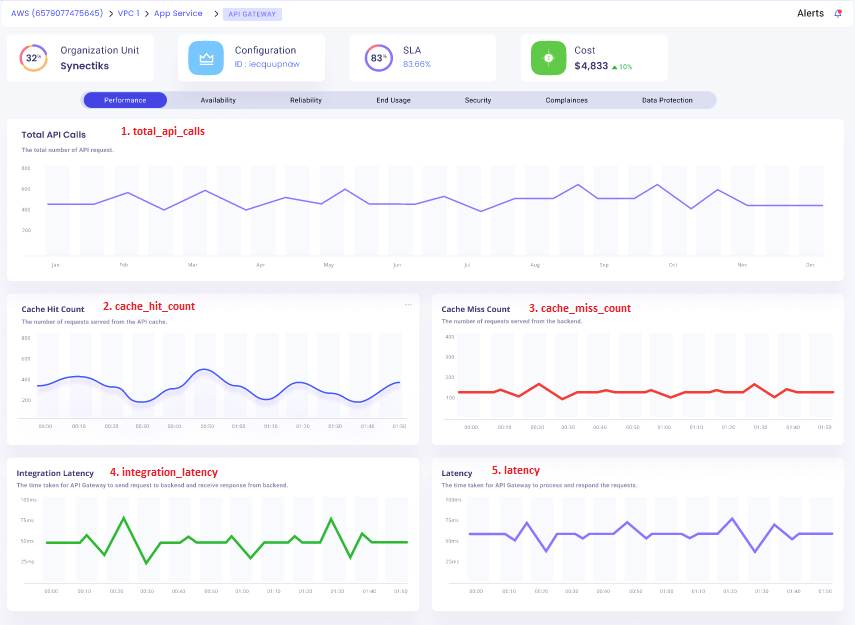
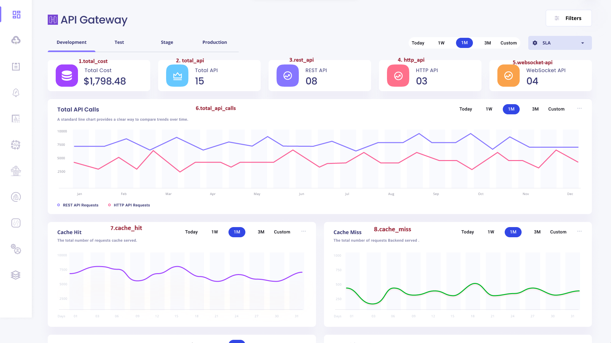
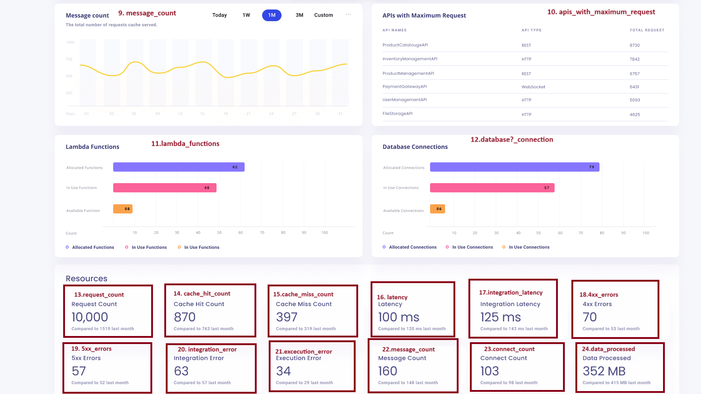

# Table of Contents

- [awsx-getelementdetails](#awsx-getelementdetails)
- [ui-analysis-and-listing-methods](#ui-analysis-and-listing-methods)
   - [total_api_calls_panel](#total_api_calls_panel)
   - [cache_hit_count_panel](#cache_hit_count_panel)
   - [cache_miss_count_panel](#cache_miss_count_panel)
   - [integration_latency_panel](#integration_latency_panel)
   - [latency_panel](#latency_panel)
   - [uptime_percentage_panel](#total_api_calls_panel)
   - [response_time_panel](#cache_hit_panel)
   - [uptime_of_deploymnet_stages_panel](#cache_miss_panel)
   - [downtime_incident_panel](#message_count_panel)
   - [4xx_errors_panel](#apis_with_maximum_request_panel)
   - [5xx_errors_panel](#lambda_function_panel)
   - [error_logs_panel](#database_connection_panel)
   - [top_events_panel](#request_count_panel)
   - [successful_and_failed_events_panel](#cache_hit_count_panel)
   - [successful_event_details_panel](#cache_miss_count_panel)
   - [failed_event_details_panel](#latency_panel)
  - [security_logs_panel](#integration_latency_panel)
  - [threats_panel](#4xx_errors_panel)

  
 
- [list of subcommands and options for ApiGateway](#list-of-subcommands-and-options-for-ApiGateway)
 
# awsx-getelementdetails
It implements the awsx plugin getElementDetails
 
# ui analysis and listing methods

1. total_api_calls_panel
2. cache_hit_count_panel
3. cache_miss_count_panel
4. integration_latency_panel
5. latency_panel
6. uptime_percentage_panel
7. response_time_panel
8. uptime_of_deploymnet_stages_panel
9. downtime_incident_panel
10. 4xx_errors_panel
11. 5xx_errors_panel
12. error_logs_panel
13. top_events_panel
14. successful_and_failed_events_panel
15. successful_event_details_panel
16. failed_event_details_panel
17. security_logs_panel
18. threats_panel


_
# ui-analysys-and listing-methods
## Total cost panel


1. total_cost_panel

<!-- if vault is their then external Id and crossAccountRole is not required -->

**called from subcommand**

go run awsx-getelementdetails.go  --vaultUrl=<afreenXXXXXXX1309> --elementId=9321 --query="total_cost_panel" --elementType="ApiGateway" --responseType=json --startTime=2023-12-01T00:00:00Z --endTime=2023-12-02T23:59:59Z
 

**called from maincommand**

 
awsx --vaultUrl=<afreenXXXXXXX1309> --elementId=9321 --query="total_cost_panel" --elementType="ApiGateway" --responseType=json --startTime=2023-12-01T00:00:00Z --endTime=2023-12-02T23:59:59Z


**Called from API**

http://localhost:7000/awsx-api/getQueryOutput?vaultUrl=<afreenXXXX>&elementId=9321&elementType=ApiGateway&query=total_cost_panel&responseType=json&startTime=2023-12-01T00:00:00Z&endTime=2023-12-02T23:59:59Z


**Desired Output in json / graph format:**
1. Total Cost

-$1798.48


**Algorithm/ Pseudo Code**

**Algorithm:** 
- Total Cost panel - Find the total cost for all requests.

 **Pseudo Code:**  
 
 


# ui-analysys-and listing-methods
## Total api panel


2. total_api_panel 


**called from subcommand**

go run awsx-getelementdetails.go  --vaultUrl=<afreenXXXXXXX1309> --elementId=9321 --query="total_api_panel" --elementType="ApiGateway" --responseType=json --startTime=2023-12-01T00:00:00Z --endTime=2023-12-02T23:59:59Z


**called from maincommand**

awsx --vaultUrl=<afreenXXXXXXX1309> --elementId=9321 --query="total_api_panel" --elementType="ApiGateway" --responseType=json --startTime=2023-12-01T00:00:00Z --endTime=2023-12-02T23:59:59Z


**Called from API**

http://localhost:7000/awsx-api/getQueryOutput?vaultUrl=<afreen1309XXX>&elementType=ApiGateway&elementId=9321&query=total_api_panel&responseType=json&startTime=2023-12-01T00:00:00Z&endTime=2023-12-02T23:59:59Z


**Desired Output in json / graph format:**
2.  Total Api

-15


**Algorithm/ Pseudo Code**

**Algorithm:** 
- Total Api - Write a cli for total api, where we shall write a program for getting total api available.

 **Pseudo Code:** 

 
 
 # ui-analysys-and listing-methods
## Rest api panel


3. rest_api_panel 


**called from subcommand**

go run awsx-getelementdetails.go  --vaultUrl=<afreenXXXXXXX1309> --elementId=9321 --query="rest_api_panel" --elementType="ApiGateway" --responseType=json --startTime=2023-12-01T00:00:00Z --endTime=2023-12-02T23:59:59Z

 

**called from maincommand**

awsx --vaultUrl=<afreenXXXXXXX1309> --elementId=9321 --query="rest_api_panel" --elementType="ApiGateway" --responseType=json --startTime=2023-12-01T00:00:00Z --endTime=2023-12-02T23:59:59Z


**Called from API**

http://localhost:7000/awsx-api/getQueryOutput?vaultUrl=<afreenxxxx1309>&elementType=ApiGateway&elementId=9321&query=rest_api_panel&responseType=json&startTime=2023-12-01T00:00:00Z&endTime=2023-12-02T23:59:59Z


**Desired Output in json / graph format:**
3.  Rest Api

-08


**Algorithm/ Pseudo Code**

**Algorithm:** 
- Rest Api panel - Write a cli for rest api, where we shall write a program for finding all rest api.

 **Pseudo Code:**  
 
 

# ui-analysys-and listing-methods

## http_api_panel


4. http_api_panel 


**called from subcommand**

go run awsx-getelementdetails.go  --vaultUrl=<afreenxxxx1309> --elementId=9321 --query="http_api_panel" --elementType="ApiGateway" --responseType=json --startTime=2023-12-01T00:00:00Z --endTime=2023-12-02T23:59:59Z

 

**called from maincommand**

awsx --vaultUrl=<afreenxxxx1309> --elementId=9321 --query="http_api_panel" --elementType="ApiGateway" --responseType=frame --startTime=2023-12-01T00:00:00Z --endTime=2023-12-02T23:59:59Z


**Called from API**

http://localhost:7000/awsx-api/getQueryOutput?vaultUrl=<afreenxxxx1309>&elementType=AWS/ApiGateway&elementId=9321&query=http_api_panel&responseType=json&startTime=2023-12-01T00:00:00Z&endTime=2023-12-02T23:59:59Z


**Desired Output in json / graph format:**
4.https api

-03

**Algorithm/ Pseudo Code**

**Algorithm:** 
- http api  panel - Write a cli for http api, where we shall write a program for finding http api.

 **Pseudo Code:**
 
 
# ui-analysys-and listing-methods

## websocket_api_panel


5. websocket_api_panel


**called from subcommand**

go run awsx-getelementdetails.go  --vaultUrl=<afreenxxxx1309> --elementId=9321 --query="websocket_api_panel" --elementType="ApiGateway" --responseType=json --startTime=2023-12-01T00:00:00Z --endTime=2023-12-02T23:59:59Z


 

**called from maincommand**

awsx --vaultUrl=<afreenxxxx1309> --elementId=9321 --query="websocket_api_panel" --elementType="ApiGateway" --responseType=json --startTime=2023-12-01T00:00:00Z --endTime=2023-12-02T23:59:59Z


**Called from API**

http://localhost:7000/awsx-api/getQueryOutput?vaultUrl=<afreenxxxx1309>&elementType=ApiGateway&elementId=9321&query=websocket_api_panel&responseType=json&startTime=2023-12-01T00:00:00Z&endTime=2023-12-02T23:59:59Z


**Desired Output in json / graph format:**
5. websocket api panel

	-04


**Algorithm/ Pseudo Code**

**Algorithm:** 
- web socket api  -write a cli for websocket api panel.

 **Pseudo Code:** 
 
# ui-analysys-and listing-methods

## total_api_calls_panel


6. total_api_calls_panel


**called from subcommand**

go run awsx-getelementdetails.go  --vaultUrl=<afreenxxxx1309> --elementId=9321 --query="total_api_calls_panel" --elementType="ApiGateway" --responseType=json --startTime=2023-12-01T00:00:00Z --endTime=2023-12-02T23:59:59Z


 

**called from maincommand**

awsx --vaultUrl=<afreenxxxx1309> --elementId=9321 --query="total_api_calls_panel" --elementType="ApiGateway" --responseType=json --startTime=2023-12-01T00:00:00Z --endTime=2023-12-02T23:59:59Z


**Called from API**

http://localhost:7000/awsx-api/getQueryOutput?vaultUrl=<afreenxxxx1309>&elementType=ApiGateway&elementId=9321&query=total_api_calls_panel&responseType=json&startTime=2023-12-01T00:00:00Z&endTime=2023-12-02T23:59:59Z


**Desired Output in json / graph format:**
6. Total Api calls panel

	-data in graph form

**Algorithm/ Pseudo Code**

**Algorithm:** 
- Total api calls  -Fire a cloudwatch query for total_api_calls_panel.

 **Pseudo Code:** 
 
# ui-analysys-and listing-methods

## cache_hit_panel


7. cache_hit_panel

 


**called from subcommand**

go run awsx-getelementdetails.go  --vaultUrl=<afreenxxxx1309> --elementId=9321 --query="cache_hit_panel" --elementType="ApiGateway" --responseType=json --startTime=2023-12-01T00:00:00Z --endTime=2023-12-02T23:59:59Z


**called from maincommand**

awsx --vaultUrl=<afreenxxxx1309> --elementId=9321 --query="cache_hit_panel" --elementType="ApiGateway" --responseType=json --startTime=2023-12-01T00:00:00Z --endTime=2023-12-02T23:59:59Z


**Called from API**

http://localhost:7000/awsx-api/getQueryOutput?vaultUrl=<afreenxxxx1309>&elementType=ApiGateway&elementId=9321&query=cache_hit_panel_panel&responseType=json&startTime=2023-12-01T00:00:00Z&endTime=2023-12-02T23:59:59Z


**Desired Output in json / graph format:**
7. Cache hit panel

	-data in graph form


**Algorithm/ Pseudo Code**

**Algorithm:** 
- cache hit  -Fire a cloudwatch query for cache hit panel, using metric cache_hit.The total number of cache served request we have to take.

 **Pseudo Code:** 
 
# ui-analysys-and listing-methods

## cache_miss_panel


8. cache_miss_panel


**called from subcommand**

go run awsx-getelementdetails.go  --vaultUrl=<afreenxxxx1309> --elementId=9321 --query="cache_miss_panel" --elementType="ApiGateway" --responseType=json --startTime=2023-12-01T00:00:00Z --endTime=2023-12-02T23:59:59Z

**called from maincommand**

awsx --vaultUrl=<afreenxxxx1309> --elementId=9321 --query="cache_miss_panel" --elementType="ApiGateway" --responseType=json --startTime=2023-12-01T00:00:00Z --endTime=2023-12-02T23:59:59Z


**Called from API**

http://localhost:7000/awsx-api/getQueryOutput?vaultUrl=<afreenxxxx1309>&elementType=ApiGateway&elementId=9321&query=cache_miss_panel&responseType=json&startTime=2023-12-01T00:00:00Z&endTime=2023-12-02T23:59:59Z


**Desired Output in json / graph format:**
8. Cache miss panel

	-data in graph form


**Algorithm/ Pseudo Code**

**Algorithm:** 
- Cache miss   -Fire a cloudwatch query for cache miss, using metric cache miss.

 **Pseudo Code:** 
 
 
# ui-analysys-and listing-methods

##  message_count_panel


9. message_count_panel


**called from subcommand**

go run awsx-getelementdetails.go  --vaultUrl=<afreenxxxx1309> --elementId=9321 --query="message_count_panel" --elementType="ApiGateway" --responseType=json --startTime=2023-12-01T00:00:00Z --endTime=2023-12-02T23:59:59Z


**called from maincommand**

awsx --vaultUrl=<afreenxxxx1309> --elementId=9321 --query="message_count_panel" --elementType="ApiGateway" --responseType=json --startTime=2023-12-01T00:00:00Z --endTime=2023-12-02T23:59:59Z


**Called from API**

http://localhost:7000/awsx-api/getQueryOutput?vaultUrl=<afreenxxxx1309>&elementType=ApiGateway&elementId=9321&query=message_count_panel&responseType=json&startTime=2023-12-01T00:00:00Z&endTime=2023-12-02T23:59:59Z


**Desired Output in json / graph format:**
9. message count panel

	-


**Algorithm/ Pseudo Code**

**Algorithm:** 
- Message count panel  -Fire a cloudwatch query for message_count_panel, using metric message_count_panel.In this we have to calculate total number of cache served.

 **Pseudo Code:** 
 
 
# ui-analysys-and listing-methods

##  apis_with_maximum_request_panel


10. apis_with_maximum_request


**called from subcommand**

go run awsx-getelementdetails.go  --vaultUrl=<afreenxxxx1309> --elementId=9321 --query="memory_apis_with_maximum_request" --elementType="ApiGateway" --responseType=json --startTime=2023-12-01T00:00:00Z --endTime=2023-12-02T23:59:59Z

 

**called from maincommand**

awsx --vaultUrl=<afreenxxxx1309> --elementId=9321 --query="apis_with_maximum_request" --elementType="ApiGateway" --responseType=json --startTime=2023-12-01T00:00:00Z --endTime=2023-12-02T23:59:59Z


**Called from API**

http://localhost:7000/awsx-api/getQueryOutput?vaultUrl=<afreenxxxx1309>&elementType=ApiGateway&elementId=9321&query=apis_with_maximum_request&responseType=json


**Desired Output in json / graph format:**
10. apis_with_maximum_request

	-api name,api-request,total request


**Algorithm/ Pseudo Code**

**Algorithm:** 
- apis wit maximum request request -Fire a cloudwatch query for apis_with_maximum_request, using metric apis_with_maximum_request.

 **Pseudo Code:** 
 

 # ui-analysys-and listing-methods

 ##  lambda_function_panel


11. lambda_functions_panel


**called from subcommand**

go run awsx-getelementdetails.go  --vaultUrl=<afreenxxxx1309> --elementId=9321 --query="lambda_functions_panel" --elementType="ApiGateway" --responseType=json --startTime=2023-12-01T00:00:00Z --endTime=2023-12-02T23:59:59Z


**called from maincommand**

awsx --vaultUrl=<afreenxxxx1309> --elementId=9321 --query="lambda_functions_panel" --elementType="ApiGateway" --responseType=json --startTime=2023-12-01T00:00:00Z --endTime=2023-12-02T23:59:59Z


**Called from API**

http://localhost:7000/awsx-api/getQueryOutput?vaultUrl=<afreenxxxx1309>&elementType=ApiGateway&elementId=9321&query=lambda_functions_panel&responseType=json


**Desired Output in json / graph format:**
11. lambda functions panel

	-lambda_functions_panel


**Algorithm/ Pseudo Code**

**Algorithm:** 
- lambda_functions_panel  -Fire a cloudwatch query for lambda_functions_panel, using metric lambda_functions_panel.allocated function,in use function and available function.

 **Pseudo Code:** 
 
 
 # ui-analysys-and listing-methods

##  database_connection_panel


12. database_connections_panel


**called from subcommand**

go run awsx-getelementdetails.go  --vaultUrl=<afreenxxxx1309> --elementId=9321 --query="database_connections_panel" --elementType="ApiGateway" --responseType=json --startTime=2023-12-01T00:00:00Z --endTime=2023-12-02T23:59:59Z

 

**called from maincommand**

awsx --vaultUrl=<afreenxxxx1309> --elementId=9321 --query="database_connections_panel" --elementType="ApiGateway" --responseType=json --startTime=2023-12-01T00:00:00Z --endTime=2023-12-02T23:59:59Z


**Called from API**

http://localhost:7000/awsx-api/getQueryOutput?vaultUrl=<afreenxxxx1309>&elementType=ApiGateway&elementId=9321&query=database_connections_panel&responseType=json&startTime=2023-12-01T00:00:00Z&endTime=2023-12-02T23:59:59Z


**Desired Output in json / graph format:**
12. database connections panel

	-allocated connection,in use connection and available connection


**Algorithm/ Pseudo Code**

**Algorithm:** 
- database connections panel  -Fire a cloudwatch query for database_connections_panel, using metric database_connections_panel.For allocated ,in use and available connection we need to find it.

 **Pseudo Code:**  
 
 
 
 # ui-analysys-and listing-methods
##  request_count_panel


13. request_count_panel


**called from subcommand**

go run awsx-getelementdetails.go  --vaultUrl=<afreenxxxx1309> --elementId=9321 --query="request_count_panel" --elementType="ApiGateway" --responseType=json --startTime=2023-12-01T00:00:00Z --endTime=2023-12-02T23:59:59Z


**called from maincommand**

awsx --vaultUrl=<afreenxxxx1309> --elementId=9321 --query="request_count_panel" --elementType="ApiGateway" --responseType=json --startTime=2023-12-01T00:00:00Z --endTime=2023-12-02T23:59:59Z


**Called from API**

http://localhost:7000/awsx-api/getQueryOutput?vaultUrl=<afreenxxxx1309>&elementType=ApiGateway&elementId=9321&query=request_count_panel&responseType=json&startTime=2023-12-01T00:00:00Z&endTime=2023-12-02T23:59:59Z


**Desired Output in json / graph format:**
13. request count panel

	-10,000


**Algorithm/ Pseudo Code**

**Algorithm:** 
- request count panel  -Fire a cloudwatch query for request count panel, using metric request count panel.

 **Pseudo Code:**  
 

 # ui-analysys-and listing-methods
##  cache_hit_count_panel


14. cache_hit_count_panel


**called from subcommand**

go run awsx-getelementdetails.go  --vaultUrl=<afreenxxxx1309> --elementId=9321 --query="cache_hit_count_panel" --elementType="ApiGateway" --responseType=json --startTime=2023-12-01T00:00:00Z --endTime=2023-12-02T23:59:59Z

 
**called from maincommand**

awsx --vaultUrl=<afreenxxxx1309> --elementId=9321 --query="cache_hit_count_panel" --elementType="ApiGateway" --responseType=json --startTime=2023-12-01T00:00:00Z --endTime=2023-12-02T23:59:59Z


**Called from API**

http://localhost:7000/awsx-api/getQueryOutput?vaultUrl=<afreenxxxx1309>&elementType=ApiGateway&elementId=9321&query=cache_hit_count_panel


**Desired Output in json / graph format:**
14. cache_hit_count_panel

	-870


**Algorithm/ Pseudo Code**

**Algorithm:** 
- cache hit count panel  -Fire a cloudwatch query for cache_hit_count_panel, using metric cache_hit_count_panel.

 **Pseudo Code:**  
 
 
 # ui-analysys-and listing-methods
##  cache_miss_count_panel


15. cache_miss_count_panel


**called from subcommand**

go run awsx-getelementdetails.go  --vaultUrl=<afreenxxxx1309> --elementId=9321 --query="cache_miss_count_panel" --elementType="ApiGateway" --responseType=json --startTime=2023-12-01T00:00:00Z --endTime=2023-12-02T23:59:59Z
 

**called from maincommand**

awsx --vaultUrl=<afreenxxxx1309> --elementId=9321 --query="cache_miss_count_panel" --elementType="ApiGateway" --responseType=json --startTime=2023-12-01T00:00:00Z --endTime=2023-12-02T23:59:59Z


**Called from API**

http://localhost:7000/awsx-api/getQueryOutput?vaultUrl=<afreenxxxx1309>&elementType=ApiGateway&elementId=9321&query=cache_miss_count_panel&responseType=json&startTime=2023-12-01T00:00:00Z&endTime=2023-12-02T23:59:59Z


**Desired Output in json / graph format:**
15. cache miss count panel

	-397
	


**Algorithm/ Pseudo Code**

**Algorithm:** 
- cache miss count panel  -Fire a cloudwatch query for cache_miss_count_panel, using metric cache_miss_count_panel.

 **Pseudo Code:**  
 
 # ui-analysys-and listing-methods
##  latency_panel


16. latency_panel


**called from subcommand**

go run awsx-getelementdetails.go  --vaultUrl=<afreenxxxx1309> --elementId=9321 --query="latency panelementType="ApiGateway" --responseType=json --startTime=2023-12-01T00:00:00Z --endTime=2023-12-02T23:59:59Z

 

**called from maincommand**

awsx --vaultUrl=<afreenxxxx1309> --elementId=9321 --query="latency panelementType="ApiGateway" --responseType=json --startTime=2023-12-01T00:00:00Z --endTime=2023-12-02T23:59:59Z


**Called from API**

http://localhost:7000/awsx-api/getQueryOutput?vaultUrl=<afreenxxxx1309>&elementType=ApiGateway&elementId=9321&query=latency_panel&responseType=json


**Desired Output in json / graph format:**
16. latency panel

	-100ms
	  

**Algorithm/ Pseudo Code**

**Algorithm:** 
- latency panel  -Fire a cloudwatch query for latency_panel, using metric latency_panel.

 **Pseudo Code:**  
 
 
  # ui-analysys-and listing-methods
  ##  integration_latency_panel


17. integration_latency_panel


**called from subcommand**

go run awsx-getelementdetails.go  --vaultUrl=<afreenxxxx1309> --elementId=9321 --query="integration_latency_panel" --elementType="ApiGateway" --responseType=json --startTime=2023-12-01T00:00:00Z --endTime=2023-12-02T23:59:59Z


**called from maincommand**

awsx --vaultUrl=<afreenxxxx1309> --elementId=9321 --query="integration_latency_panel" --elementType="ApiGateway" --responseType=json --startTime=2023-12-01T00:00:00Z --endTime=2023-12-02T23:59:59Z


**Called from API**

http://localhost:7000/awsx-api/getQueryOutput?vaultUrl=<afreenxxxx1309>&elementType=ApiGateway&elementId=9321&query=integration_latency_panel&responseType=json&startTime=2023-12-01T00:00:00Z&endTime=2023-12-02T23:59:59Z


**Desired Output in json / graph format:**
17. integration_latency_panel

	-125 ms
	

**Algorithm/ Pseudo Code**

**Algorithm:** 
- integration latency panel -Fire a cloudwatch query for integration latency panel, using metric integration latency panel.

 **Pseudo Code:**  
 
# ui-analysys-and listing-methods

##  4xx_errors_panel


18. 4xx_errors_panel


**called from subcommand**

go run awsx-getelementdetails.go  --vaultUrl=<afreenxxxx1309> --elementId=9321 --query="4xx_errors_panel" --elementType="ApiGateway" --responseType=json --startTime=2023-12-01T00:00:00Z --endTime=2023-12-02T23:59:59Z


**called from maincommand**

awsx --vaultUrl=<afreenxxxx1309> --elementId=9321 --query="4xx_errors_panel" --elementType="ApiGateway" --responseType=json --startTime=2023-12-01T00:00:00Z --endTime=2023-12-02T23:59:59Z


**Called from API**

http://localhost:7000/awsx-api/getQueryOutput?vaultUrl=<afreenxxxx1309>&elementType=ApiGateway&elementId=9321&query=4xx_errors_panel&responseType=json


**Desired Output in json / graph format:**
18. 4xx_errors_panel

	-70
	

**Algorithm/ Pseudo Code**

**Algorithm:** 
- 4xx_errors_panel -Fire a cloudwatch query for 4xx_errors_panel, using metric 4xx_errors_panel.

 **Pseudo Code:**  
 
 # ui-analysys-and listing-methods
##  5xx_errors_panel


19. 5xx_errors_panel


**called from subcommand**

go run awsx-getelementdetails.go  --vaultUrl=<afreenxxxx1309> --elementId=9321 --query="5xx_errors_panel" --elementType="ApiGateway" --responseType=json --startTime=2023-12-01T00:00:00Z --endTime=2023-12-02T23:59:59Z

 

**called from maincommand**

awsx --vaultUrl=<afreenxxxx1309> --elementId=9321 --query="5xx_errors_panel" --elementType="ApiGateway" --responseType=json --startTime=2023-12-01T00:00:00Z --endTime=2023-12-02T23:59:59Z


**Called from API**

http://localhost:7000/awsx-api/getQueryOutput?vaultUrl<afreenxxxx1309>&elementType=ApiGateway&elementId=9321&query=5xx_errors_panel$responseType=json&startTime=2023-12-01T00:00:00Z&endTime=2023-12-02T23:59:59Z


**Desired Output in json / graph format:**
19. 5xx_errors_panel

	-57
	

**Algorithm/ Pseudo Code**

**Algorithm:** 
- 5xx_errors_panel  -Fire a cloudwatch query for 5xx_errors_panel, using metric 5xx_errors_panel.

 **Pseudo Code:**  
 
 # ui-analysys-and listing-methods
##  integration_error_panel


20. integration_error_panel


**called from subcommand**

go run awsx-getelementdetails.go  --vaultUrl=<afreenxxxx1309> --elementId=9321 --query="integration_error_panel" --elementType="ApiGateway" --responseType=json --startTime=2023-12-01T00:00:00Z --endTime=2023-12-02T23:59:59Z

 

**called from maincommand**

awsx --vaultUrl=<afreenxxxx1309> --elementId=9321 --query="integration_error_panel" --elementType="ApiGateway" --responseType=json --startTime=2023-12-01T00:00:00Z --endTime=2023-12-02T23:59:59Z


**Called from API**

http://localhost:7000/awsx-api/getQueryOutput?vaultUrl=<afreenxxxx1309>&elementType=ApiGateway&elementId=9321&query=integration_error_panel&responsetype=json&startTime=2023-12-01T00:00:00Z&endTime=2023-12-02T23:59:59Z


**Desired Output in json / graph format:**
20. integration error panel

	-63
	

**Algorithm/ Pseudo Code**

**Algorithm:** 

- integration_error_panel  -Fire a cloudwatch query for integration_error_panel, using metric integration_error_panel.

 **Pseudo Code:**  


 
# list of subcommands and options for ApiGateway
 
| S.No | CLI Spec|  Description                          
|------|----------------|----------------------|
| 1    | awsx --vaultURL=vault.synectiks.net getElementDetails --elementId="1234" --elementType=ApiGateway --query="cpu_utilization_panel"  | This will get the specific ApiGateway instance cpu utilization panel data in hybrid structure |
| 2    | awsx --vaultURL=vault.synectiks.net getElementDetails --elementId="1234" --elementType=ApiGateway --query="memory_utilization_panel" | This will get the specific ApiGateway instance memory utilization panel data in hybrid structure|
| 3    | awsx --vaultURL=vault.synectiks.net getElementDetails --elementId="1234" --elementType=ApiGateway --query="rest_api_panel"  | This will get the specific ApiGateway instance storage utilization panel data in hybrid structure |
| 4    | awsx --vaultURL=vault.synectiks.net getElementDetails --elementId="1234" --elementType=ApiGateway --query="network_utilization_panel"  | This will get th1e specific ApiGateway instance network utilization panel data in hybrid structure |


## Acknowledgements

 - [Awesome Readme Templates](https://awesomeopensource.com/project/elangosundar/awesome-README-templates)
 - [Awesome README](https://github.com/matiassingers/awesome-readme)
 - [How to write a Good readme](https://bulldogjob.com/news/449-how-to-write-a-good-readme-for-your-github-project)


## API Reference

#### Get all items

```http
  GET /api/items
```

| Parameter | Type     | Description                |
| :-------- | :------- | :------------------------- |
| `api_key` | `string` | **Required**. Your API key |

#### Get item

```http
  GET /api/items/${id}
```

| Parameter | Type     | Description                       |
| :-------- | :------- | :-------------------------------- |
| `id`      | `string` | **Required**. Id of item to fetch |

#### add(num1, num2)

Takes two numbers and returns the sum.


## Appendix

Any additional information goes here

