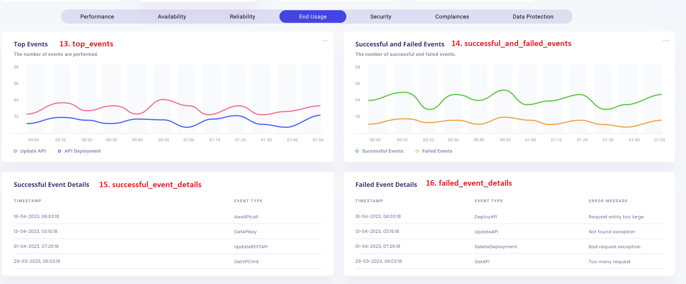

# Table of Contents

- [awsx-getelementdetails](#awsx-getelementdetails)
- [ui-analysis-and-listing-methods](#ui-analysis-and-listing-methods)
   - [total_api_calls_panel](#total-api-calls-panel)
   - [cache_hit_count_panel](#cache-hit-count-panel)
   - [cache_miss_count_panel](#cache-miss-count-panel)
   - [integration_latency_panel](#integration-latency-panel)
   - [latency_panel](#latency-panel)
   - [uptime_percentage_panel](#uptime-percentage-panel)
   - [response_time_panel](#response-time-panel)
   - [uptime_of_deployment_stages](#uptime-of-deployment-stages)
   - [downtime_incident_panel](#downtime-incident-panel)
   - [4xx_errors_panel](#4xx-errors-panel)
   - [5xx_errors_panel](#5xx-errors-panel)
   - [error_logs_panel](#error-logs-panel)
   - [top_events_panel](#top-events-panel)
   - [successful_and_failed_events_panel](#successful-and-failed-events-panel)
   - [successful_event_details_panel](#successful-event-details-panel)
   - [failed_event_details](#failed-event-details)
 
- [List of Subcommands and Options for ApiGateway](#list-of-subcommands-and-options-for-apigateway)
 

# awsx-getelementdetails
It implements the awsx plugin getElementDetails.
 
# ui analysis and listing methods

1.  total_api_calls_panel
2.  cache_hit_count_panel
3.  cache_miss_count_panel
4.  integration_latency_panel
5.  latency_panel
6.  uptime_percentage_panel
7.  response_time_panel
8.  uptime_of_deployment_stages
9.  downtime_incident_panel
10. 4xx_errors_panel
11. 5xx_errors_panel
12. error_logs_panel
13. top_events_panel
14. successful_and_failed_events_panel
15. successful_event_details_panel
16. failed_event_details

## Algorithm for Metric-Based Panels

1. **Define a command to fetch metrics.**
2. **On command execution:**
   - Authenticate the command.
   - If authentication fails:
     - Print error and return.
   - Retrieve response type from command flags.
   - Call function to fetch metrics data.
   - If error occurs:
     - Print error and return.
   - Format and print the response based on response type.
3. **Define function to fetch metrics data:**
   - Get element type and instance ID from command flags.
   - Parse start time and end time from command flags.
   - If error in parsing times:
     - Return error.
   - Get instance ID using CMDB data.
   - If error in getting instance ID:
     - Return error.
   - Initialize metric data map.
   - Get metric data and store in metric data map if available.
   - Create JSON output map with metric data values.
   - Marshal JSON output to JSON string.
   - If error occurs:
     - Return error.
   - Return JSON string and metric data.
4. **Initialize command flags.**

## Algorithm for Log-Based Panels

1. **Define a command to fetch logs data.**
2. **On command execution:**
   - Authenticate the command.
   - If authentication fails:
     - Print error and return.
   - Retrieve response type from command flags.
   - Call function to fetch logs data.
   - If error occurs:
     - Print error and return.
   - Format and print the response based on response type.
3. **Define function to fetch logs data:**
   - Get log group name from command flags.
   - Parse start and end times from command flags.
   - If error in parsing times:
     - Return error.
   - Get log group name using CMDB data.
   - If error in getting log group name:
     - Return error.
   - Construct CloudWatch query and fetch data.
   - If error occurs:
     - Return error.
   - Process fetched results.
   - Return processed results and nil for error.
4. **Initialize command flags.**


## Pseudo code for Metric-Based Panels

```pseudo
COMMAND fetch_metrics

ON EXECUTION:
    // Step 1: Authenticate the command
    IF NOT authenticate_command():
        PRINT "Authentication Error"
        RETURN

    // Step 2: Retrieve response type from command flags
    response_type = get_flag("response_type")

    // Step 3: Call function to fetch metrics data
    metrics_data, error = fetch_metrics_data()
    IF error:
        PRINT error
        RETURN

    // Step 4: Format and print the response based on response type
    formatted_response = format_response(metrics_data, response_type)
    PRINT formatted_response

//FUNCTION TO FETCH METRICS DATA
FUNCTION fetch_metrics_data():
    // Step 1: Get element type and instance ID from command flags
    element_type = get_flag("element_type")
    instance_id = get_flag("instance_id")

    // Step 2: Parse start time and end time from command flags
    start_time, end_time, time_error = parse_times(get_flag("start_time"), get_flag("end_time"))
    IF time_error:
        RETURN NULL, "Time Parsing Error"

    // Step 3: Get instance ID using CMDB data
    cmdb_instance_id, cmdb_error = get_cmdb_instance_id(instance_id)
    IF cmdb_error:
        RETURN NULL, "CMDB Instance ID Error"

    // Step 4: Initialize metric data map
    metric_data_map = {}

    // Step 5: Get metric data and store in metric data map if available
    metric_data, metric_error = get_metric_data(element_type, cmdb_instance_id, start_time, end_time)
    IF metric_error:
        RETURN NULL, "Metric Data Error"

    // Step 6: Create JSON output map with metric data values
    json_output_map = { "metrics": metric_data }

    // Step 7: Marshal JSON output to JSON string
    json_string, marshal_error = marshal_json(json_output_map)
    IF marshal_error:
        RETURN NULL, "JSON Marshalling Error"
    RETURN json_string, NULL

// Function to parse times from flags
FUNCTION parse_times(start_time_flag, end_time_flag):
    TRY:
        parsed_start_time = parse_time(start_time_flag)
        parsed_end_time = parse_time(end_time_flag)
    EXCEPT:
        RETURN NULL, NULL, "Time Parsing Error"
    RETURN parsed_start_time, parsed_end_time, NULL

// Function to authenticate the command
FUNCTION authenticate_command():
    // Dummy authentication logic
    IF command_has_valid_token():
        RETURN TRUE
    ELSE:
        RETURN FALSE
// Function to get a flag value
FUNCTION get_flag(flag_name):
    // Retrieve flag value from command input
    RETURN command_flags[flag_name]

// Function to get CMDB instance ID
FUNCTION get_cmdb_instance_id(instance_id):
    // Simulate CMDB lookup
    IF instance_id in CMDB:
        RETURN CMDB[instance_id], NULL
    ELSE:
        RETURN NULL, "CMDB Instance ID Error"

// Function to get metric data
FUNCTION get_metric_data(element_type, cmdb_instance_id, start_time, end_time):
    // Simulate fetching metrics from a data source
    metric_data = fetch_from_data_source(element_type, cmdb_instance_id, start_time, end_time)
    IF metric_data IS EMPTY:
        RETURN NULL, "Metric Data Error"
    RETURN metric_data, NULL

// Function to create JSON output map with metric data values
FUNCTION create_json_output_map(metric_data):
    // Create and return the JSON output map
    RETURN { "metrics": metric_data }

// Function to marshal JSON output to JSON string
FUNCTION marshal_json(json_output_map):
    TRY:
        json_string = json_encode(json_output_map)
    EXCEPT:
        RETURN NULL, "JSON Marshalling Error"
    RETURN json_string, NULL

// Function to format response based on response type
FUNCTION format_response(data, response_type):
    // Format the data based on the response type
    IF response_type == "json":
        RETURN data
    ELSE IF response_type == "text":
        RETURN convert_json_to_text(data)
    ELSE:
        RETURN "Unknown response type"

// Initialize command flags
COMMAND_FLAGS:
    response_type: STRING
    element_type: STRING
    instance_id: STRING
    start_time: STRING
    end_time: STRING
```


## Pseudo code to Fetch Logs Data

```pseudo
COMMAND fetch_logs

ON EXECUTION:
    // Step 1: Authenticate the command
    IF NOT authenticate_command():
        PRINT "Authentication Error"
        RETURN

    // Step 2: Retrieve response type from command flags
    response_type = get_flag("response_type")

    // Step 3: Call function to fetch logs data
    logs_data, error = fetch_logs_data()
    IF error:
        PRINT error
        RETURN

    // Step 4: Format and print the response based on response type
    formatted_response = format_response(logs_data, response_type)
    PRINT formatted_response

//FUNCTION TO FETCH LOGS DATA:
FUNCTION fetch_logs_data():
    // Step 1: Get log group name from command flags
    log_group_name = get_flag("log_group_name")

    // Step 2: Parse start and end times from command flags
    start_time, end_time, time_error = parse_times(get_flag("start_time"), get_flag("end_time"))
    IF time_error:
        RETURN NULL, "Time Parsing Error"

    // Step 3: Get log group name using CMDB data
    cmdb_log_group_name, cmdb_error = get_cmdb_log_group_name(log_group_name)
    IF cmdb_error:
        RETURN NULL, "CMDB Log Group Name Error"

    // Step 4: Construct CloudWatch query and fetch data
    cloudwatch_query = construct_cloudwatch_query(cmdb_log_group_name, start_time, end_time)
    log_data, query_error = execute_cloudwatch_query(cloudwatch_query)
    IF query_error:
        RETURN NULL, "CloudWatch Query Error"

    // Step 5: Process fetched results
    processed_results = process_log_data(log_data)

    RETURN processed_results, NULL

// Function to parse times from flags
FUNCTION parse_times(start_time_flag, end_time_flag):
    // Assume some parsing logic here
    IF parsing_fails:
        RETURN NULL, NULL, "Time Parsing Error"
    RETURN parsed_start_time, parsed_end_time, NULL

// Function to authenticate the command
FUNCTION authenticate_command():
    // Assume some authentication logic here
    RETURN authentication_status

// Function to get a flag value
FUNCTION get_flag(flag_name):
    // Assume logic to retrieve flag value
    RETURN flag_value

// Function to get CMDB log group name
FUNCTION get_cmdb_log_group_name(log_group_name):
    // Assume logic to get log group name from CMDB
    IF cmdb_lookup_fails:
        RETURN NULL, "CMDB Log Group Name Error"
    RETURN cmdb_log_group_name, NULL

// Function to construct CloudWatch query
FUNCTION construct_cloudwatch_query(cmdb_log_group_name, start_time, end_time):
    // Assume logic to construct CloudWatch query
    RETURN cloudwatch_query

// Function to execute CloudWatch query
FUNCTION execute_cloudwatch_query(cloudwatch_query):
    // Assume logic to execute query
    IF query_fails:
        RETURN NULL, "CloudWatch Query Error"
    RETURN log_data, NULL

// Function to process log data
FUNCTION process_log_data(log_data):
    // Assume logic to process log data
    RETURN processed_results

// Function to format response based on response type
FUNCTION format_response(data, response_type):
    // Assume logic to format response
    RETURN formatted_response

// Initialize command flags
COMMAND_FLAGS:
    response_type: STRING
    log_group_name: STRING
    start_time: STRING
    end_time: STRING
```

# ui-analysys-and listing-methods
## Total API Calls panel


1. total_api_calls_panel

**called from subcommand**
```shell
go run awsx-getelementdetails.go  --vaultUrl=<afreenxxxx1309> --elementId=14830 --query="total_api_calls_panel" --elementType="ApiGateway" --responseType=frame --startTime=2023-12-01T00:00:00Z --endTime=2023-12-02T23:59:59Z
```

**called from maincommand**
```shell
awsx --vaultUrl=<afreenxxxx1309> --elementId=14830 --query="total_api_calls_panel" --elementType="ApiGateway" --responseType=frame --startTime=2023-12-01T00:00:00Z --endTime=2023-12-02T23:59:59Z
```

**Called from API**
[http://localhost:7000/awsx-api/getQueryOutput?vaultUrl=<afreenxxxx1309>&elementType=ApiGateway&elementId=14830&query=total_api_calls_panel&responseType=frame&startTime=2023-12-01T00:00:00Z&endTime=2023-12-02T23:59:59Z](http://localhost:7000/awsx-api/getQueryOutput?vaultUrl=<afreenxxxx1309>&elementType=ApiGateway&elementId=14830&query=total_api_calls_panel&responseType=frame&startTime=2023-12-01T00:00:00Z&endTime=2023-12-02T23:59:59Z)

**Desired Output in json / graph format:**
1. Total Api calls panel

```json
{
  "total_api_calls": 600,
  "percentage": 83
}
```

**Algorithm/ Pseudo Code**

**Algorithm:** 
- Total api calls - Calculate the total number of API requests.

1. Initialize a counter for total API calls (total_api_calls) to 0.
2. Iterate through the API request log.
3. For each data point, increase the total_api_calls counter by 1.
4. Print the total_api_calls counter.

 **Pseudo Code:** 
 ```
 Initialize cache_hit_count = 0
For each API request:
    If request is served from cache:
        Increment cache_hit_count by 1
Display cache_hit_count
 ```

# ui-analysys-and listing-methods
## Cache Hit Count Panel

i
2. cache_hit_count_panel 

**called from subcommand**
```
go run awsx-getelementdetails.go  --vaultUrl=<afreenXXXXXXX1309> --elementId=14830 --query="cache_hit_count_panel" --elementType="ApiGateway" --responseType=frame --startTime=2023-12-01T00:00:00Z --endTime=2023-12-02T23:59:59Z
```

**called from maincommand**
```
awsx --vaultUrl=<afreenXXXXXXX1309> --elementId=14830 --query="cache_hit_count_panel" --elementType="ApiGateway" --responseType=frame --startTime=2023-12-01T00:00:00Z --endTime=2023-12-02T23:59:59Z
```

**Called from API**
[http://localhost:7000/awsx-api/getQueryOutput?vaultUrl=<afreen1309XXX>&elementType=ApiGateway&elementId=14830&query=cache_hit_count_panel&responseType=frame&startTime=2023-12-01T00:00:00Z&endTime=2023-12-02T23:59:59Z](http://localhost:7000/awsx-api/getQueryOutput?vaultUrl=<afreen1309XXX>&elementType=ApiGateway&elementId=14830&query=cache_hit_count_panel&responseType=frame&startTime=2023-12-01T00:00:00Z&endTime=2023-12-02T23:59:59Z
)

**Desired Output in json / graph format:**
2.  Cache Hit Count
```json
{
  "cache_hit_count": 400,
  "data": [
    { "time": "00:10", "value": 200 },
    { "time": "00:20", "value": 200 },
    { "time": "00:30", "value": 30 },
    ...
  ]
}
```

**Algorithm/ Pseudo Code**

**Algorithm:** 
- Cache Hit Count - Displays the number of API requests served from the cache.
1. Initialize a counter for cache hits (cache_hit_count) to 0.
2. Iterate through the API request log.
3. For each data point, check if the request was served from the cache.
4. If yes, increase the cache_hit_count counter by 1.
5. Print the cache_hit_count counter.

 **Pseudo Code:** 
```
Initialize cache_hit_count = 0
For each API request:
    If request is served from cache:
        Increment cache_hit_count by 1
Display cache_hit_count
```

# ui-analysys-and listing-methods
## Cache Miss Count Panel


3. cache_miss_count_panel 

**called from subcommand**
```shell
go run awsx-getelementdetails.go  --vaultUrl=<afreenXXXXXXX1309> --elementId=14830 --query="cache_miss_count_panel" --elementType="ApiGateway" --responseType=frame --startTime=2023-12-01T00:00:00Z --endTime=2023-12-02T23:59:59Z
```

**called from maincommand**
```shell
awsx --vaultUrl=<afreenXXXXXXX1309> --elementId=14830 --query="cache_miss_count_panel" --elementType="ApiGateway" --responseType=frame --startTime=2023-12-01T00:00:00Z --endTime=2023-12-02T23:59:59Z
```

**Called from API**
[http://localhost:7000/awsx-api/getQueryOutput?vaultUrl=<afreen1309XXX>&elementType=ApiGateway&elementId=14830&query=cache_miss_count_panel&responseType=frame&startTime=2023-12-01T00:00:00Z&endTime=2023-12-02T23:59:59Z](http://localhost:7000/awsx-api/getQueryOutput?vaultUrl=<afreen1309XXX>&elementType=ApiGateway&elementId=14830&query=cache_miss_count_panel&responseType=frame&startTime=2023-12-01T00:00:00Z&endTime=2023-12-02T23:59:59

**Desired Output in json / graph format:**
3.  Cache Miss Count
```json
{
  "cache_miss_count": 433,
  "data": [
    { "time": "00:00", "value": 300 },
    { "time": "00:20", "value": 200 },
    { "time": "00:30", "value": 100 },
    ...
  ]
}
```

**Algorithm/ Pseudo Code**

**Algorithm:** 
- Cache Miss Count - Displays the number of API requests served from the backend.
1. Initialize a counter for cache misses (cache_miss_count) to 0.
2. Iterate through the API request log.
3. For each data point, check if the request was served from the backend.
4. If yes, increase the cache_miss_count counter by 1.
5. Print the cache_miss_count counter.

 **Pseudo Code:** 
```
Initialize cache_miss_count = 0
For each API request:
    If request is served from backend:
        Increment cache_miss_count by 1
Display cache_miss_count
```

# ui-analysys-and listing-methods
## Integration Latency Panel


4. integration_latency_panel 

**called from subcommand**
```shell
go run awsx-getelementdetails.go  --vaultUrl=<afreenxxxx1309> --elementId=14830 --query="integration_latency_panel" --elementType="ApiGateway" --responseType=frame --startTime=2023-12-01T00:00:00Z --endTime=2023-12-02T23:59:59Z
```
 
**called from maincommand**
```shell
awsx --vaultUrl=<afreenxxxx1309> --elementId=14830 --query="integration_latency_panel" --elementType="ApiGateway" --responseType=frame --startTime=2023-12-01T00:00:00Z --endTime=2023-12-02T23:59:59Z
```

**Called from API**
[http://localhost:7000/awsx-api/getQueryOutput?vaultUrl=<afreenxxxx1309>&elementType=AWS/ApiGateway&elementId=14830&query=integration_latency_panel&responseType=frame&startTime=2023-12-01T00:00:00Z&endTime=2023-12-02T23:59:59Z](http://localhost:7000/awsx-api/getQueryOutput?vaultUrl=<afreenxxxx1309>&elementType=AWS/ApiGateway&elementId=14830&query=integration_latency_panel&responseType=frame&startTime=2023-12-01T00:00:00Z&endTime=2023-12-02T23:59:59Z)

**Desired Output in json / graph format:**
4. integration_latency_panel 
```json
{
  "integration_latency": 7500,
  "data": [
    { "time": "00:00", "value": 50 },
    { "time": "00:10", "value": 28 },
    { "time": "00:20", "value": 30 },
    ...
  ]
}
```
**Algorithm/ Pseudo Code**

**Algorithm:** 
- Integration Latency - Calculates and displays the average time taken for API Gateway to send requests to and receive responses from the backend.
1. Initialize an empty list for latency values.
2. Iterate through the API request log.
3. For each data point, extract the integration latency value.
4. Append the latency value to the latency_values list.
5. Calculate the average latency by summing all values in the latency_values list and dividing by the number of elements in the list.
6. Print the average latency value.

 **Pseudo Code:**
 ```
 Initialize latency_sum = 0
Initialize request_count = 0
For each API request:
    Record start_time when API Gateway sends request to backend
    Record end_time when API Gateway receives response from backend
    Calculate latency = end_time - start_time
    Increment latency_sum by latency
    Increment request_count by 1
Calculate average_latency = latency_sum / request_count
Display average_latency
```
 
# ui-analysys-and listing-methods

## Latency Panel


5. latency_panel

**called from subcommand**
```shell
go run awsx-getelementdetails.go  --vaultUrl=<afreenxxxx1309> --elementId=14830 --query="latency_panel" --elementType="ApiGateway" --responseType=frame --startTime=2023-12-01T00:00:00Z --endTime=2023-12-02T23:59:59Z
```

**called from maincommand**
```shell
awsx --vaultUrl=<afreenxxxx1309> --elementId=14830 --query="latency_panel" --elementType="ApiGateway" --responseType=frame --startTime=2023-12-01T00:00:00Z --endTime=2023-12-02T23:59:59Z
```

**Called from API**
[http://localhost:7000/awsx-api/getQueryOutput?vaultUrl=<afreenxxxx1309>&elementType=ApiGateway&elementId=14830&query=latency_panel&responseType=frame&startTime=2023-12-01T00:00:00Z&endTime=2023-12-02T23:59:59Z](http://localhost:7000/awsx-api/getQueryOutput?vaultUrl=<afreenxxxx1309>&elementType=ApiGateway&elementId=14830&query=latency_panel&responseType=frame&startTime=2023-12-01T00:00:00Z&endTime=2023-12-02T23:59:59Z)

**Desired Output in json / graph format:**
5. latency_panel
```json
{
  "latency": 7,
  "data": [
    { "time": "00:00", "value": 50 },
    { "time": "00:10", "value": 255 },
    { "time": "00:20", "value": 7 },
    ...
  ]
}
```

**Algorithm/ Pseudo Code**
**Algorithm:** 
- latency - Calculates and displays the average time taken for API Gateway to process and respond to API requests. 

1. Initialize an empty list for latency values (latency_values).
2. Iterate through the API request log.
3. For each data point, extract the latency value for API Gateway to process and respond to the request.
4. Append the latency value to the latency_values list.
5. Calculate the average latency by summing all values in the latency_values list and dividing by the number of elements in the list.
6. Print the average latency value.

 **Pseudo Code:** 
 ```
Initialize latency_sum = 0
Initialize request_count = 0
For each API request:
    Record start_time when API Gateway receives request
    Record end_time when API Gateway sends response
    Calculate latency = end_time - start_time
    Increment latency_sum by latency
    Increment request_count by 1
Calculate average_latency = latency_sum / request_count
Display average_latency
```

# ui-analysys-and listing-methods

## Uptime Percentage Panel


6. uptime_percentage_panel


**called from subcommand**
```shell
go run awsx-getelementdetails.go  --vaultUrl=<afreenxxxx1309> --elementId=14830 --query="uptime_percentage_panel" --elementType="ApiGateway" --responseType=frame --startTime=2023-12-01T00:00:00Z --endTime=2023-12-02T23:59:59Z
```

**called from maincommand**
```shell
awsx --vaultUrl=<afreenxxxx1309> --elementId=14830 --query="uptime_percentage_panel" --elementType="ApiGateway" --responseType=frame --startTime=2023-12-01T00:00:00Z --endTime=2023-12-02T23:59:59Z
```

**Called from API**
[http://localhost:7000/awsx-api/getQueryOutput?vaultUrl=<afreenxxxx1309>&elementType=ApiGateway&elementId=14830&query=uptime_percentage_panel&responseType=frame&startTime=2023-12-01T00:00:00Z&endTime=2023-12-02T23:59:59Z](http://localhost:7000/awsx-api/getQueryOutput?vaultUrl=<afreenxxxx1309>&elementType=ApiGateway&elementId=14830&query=uptime_percentage_panel&responseType=frame&startTime=2023-12-01T00:00:00Z&endTime=2023-12-02T23:59:59Z)


**Desired Output in json / graph format:**
6. Uptime Percentage Panel
```json
{
  "uptime_percentage": 83.66,
  "total_availability": 99.9
}
```

**Algorithm/ Pseudo Code**

**Algorithm:** 
- Uptime Percentage Panel - Displays the percentage of time the API Gateway was available and responding to requests.

1. Initialize an empty list for uptime values (uptime_values).
2. Iterate through the API request log.
3. For each data point, check if the API Gateway was available and responding to requests.
4. If available, append 1 to the uptime_values list; otherwise, append 0.
5. Calculate the uptime percentage by summing all values in the uptime_values list and dividing by the total number of elements in the list.
6. Print the uptime percentage value.

 **Pseudo Code:** 
 ```
Initialize uptime_sum = 0
Initialize total_requests = 0
For each API request:
    If API Gateway is available:
        Increment uptime_sum by 1
    Increment total_requests by 1
Calculate uptime_percentage = uptime_sum / total_requests
Display uptime_percentage
```

# ui-analysys-and listing-methods

## Response Time Panel


7. response_time_panel

**called from subcommand**
```shell
go run awsx-getelementdetails.go  --vaultUrl=<afreenxxxx1309> --elementId=14830 --query="response_time_panel" --elementType="ApiGateway" --responseType=frame --startTime=2023-12-01T00:00:00Z --endTime=2023-12-02T23:59:59Z
```

**called from maincommand**
```shell
awsx --vaultUrl=<afreenxxxx1309> --elementId=14830 --query="response_time_panel" --elementType="ApiGateway" --responseType=frame --startTime=2023-12-01T00:00:00Z --endTime=2023-12-02T23:59:59Z
```

**Called from API**
[http://localhost:7000/awsx-api/getQueryOutput?vaultUrl=<afreenxxxx1309>&elementType=ApiGateway&elementId=14830&query=response_time_panel&responseType=frame&startTime=2023-12-01T00:00:00Z&endTime=2023-12-02T23:59:59Z](http://localhost:7000/awsx-api/getQueryOutput?vaultUrl=<afreenxxxx1309>&elementType=ApiGateway&elementId=14830&query=response_time_panel&responseType=frame&startTime=2023-12-01T00:00:00Z&endTime=2023-12-02T23:59:59Z)

**Desired Output in json / graph format:**
7. Response Time Panel
```json
 {
  "response_time": [
    {"value": 100, "label": "Max"},
    {"value": 75, "label": "Average"},
    {"value": 50, "label": "Min"},
    {"value": 25, "label": "Target"}
  ]
}
```

**Algorithm/ Pseudo Code**

**Algorithm:** 
- Response Time Panel - Displays the average response time of the API Gateway.

1. Initialize an empty list for response time values.
2. Iterate through the API request log.
3. For each data point, extract the response time value for the API Gateway to process and respond to the request.
4. Append the response time value to the response_time_values list.
5. Calculate the average response time by summing all values in the response_time_values list and dividing by the number of elements in the list.
6. Print the average response time value.

 **Pseudo Code:** 
 ```
Initialize response_time_sum = 0
Initialize total_requests = 0
For each API request:
    Calculate response_time = response_timestamp - request_timestamp
    Append response_time to response_time_values
    Increment total_requests by 1
Calculate average_response_time = response_time_sum / total_requests
Display average_response_time
 ```
 
# ui-analysys-and listing-methods

## Uptime Of Deployment Stages


8. uptime_of_deployment_stages

**called from subcommand**
```shell
go run awsx-getelementdetails.go  --vaultUrl=<afreenxxxx1309> --elementId=14830 --query="uptime_of_deployment_stages" --elementType="ApiGateway" --responseType=frame --startTime=2023-12-01T00:00:00Z --endTime=2023-12-02T23:59:59Z
```

**called from maincommand**
```shell
awsx --vaultUrl=<afreenxxxx1309> --elementId=14830 --query="uptime_of_deployment_stages" --elementType="ApiGateway" --responseType=frame --startTime=2023-12-01T00:00:00Z --endTime=2023-12-02T23:59:59Z
```

**Called from API**
[http://localhost:7000/awsx-api/getQueryOutput?vaultUrl=<afreenxxxx1309>&elementType=ApiGateway&elementId=14830&query=uptime_of_deployment_stages&responseType=jsoframen&startTime=2023-12-01T00:00:00Z&endTime=2023-12-02T23:59:59Z](http://localhost:7000/awsx-api/getQueryOutput?vaultUrl=<afreenxxxx1309>&elementType=ApiGateway&elementId=14830&query=uptime_of_deployment_stages&responseType=frame&startTime=2023-12-01T00:00:00Z&endTime=2023-12-02T23:59:59Z)


**Desired Output in json / graph format:**
8. Uptime Of Deployment Stages
```json
{
  "deployment_stages": [
    {"stage": "Development", "uptime": 100},
    {"stage": "Testing", "uptime": 75},
    {"stage": "Beta", "uptime": 50},
    {"stage": "Production", "uptime": 25}
  ]
}
```

**Algorithm/ Pseudo Code**

**Algorithm:** 
- Uptime Of Deployment Stages - Displays the uptime percentage of each deployment stage.

1. Initialize an empty dictionary for deployment stages and their uptime values.
2. Iterate through the API request log.
3. For each data point, check the deployment stage and if the API Gateway was available and responding to requests.
4. If available, increment the uptime value for the corresponding deployment stage in the deployment_stages dictionary.
5. Calculate the uptime percentage for each deployment stage by dividing its uptime value by the total number of requests for that stage.
6. Print the uptime percentage for each deployment stage.

 **Pseudo Code:** 
 ```
 Initialize deployment_stages = {}
For each API request:
    deployment_stage = get_deployment_stage()
    If API Gateway is available:
        If deployment_stage not in deployment_stages:
            deployment_stages[deployment_stage] = 1
        else:
            deployment_stages[deployment_stage] += 1
For each deployment_stage in deployment_stages:
    Calculate uptime_percentage = deployment_stages[deployment_stage] / total_requests_for_stage
    Display uptime_percentage for deployment_stage
 ```

# ui-analysys-and listing-methods

##  Downtime Incident Panel


9. downtime_incident_panel

**called from subcommand**
```shell
go run awsx-getelementdetails.go  --vaultUrl=<afreenxxxx1309> --elementId=15185 --query="downtime_incident_panel" --elementType="ApiGateway" --responseType=json --startTime=2023-12-01T00:00:00Z --endTime=2023-12-02T23:59:59Z
```

**called from maincommand**
```shell
awsx --vaultUrl=<afreenxxxx1309> --elementId=15185 --query="downtime_incident_panel" --elementType="ApiGateway" --responseType=json --startTime=2023-12-01T00:00:00Z --endTime=2023-12-02T23:59:59Z
```

**Called from API**
[http://localhost:7000/awsx-api/getQueryOutput?vaultUrl=<afreenxxxx1309>&elementType=ApiGateway&elementId=15185&query=downtime_incident_panel&responseType=json&startTime=2023-12-01T00:00:00Z&endTime=2023-12-02T23:59:59Z](http://localhost:7000/awsx-api/getQueryOutput?vaultUrl=<afreenxxxx1309>&elementType=ApiGateway&elementId=15185&query=downtime_incident_panel&responseType=json&startTime=2023-12-01T00:00:00Z&endTime=2023-12-02T23:59:59Z)

**Desired Output in json / graph format:**
9. Downtime Incident Panel
```json
{
  "downtime_incidents": [
    {
      "timestamp": "18-04-2023, 06:03:18",
      "event_type": "AwsApicall",
      "downtime_reason": "Network Connectivity issue"
    },
    {
      "timestamp": "13-04-2023, 03:15:18",
      "event_type": "GetAPikey",
      "downtime_reason": "Database Maintenance"
    },
    ...
  ]
}
```

**Algorithm/ Pseudo Code**

**Algorithm:** 
- Downtime Incident Panel - Displays the downtime incidents with their timestamps, event types, and reasons.

1. Initialize an empty list for downtime incidents (downtime_incidents).
2. Iterate through the API request log.
3. For each data point, check if the API Gateway was unavailable.
4. If unavailable, extract the timestamp, event type, and reason for the downtime incident.
5. Append the downtime incident to the downtime_incidents list.
6. Print the downtime incidents list.

 **Pseudo Code:** 
 ```
 Initialize downtime_incidents = []
For each API request:
    If API Gateway is unavailable:
        Extract timestamp, event_type, and reason
        Append (timestamp, event_type, reason) to downtime_incidents
Display downtime_incidents
```

# ui-analysys-and listing-methods

##  4xx Errors Panel


10. 4xx_errors_panel

**called from subcommand**
```shell
go run awsx-getelementdetails.go  --vaultUrl=<afreenxxxx1309> --elementId=14830 --query="4xx_errors_panel" --elementType="ApiGateway" --responseType=frame --startTime=2023-12-01T00:00:00Z --endTime=2023-12-02T23:59:59Z
```

**called from maincommand**
```shell
awsx --vaultUrl=<afreenxxxx1309> --elementId=14830 --query="4xx_errors_panel" --elementType="ApiGateway" --responseType=frame --startTime=2023-12-01T00:00:00Z --endTime=2023-12-02T23:59:59Z
```

**Called from API**
[http://localhost:7000/awsx-api/getQueryOutput?vaultUrl=<afreenxxxx1309>&elementType=ApiGateway&elementId=14830&query=4xx_errors_panel&responseType=frame](http://localhost:7000/awsx-api/getQueryOutput?vaultUrl=<afreenxxxx1309>&elementType=ApiGateway&elementId=14830&query=4xx_errors_panel&responseType=frame)


**Desired Output in json / graph format:**
10. 4xx_errors_panel
```json
{
  "4xx_errors": {
    "metric": "4xx_errors",
    "data": [
      {"time": "00:00", "value": 20},
      {"time": "00:10", "value": 15},
      {"time": "00:20", "value": 10},
      ...
    ]
  }
}
```

**Algorithm/ Pseudo Code**

**Algorithm:** 
- 4xx Errors Panel - Displays the total number of 4xx errors with their corresponding timestamps.

1. Initialize an empty list for 4xx errors (four_xx_errors).
2. Iterate through the error logs.
3. For each data point, check if the error code starts with '4'.
4. If it does, extract the timestamp and the error code.
5. Append the 4xx error to the four_xx_errors list.
6. Print the four_xx_errors list.

 **Pseudo Code:**
 ```
 Initialize four_xx_errors = []
For each error log:
    If error code starts with '4':
        Extract timestamp and error_code
        Append (timestamp, error_code) to four_xx_errors
Display four_xx_errors
```

 # ui-analysys-and listing-methods

 ##  5xx Errors Panel


11. 5xx_errors_panel


**called from subcommand**
```shell
go run awsx-getelementdetails.go  --vaultUrl=<afreenxxxx1309> --elementId=14830 --query="5xx_errors_panel" --elementType="ApiGateway" --responseType=frame --startTime=2023-12-01T00:00:00Z --endTime=2023-12-02T23:59:59Z
```

**called from maincommand**
```shell
awsx --vaultUrl=<afreenxxxx1309> --elementId=14830 --query="5xx_errors_panel" --elementType="ApiGateway" --responseType=frame --startTime=2023-12-01T00:00:00Z --endTime=2023-12-02T23:59:59Z
```

**Called from API**
[http://localhost:7000/awsx-api/getQueryOutput?vaultUrl=<afreenxxxx1309>&elementType=ApiGateway&elementId=14830&query=5xx_errors_panel&responseType=frame](http://localhost:7000/awsx-api/getQueryOutput?vaultUrl=<afreenxxxx1309>&elementType=ApiGateway&elementId=14830&query=5xx_errors_panel&responseType=frame)

**Desired Output in json / graph format:**
11. 5xx_errors_panel
```json
{
  "5xx_errors": {
    "metric": "5xx_errors",
    "data": [
      {"time": "00:00", "value": 20},
      {"time": "00:10", "value": 15},
      {"time": "00:20", "value": 10},
      ...
    ]
  }
}
```
**Algorithm/ Pseudo Code**

**Algorithm:** 
- 5xx Errors Panel - Displays the total number of 5xx errors with their corresponding timestamps and error codes.

1. Initialize an empty list for 5xx errors (five_xx_errors).
2. Iterate through the error logs.
3. For each data point, check if the error code starts with '5'.
4. If it does, extract the timestamp, error code, and error message.
5. Append the 5xx error to the five_xx_errors list.
6. Print the five_xx_errors list.

 **Pseudo Code:** 
 ```
 Initialize five_xx_errors = []
For each error log:
    If error code starts with '5':
        Extract timestamp, error_code, and error_message
        Append (timestamp, error_code, error_message) to five_xx_errors
Display five_xx_errors
 ```

 # ui-analysys-and listing-methods
##  Error Logs Panel


12. error_logs_panel

**called from subcommand**
```shell
go run awsx-getelementdetails.go  --vaultUrl=<afreenxxxx1309> --elementId=15185 --query="error_logs_panel" --elementType="ApiGateway" --responseType=json --startTime=2023-12-01T00:00:00Z --endTime=2023-12-02T23:59:59Z
```

**called from maincommand**
```shell
awsx --vaultUrl=<afreenxxxx1309> --elementId=15185 --query="error_logs_panel" --elementType="ApiGateway" --responseType=json --startTime=2023-12-01T00:00:00Z --endTime=2023-12-02T23:59:59Z
```

**Called from API**
[http://localhost:7000/awsx-api/getQueryOutput?vaultUrl=<afreenxxxx1309>&elementType=ApiGateway&elementId=15185&query=error_logs_panel&responseType=json&startTime=2023-12-01T00:00:00Z&endTime=2023-12-02T23:59:59Z](http://localhost:7000/awsx-api/getQueryOutput?vaultUrl=<afreenxxxx1309>&elementType=ApiGateway&elementId=15185&query=error_logs_panel&responseType=json&startTime=2023-12-01T00:00:00Z&endTime=2023-12-02T23:59:59Z)

**Desired Output in json / graph format:**
12. error_logs_panel
```json
{
  "error_logs": [
    {
      "timestamp": "18-04-2023, 06:03:18",
      "http_method": "POST",
      "error_code": 500,
      "error_message": "Lambda execution failed"
    },
    {
      "timestamp": "13-04-2023, 03:15:18",
      "http_method": "POST",
      "error_code": 403,
      "error_message": "Invalid input format"
    },
    ...
  ]
}
```

**Algorithm/ Pseudo Code**

**Algorithm:** 
- Error Logs Panel - Displays the error logs with their corresponding timestamps, HTTP methods, error codes, and error messages.

1. Initialize an empty list for error logs (error_logs).
2. Iterate through the error logs.
3. For each data point, extract the timestamp, HTTP method, error code, and error message.
4. Append the error log to the error_logs list.
5. Print the error_logs list.

 **Pseudo Code:**  
```
Initialize error_logs = []
For each error log:
    Extract timestamp, HTTP_method, error_code, and error_message
    Append (timestamp, HTTP_method, error_code, error_message) to error_logs
Display error_logs
``` 

# ui-analysys-and listing-methods
##  Top Events Panel


13. top_events_panel

**called from subcommand**
```shell
go run awsx-getelementdetails.go  --vaultUrl=<afreenxxxx1309> --elementId=15185 --query="top_events_panel" --elementType="ApiGateway" --responseType=json --startTime=2023-12-01T00:00:00Z --endTime=2023-12-02T23:59:59Z
```

**called from maincommand**
```shell
awsx --vaultUrl=<afreenxxxx1309> --elementId=15185 --query="top_events_panel" --elementType="ApiGateway" --responseType=json --startTime=2023-12-01T00:00:00Z --endTime=2023-12-02T23:59:59Z
```

**Called from API**
[http://localhost:7000/awsx-api/getQueryOutput?vaultUrl=<afreenxxxx1309>&elementType=ApiGateway&elementId=15185&query=top_events_panel&responseType=json&startTime=2023-12-01T00:00:00Z&endTime=2023-12-02T23:59:59Z](http://localhost:7000/awsx-api/getQueryOutput?vaultUrl=<afreenxxxx1309>&elementType=ApiGateway&elementId=15185&query=top_events_panel&responseType=json&startTime=2023-12-01T00:00:00Z&endTime=2023-12-02T23:59:59Z)

**Desired Output in json / graph format:**
13. request count panel
```json
{
  "top_events": [
    {"time": "00:00", "count": 8},
    {"time": "02:00", "count": 6},
    {"time": "04:00", "count": 4},
    {"time": "06:00", "count": 2}
  ]
}
```

**Algorithm/ Pseudo Code**

**Algorithm:** 
top_events_panel  - Displays the number of events performed at each time interval.

 **Pseudo Code:**  
 ```
 Initialize event_counts = {}
For each API request:
   Increment count for corresponding time interval in event_counts
Display event_counts
 ```

# ui-analysys-and listing-methods
##  Successful And Failed Events Panel


14. successful_and_failed_events_panel

**called from subcommand**
```shell
go run awsx-getelementdetails.go  --vaultUrl=<afreenxxxx1309> --elementId=14830 --query="successful_and_failed_events_panel" --elementType="ApiGateway" --responseType=frame --startTime=2023-12-01T00:00:00Z --endTime=2023-12-02T23:59:59Z
```
 
**called from maincommand**
```shell
awsx --vaultUrl=<afreenxxxx1309> --elementId=14830 --query="successful_and_failed_events_panel" --elementType="ApiGateway" --responseType=frame --startTime=2023-12-01T00:00:00Z --endTime=2023-12-02T23:59:59Z
```

**Called from API**
[http://localhost:7000/awsx-api/getQueryOutput?vaultUrl=<afreenxxxx1309>&elementType=ApiGateway&elementId=14380&query=successful_and_failed_events_panel&responseType=frame&startTime=2023-12-01T00:00:00Z&endTime=2023-12-02T23:59:59Z](http://localhost:7000/awsx-api/getQueryOutput?vaultUrl=<afreenxxxx1309>&elementType=ApiGateway&elementId=14380&query=successful_and_failed_events_panel&responseType=frame&startTime=2023-12-01T00:00:00Z&endTime=2023-12-02T23:59:59Z)

**Desired Output in json / graph format:**
14. successful_and_failed_events_panel
```json
{
  "successful_and_failed_events": [
    {"time": "00:10", "successful": 8, "failed": 2},
    {"time": "00:20", "successful": 6, "failed": 2},
    {"time": "00:30", "successful": 4, "failed": 2},
    ...
  ]
}
```
**Algorithm/ Pseudo Code**

**Algorithm:** 
- Successful and Failed Events Panel - Displays the number of successful and failed events at each time interval.

1. Initialize two empty dictionaries to store successful and failed event counts
2. Iterate through the API request log.
3. For each data point, increment the count for the corresponding time interval in successful_events or failed_events based on the event type.
4. Print the successful_events and failed_events dictionaries.

 **Pseudo Code:** 
 ```
 Initialize successful_events = {}
Initialize failed_events = {}
For each API request:
   If event is successful:
       Increment count for corresponding time interval in successful_events
   Else:
       Increment count for corresponding time interval in failed_events
Display successful_events and failed_events
 ```

# ui-analysys-and listing-methods
##  Successful Event Details Panel


15. successful_event_details_panel

**called from subcommand**
```shell
go run awsx-getelementdetails.go  --vaultUrl=<afreenxxxx1309> --elementId=15185 --query="successful_event_details_panel" --elementType="ApiGateway" --responseType=json --startTime=2023-12-01T00:00:00Z --endTime=2023-12-02T23:59:59Z
 ```

**called from maincommand**
```shell
awsx --vaultUrl=<afreenxxxx1309> --elementId=15185 --query="successful_event_details_panel" --elementType="ApiGateway" --responseType=json --startTime=2023-12-01T00:00:00Z --endTime=2023-12-02T23:59:59Z
```
0
**Called from API**
[http://localhost:7000/awsx-api/getQueryOutput?vaultUrl=<afreenxxxx1309>&elementType=ApiGateway&elementId=15185&query=successful_event_details_panel&responseType=json&startTime=2023-12-01T00:00:00Z&endTime=2023-12-02T23:59:59Z](http://localhost:7000/awsx-api/getQueryOutput?vaultUrl=<afreenxxxx1309>&elementType=ApiGateway&elementId=15185&query=successful_event_details_panel&responseType=json&startTime=2023-12-01T00:00:00Z&endTime=2023-12-02T23:59:59Z)

**Desired Output in json / graph format:**
15. successful_event_details_panel
```json
{
  "successful_event_details": [
    {"timestamp": "18-04-2023, 06:03:18", "event_type": "AwsAPlcall"},
    {"timestamp": "13-04-2023, 03:15:18", "event_type": "AwsAPlcall"},
    {"timestamp": "01-04-2023, 07:26:18", "event_type": "AwsAPlcall"},
    ...
  ]
}
```

**Algorithm/ Pseudo Code**

**Algorithm:** 
- successful_event_details_panel - Displays the details of successful events, including timestamps and event types.

1. Initialize an empty list to store successful event details.
2. Iterate through the API request log.
3. For each successful event, extract the timestamp and event type.
4. Append the successful event details to the successful_event_details list.
5. Print the successful_event_details list.

 **Pseudo Code:**  
 ```
 Initialize successful_event_details = []
For each API request:
   If event is successful:
       Extract timestamp and event_type
       Append (timestamp, event_type) to successful_event_details
Display successful_event_details
 ```
 
 # ui-analysys-and listing-methods
##  Failed Event Details


16. failed_event_details

**called from subcommand**
```shell
go run awsx-getelementdetails.go  --vaultUrl=<afreenxxxx1309> --elementId=15185 --query="failed_event_details" --elementType="ApiGateway" --responseType=json --startTime=2023-12-01T00:00:00Z --endTime=2023-12-02T23:59:59Z
```
 
**called from maincommand**
```shell
awsx --vaultUrl=<afreenxxxx1309> --elementId=15185 --query="latency panelementType="ApiGateway" --responseType=json --startTime=2023-12-01T00:00:00Z --endTime=2023-12-02T23:59:59Z
```

**Called from API**
[http://localhost:7000/awsx-api/getQueryOutput?vaultUrl=<afreenxxxx1309>&elementType=ApiGateway&elementId=15185&query=failed_event_details&responseType=json](http://localhost:7000/awsx-api/getQueryOutput?vaultUrl=<afreenxxxx1309>&elementType=ApiGateway&elementId=15185&query=failed_event_details&responseType=json)

**Desired Output in json / graph format:**
16. Failed Event Details Panel
```json
{
  "failed_event_details": [
    {"timestamp": "18-04-2023, 06:03:18", "event_type": "GetAPikey", "error_message": "Request entity too large"},
    {"timestamp": "13-04-2023, 03:15:18", "event_type": "UpdateRESTAPI", "error_message": "Not found exception"},
    {"timestamp": "01-04-2023, 07:26:18", "event_type": "GetVPClink", "error_message": "Bad request exception"},
    ...
  ]
}
```

**Algorithm/ Pseudo Code**

**Algorithm:** 
- Failed Event Details Panel  - Displays the details of failed events, including timestamps, event types, and error messages.

1.  Initialize an empty list to store failed event details.
2. Iterate through the API request log.
3. For each failed event, extract the timestamp, event type, and error message.
4. Append the failed event details to the failed_event_details list.
5. Print the failed_event_details list.

 **Pseudo Code:**  
 ```
 Initialize failed_event_details = []
For each API request:
   If event is failed:
       Extract timestamp, event_type, and error_message
       Append (timestamp, event_type, error_message) to failed_event_details
Display failed_event_details
 ```

# List of Subcommands and Options for ApiGateway

| S.No | CLI Spec|  Description                                                          |
|------|----------------|----------------------------------------------------------------------|
| 1    | awsx --vaultURL=vault.synectiks.net getElementDetails --elementId="14830" --elementType=ApiGateway --query="total_api_calls_panel"  | Retrieve the total number of API calls made to a specific API Gateway. |
| 2    | awsx --vaultURL=vault.synectiks.net getElementDetails --elementId="14830" --elementType=ApiGateway --query="cache_hit_count_panel" | Retrieve the count of cache hits for a specific API Gateway. |
| 3    | awsx --vaultURL=vault.synectiks.net getElementDetails --elementId="14830" --elementType=ApiGateway --query="cache_miss_count_panel"  | Retrieve the count of cache misses for a specific API Gateway. |
| 4    | awsx --vaultURL=vault.synectiks.net getElementDetails --elementId="14830" --elementType=ApiGateway --query="integration_latency_panel"  | Retrieve the integration latency metrics for a specific API Gateway. |
| 5    | awsx --vaultURL=vault.synectiks.net getElementDetails --elementId="14830" --elementType=ApiGateway --query="latency_panel"  | Retrieve the overall latency metrics for a specific API Gateway. |
| 6    | awsx --vaultURL=vault.synectiks.net getElementDetails --elementId="14830" --elementType=ApiGateway --query="uptime_percentage_panel"  | Retrieve the uptime percentage metrics for a specific API Gateway. |
| 7    | awsx --vaultURL=vault.synectiks.net getElementDetails --elementId="14830" --elementType=ApiGateway --query="response_time_panel"  | Retrieve the response time metrics for a specific API Gateway. |
| 8    | awsx --vaultURL=vault.synectiks.net getElementDetails --elementId="14830" --elementType=ApiGateway --query="uptime_of_deployment_stages"  | Retrieve the uptime metrics for the deployment stages of a specific API Gateway. |
| 9    | awsx --vaultURL=vault.synectiks.net getElementDetails --elementId="15185" --elementType=ApiGateway --query="downtime_incident_panel"  | Retrieve information on downtime incidents for a specific API Gateway. |
| 10    | awsx --vaultURL=vault.synectiks.net getElementDetails --elementId="14830" --elementType=ApiGateway --query="4xx_errors_panel"  | Retrieve the count of 4xx errors for a specific API Gateway. |
| 11    | awsx --vaultURL=vault.synectiks.net getElementDetails --elementId="14380" --elementType=ApiGateway --query="5xx_errors_panel"  | Retrieve the count of 5xx errors for a specific API Gateway. |
| 12    | awsx --vaultURL=vault.synectiks.net getElementDetails --elementId="148315185" --elementType=ApiGateway --query="error_logs_panel"  | Retrieve error logs for a specific API Gateway. |
| 13    | awsx --vaultURL=vault.synectiks.net getElementDetails --elementId="15185" --elementType=ApiGateway --query="top_events_panel"  | Retrieve data on top events for a specific API Gateway. |
| 14    | awsx --vaultURL=vault.synectiks.net getElementDetails --elementId="14830" --elementType=ApiGateway --query="successful_and_failed_events_panel"  | Retrieve data on both successful and failed events for a specific API Gateway. |
| 15    | awsx --vaultURL=vault.synectiks.net getElementDetails --elementId="15185" --elementType=ApiGateway --query="successful_event_details_panel"  | Retrieve detailed information on successful events for a specific API Gateway. |
| 16    | awsx --vaultURL=vault.synectiks.net getElementDetails --elementId="15185" --elementType=ApiGateway --query="failed_event_details_panel"  | Retrieve detailed information on failed events for a specific API Gateway. |


## Acknowledgements

 - [Awesome Readme Templates](https://awesomeopensource.com/project/elangosundar/awesome-README-templates)
 - [Awesome README](https://github.com/matiassingers/awesome-readme)
 - [How to write a Good readme](https://bulldogjob.com/news/449-how-to-write-a-good-readme-for-your-github-project)


## API Reference

#### Get all items

```http
  GET /api/items
```

| Parameter | Type     | Description                |
| :-------- | :------- | :------------------------- |
| `api_key` | `string` | **Required**. Your API key |

#### Get item

```http
  GET /api/items/${id}
```

| Parameter | Type     | Description                       |
| :-------- | :------- | :-------------------------------- |
| `id`      | `string` | **Required**. Id of item to fetch |

#### add(num1, num2)

Takes two numbers and returns the sum.


## Appendix

Any additional information goes here
