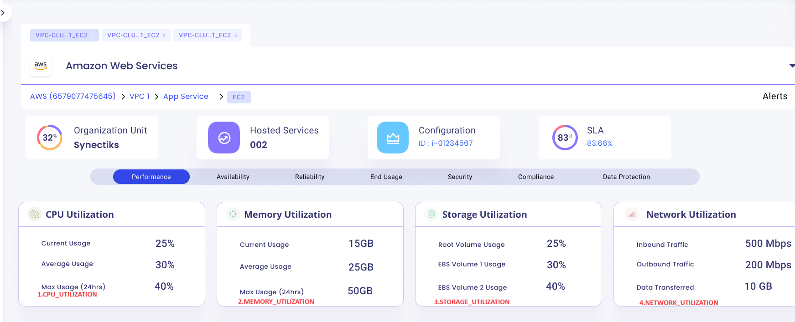
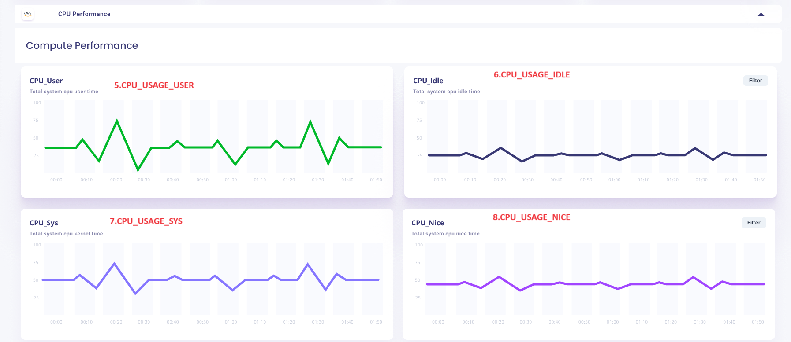
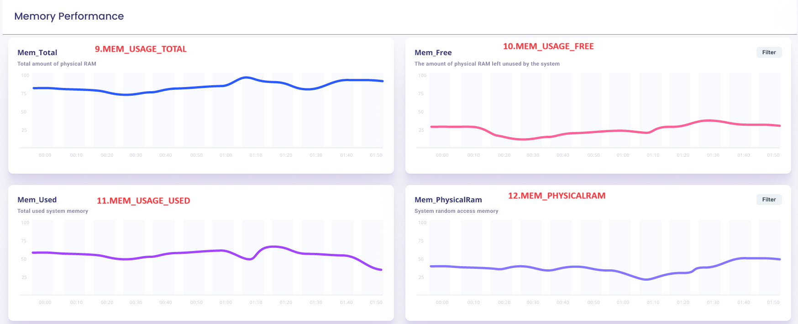

- [awsx-getelementdetails](#awsx-getelementdetails)
- [ui-analysys-and listing-methods](#ui-analysys-and-listing-methods)
  - [cpu\_utilization\_panel](#cpu_utilization_panel)
  - [memory\_utilization\_panel](#memory_utiization_panel)
  - [storage\_utilization\_panel](#storage_utiization_panel)
  - [network\_utilization\_panel](#network_utiization_panel)
  - [cpu\_usage\_user\_panel](#cpu_usage_user_panel)
  - [cpu\_usage\_idle\_panel](#cpu_usage_idle_panel)   
  - [cpu\_usage\_sys\_panel](#cpu_usage_sys_panel)
  - [cpu\_usage\_nice\_panel](#cpu_usage_nice_panel)
  - [mem\_total\_panel](#mem_total_panel)
  - [mem\_free\_panel](#mem_free_panel)
  - [mem\_used\_panel](#mem_used_panel)
  - [mem\_physicalRam\_panel](#mem_physicalRam_panel)
  - [disk\_read\_panel](#disk_read_panel)
  - [disk\_write\_panel](#disk_write_panel)
  - [disk\_used\_panel](#disk_used_panel)
  - [disk\_available\_panel](#disk_available_panel)
  
 
- [list of subcommands and options for EC2](#list-of-subcommands-and-options-for-ec2)
 
# awsx-getelementdetails
It implements the awsx plugin getElementDetails
 
# ui-analysys-and listing-methods

1. cpu_utilization_panel
2. memory_utilization_panel
3. storage_utilization_panel
4. network_utilization_panel
5. cpu_usage_user_panel
6. cpu_usage_idle_panel
7. cpu_usage_sys_panel
8. cpu_usage_nice_panel
9. mem_Total
10.mem_Free
11.mem_used
12.mem_PhysicalRam
13.Disk_Reads
14.Disk_Writes
15.Disk_Used
16.Disk_available

# ui-analysys-and listing-methods

1. cpu_utilization_panel

## cpu_utiization_panel

**called from subcommand**

go run awsx-getelementdetails.go  --zone=us-east-1 --externalId=<afreenxxxx1309> --crossAccountRoleArn=<afreenxxxx1309> --instanceID="i-05e4e6757f13da657" --query="cpu_utilization_panel" --elementType="AWS/EC2" --responseType=json --startTime=2023-12-01T00:00:00Z --endTime=2023-12-02T23:59:59Z
 

**called from maincommand**

awsx --zone=us-east-1 --externalId=<afreenxxxx1309> --crossAccountRoleArn=<afreenxxxx1309> --instanceID="i-05e4e6757f13da657" --query="cpu_utilization_panel" --elementType="AWS/EC2" --responseType=frame --startTime=2023-12-01T00:00:00Z --endTime=2023-12-02T23:59:59Z


**Called from API**

http://localhost:7000/awsx-api/getQueryOutput?zone=us-east-1&externalId=<afreenxxxx1309>&crossAccountRoleArn=<afreenxxxx1309>&elementType=AWS/EC2&instanceID=i-05e4e6757f13da657&query=cpu_utilization_panel


**Desired Output in json / graph format:**
1. CPU utilization
{
	CurrentUsage:25%,
	AverageUsage:30%,
	MaxUsage:40%
}


**Algorithm/ Pseudo Code**

**Algorithm:** 
- CPU utilization panel - Write a custom metric for cpu utilization, where we shall write a program for current, avg and max.

 **Pseudo Code:**  
 
 


# ui-analysys-and listing-methods

2. memory_utilization_panel 

## memory_utiization_panel

**called from subcommand**

go run awsx-getelementdetails.go  --zone=us-east-1 --externalId=<afreenxxxx1309> --crossAccountRoleArn=<afreenxxxx1309> --instanceID="i-05e4e6757f13da657" --query="memory_utilization_panel" --elementType="AWS/EC2" --responseType=json --startTime=2023-12-01T00:00:00Z --endTime=2023-12-02T23:59:59Z


**called from maincommand**

awsx --zone=us-east-1 --externalId=<afreenxxxx1309> --crossAccountRoleArn=<afreenxxxx1309> --instanceID="i-05e4e6757f13da657" --query="memory_utilization_panel" --elementType="AWS/EC2" --responseType=frame --startTime=2023-12-01T00:00:00Z --endTime=2023-12-02T23:59:59Z


**Called from API**

http://localhost:7000/awsx-api/getQueryOutput?zone=us-east-1&externalId=<afreenxxxx1309>&crossAccountRoleArn=<afreenxxxx1309>&elementType=AWS/EC2&instanceID=i-05e4e6757f13da657&query=memory_utilization_panel


**Desired Output in json / graph format:**
2.  Memory utilization
{
    CurrentUsage:25GB,
    AverageUsage:30GB,
	MaxUsage:40GB
}


**Algorithm/ Pseudo Code**

**Algorithm:** 
- MemoryUtilization - Write a custom metric for memory utilization, where we shall write a program for current, avg and max.

 **Pseudo Code:** 

 
 
 # ui-analysys-and listing-methods

3. storage_utilization_panel 

## storage_utiization_panel

**called from subcommand**

go run awsx-getelementdetails.go  --zone=us-east-1 --externalId=<afreenxxxx1309> --crossAccountRoleArn=<afreenxxxx1309> --instanceID="i-05e4e6757f13da657" --query="storage_utilization_panel" --elementType="AWS/EC2" --responseType=json --startTime=2023-12-01T00:00:00Z --endTime=2023-12-02T23:59:59Z

 

**called from maincommand**

awsx --zone=us-east-1 --externalId=<afreenxxxx1309> --crossAccountRoleArn=<afreenxxxx1309> --instanceID="i-05e4e6757f13da657" --query="storage_utilization_panel" --elementType="AWS/EC2" --responseType=frame --startTime=2023-12-01T00:00:00Z --endTime=2023-12-02T23:59:59Z


**Called from API**

http://localhost:7000/awsx-api/getQueryOutput?zone=us-east-1&externalId=<afreenxxxx1309>&crossAccountRoleArn=<afreenxxxx1309>&elementType=AWS/EC2&instanceID=i-05e4e6757f13da657&query=storage_utilization_panel


**Desired Output in json / graph format:**
3.  Storage utilization
{
    RootVolumeUsage:25GB,
    EBSVolume1Usage:30GB,
	EBSVolume2Usage:40GB
}


**Algorithm/ Pseudo Code**

**Algorithm:** 
- Storage Utilization panel - Write a custom metric for storage utilization, where we shall write a program for root volume usage and ebs disks usage.

 **Pseudo Code:**  
 
 

 # ui-analysys-and listing-methods

4. network_utilization_panel 

## network_utiization_panel


**called from subcommand**

go run awsx-getelementdetails.go  --zone=us-east-1 --externalId=<afreenxxxx1309> --crossAccountRoleArn=<afreenxxxx1309> --instanceID="i-05e4e6757f13da657" --query="network_utilization_panel" --elementType="AWS/EC2" --responseType=json --startTime=2023-12-01T00:00:00Z --endTime=2023-12-02T23:59:59Z

 

**called from maincommand**

awsx --zone=us-east-1 --externalId=<afreenxxxx1309> --crossAccountRoleArn=<afreenxxxx1309> --instanceID="i-05e4e6757f13da657" --query="network_utilization_panel" --elementType="AWS/EC2" --responseType=frame --startTime=2023-12-01T00:00:00Z --endTime=2023-12-02T23:59:59Z


**Called from API**

http://localhost:7000/awsx-api/getQueryOutput?zone=us-east-1&externalId=<afreenxxxx1309>&crossAccountRoleArn=<afreenxxxx1309>&elementType=AWS/EC2&instanceID=i-05e4e6757f13da657&query=network_utilization_panel


**Desired Output in json / graph format:**
4.Network utilization
{
    Inbound traffic:500Mbps,
    Outbound traffic:200Mbps,
	Data Transferred:10GB
}


**Algorithm/ Pseudo Code**

**Algorithm:** 
- Network utilization panel - Write a custom metric for Network utilization, where we shall write a program for root volume usage and ebs disks usage.

 **Pseudo Code:**
 
 
 # ui-analysys-and listing-methods

5. cpu_usage_user_panel


## cpu_usage_user_panel

**called from subcommand**


go run awsx-getelementdetails.go  --zone=us-east-1 --externalId=<afreenxxxx1309> --crossAccountRoleArn=<afreenxxxx1309> --cloudWatchQueries="[{\"RefID\": \"A\",\"MaxDataPoint\": 100,\"Interval\": 60,\"TimeRange\": {\"From\": \"\",\"To\": \"\",\"TimeZone\": \"UTC\"},\"Query\": [{\"Namespace\": \"(CWAgent, ImageId,InstanceId,InstanceType)\",\"MetricName\": \"COUNT(cpu_usage_user)\",\"Period\": 300,\"Stat\": \"Average\",\"Dimensions\": [{\"Name\": \"InstanceId\",\"Value\": \"i-02b30f1ea5c56e31a\"}]}]}]"

 

**called from maincommand**

awsx --zone=us-east-1 --externalId=<afreenxxxx1309> --crossAccountRoleArn=<afreenxxxx1309> --cloudWatchQueries="[{\"RefID\": \"A\",\"MaxDataPoint\": 100,\"Interval\": 60,\"TimeRange\": {\"From\": \"\",\"To\": \"\",\"TimeZone\": \"UTC\"},\"Query\": [{\"Namespace\": \"(CWAgent, ImageId,InstanceId,InstanceType)\",\"MetricName\": \"COUNT(cpu_usage_user)\",\"Period\": 300,\"Stat\": \"Average\",\"Dimensions\": [{\"Name\": \"InstanceId\",\"Value\": \"i-02b30f1ea5c56e31a\"}]}]}]"


**Called from API**

http://localhost:7000/awsx-api/getQueryOutput?zone=us-east-1&externalId=<afreenxxxx1309>&crossAccountRoleArn=<afreenxxxx1309>&elementType=AWS/EC2&instanceID=i-05e4e6757f13da657&query=cpu_usage_user_panel


**Desired Output in json / graph format:**
5. CPU usage user panel

	-cpu_usage_user


**Algorithm/ Pseudo Code**

**Algorithm:** 
- CPU usage user  -Fire a cloudwatch query for cpu_usage_user_panel, using metric cpu_usage_user.

 **Pseudo Code:** 
 
 # ui-analysys-and listing-methods

6. cpu_usage_user_panel


## cpu_usage__idle_panel

**called from subcommand**

go run awsx-getelementdetails.go  --zone=us-east-1 --externalId=<afreenxxxx1309> --crossAccountRoleArn=<afreenxxxx1309> --cloudWatchQueries="[{\"RefID\": \"A\",\"MaxDataPoint\": 100,\"Interval\": 60,\"TimeRange\": {\"From\": \"\",\"To\": \"\",\"TimeZone\": \"UTC\"},\"Query\": [{\"Namespace\": \"(CWAgent, ImageId,InstanceId,InstanceType)\",\"MetricName\": \"COUNT(cpu_usage_idle)\",\"Period\": 300,\"Stat\": \"Average\",\"Dimensions\": [{\"Name\": \"InstanceId\",\"Value\": \"i-02b30f1ea5c56e31a\"}]}]}]"

 

**called from maincommand**

awsx --zone=us-east-1 --externalId=<afreenxxxx1309> --crossAccountRoleArn=<afreenxxxx1309> --cloudWatchQueries="[{\"RefID\": \"A\",\"MaxDataPoint\": 100,\"Interval\": 60,\"TimeRange\": {\"From\": \"\",\"To\": \"\",\"TimeZone\": \"UTC\"},\"Query\": [{\"Namespace\": \"(CWAgent, ImageId,InstanceId,InstanceType)\",\"MetricName\": \"COUNT(cpu_usage_idle)\",\"Period\": 300,\"Stat\": \"Average\",\"Dimensions\": [{\"Name\": \"InstanceId\",\"Value\": \"i-02b30f1ea5c56e31a\"}]}]}]"


**Called from API**

http://localhost:7000/awsx-api/getQueryOutput?zone=us-east-1&externalId=<afreenxxxx1309>&crossAccountRoleArn=<afreenxxxx1309>&elementType=AWS/EC2&instanceID=i-05e4e6757f13da657&query=cpu_usage_idle_panel


**Desired Output in json / graph format:**
6. CPU usage idle panel

	-cpu_usage_idle


**Algorithm/ Pseudo Code**

**Algorithm:** 
- CPU usage idle  -Fire a cloudwatch query for cpu_usage_idle_panel, using metric cpu_usage_idle.

 **Pseudo Code:** 
 
 # ui-analysys-and listing-methods

7. cpu_usage_user_panel

 
## cpu_usage_sys_panel

**called from subcommand**

go run awsx-getelementdetails.go  --zone=us-east-1 --externalId=<afreenxxxx1309> --crossAccountRoleArn=<afreenxxxx1309> --cloudWatchQueries="[{\"RefID\": \"A\",\"MaxDataPoint\": 100,\"Interval\": 60,\"TimeRange\": {\"From\": \"\",\"To\": \"\",\"TimeZone\": \"UTC\"},\"Query\": [{\"Namespace\": \"(CWAgent, ImageId,InstanceId,InstanceType)\",\"MetricName\": \"COUNT(cpu_usage_sys)\",\"Period\": 300,\"Stat\": \"Average\",\"Dimensions\": [{\"Name\": \"InstanceId\",\"Value\": \"i-02b30f1ea5c56e31a\"}]}]}]"

 

**called from maincommand**

awsx --zone=us-east-1 --externalId=<afreenxxxx1309> --crossAccountRoleArn=<afreenxxxx1309> --cloudWatchQueries="[{\"RefID\": \"A\",\"MaxDataPoint\": 100,\"Interval\": 60,\"TimeRange\": {\"From\": \"\",\"To\": \"\",\"TimeZone\": \"UTC\"},\"Query\": [{\"Namespace\": \"(CWAgent, ImageId,InstanceId,InstanceType)\",\"MetricName\": \"COUNT(cpu_usage_sys)\",\"Period\": 300,\"Stat\": \"Average\",\"Dimensions\": [{\"Name\": \"InstanceId\",\"Value\": \"i-02b30f1ea5c56e31a\"}]}]}]"


**Called from API**

http://localhost:7000/awsx-api/getQueryOutput?zone=us-east-1&externalId=<afreenxxxx1309>&crossAccountRoleArn=<afreenxxxx1309>&elementType=AWS/EC2&instanceID=i-05e4e6757f13da657&query=cpu_usage_sys_panel


**Desired Output in json / graph format:**
7. CPU usage sys panel

	-cpu_usage_sys


**Algorithm/ Pseudo Code**

**Algorithm:** 
- CPU usage sys  -Fire a cloudwatch query for cpu_usage_sys_panel, using metric cpu_sys_user.

 **Pseudo Code:** 
 
 # ui-analysys-and listing-methods

8. cpu_usage_nice_panel


## cpu_usage_nice_panel

**called from subcommand**

go run awsx-getelementdetails.go  --zone=us-east-1 --externalId=<afreenxxxx1309> --crossAccountRoleArn=<afreenxxxx1309> --cloudWatchQueries="[{\"RefID\": \"A\",\"MaxDataPoint\": 100,\"Interval\": 60,\"TimeRange\": {\"From\": \"\",\"To\": \"\",\"TimeZone\": \"UTC\"},\"Query\": [{\"Namespace\": \"(CWAgent, ImageId,InstanceId,InstanceType)\",\"MetricName\": \"COUNT(cpu_usage_nice)\",\"Period\": 300,\"Stat\": \"Average\",\"Dimensions\": [{\"Name\": \"InstanceId\",\"Value\": \"i-02b30f1ea5c56e31a\"}]}]}]"

 

**called from maincommand**

awsx --zone=us-east-1 --externalId=<afreenxxxx1309> --crossAccountRoleArn=<afreenxxxx1309> --cloudWatchQueries="[{\"RefID\": \"A\",\"MaxDataPoint\": 100,\"Interval\": 60,\"TimeRange\": {\"From\": \"\",\"To\": \"\",\"TimeZone\": \"UTC\"},\"Query\": [{\"Namespace\": \"(CWAgent, ImageId,InstanceId,InstanceType)\",\"MetricName\": \"COUNT(cpu_usage_nice)\",\"Period\": 300,\"Stat\": \"Average\",\"Dimensions\": [{\"Name\": \"InstanceId\",\"Value\": \"i-02b30f1ea5c56e31a\"}]}]}]"


**Called from API**

http://localhost:7000/awsx-api/getQueryOutput?zone=us-east-1&externalId=<afreenxxxx1309>&crossAccountRoleArn=<afreenxxxx1309>&elementType=AWS/EC2&instanceID=i-05e4e6757f13da657&query=cpu_usage_nice_panel


**Desired Output in json / graph format:**
8. CPU usage nice panel

	-cpu_usage_nice


**Algorithm/ Pseudo Code**

**Algorithm:** 
- CPU usage nice  -Fire a cloudwatch query for cpu_usage_nice_panel, using metric cpu_usage_nice.

 **Pseudo Code:** 
 
 
 # ui-analysys-and listing-methods

9. mem_total_panel


##  mem_total_panel

**called from subcommand**

go run awsx-getelementdetails.go  --zone=us-east-1 --externalId=<afreenxxxx1309> --crossAccountRoleArn=<afreenxxxx1309> --cloudWatchQueries="[{\"RefID\": \"A\",\"MaxDataPoint\": 100,\"Interval\": 60,\"TimeRange\": {\"From\": \"\",\"To\": \"\",\"TimeZone\": \"UTC\"},\"Query\": [{\"Namespace\": \"(CWAgent, ImageId,InstanceId,InstanceType)\",\"MetricName\": \"COUNT(memory_total)\",\"Period\": 300,\"Stat\": \"Average\",\"Dimensions\": [{\"Name\": \"InstanceId\",\"Value\": \"i-02b30f1ea5c56e31a\"}]}]}]"

 

**called from maincommand**

awsx --zone=us-east-1 --externalId=<afreenxxxx1309> --crossAccountRoleArn=<afreenxxxx1309> --cloudWatchQueries="[{\"RefID\": \"A\",\"MaxDataPoint\": 100,\"Interval\": 60,\"TimeRange\": {\"From\": \"\",\"To\": \"\",\"TimeZone\": \"UTC\"},\"Query\": [{\"Namespace\": \"(CWAgent, ImageId,InstanceId,InstanceType)\",\"MetricName\": \"COUNT(memory_total)\",\"Period\": 300,\"Stat\": \"Average\",\"Dimensions\": [{\"Name\": \"InstanceId\",\"Value\": \"i-02b30f1ea5c56e31a\"}]}]}]"


**Called from API**

http://localhost:7000/awsx-api/getQueryOutput?zone=us-east-1&externalId=<afreenxxxx1309>&crossAccountRoleArn=<afreenxxxx1309>&elementType=AWS/EC2&instanceID=i-05e4e6757f13da657&query=memory_total_panel


**Desired Output in json / graph format:**
9. memory total panel

	-mem_total_panel


**Algorithm/ Pseudo Code**

**Algorithm:** 
- Mem total panel  -Fire a cloudwatch query for mem_total_panel, using metric mem_total_panel.

 **Pseudo Code:** 
 
 
 # ui-analysys-and listing-methods

10. mem_free_panel


##  mem_free_panel

**called from subcommand**

go run awsx-getelementdetails.go  --zone=us-east-1 --externalId=<afreenxxxx1309> --crossAccountRoleArn=<afreenxxxx1309> --cloudWatchQueries="[{\"RefID\": \"A\",\"MaxDataPoint\": 100,\"Interval\": 60,\"TimeRange\": {\"From\": \"\",\"To\": \"\",\"TimeZone\": \"UTC\"},\"Query\": [{\"Namespace\": \"(CWAgent, ImageId,InstanceId,InstanceType)\",\"MetricName\": \"COUNT(memory_free)\",\"Period\": 300,\"Stat\": \"Average\",\"Dimensions\": [{\"Name\": \"InstanceId\",\"Value\": \"i-02b30f1ea5c56e31a\"}]}]}]"

 

**called from maincommand**

awsx --zone=us-east-1 --externalId=<afreenxxxx1309> --crossAccountRoleArn=<afreenxxxx1309> --cloudWatchQueries="[{\"RefID\": \"A\",\"MaxDataPoint\": 100,\"Interval\": 60,\"TimeRange\": {\"From\": \"\",\"To\": \"\",\"TimeZone\": \"UTC\"},\"Query\": [{\"Namespace\": \"(CWAgent, ImageId,InstanceId,InstanceType)\",\"MetricName\": \"COUNT(memory_free)\",\"Period\": 300,\"Stat\": \"Average\",\"Dimensions\": [{\"Name\": \"InstanceId\",\"Value\": \"i-02b30f1ea5c56e31a\"}]}]}]"


**Called from API**

http://localhost:7000/awsx-api/getQueryOutput?zone=us-east-1&externalId=<afreenxxxx1309>&crossAccountRoleArn=<afreenxxxx1309>&elementType=AWS/EC2&instanceID=i-05e4e6757f13da657&query=memory_free_panel


**Desired Output in json / graph format:**
10. memory free panel

	-mem_free_panel


**Algorithm/ Pseudo Code**

**Algorithm:** 
- Mem free panel  -Fire a cloudwatch query for mem_free_panel, using metric mem_free_panel.

 **Pseudo Code:** 
 
 # ui-analysys-and listing-methods

11. mem_used_panel


##  mem_used_panel

**called from subcommand**

go run awsx-getelementdetails.go  --zone=us-east-1 --externalId=<afreenxxxx1309> --crossAccountRoleArn=<afreenxxxx1309> --cloudWatchQueries="[{\"RefID\": \"A\",\"MaxDataPoint\": 100,\"Interval\": 60,\"TimeRange\": {\"From\": \"\",\"To\": \"\",\"TimeZone\": \"UTC\"},\"Query\": [{\"Namespace\": \"(CWAgent, ImageId,InstanceId,InstanceType)\",\"MetricName\": \"COUNT(memory_used)\",\"Period\": 300,\"Stat\": \"Average\",\"Dimensions\": [{\"Name\": \"InstanceId\",\"Value\": \"i-02b30f1ea5c56e31a\"}]}]}]"

 

**called from maincommand**

awsx --zone=us-east-1 --externalId=<afreenxxxx1309> --crossAccountRoleArn=<afreenxxxx1309> --cloudWatchQueries="[{\"RefID\": \"A\",\"MaxDataPoint\": 100,\"Interval\": 60,\"TimeRange\": {\"From\": \"\",\"To\": \"\",\"TimeZone\": \"UTC\"},\"Query\": [{\"Namespace\": \"(CWAgent, ImageId,InstanceId,InstanceType)\",\"MetricName\": \"COUNT(memory_used)\",\"Period\": 300,\"Stat\": \"Average\",\"Dimensions\": [{\"Name\": \"InstanceId\",\"Value\": \"i-02b30f1ea5c56e31a\"}]}]}]"


**Called from API**

http://localhost:7000/awsx-api/getQueryOutput?zone=us-east-1&externalId=<afreenxxxx1309>&crossAccountRoleArn=<afreenxxxx1309>&elementType=AWS/EC2&instanceID=i-05e4e6757f13da657&query=memory_used_panel


**Desired Output in json / graph format:**
11. memory used panel

	-mem_used_panel


**Algorithm/ Pseudo Code**

**Algorithm:** 
- Mem used panel  -Fire a cloudwatch query for mem_used_panel, using metric mem_used_panel.

 **Pseudo Code:** 
 
 
 # ui-analysys-and listing-methods

12. mem_physicalRAM_panel


##  mem_physicalRAM_panel

**called from subcommand**

go run awsx-getelementdetails.go  --zone=us-east-1 --externalId=<afreenxxxx1309> --crossAccountRoleArn=<afreenxxxx1309> --cloudWatchQueries="[{\"RefID\": \"A\",\"MaxDataPoint\": 100,\"Interval\": 60,\"TimeRange\": {\"From\": \"\",\"To\": \"\",\"TimeZone\": \"UTC\"},\"Query\": [{\"Namespace\": \"(CWAgent, ImageId,InstanceId,InstanceType)\",\"MetricName\": \"COUNT(memory_physicalRAM)\",\"Period\": 300,\"Stat\": \"Average\",\"Dimensions\": [{\"Name\": \"InstanceId\",\"Value\": \"i-02b30f1ea5c56e31a\"}]}]}]"

 

**called from maincommand**

awsx --zone=us-east-1 --externalId=<afreenxxxx1309> --crossAccountRoleArn=<afreenxxxx1309> --cloudWatchQueries="[{\"RefID\": \"A\",\"MaxDataPoint\": 100,\"Interval\": 60,\"TimeRange\": {\"From\": \"\",\"To\": \"\",\"TimeZone\": \"UTC\"},\"Query\": [{\"Namespace\": \"(CWAgent, ImageId,InstanceId,InstanceType)\",\"MetricName\": \"COUNT(memory_physicalRAM)\",\"Period\": 300,\"Stat\": \"Average\",\"Dimensions\": [{\"Name\": \"InstanceId\",\"Value\": \"i-02b30f1ea5c56e31a\"}]}]}]"


**Called from API**

http://localhost:7000/awsx-api/getQueryOutput?zone=us-east-1&externalId=<afreenxxxx1309>&crossAccountRoleArn=<afreenxxxx1309>&elementType=AWS/EC2&instanceID=i-05e4e6757f13da657&query=memory_physicalRAM_panel


**Desired Output in json / graph format:**
12. memory physicalRAM panel

	-mem_physicalRAM_panel


**Algorithm/ Pseudo Code**

**Algorithm:** 
- Mem physicalRAM panel  -Fire a cloudwatch query for mem_physicalRAM_panel, using metric mem_physicalRAM_panel.

 **Pseudo Code:**  


 
# list of subcommands and options for EC2
 
| S.No | CLI Spec|  Description                          
|------|----------------|----------------------|
| 1    | awsx --vaultURL=vault.synectiks.net getElementDetails --elementId="1234" --elementType=EC2 --query="cpu_utilization_panel"  | This will get the specific EC2 instance cpu utilization panel data in hybrid structure |
| 2    | awsx --vaultURL=vault.synectiks.net getElementDetails --elementId="1234" --elementType=EC2 --query="memory_utilization_panel" | This will get the specific EC2 instance memory utilization panel data in hybrid structure|
| 3    | awsx --vaultURL=vault.synectiks.net getElementDetails --elementId="1234" --elementType=EC2 --query="storage_utilization_panel"  | This will get the specific EC2 instance storage utilization panel data in hybrid structure |
| 4    | awsx --vaultURL=vault.synectiks.net getElementDetails --elementId="1234" --elementType=EC2 --query="network_utilization_panel"  | This will get th1e specific EC2 instance network utilization panel data in hybrid structure |


## Acknowledgements

 - [Awesome Readme Templates](https://awesomeopensource.com/project/elangosundar/awesome-README-templates)
 - [Awesome README](https://github.com/matiassingers/awesome-readme)
 - [How to write a Good readme](https://bulldogjob.com/news/449-how-to-write-a-good-readme-for-your-github-project)


## API Reference

#### Get all items

```http
  GET /api/items
```

| Parameter | Type     | Description                |
| :-------- | :------- | :------------------------- |
| `api_key` | `string` | **Required**. Your API key |

#### Get item

```http
  GET /api/items/${id}
```

| Parameter | Type     | Description                       |
| :-------- | :------- | :-------------------------------- |
| `id`      | `string` | **Required**. Id of item to fetch |

#### add(num1, num2)

Takes two numbers and returns the sum.


## Appendix

Any additional information goes here

