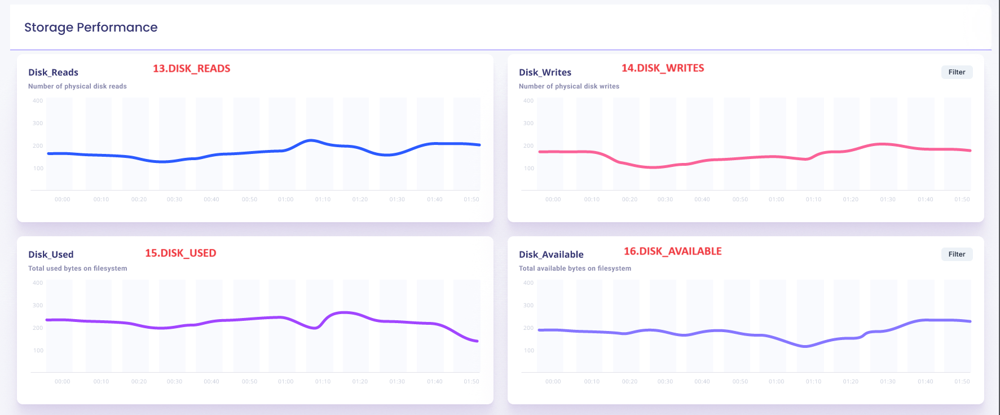
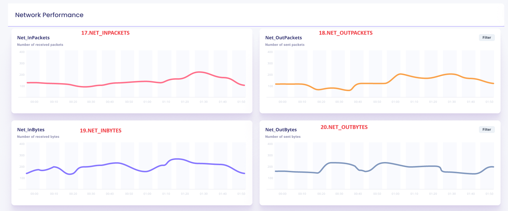

# Table of Contents

- [awsx-getelementdetails](#awsx-getelementdetails)
- [ui-analysis-and-listing-methods](#ui-analysis-and-listing-methods)
   - [cpu_utiization_panel](#cpu_utiization_panel)
   - [memory_utilization_panel](#memory_utilization_panel)
   - [storage_utilization_panel](#storage_utilization_panel)
   - [network_utilization_panel](#network_utilization_panel)
   - [cpu_usage_user_panel](#cpu_usage_user_panel)
   - [cpu_usage_idle_panel](#cpu_usage_idle_panel)
   - [cpu_usage_sys_panel](#cpu_usage_sys_panel)
   - [cpu_usage_nice_panel](#cpu_usage_nice_panel)
   - [mem_total_panel](#mem_total_panel)
   - [mem_free_panel](#mem_free_panel)
   - [mem_used_panel](#mem_used_panel)
   - [mem_physicalram_panel](#mem_physicalram_panel)
   - [disk_read_panel](#disk_read_panel)
   - [disk_write_panel](#disk_write_panel)
   - [disk_used_panel](#disk_used_panel)
   - [disk_available_panel](#disk_available_panel)
  - [net_inpackets_panel](#net_inpackets_panel)
  - [net_outpackets_panel](#net_outpackets_panel)
  - [net_inbytes_panel](#net_inbytes_panel)
  - [net_outbytes_panel](#net_outbytes_panel)
  - [cpu_utilization_graph_panel](#cpu_utilization_graph_panel)
  - [memory_utilization_graph_panel](#memory_utilization_graph_panel)
  - [network_traffic_panel](#network_traffic_panel)
  - [disk_in_out_panel](#disk_in_out_panel)
  - [instance_status_panel](#instance_status_panel)
  - [alerts_and_notifications_panel](#alerts_and_notifications_panel)
  - [instances_health_check_panel](#instances_health_check_panel)
  - [net_throughput_panel](#net_throughput_panel)
  - [error_rate_panel](#error_rate_panel)
  - [mean_time_to_recovery_panel](#mean_time_to_recovery_panel)
  - [hosted_service_overview_panel](#hosted_service_overview_panel)
  - [latency_panel](#latency_panel)
  - [error_tracking_panel](#error_tracking_panel)
  - [instance_hours_running_panel](#instance_hours_running_panel)
  - [instance_hours_stopped_panel](#error_rate_panel)


  
 
- [list of subcommands and options for EC2](#list-of-subcommands-and-options-for-ec2)
 
# awsx-getelementdetails
It implements the awsx plugin getElementDetails
 
# ui analysis and listing methods

1. cpu_utilization_panel
2. memory_utilization_panel
3. storage_utilization_panel
4. network_utilization_panel
5. cpu_usage_user_panel
6. cpu_usage_idle_panel
7. cpu_usage_sys_panel
8. cpu_usage_nice_panel
9.  mem_total_panel
10. mem_free_panel
11. mem_used_panel
12. mem_physicalRam_panel
13. disk_reads_panel
14. disk_writes_panel
15. disk_used_panel
16. disk_available_panel
17. net_inpackets_panel
18. net_outpacket_panel
19. net_inBytes_panel
20. net_outBytes_panel
21. cpu_utilization_graph_panel
22. memory_utilization_graph_panel
23. network_traffic_panel
24. disk_in_out_panel
25. instance_status_panel
26. alerts_and_notifications_panel
27. instances_health_check_panel
28. net_throughput_panel
29. error_rate_panel
30. mean_time_to_recovery_panel
31. hosted_service_overview_panel
32. latency_panel
33. error_tracking_panel
34. instance_hours_running_panel
35. instance_hours_stopped_panel
36. instance_start_count_panel
37. instance_stop_count_panel
38. network_inbound_data_transfer_panel
39. network_outbound_data_transfer_panel
40. custom_alerts_panel
41. instance_compliance_score_panel
42. instance_security_patch_status_panel
43. patching_panel
44. hardening_panel
45. instance_authentiication_failures_panel
46. encryption_compliance_panel
47. patch_mangement_status_panel
48. password_policy_compliance_panel
49. software_version_compliance_panel
50. access_control_and_permissions_panel

_
# ui-analysys-and listing-methods
# cpu_utiization_panel


1. cpu_utilization_panel

<!-- if vault is their then external Id and crossAccountRole is not required -->

**called from subcommand**

go run awsx-getelementdetails.go  --vaultUrl=<afreenXXXXXXX1309> --elementId=900000 --query="cpu_utilization_panel" --elementType="EC2" --responseType=json --startTime=2023-12-01T00:00:00Z --endTime=2023-12-02T23:59:59Z
 

**called from maincommand**

 
awsx --vaultUrl=<afreenXXXXXXX1309> --elementId=900000 --query="cpu_utilization_panel" --elementType="EC2" --responseType=json --startTime=2023-12-01T00:00:00Z --endTime=2023-12-02T23:59:59Z


**Called from API**

http://localhost:7000/awsx-api/getQueryOutput?vaultUrl=<afreenXXXX>&elementId=900000&elementType=EC2&query=cpu_utilization_panel&responseType=json&startTime=2023-12-01T00:00:00Z&endTime=2023-12-02T23:59:59Z


**Desired Output in json / graph format:**
1. CPU utilization
{
	CurrentUsage:25%,
	AverageUsage:30%,
	MaxUsage:40%
}


**Algorithm/ Pseudo Code**

**Algorithm:** 
- CPU utilization panel - Write a custom metric for cpu utilization, where we shall write a program for current, avg and max.

 **Pseudo Code:**  
 
 


# ui-analysys-and listing-methods
## memory_utilization_panel


2. memory_utilization_panel 


**called from subcommand**

go run awsx-getelementdetails.go  --vaultUrl=<afreenXXXXXXX1309> --elementId=900000 --query="memory_utilization_panel" --elementType="EC2" --responseType=json --startTime=2023-12-01T00:00:00Z --endTime=2023-12-02T23:59:59Z


**called from maincommand**

awsx --vaultUrl=<afreenXXXXXXX1309> --elementId=900000 --query="memory_utilization_panel" --elementType="EC2" --responseType=json --startTime=2023-12-01T00:00:00Z --endTime=2023-12-02T23:59:59Z


**Called from API**

http://localhost:7000/awsx-api/getQueryOutput?vaultUrl=<afreen1309XXX>&elementType=AWS/EC2&elementId=900000&query=memory_utilization_panel&responseType=json&startTime=2023-12-01T00:00:00Z&endTime=2023-12-02T23:59:59Z


**Desired Output in json / graph format:**
2.  Memory utilization
{
    CurrentUsage:25GB,
    AverageUsage:30GB,
	MaxUsage:40GB
}


**Algorithm/ Pseudo Code**

**Algorithm:** 
- MemoryUtilization - Write a custom metric for memory utilization, where we shall write a program for current, avg and max.

 **Pseudo Code:** 

 
 
 # ui-analysys-and listing-methods
 ## storage_utilization_panel


3. storage_utilization_panel 


**called from subcommand**

go run awsx-getelementdetails.go  --vaultUrl=<afreenXXXXXXX1309> --elementId=900000 --query="storage_utilization_panel" --elementType="EC2" --responseType=json --startTime=2023-12-01T00:00:00Z --endTime=2023-12-02T23:59:59Z

 

**called from maincommand**

awsx --vaultUrl=<afreenXXXXXXX1309> --elementId=900000 --query="storage_utilization_panel" --elementType="EC2" --responseType=json --startTime=2023-12-01T00:00:00Z --endTime=2023-12-02T23:59:59Z


**Called from API**

http://localhost:7000/awsx-api/getQueryOutput?vaultUrl=<afreenxxxx1309>&elementType=EC2&elementId=900000&query=storage_utilization_panel&responseType=json&startTime=2023-12-01T00:00:00Z&endTime=2023-12-02T23:59:59Z


**Desired Output in json / graph format:**
3.  Storage utilization
{
    RootVolumeUsage:25GB,
    EBSVolume1Usage:30GB,
	EBSVolume2Usage:40GB
}


**Algorithm/ Pseudo Code**

**Algorithm:** 
- Storage Utilization panel - Write a custom metric for storage utilization, where we shall write a program for root volume usage and ebs disks usage.

 **Pseudo Code:**  
 
 

 # ui-analysys-and listing-methods
 ## network_utilization_panel


4. network_utilization_panel 


**called from subcommand**

go run awsx-getelementdetails.go  --vaultUrl=<afreenxxxx1309> --elementId=900000 --query="network_utilization_panel" --elementType="EC2" --responseType=json --startTime=2023-12-01T00:00:00Z --endTime=2023-12-02T23:59:59Z

 

**called from maincommand**

awsx --vaultUrl=<afreenxxxx1309> --elementId=900000 --query="network_utilization_panel" --elementType="EC2" --responseType=frame --startTime=2023-12-01T00:00:00Z --endTime=2023-12-02T23:59:59Z


**Called from API**

http://localhost:7000/awsx-api/getQueryOutput?vaultUrl=<afreenxxxx1309>&elementType=AWS/EC2&elementId=900000&query=network_utilization_panel&responseType=json&startTime=2023-12-01T00:00:00Z&endTime=2023-12-02T23:59:59Z


**Desired Output in json / graph format:**
4.Network utilization
{
    Inbound traffic:500Mbps,
    Outbound traffic:200Mbps,
	Data Transferred:10GB
}


**Algorithm/ Pseudo Code**

**Algorithm:** 
- Network utilization panel - Write a custom metric for Network utilization, where we shall write a program for root volume usage and ebs disks usage.

 **Pseudo Code:**
 
 
 # ui-analysys-and listing-methods
 ## cpu_usage_user_panel


5. cpu_usage_user_panel


**called from subcommand**

go run awsx-getelementdetails.go  --vaultUrl=<afreenxxxx1309> --elementId=900000 --query="cpu_usage_user" --elementType="EC2" --responseType=json --startTime=2023-12-01T00:00:00Z --endTime=2023-12-02T23:59:59Z


 

**called from maincommand**

awsx --vaultUrl=<afreenxxxx1309> --elementId=900000 --query="cpu_usage_user" --elementType="EC2" --responseType=json --startTime=2023-12-01T00:00:00Z --endTime=2023-12-02T23:59:59Z


**Called from API**

http://localhost:7000/awsx-api/getQueryOutput?vaultUrl=<afreenxxxx1309>&elementType=EC2&elementId=900000&query=cpu_usage_user_panel&responseType=json&startTime=2023-12-01T00:00:00Z&endTime=2023-12-02T23:59:59Z


**Desired Output in json / graph format:**
5. CPU usage user panel

	-cpu_usage_user


**Algorithm/ Pseudo Code**

**Algorithm:** 
- CPU usage user  -Fire a cloudwatch query for cpu_usage_user_panel, using metric cpu_usage_user.

 **Pseudo Code:** 
 
 # ui-analysys-and listing-methods
## cpu_usage_idle_panel


6. cpu_usage_user_panel


**called from subcommand**

go run awsx-getelementdetails.go  --vaultUrl=<afreenxxxx1309> --elementId=900000 --query="cpu_usage_idle" --elementType="EC2" --responseType=json --startTime=2023-12-01T00:00:00Z --endTime=2023-12-02T23:59:59Z


 

**called from maincommand**

awsx --vaultUrl=<afreenxxxx1309> --elementId=900000 --query="cpu_usage_idle" --elementType="EC2" --responseType=json --startTime=2023-12-01T00:00:00Z --endTime=2023-12-02T23:59:59Z


**Called from API**

http://localhost:7000/awsx-api/getQueryOutput?vaultUrl=<afreenxxxx1309>&elementType=EC2&elementId=900000&query=cpu_usage_idle_panel&responseType=json&startTime=2023-12-01T00:00:00Z&endTime=2023-12-02T23:59:59Z


**Desired Output in json / graph format:**
6. CPU usage idle panel

	-cpu_usage_idle


**Algorithm/ Pseudo Code**

**Algorithm:** 
- CPU usage idle  -Fire a cloudwatch query for cpu_usage_idle_panel, using metric cpu_usage_idle.

 **Pseudo Code:** 
 
 # ui-analysys-and listing-methods
## cpu_usage_sys_panel


7. cpu_usage_user_panel

 


**called from subcommand**

go run awsx-getelementdetails.go  --vaultUrl=<afreenxxxx1309> --elementId=900000 --query="cpu_usage_sys" --elementType="EC2" --responseType=json --startTime=2023-12-01T00:00:00Z --endTime=2023-12-02T23:59:59Z


**called from maincommand**

awsx --vaultUrl=<afreenxxxx1309> --elementId=900000 --query="cpu_usage_sys" --elementType="EC2" --responseType=json --startTime=2023-12-01T00:00:00Z --endTime=2023-12-02T23:59:59Z


**Called from API**

http://localhost:7000/awsx-api/getQueryOutput?vaultUrl=<afreenxxxx1309>&elementType=EC2&elementId=900000&query=cpu_usage_sys_panel&responseType=json&startTime=2023-12-01T00:00:00Z&endTime=2023-12-02T23:59:59Z


**Desired Output in json / graph format:**
7. CPU usage sys panel

	-cpu_usage_sys


**Algorithm/ Pseudo Code**

**Algorithm:** 
- CPU usage sys  -Fire a cloudwatch query for cpu_usage_sys_panel, using metric cpu_sys_user.

 **Pseudo Code:** 
 
 # ui-analysys-and listing-methods
## cpu_usage_nice_panel


8. cpu_usage_nice_panel


**called from subcommand**

go run awsx-getelementdetails.go  --vaultUrl=<afreenxxxx1309> --elementId=900000 --query="cpu_usage_nice" --elementType="EC2" --responseType=json --startTime=2023-12-01T00:00:00Z --endTime=2023-12-02T23:59:59Z

**called from maincommand**

awsx --vaultUrl=<afreenxxxx1309> --elementId=900000 --query="cpu_usage_nice" --elementType="EC2" --responseType=json --startTime=2023-12-01T00:00:00Z --endTime=2023-12-02T23:59:59Z


**Called from API**

http://localhost:7000/awsx-api/getQueryOutput?vaultUrl=<afreenxxxx1309>&elementType=EC2&elementId=900000&query=cpu_usage_nice_panel&responseType=json&startTime=2023-12-01T00:00:00Z&endTime=2023-12-02T23:59:59Z


**Desired Output in json / graph format:**
8. CPU usage nice panel

	-cpu_usage_nice


**Algorithm/ Pseudo Code**

**Algorithm:** 
- CPU usage nice  -Fire a cloudwatch query for cpu_usage_nice_panel, using metric cpu_usage_nice.

 **Pseudo Code:** 
 
 
 # ui-analysys-and listing-methods
##  mem_total_panel


9. mem_total_panel


**called from subcommand**

go run awsx-getelementdetails.go  --vaultUrl=<afreenxxxx1309> --elementId=900000 --query="memory_total" --elementType="EC2" --responseType=json --startTime=2023-12-01T00:00:00Z --endTime=2023-12-02T23:59:59Z


**called from maincommand**

awsx --vaultUrl=<afreenxxxx1309> --elementId=900000 --query="memory_total" --elementType="EC2" --responseType=json --startTime=2023-12-01T00:00:00Z --endTime=2023-12-02T23:59:59Z


**Called from API**

http://localhost:7000/awsx-api/getQueryOutput?vaultUrl=<afreenxxxx1309>&elementType=EC2&elementId=900000&query=memory_total_panel&responseType=json&startTime=2023-12-01T00:00:00Z&endTime=2023-12-02T23:59:59Z


**Desired Output in json / graph format:**
9. memory total panel

	-mem_total_panel


**Algorithm/ Pseudo Code**

**Algorithm:** 
- Mem total panel  -Fire a cloudwatch query for mem_total_panel, using metric mem_total_panel.

 **Pseudo Code:** 
 
 
 # ui-analysys-and listing-methods

##  mem_free_panel


10. mem_free_panel


**called from subcommand**

go run awsx-getelementdetails.go  --vaultUrl=<afreenxxxx1309> --elementId=900000 --query="memory_free" --elementType="EC2" --responseType=json --startTime=2023-12-01T00:00:00Z --endTime=2023-12-02T23:59:59Z

 

**called from maincommand**

awsx --vaultUrl=<afreenxxxx1309> --elementId=900000 --query="memory_free" --elementType="EC2" --responseType=json --startTime=2023-12-01T00:00:00Z --endTime=2023-12-02T23:59:59Z


**Called from API**

http://localhost:7000/awsx-api/getQueryOutput?vaultUrl=<afreenxxxx1309>&elementType=EC2&elementId=900000&query=memory_free_panel&responseType=json&startTime=2023-12-01T00:00:00Z&endTime=2023-12-02T23:59:59Z


**Desired Output in json / graph format:**
10. memory free panel

	-mem_free_panel


**Algorithm/ Pseudo Code**

**Algorithm:** 
- Mem free panel  -Fire a cloudwatch query for mem_free_panel, using metric mem_free_panel.

 **Pseudo Code:** 
 
 # ui-analysys-and listing-methods

11. mem_used_panel


##  mem_used_panel

**called from subcommand**

go run awsx-getelementdetails.go  --vaultUrl=<afreenxxxx1309> --elementId=900000 --query="memory_used" --elementType="EC2" --responseType=json --startTime=2023-12-01T00:00:00Z --endTime=2023-12-02T23:59:59Z


**called from maincommand**

awsx --vaultUrl=<afreenxxxx1309> --elementId=900000 --query="memory_used" --elementType="EC2" --responseType=json --startTime=2023-12-01T00:00:00Z --endTime=2023-12-02T23:59:59Z


**Called from API**

http://localhost:7000/awsx-api/getQueryOutput?vaultUrl=<afreenxxxx1309>&elementType=EC2&elementId=900000&query=memory_used_panel&responseType=json&startTime=2023-12-01T00:00:00Z&endTime=2023-12-02T23:59:59Z


**Desired Output in json / graph format:**
11. memory used panel

	-mem_used_panel


**Algorithm/ Pseudo Code**

**Algorithm:** 
- Mem used panel  -Fire a cloudwatch query for mem_used_panel, using metric mem_used_panel.

 **Pseudo Code:** 
 
 
 # ui-analysys-and listing-methods

##  mem_physicalram_panel


12. mem_physicalRAM_panel


**called from subcommand**

go run awsx-getelementdetails.go  --vaultUrl=<afreenxxxx1309> --elementId=900000 --query="memory_physicalRAM" --elementType="EC2" --responseType=json --startTime=2023-12-01T00:00:00Z --endTime=2023-12-02T23:59:59Z

 

**called from maincommand**

awsx --vaultUrl=<afreenxxxx1309> --elementId=900000 --query="memory_physicalRAM" --elementType="EC2" --responseType=json --startTime=2023-12-01T00:00:00Z --endTime=2023-12-02T23:59:59Z


**Called from API**

http://localhost:7000/awsx-api/getQueryOutput?vaultUrl=<afreenxxxx1309>&elementType=EC2&elementId=900000&query=memory_physicalRAM_panel&responseType=json&startTime=2023-12-01T00:00:00Z&endTime=2023-12-02T23:59:59Z


**Desired Output in json / graph format:**
12. memory physicalRAM panel

	-mem_physicalRAM_panel


**Algorithm/ Pseudo Code**

**Algorithm:** 
- Mem physicalRAM panel  -Fire a cloudwatch query for mem_physicalRAM_panel, using metric mem_physicalRAM_panel.

 **Pseudo Code:**  
 
 
 
 # ui-analysys-and listing-methods
##  disk_read_panel


13. disk_read_panel


**called from subcommand**

go run awsx-getelementdetails.go  --vaultUrl=<afreenxxxx1309> --elementId=900000 --query="disk_read" --elementType="EC2" --responseType=json --startTime=2023-12-01T00:00:00Z --endTime=2023-12-02T23:59:59Z


**called from maincommand**

awsx --vaultUrl=<afreenxxxx1309> --elementId=900000 --query="disk_read" --elementType="EC2" --responseType=json --startTime=2023-12-01T00:00:00Z --endTime=2023-12-02T23:59:59Z


**Called from API**

http://localhost:7000/awsx-api/getQueryOutput?vaultUrl=<afreenxxxx1309>&elementType=EC2&elementId=900000&query=disk_read_panel&responseType=json&startTime=2023-12-01T00:00:00Z&endTime=2023-12-02T23:59:59Z


**Desired Output in json / graph format:**
13. disk_read panel

	-disk_read_panel


**Algorithm/ Pseudo Code**

**Algorithm:** 
- disk read panel  -Fire a cloudwatch query for disk_read_panel, using metric disk_read_panel.

 **Pseudo Code:**  
 

 # ui-analysys-and listing-methods
##  disk_write_panel


14. disk_write_panel


**called from subcommand**

go run awsx-getelementdetails.go  --vaultUrl=<afreenxxxx1309> --elementId=900000 --query="disk_write" --elementType="EC2" --responseType=json --startTime=2023-12-01T00:00:00Z --endTime=2023-12-02T23:59:59Z

 
**called from maincommand**

awsx --vaultUrl=<afreenxxxx1309> --elementId=900000 --query="disk_write" --elementType="EC2" --responseType=json --startTime=2023-12-01T00:00:00Z --endTime=2023-12-02T23:59:59Z


**Called from API**

http://localhost:7000/awsx-api/getQueryOutput?vaultUrl=<afreenxxxx1309>&elementType=EC2&elementId=900000&query=disk_write_panel&responseType=json&startTime=2023-12-01T00:00:00Z&endTime=2023-12-02T23:59:59Z


**Desired Output in json / graph format:**
14. disk_write panel

	-disk_write_panel


**Algorithm/ Pseudo Code**

**Algorithm:** 
- disk write panel  -Fire a cloudwatch query for disk_write_panel, using metric disk_write_panel.

 **Pseudo Code:**  
 
 
 # ui-analysys-and listing-methods
##  disk_used_panel


15. disk_used_panel


**called from subcommand**

go run awsx-getelementdetails.go  --vaultUrl=<afreenxxxx1309> --elementId=900000 --query="disk_used" --elementType="EC2" --responseType=json --startTime=2023-12-01T00:00:00Z --endTime=2023-12-02T23:59:59Z
 

**called from maincommand**

awsx --vaultUrl=<afreenxxxx1309> --elementId=900000 --query="disk_used" --elementType="EC2" --responseType=json --startTime=2023-12-01T00:00:00Z --endTime=2023-12-02T23:59:59Z


**Called from API**

http://localhost:7000/awsx-api/getQueryOutput?vaultUrl=<afreenxxxx1309>&elementType=EC2&elementId=900000&query=disk_used_panel&responseType=json&startTime=2023-12-01T00:00:00Z&endTime=2023-12-02T23:59:59Z


**Desired Output in json / graph format:**
15. disk_used panel

	-disk_used_panel
	


**Algorithm/ Pseudo Code**

**Algorithm:** 
- disk used panel  -Fire a cloudwatch query for disk_used_panel, using metric disk_used_panel.

 **Pseudo Code:**  
 
 # ui-analysys-and listing-methods
##  disk_available_panel


16. disk_available_panel


**called from subcommand**

go run awsx-getelementdetails.go  --vaultUrl=<afreenxxxx1309> --elementId=900000 --query="disk_available" --elementType="EC2" --responseType=json --startTime=2023-12-01T00:00:00Z --endTime=2023-12-02T23:59:59Z

 

**called from maincommand**

awsx --vaultUrl=<afreenxxxx1309> --elementId=900000 --query="disk_available" --elementType="EC2" --responseType=json --startTime=2023-12-01T00:00:00Z --endTime=2023-12-02T23:59:59Z


**Called from API**

http://localhost:7000/awsx-api/getQueryOutput?vaultUrl=<afreenxxxx1309>&elementType=EC2&elementId=900000&query=disk_available_panel&responseType=json&startTime=2023-12-01T00:00:00Z&endTime=2023-12-02T23:59:59Z


**Desired Output in json / graph format:**
16. disk_available panel

	-disk_available_panel
	  

**Algorithm/ Pseudo Code**

**Algorithm:** 
- disk available panel  -Fire a cloudwatch query for disk_available_panel, using metric disk_available_panel.

 **Pseudo Code:**  
 
 
  # ui-analysys-and listing-methods
  ##  net_inpackets_panel


17. net_inPackets_panel


**called from subcommand**

go run awsx-getelementdetails.go  --vaultUrl=<afreenxxxx1309> --elementId=900000 --query="network_in" --elementType="EC2" --responseType=json --startTime=2023-12-01T00:00:00Z --endTime=2023-12-02T23:59:59Z


**called from maincommand**

awsx --vaultUrl=<afreenxxxx1309> --elementId=900000 --query="network_in" --elementType="EC2" --responseType=json --startTime=2023-12-01T00:00:00Z --endTime=2023-12-02T23:59:59Z


**Called from API**

http://localhost:7000/awsx-api/getQueryOutput?vaultUrl=<afreenxxxx1309>&elementType=EC2&elementId=900000&query=network_in_panel&responseType=json&startTime=2023-12-01T00:00:00Z&endTime=2023-12-02T23:59:59Z


**Desired Output in json / graph format:**
17. network_in_packets_panel

	-network_in_panel
	

**Algorithm/ Pseudo Code**

**Algorithm:** 
- network_inpackets panel  -Fire a cloudwatch query for network_inpackets_panel, using metric network_in_panel.

 **Pseudo Code:**  
 
  # ui-analysys-and listing-methods
##  net_outpackets_panel


18. net\_outPackets\_panel


##  net_outpackets_panel

**called from subcommand**

go run awsx-getelementdetails.go  --vaultUrl=<afreenxxxx1309> --elementId=900000 --query="network_out" --elementType="EC2" --responseType=json --startTime=2023-12-01T00:00:00Z --endTime=2023-12-02T23:59:59Z


**called from maincommand**

awsx --vaultUrl=<afreenxxxx1309> --elementId=900000 --query="network_out" --elementType="EC2" --responseType=json --startTime=2023-12-01T00:00:00Z --endTime=2023-12-02T23:59:59Z


**Called from API**

http://localhost:7000/awsx-api/getQueryOutput?vaultUrl=<afreenxxxx1309>&elementType=EC2&elementId=900000&query=network_out_panel&responseType=json&startTime=2023-12-01T00:00:00Z&endTime=2023-12-02T23:59:59Z


**Desired Output in json / graph format:**
18. network_out_packets_panel

	-network_out_panel
	

**Algorithm/ Pseudo Code**

**Algorithm:** 
- network_outpackets panel  -Fire a cloudwatch query for network_outpackets_panel, using metric network_out_panel.

 **Pseudo Code:**  
 
 # ui-analysys-and listing-methods
##  net_inbytes_panel


19. net\_inbytes\_panel


**called from subcommand**

go run awsx-getelementdetails.go  --vaultUrl=<afreenxxxx1309> --elementId=900000 --query="network_in" --elementType="EC2" --responseType=json --startTime=2023-12-01T00:00:00Z --endTime=2023-12-02T23:59:59Z

 

**called from maincommand**

awsx --vaultUrl=<afreenxxxx1309> --elementId=900000 --query="network_in" --elementType="EC2" --responseType=json --startTime=2023-12-01T00:00:00Z --endTime=2023-12-02T23:59:59Z


**Called from API**

http://localhost:7000/awsx-api/getQueryOutput?vaultUrl<afreenxxxx1309>&elementType=EC2&elementId=900000&query=network_in_panel$responseType=json&startTime=2023-12-01T00:00:00Z&endTime=2023-12-02T23:59:59Z


**Desired Output in json / graph format:**
19. network_in_packets_panel

	-network_in_panel
	

**Algorithm/ Pseudo Code**

**Algorithm:** 
- network_inBytes panel  -Fire a cloudwatch query for network_inBytes_panel, using metric network_in_panel.

 **Pseudo Code:**  
 
 # ui-analysys-and listing-methods
##  net_outbytes_panel


20. net\_outBytes\_panel


**called from subcommand**

go run awsx-getelementdetails.go  --vaultUrl=<afreenxxxx1309> --elementId=900000 --query="network_out" --elementType="EC2" --responseType=json --startTime=2023-12-01T00:00:00Z --endTime=2023-12-02T23:59:59Z

 

**called from maincommand**

awsx --vaultUrl=<afreenxxxx1309> --elementId=900000 --query="network_out" --elementType="EC2" --responseType=json --startTime=2023-12-01T00:00:00Z --endTime=2023-12-02T23:59:59Z


**Called from API**

http://localhost:7000/awsx-api/getQueryOutput?vaultUrl=<afreenxxxx1309>&elementType=EC2&elementId=900000&query=network_out_panel&responsetype=json&startTime=2023-12-01T00:00:00Z&endTime=2023-12-02T23:59:59Z


**Desired Output in json / graph format:**
20. network_out_bytes_panel

	-network_outBytes_panel
	

**Algorithm/ Pseudo Code**

**Algorithm:** 

- network_outBytes panel  -Fire a cloudwatch query for network_outBytes_panel, using metric network_out_panel.

 **Pseudo Code:**  


 
# list of subcommands and options for EC2
 
| S.No | CLI Spec|  Description                          
|------|----------------|----------------------|
| 1    | awsx --vaultURL=vault.synectiks.net getElementDetails --elementId="900000" --elementType=EC2 --query="cpu_utilization_panel"  | This will get the specific EC2 instance cpu utilization panel data in hybrid structure |
| 2    | awsx --vaultURL=vault.synectiks.net getElementDetails --elementId="900000" --elementType=EC2 --query="memory_utilization_panel" | This will get the specific EC2 instance memory utilization panel data in hybrid structure|
| 3    | awsx --vaultURL=vault.synectiks.net getElementDetails --elementId="900000" --elementType=EC2 --query="storage_utilization_panel"  | This will get the specific EC2 instance storage utilization panel data in hybrid structure |
| 4    | awsx --vaultURL=vault.synectiks.net getElementDetails --elementId="900000" --elementType=EC2 --query="network_utilization_panel"  | This will get th1e specific EC2 instance network utilization panel data in hybrid structure |


## Acknowledgements

 - [Awesome Readme Templates](https://awesomeopensource.com/project/elangosundar/awesome-README-templates)
 - [Awesome README](https://github.com/matiassingers/awesome-readme)
 - [How to write a Good readme](https://bulldogjob.com/news/449-how-to-write-a-good-readme-for-your-github-project)


## API Reference

#### Get all items

```http
  GET /api/items
```

| Parameter | Type     | Description                |
| :-------- | :------- | :------------------------- |
| `api_key` | `string` | **Required**. Your API key |

#### Get item

```http
  GET /api/items/${id}
```

| Parameter | Type     | Description                       |
| :-------- | :------- | :-------------------------------- |
| `id`      | `string` | **Required**. Id of item to fetch |

#### add(num1, num2)

Takes two numbers and returns the sum.


## Appendix

Any additional information goes here

