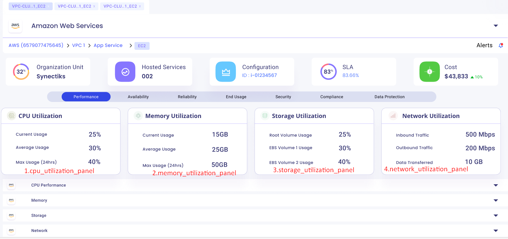
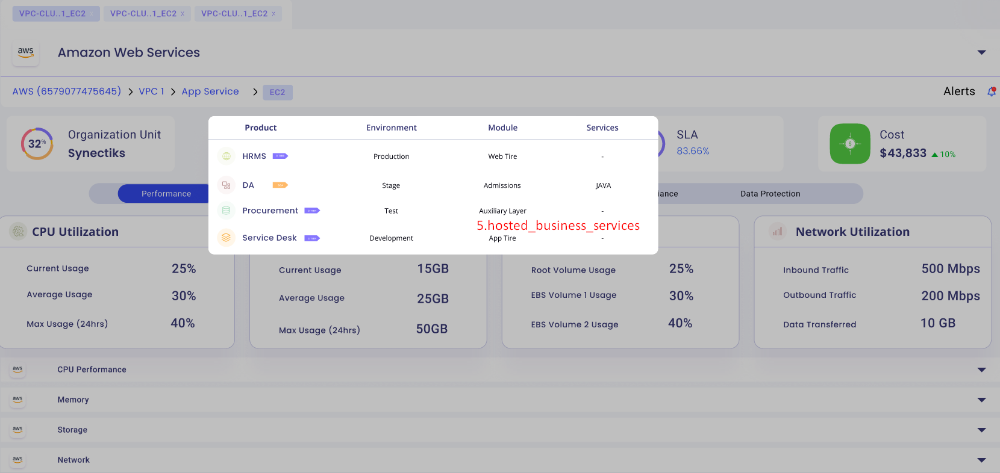
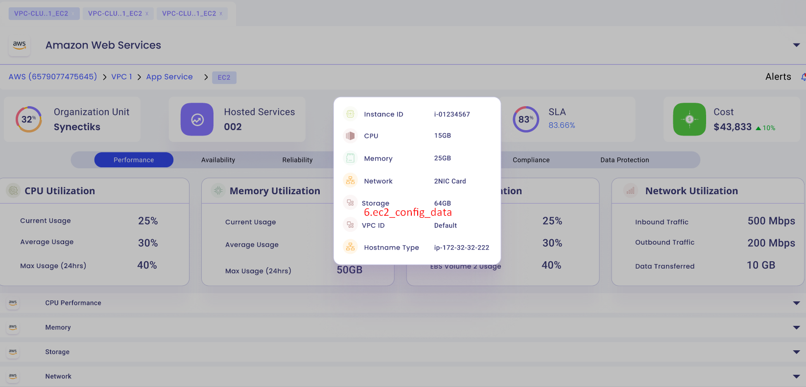
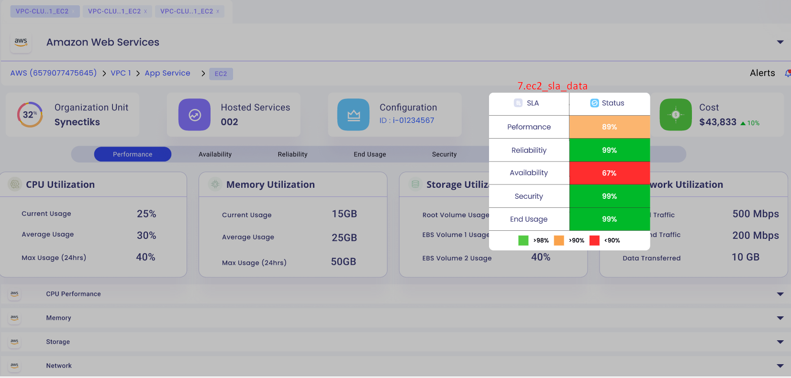
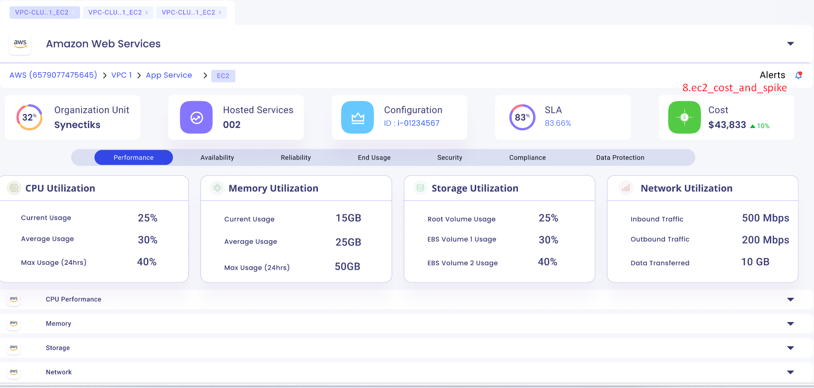

- [awsx-getelementdetails](#awsx-getelementdetails)
- [ui-analysys-and listing-methods](#ui-analysys-and-listing-methods)
  - [cpu\_utilization\_panel](#cpu_utilization_panel)
- [list of subcommands and options for EC2](#list-of-subcommands-and-options-for-ec2)

# awsx-getelementdetails
It implements the awsx plugin getElementDetails 

# ui-analysys-and listing-methods

1. cpu_utilization_panel 
2. storage_utilization_panel
3. network_utilization_panel
4. memory_utilization_panel
   

5. hosted_business_services

6. ec2_config_data

7. ec2_sla_data

8. ec2_cost_and_spike

## cpu_utilization_panel

**called from subcommand**

awsx-getelementdetails --vaultURL=vault.synectiks.net --elementId="1234" --elementType=EC2 --query="cpu_utilization_panel" --timeRange={}

**called from maincommand**

awsx --vaultURL=vault.synectiks.net getElementDetails --elementId="1234" --elementType=EC2 --query="cpu_utilization_panel" --timeRange={}

**Called from API**

/awsx-api/getQueryOutput? elementType=EC2, elementId="1234" , query=cpu_utilization_panel, --timeRange={}

**Desired Output in json format:**
{
	CurrentUsage:25,
	AverageUsage:30,
	MaxUsage:40
}

**Algorithm/ Pseudo Code**

write in details

# list of subcommands and options for EC2

| S.No | CLI Spec|  Description                           
|------|----------------|----------------------|
| 1    | awsx --vaultURL=vault.synectiks.net getElementDetails --elementId="1234" --elementType=EC2 --query="ec2-config-data"  | This will get the specific EC2 instance config data |
| 2    | awsx --vaultURL=vault.synectiks.net getElementDetails --elementId="1234" --elementType=EC2 --query="cpu_utilization_panel"  | This will get the specific EC2 instance cpu utilization panel data in hybrid structure |
| 3    | awsx --vaultURL=vault.synectiks.net getElementDetails --elementId="1234" --elementType=EC2 --query="storage_utilization_panel" | This will get the specific EC2 instance storage utilization panel data in hybrid structure|
| 4    | awsx --vaultURL=vault.synectiks.net getElementDetails --elementId="1234" --elementType=EC2 --query="network_utilization_panel"  | This will get the specific EC2 instance network utilization panel data in hybrid structure |
