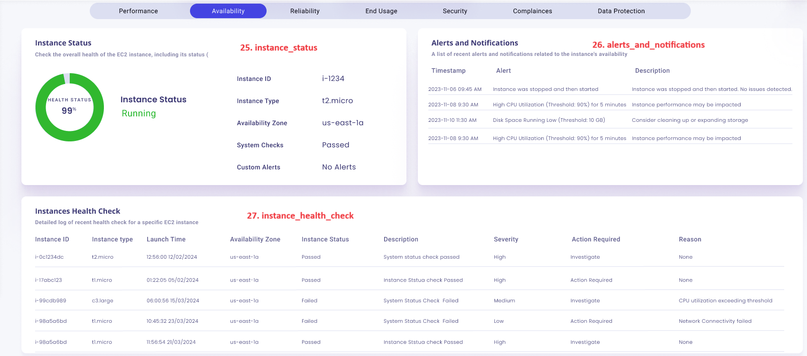
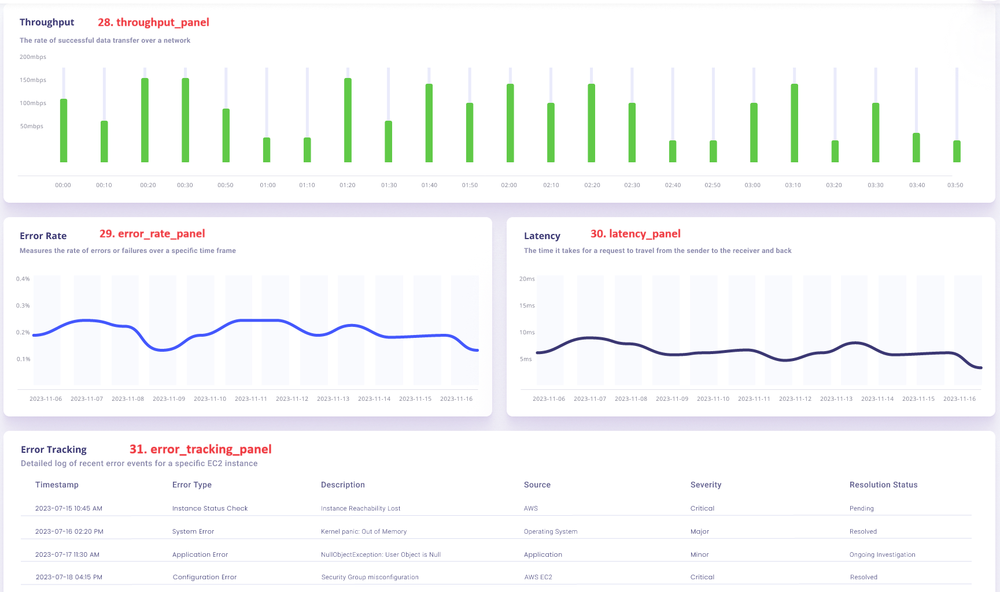

# Table of Contents

- [awsx-getelementdetails](#awsx-getelementdetails)
- [ui-analysis-and-listing-methods](#ui-analysis-and-listing-methods)
   - [cpu_utiization_panel](#cpu_utiization_panel)
   - [memory_utilization_panel](#memory_utilization_panel)
   - [storage_utilization_panel](#storage_utilization_panel)
   - [network_utilization_panel](#network_utilization_panel)
   - [cpu_usage_user_panel](#cpu_usage_user_panel)
   - [cpu_usage_idle_panel](#cpu_usage_idle_panel)
   - [cpu_usage_sys_panel](#cpu_usage_sys_panel)
   - [cpu_usage_nice_panel](#cpu_usage_nice_panel)
   - [mem_usage_total_panel](#mem_usage_total_panel)
   - [mem_usage_free_panel](#mem_usage_free_panel)
   - [mem_usage_used_panel](#mem_usage_used_panel)
   - [mem_physicalram_panel](#mem_physicalram_panel)
   - [disk_read_panel](#disk_reads_panel)
   - [disk_write_panel](#disk_writes_panel)
   - [disk_used_panel](#disk_used_panel)
   - [disk_available_panel](#disk_available_panel)
  - [net_inpackets_panel](#net_inpackets_panel)
  - [net_outpackets_panel](#net_outpackets_panel)
  - [net_inbytes_panel](#net_inbytes_panel)
  - [net_outbytes_panel](#net_outbytes_panel)
  - [cpu_utilization_graph_panel](#cpu_utilization_graph_panel)
  - [memory_utilization_graph_panel](#memory_utilization_graph_panel)
  - [network_traffic_panel](#network_traffic_panel)
  - [disk_io_panel](#disk_io_panel)
  - [instance_status_panel](#instance_status_panel)
  - [alerts_and_notifications_panel](#alerts_and_notifications_panel)
  - [instances_health_check_panel](#instances_health_check_panel)
  - [throughput_panel](#throughput_panel)
  - [error_rate_panel](#error_rate_panel)
  - [latency_panel](#latency_panel)
  - [error_tracking_panel](#error_tracking_panel)
  - [instance_running_hour_panel](#instance_running_hour_panel)
  - [instance_hours_stopped_panel](#instance_hours_stopped_panel)
  - [instance_start_count_panel](#instance_start_count_panel)
  - [instance_stop_count_panel](#instance_stop_count_panel)
  - [network_inbound_panel](#network_inbound_panel)
  - [network_outbound_panel](#network_outbound_panel)
  - [custom_alert_panel](#custom_alert_panel)

  
- [pseudocode for matric based panels](#pseudocode-for-matric-based-panels)
- [pseudocode for log based panels](#pseudocode-for-log-based-panels)

- [list of subcommands and options for EC2](#list-of-subcommands-and-options-for-ec2)
 
# awsx-getelementdetails
It implements the awsx plugin getElementDetails
 
# ui analysis and listing methods

1. cpu_utilization_panel
2. memory_utilization_panel
3. storage_utilization_panel
4. network_utilization_panel
5. cpu_usage_user_panel
6. cpu_usage_idle_panel
7. cpu_usage_sys_panel
8. cpu_usage_nice_panel
9.  mem_usage_total_panel
10. mem_usage_free_panel
11. mem_usage_used_panel
12. mem_physicalRam_panel
13. disk_read_panel
14. disk_write_panel
15. disk_used_panel
16. disk_available_panel
17. net_inpackets_panel
18. net_outpacket_panel
19. net_inBytes_panel
20. net_outBytes_panel
21. cpu_utilization_graph_panel
22. memory_utilization_graph_panel
23. network_traffic_panel
24. disk_io_panel
25. instance_status_panel
26. alerts_and_notifications_panel
27. instances_health_check_panel
28. throughput_panel
29. error_rate_panel
30. latency_panel
31. error_tracking_panel
32. instance_running_hour_panel
33. instance_hours_stopped_panel
34. instance_start_count_panel
35. instance_stop_count_panel
36. network_inbound_panel   <!-- network_inbound_data_transfer_panel -->
37. network_outbound_panel  <!-- network_outbound_data_transfer_panel -->
38. custom_alerts_panel
39. instance_authentiication_failures_panel
40. patching_panel
41. patch_mangement_status_panel


**Algorithm:** 
## Algorithm for metric based panels

1. **Define a command to fetch metrics.**
2. **On command execution:**
   - Authenticate the command.
   - Call function to fetch metrics data.
   - Print metrics data.
3. **Define function to fetch metrics data:**
   - Get parameters and parse times from command flags.
   - Get additional data (e.g., log group name).
   - Construct an input for CloudWatch metrics and bring data using the AWS SDK for Go.
   - Process and return results.
4. **Initialize command flags.**

## Algorithm for log based panels
1. **Define a command to fetch logs data.**
2. **On command execution:**
   - Authenticate the command.
   - Call function to fetch logs data.
   - Print logs data.
3. **Define function to fetch logs data:**
    - Get log group name from command flags.
    - Parse start and end times.
    - Get log group name from CMDB data.
    - Construct and execute CloudWatch query.
    - Process and return results.
4. **Initialize command flags.**
_
# pseudocode for matric based panels
```
Define command to fetch metrics:

On command run:
    Authenticate the command
    If authentication fails:
        Print error and return
    Get responseType from command flags
    Retrieve metrics using GetMetricsPanel function
    If error occurs:
        Print error and return
    Format and print the response based on responseType

Function GetMetricsPanel(command, clientAuth, cloudWatchClient):
    Input: cmd *cobra.Command, clientAuth *model.Auth, cloudWatchClient *cloudwatch.CloudWatch
    Output: string, map[string]*cloudwatch.GetMetricDataOutput, error
    Get elementType and instanceId from command flags
    Parse startTime and endTime from command flags
    If error in parsing times:
        Return error
    Get instanceId using CMDB data
    If error in getting instanceId:
        Return error
    Initialize metricData map
    Get metric data and store in metricData if available
    Create jsonOutput map with metricData values
    Marshal jsonOutput to JSON string
    If error:
        Return error
    Return JSON string and metricData

Initialize command flags

```
# pseudocode-for-log-based-panels

```
Define command to fetch cloudwatch logs:

On command run:
    Authenticate the command
    If authentication fails:
        Print error and return
    Get responseType from command flags
    Retrieve metrics using function
    If error occurs:
        Print error and return
    Format and print the response based on responseType

Function to fetch panel data:
    Input: cmd (*cobra.Command), clientAuth (*model.Auth), cloudWatchLogs (*cloudwatchlogs.CloudWatchLogs)
    Output: results ([]*cloudwatchlogs.GetQueryResultsOutput), error

    Get the log group name from command flags
    Parse the start and end times from command flags
    If an error occurs during parsing times:
        Return nil for results and the error

    Get the log group name from CMDB data
    If an error occurs during fetching CMDB data:
        Return nil for results and the error

    Construct the CloudWatch query and fetch data
    If an error occurs during fetching data:
        Return nil for results and the error

    Process the fetched results
    Return the processed results and nil for error

Initialize command flags

```

# ui-analysys-and listing-methods
# cpu_utiization_panel


1. cpu_utilization_panel

<!-- if vault is their then external Id and crossAccountRole is not required -->

**called from subcommand**
```shell
go run awsx-getelementdetails.go  --vaultUrl=<afreenXXXXXXX1309> --elementId=14923 --query="cpu_utilization_panel" --elementType="EC2" --responseType=json --startTime=2023-12-01T00:00:00Z --endTime=2023-12-02T23:59:59Z
```
 
**called from maincommand**
```shell
awsx --vaultUrl=<afreenXXXXXXX1309> --elementId=14923 --query="cpu_utilization_panel" --elementType="EC2" --responseType=json --startTime=2023-12-01T00:00:00Z --endTime=2023-12-02T23:59:59Z
```


**Called from API**

[http://localhost:7000/awsx-api/getQueryOutput?vaultUrl=<afreenXXXX>&elementId=14923&elementType=EC2&query=cpu_utilization_panel&responseType=json&startTime=2023-12-01T00:00:00Z&endTime=2023-12-02T23:59:59Z](http://localhost:7000/awsx-api/getQueryOutput?vaultUrl=<afreenXXXX>&elementId=14923&elementType=EC2&query=cpu_utilization_panel&responseType=json&startTime=2023-12-01T00:00:00Z&endTime=2023-12-02T23:59:59Z)


**Algorithm:** 
- CPU utilization panel - Write a custom metric for cpu utilization, where we shall write a program for current, avg and max.


**Metric Used:**
- **Metric Name:** CPUUtilization
- **Statistics Used:**
  - SampleCount: Used for calculating current usage.
  - Average: Used for calculating average usage.
  - Maximum: Used for calculating maximum usage.


**Desired Output in json / graph format:**
```json
{
	"CurrentUsage":"25%",
	"AverageUsage":"30%",
	"MaxUsage":"40%"
}
```

# ui-analysys-and listing-methods
## memory_utilization_panel


2. memory_utilization_panel 

**called from subcommand**
```shell
go run awsx-getelementdetails.go  --vaultUrl=<afreenXXXXXXX1309> --elementId=14923 --query="memory_utilization_panel" --elementType="EC2" --responseType=json --startTime=2023-12-01T00:00:00Z --endTime=2023-12-02T23:59:59Z
```

**called from maincommand**
```shell
awsx --vaultUrl=<afreenXXXXXXX1309> --elementId=14923 --query="memory_utilization_panel" --elementType="EC2" --responseType=json --startTime=2023-12-01T00:00:00Z --endTime=2023-12-02T23:59:59Z
```

**Called from API**

[http://localhost:7000/awsx-api/getQueryOutput?vaultUrl=<afreen1309XXX>&elementType=AWS/EC2&elementId=14923&query=memory_utilization_panel&responseType=json&startTime=2023-12-01T00:00:00Z&endTime=2023-12-02T23:59:59Z](http://localhost:7000/awsx-api/getQueryOutput?vaultUrl=<afreen1309XXX>&elementType=AWS/EC2&elementId=14923&query=memory_utilization_panel&responseType=json&startTime=2023-12-01T00:00:00Z&endTime=2023-12-02T23:59:59Z)


**Algorithm:** 
- MemoryUtilization - Write a custom metric for memory utilization, where we shall write a program for current, avg and max using mem_used_percent matric.

**Metric Used:**
- **Metric Name:** mem_used_percent
- **Statistics Used:**
  - SampleCount: Used for calculating current usage.
  - Average: Used for calculating average usage.
  - Maximum: Used for calculating maximum usage.

**Desired Output in json / graph format:**

2.  Memory utilization
```json
{
    "CurrentUsage":"25GB",
    "AverageUsage":"30GB",
	  "MaxUsage":"40GB"
}

```

# ui-analysys-and listing-methods
## storage_utilization_panel


3. storage_utilization_panel 

**called from subcommand**

```shell
go run awsx-getelementdetails.go  --vaultUrl=<afreenXXXXXXX1309> --elementId=14923 --query="storage_utilization_panel" --elementType="EC2" --responseType=json --startTime=2023-12-01T00:00:00Z --endTime=2023-12-02T23:59:59Z
```

**called from maincommand**

```shell
awsx --vaultUrl=<afreenXXXXXXX1309> --elementId=14923 --query="storage_utilization_panel" --elementType="EC2" --responseType=json --startTime=2023-12-01T00:00:00Z --endTime=2023-12-02T23:59:59Z
```

**Called from API**

[http://localhost:7000/awsx-api/getQueryOutput?vaultUrl=<afreenxxxx1309>&elementType=EC2&elementId=14923&query=storage_utilization_panel&responseType=json&startTime=2023-12-01T00:00:00Z&endTime=2023-12-02T23:59:59Z](http://localhost:7000/awsx-api/getQueryOutput?vaultUrl=<afreenxxxx1309>&elementType=EC2&elementId=14923&query=storage_utilization_panel&responseType=json&startTime=2023-12-01T00:00:00Z&endTime=2023-12-02T23:59:59Z)


**Algorithm:** 
- Storage Utilization panel - Write a custom metric for storage utilization, where we shall write a program for root volume usage and ebs disks usage.

**Metric Used:**
- **Metric Name:** Storage Utilization
- **Statistics Used:**
  - Average: Used for calculating average utilization.
  - Period: 300 seconds
  - Namespace: CWAgent
  - Metric Name: disk_used_percent (Root Volume Utilization), VolumeBytesUsed (EBS Volume Utilization)

**Desired Output in json / graph format:**
```json
{
    "RootVolumeUsage":"25GB",
    "EBSVolume1Usage":"30GB",
	"EBSVolume2Usage":"40GB"
}
```

 
 # ui-analysys-and listing-methods
 ## network_utilization_panel


4. network_utilization_panel 

**called from subcommand**
```shell
go run awsx-getelementdetails.go  --vaultUrl=<afreenxxxx1309> --elementId=14923 --query="network_utilization_panel" --elementType="EC2" --responseType=json --startTime=2023-12-01T00:00:00Z --endTime=2023-12-02T23:59:59Z
```

**called from maincommand**

```shell
awsx --vaultUrl=<afreenxxxx1309> --elementId=14923 --query="network_utilization_panel" --elementType="EC2" --responseType=frame --startTime=2023-12-01T00:00:00Z --endTime=2023-12-02T23:59:59Z
```


**Called from API**

[http://localhost:7000/awsx-api/getQueryOutput?vaultUrl=<afreenxxxx1309>&elementType=AWS/EC2&elementId=14923&query=network_utilization_panel&responseType=json&startTime=2023-12-01T00:00:00Z&endTime=2023-12-02T23:59:59Z](http://localhost:7000/awsx-api/getQueryOutput?vaultUrl=<afreenxxxx1309>&elementType=AWS/EC2&elementId=14923&query=network_utilization_panel&responseType=json&startTime=2023-12-01T00:00:00Z&endTime=2023-12-02T23:59:59Z)


**Algorithm:** 
- Network utilization panel - Write a custom metric for Network utilization, where we shall write a program for root volume usage and ebs disks usage.

**Metric Used:**
- **Metric Name:** Network Utilization
- **Statistics Used:**
  - Average: Used for calculating average utilization.
  - Period: 300 seconds
  - Namespace: AWS/EC2
  - Metric Names: NetworkIn (Inbound Traffic), NetworkOut (Outbound Traffic)

**Desired Output in json / graph format:**
```json
{
  "Inbound traffic":"500Mbps",
  "Outbound traffic":"200Mbps",
	"Data Transferred":"10GB"
}
```

# ui-analysys-and listing-methods
## cpu_usage_user_panel


5. cpu_usage_user_panel

**called from subcommand**
```shell
go run awsx-getelementdetails.go  --vaultUrl=<afreenxxxx1309> --elementId=14923 --query="cpu_usage_user" --elementType="EC2" --responseType=json --startTime=2023-12-01T00:00:00Z --endTime=2023-12-02T23:59:59Z
```

 

**called from maincommand**
```shell
awsx --vaultUrl=<afreenxxxx1309> --elementId=14923 --query="cpu_usage_user" --elementType="EC2" --responseType=json --startTime=2023-12-01T00:00:00Z --endTime=2023-12-02T23:59:59Z
```

**Called from API**

[http://localhost:7000/awsx-api/getQueryOutput?vaultUrl=<afreenxxxx1309>&elementType=EC2&elementId=14923&query=cpu_usage_user_panel&responseType=json&startTime=2023-12-01T00:00:00Z&endTime=2023-12-02T23:59:59Z](http://localhost:7000/awsx-api/getQueryOutput?vaultUrl=<afreenxxxx1309>&elementType=EC2&elementId=14923&query=cpu_usage_user_panel&responseType=json&startTime=2023-12-01T00:00:00Z&endTime=2023-12-02T23:59:59Z)


**Algorithm:** 
- CPU Usage (User) panel - Define a custom metric for CPU usage focusing on user processes, by specifying the metric name as "CPU Usage (User)", utilizing average statistics from the CWAgent namespace.

**Metric Used:**
- **Metric Name:** CPU Usage (User)
- **Statistics Used:** Average
- **Namespace:** CWAgent

**Desired Output in json / graph format:**

5. CPU usage user panel
```json
{
    "CPU_User": {
        "MetricDataResults": [
            {
                "Id": "m1",
                "Label": "cpu_usage_user",
                "Timestamps": [
                    "2024-05-20T10:00:00Z",
                    "2024-05-20T10:05:00Z",
                    "2024-05-20T10:10:00Z"
                ],
                "Values": [
                    12.5,
                    13.7,
                    15.2
                ],
                "StatusCode": "Complete",
                "Messages": []
            }
        ]
    }
}

```
 
 # ui-analysys-and listing-methods
## cpu_usage_idle_panel


6. cpu_usage_idle_panel

**called from subcommand**
```shell
go run awsx-getelementdetails.go  --vaultUrl=<afreenxxxx1309> --elementId=14923 --query="cpu_usage_idle" --elementType="EC2" --responseType=json --startTime=2023-12-01T00:00:00Z --endTime=2023-12-02T23:59:59Z
```

**called from maincommand**
```shell
awsx --vaultUrl=<afreenxxxx1309> --elementId=14923 --query="cpu_usage_idle" --elementType="EC2" --responseType=json --startTime=2023-12-01T00:00:00Z --endTime=2023-12-02T23:59:59Z
```


**Called from API**

[http://localhost:7000/awsx-api/getQueryOutput?vaultUrl=<afreenxxxx1309>&elementType=EC2&elementId=14923&query=cpu_usage_idle_panel&responseType=json&startTime=2023-12-01T00:00:00Z&endTime=2023-12-02T23:59:59Z](http://localhost:7000/awsx-api/getQueryOutput?vaultUrl=<afreenxxxx1309>&elementType=EC2&elementId=14923&query=cpu_usage_idle_panel&responseType=json&startTime=2023-12-01T00:00:00Z&endTime=2023-12-02T23:59:59Z)


**Algorithm:** 
- CPU Usage (Idle) panel - Specify a custom metric for monitoring CPU idle usage, labeled as "CPU Usage (Idle)", employing average statistics sourced from the CWAgent namespace.

**Metric Used:**
- **Metric Name:** CPU Usage (Idle)
- **Statistics Used:** Average
- **Namespace:** CWAgent


**Desired Output in json / graph format:**
6. CPU usage idle panel
```json
{
  "CPU_Idle": {
    "MetricDataResults": [
      {
        "Id": "m1",
        "Label": "cpu_usage_idle",
        "Timestamps": [
          "2024-05-20T12:00:00Z",
          "2024-05-20T12:05:00Z",
          "2024-05-20T12:10:00Z"
        ],
        "Values": [
          75.5,
          80.2,
          77.3
        ],
        "StatusCode": "Complete",
        "Messages": []
      }
    ]
  }
}
```
 
# ui-analysys-and listing-methods
## cpu_usage_sys_panel


7. cpu_usage_user_panel

**called from subcommand**

```shell
go run awsx-getelementdetails.go  --vaultUrl=<afreenxxxx1309> --elementId=14923 --query="cpu_usage_sys" --elementType="EC2" --responseType=json --startTime=2023-12-01T00:00:00Z --endTime=2023-12-02T23:59:59Z
```

**called from maincommand**
```
awsx --vaultUrl=<afreenxxxx1309> --elementId=14923 --query="cpu_usage_sys" --elementType="EC2" --responseType=json --startTime=2023-12-01T00:00:00Z --endTime=2023-12-02T23:59:59Z
```


**Called from API**
[http://localhost:7000/awsx-api/getQueryOutput?vaultUrl=<afreenxxxx1309>&elementType=EC2&elementId=14923&query=cpu_usage_sys_panel&responseType=json&startTime=2023-12-01T00:00:00Z&endTime=2023-12-02T23:59:59Z](http://localhost:7000/awsx-api/getQueryOutput?vaultUrl=<afreenxxxx1309>&elementType=EC2&elementId=14923&query=cpu_usage_sys_panel&responseType=json&startTime=2023-12-01T00:00:00Z&endTime=2023-12-02T23:59:59Z)


**Algorithm:** 
- CPU Usage (System) panel - Develop a custom metric to track CPU system usage, denoted as "CPU Usage (System)", utilizing average statistics within the CWAgent namespace.

**Metric Used:**
- **Metric Name:** CPU Usage (System)
- **Statistics Used:** Average
- **Namespace:** CWAgent


**Desired Output in json / graph format:**
7. CPU usage sys panel
```json
{
  "CPU_User": {
    "MetricDataResults": [
      {
        "Id": "m1",
        "Label": "cpu_usage_user",
        "Timestamps": [
          "2024-05-20T12:00:00Z",
          "2024-05-20T12:05:00Z",
          "2024-05-20T12:10:00Z"
        ],
        "Values": [
          12.5,
          15.2,
          14.3
        ],
        "StatusCode": "Complete",
        "Messages": []
      }
    ]
  }
}
```

 
# ui-analysys-and listing-methods
## cpu_usage_nice_panel


8. cpu_usage_nice_panel

**called from subcommand**
```shell
go run awsx-getelementdetails.go  --vaultUrl=<afreenxxxx1309> --elementId=14923 --query="cpu_usage_nice" --elementType="EC2" --responseType=json --startTime=2023-12-01T00:00:00Z --endTime=2023-12-02T23:59:59Z
```

**called from maincommand**
```
awsx --vaultUrl=<afreenxxxx1309> --elementId=14923 --query="cpu_usage_nice" --elementType="EC2" --responseType=json --startTime=2023-12-01T00:00:00Z --endTime=2023-12-02T23:59:59Z
```


**Called from API**

[http://localhost:7000/awsx-api/getQueryOutput?vaultUrl=<afreenxxxx1309>&elementType=EC2&elementId=14923&query=cpu_usage_nice_panel&responseType=json&startTime=2023-12-01T00:00:00Z&endTime=2023-12-02T23:59:59Z](http://localhost:7000/awsx-api/getQueryOutput?vaultUrl=<afreenxxxx1309>&elementType=EC2&elementId=14923&query=cpu_usage_nice_panel&responseType=json&startTime=2023-12-01T00:00:00Z&endTime=2023-12-02T23:59:59Z)


**Algorithm:** 
- CPU Usage (Nice) panel - Construct a customized metric for monitoring CPU usage attributed to "nice" processes, labeled as "CPU Usage (Nice)", employing average statistics sourced from the CWAgent namespace.

**Metric Used:**
- **Metric Name:** CPU Usage (Nice)
- **Statistics Used:** Average
- **Namespace:** CWAgent


**Desired Output in json / graph format:**
8. CPU usage nice panel
```json
{
  "CPU_Nice": {
    "MetricDataResults": [
      {
        "Id": "m1",
        "Label": "cpu_usage_nice",
        "Timestamps": [
          "2024-05-20T12:00:00Z",
          "2024-05-20T12:05:00Z",
          "2024-05-20T12:10:00Z"
        ],
        "Values": [
          2.5,
          2.7,
          2.6
        ],
        "StatusCode": "Complete",
        "Messages": []
      }
    ]
  }
}
```


 
# ui-analysys-and listing-methods
##  mem_usage_total_panel


9. mem_usage_total_panel

**called from subcommand**
```shell
go run awsx-getelementdetails.go  --vaultUrl=<afreenxxxx1309> --elementId=14923 --query="mem_usage_total_panel" --elementType="EC2" --responseType=json --startTime=2023-12-01T00:00:00Z --endTime=2023-12-02T23:59:59Z
```

**called from maincommand**
```shell
awsx --vaultUrl=<afreenxxxx1309> --elementId=14923 --query="mem_usage_total_panel" --elementType="EC2" --responseType=json --startTime=2023-12-01T00:00:00Z --endTime=2023-12-02T23:59:59Z
```

**Called from API**

[http://localhost:7000/awsx-api/getQueryOutput?vaultUrl=<afreenxxxx1309>&elementType=EC2&elementId=14923&query=mem_usage_total_panel&responseType=json&startTime=2023-12-01T00:00:00Z&endTime=2023-12-02T23:59:59Z](http://localhost:7000/awsx-api/getQueryOutput?vaultUrl=<afreenxxxx1309>&elementType=EC2&elementId=14923&query=mem_usage_total_panel&responseType=json&startTime=2023-12-01T00:00:00Z&endTime=2023-12-02T23:59:59Z)

**Algorithm:** 
- Memory Usage (Total) panel - Design a custom metric for tracking total memory usage, designated as "Memory Usage (Total)", utilizing average statistics extracted from the CWAgent namespace.

**Metric Used:**
- **Metric Name:** Memory Usage (Total)
- **Statistics Used:** Average
- **Namespace:** CWAgent


**Desired Output in json / graph format:**
9. mem_usage_total_panel
```json
{
  "Mem_Total": {
    "MetricDataResults": [
      {
        "Id": "m1",
        "Label": "mem_total",
        "Timestamps": [
          "2024-05-20T12:00:00Z",
          "2024-05-20T12:05:00Z",
          "2024-05-20T12:10:00Z"
        ],
        "Values": [
          4096.0,
          4096.0,
          4096.0
        ],
        "StatusCode": "Complete",
        "Messages": []
      }
    ]
  }
}
```


 
# ui-analysys-and listing-methods
##  mem_usage_free_panel


10. mem_usage_free_panel


**called from subcommand**
```shell
go run awsx-getelementdetails.go  --vaultUrl=<afreenxxxx1309> --elementId=14923 --query="mem_usage_free_panel" --elementType="EC2" --responseType=json --startTime=2023-12-01T00:00:00Z --endTime=2023-12-02T23:59:59Z
```

**called from maincommand**
```shell

awsx --vaultUrl=<afreenxxxx1309> --elementId=14923 --query="mem_usage_free_panel" --elementType="EC2" --responseType=json --startTime=2023-12-01T00:00:00Z --endTime=2023-12-02T23:59:59Z
```

**Called from API**

[http://localhost:7000/awsx-api/getQueryOutput?vaultUrl=<afreenxxxx1309>&elementType=EC2&elementId=14923&query=mem_usage_free_panel&responseType=json&startTime=2023-12-01T00:00:00Z&endTime=2023-12-02T23:59:59Z](http://localhost:7000/awsx-api/getQueryOutput?vaultUrl=<afreenxxxx1309>&elementType=EC2&elementId=14923&query=mem_usage_free_panel&responseType=json&startTime=2023-12-01T00:00:00Z&endTime=2023-12-02T23:59:59Z)

**Algorithm:** 
- Memory Usage (Free) panel - Craft a custom metric to monitor free memory usage, identified as "Memory Usage (Free)", utilizing average statistics obtained from the CWAgent namespace.

**Metric Used:**
- **Metric Name:** Memory Usage (Free)
- **Statistics Used:** Average
- **Namespace:** CWAgent

**Desired Output in json / graph format:**
10. memory free panel
```json
{
  "Mem_Free": {
    "MetricDataResults": [
      {
        "Id": "m1",
        "Label": "mem_free",
        "Timestamps": [
          "2024-05-20T12:00:00Z",
          "2024-05-20T12:05:00Z",
          "2024-05-20T12:10:00Z"
        ],
        "Values": [
          2048.0,
          2047.5,
          2046.0
        ],
        "StatusCode": "Complete",
        "Messages": []
      }
    ]
  }
}
```


 
 # ui-analysys-and listing-methods

11. mem_usage_used_panel

##  mem_usage_used_panel

**called from subcommand**
```shell
go run awsx-getelementdetails.go  --vaultUrl=<afreenxxxx1309> --elementId=14923 --query="mem_usage_used_panel" --elementType="EC2" --responseType=json --startTime=2023-12-01T00:00:00Z --endTime=2023-12-02T23:59:59Z
```


**called from maincommand**
```shell
awsx --vaultUrl=<afreenxxxx1309> --elementId=14923 --query="mem_usage_used_panel" --elementType="EC2" --responseType=json --startTime=2023-12-01T00:00:00Z --endTime=2023-12-02T23:59:59Z
```


**Called from API**

[http://localhost:7000/awsx-api/getQueryOutput?vaultUrl=<afreenxxxx1309>&elementType=EC2&elementId=14923&query=mem_usage_used_panel&responseType=json&startTime=2023-12-01T00:00:00Z&endTime=2023-12-02T23:59:59Z](http://localhost:7000/awsx-api/getQueryOutput?vaultUrl=<afreenxxxx1309>&elementType=EC2&elementId=14923&query=mem_usage_used_panel&responseType=json&startTime=2023-12-01T00:00:00Z&endTime=2023-12-02T23:59:59Z)


**Algorithm:** 
- Memory Usage (Used) panel - Develop a customized metric for monitoring used memory, designated as "Memory Usage (Used)", utilizing average statistics retrieved from the CWAgent namespace.
**Metric Used:**
- **Metric Name:** Memory Usage (Used)
- **Statistics Used:** Average
- **Namespace:** CWAgent


**Desired Output in json / graph format:**
11. mem_usage_used_panel
```json
{
  "Mem_Used": {
    "MetricDataResults": [
      {
        "Id": "m1",
        "Label": "mem_used",
        "Timestamps": [
          "2024-05-20T12:00:00Z",
          "2024-05-20T12:05:00Z",
          "2024-05-20T12:10:00Z"
        ],
        "Values": [
          1024.0,
          1025.5,
          1023.0
        ],
        "StatusCode": "Complete",
        "Messages": []
      }
    ]
  }
}
```


 
# ui-analysys-and listing-methods
##  mem_physicalram_panel


12. mem_physicalRAM_panel

**called from subcommand**
```shell
go run awsx-getelementdetails.go  --vaultUrl=<afreenxxxx1309> --elementId=14923 --query="memory_physicalRAM" --elementType="EC2" --responseType=json --startTime=2023-12-01T00:00:00Z --endTime=2023-12-02T23:59:59Z
```

**called from maincommand**
```shell
awsx --vaultUrl=<afreenxxxx1309> --elementId=14923 --query="memory_physicalRAM" --elementType="EC2" --responseType=json --startTime=2023-12-01T00:00:00Z --endTime=2023-12-02T23:59:59Z
```

**Called from API**
[http://localhost:7000/awsx-api/getQueryOutput?vaultUrl=<afreenxxxx1309>&elementType=EC2&elementId=14923&query=memory_physicalRAM_panel&responseType=json&startTime=2023-12-01T00:00:00Z&endTime=2023-12-02T23:59:59Z](http://localhost:7000/awsx-api/getQueryOutput?vaultUrl=<afreenxxxx1309>&elementType=EC2&elementId=14923&query=memory_physicalRAM_panel&responseType=json&startTime=2023-12-01T00:00:00Z&endTime=2023-12-02T23:59:59Z)


**Desired Output in json / graph format:**
12. memory physicalRAM panel

	-mem_physicalRAM_panel


**Algorithm:** 
- Mem physicalRAM panel  -Fire a cloudwatch query for mem_physicalRAM_panel, using metric mem_physicalRAM_panel.

# ui-analysys-and listing-methods
##  disk_reads_panel


13. disk_reads_panel


**called from subcommand**

```shell
go run awsx-getelementdetails.go  --vaultUrl=<afreenxxxx1309> --elementId=14923 --query="disk_reads_panel" --elementType="EC2" --responseType=json --startTime=2023-12-01T00:00:00Z --endTime=2023-12-02T23:59:59Z
```

**called from maincommand**

```shell
awsx --vaultUrl=<afreenxxxx1309> --elementId=14923 --query="disk_reads_panel" --elementType="EC2" --responseType=json --startTime=2023-12-01T00:00:00Z --endTime=2023-12-02T23:59:59Z
```

**Called from API**

[http://localhost:7000/awsx-api/getQueryOutput?vaultUrl=<afreenxxxx1309>&elementType=EC2&elementId=14923&query=disk_reads_panel&responseType=json&startTime=2023-12-01T00:00:00Z&endTime=2023-12-02T23:59:59Z](http://localhost:7000/awsx-api/getQueryOutput?vaultUrl=<afreenxxxx1309>&elementType=EC2&elementId=14923&query=disk_reads_panel&responseType=json&startTime=2023-12-01T00:00:00Z&endTime=2023-12-02T23:59:59Z)


**Desired Output in json / graph format:**
13. disk_reads_panel

	-disk_read_panel


**Algorithm:** 
- Disk read metrics panel - Establish a custom metric for tracking disk read metrics data, labeled as "Disk read metrics data", utilizing average statistics sourced from the AWS/EC2 namespace.

**Metric Used:**
- **Metric Name:** Disk read metrics data
- **Statistics Used:** Average
- **Namespace:** AWS/EC2

# ui-analysys-and listing-methods
##  disk_writes_panel


14. disk_writes_panel


**called from subcommand**
```shell
go run awsx-getelementdetails.go  --vaultUrl=<afreenxxxx1309> --elementId=14923 --query="disk_writes_panel" --elementType="EC2" --responseType=json --startTime=2023-12-01T00:00:00Z --endTime=2023-12-02T23:59:59Z
```
 
**called from maincommand**

```shell
awsx --vaultUrl=<afreenxxxx1309> --elementId=14923 --query="disk_writes_panel" --elementType="EC2" --responseType=json --startTime=2023-12-01T00:00:00Z --endTime=2023-12-02T23:59:59Z
```


**Called from API**

[http://localhost:7000/awsx-api/getQueryOutput?vaultUrl=<afreenxxxx1309>&elementType=EC2&elementId=14923&query=disk_writes_panel&responseType=json&startTime=2023-12-01T00:00:00Z&endTime=2023-12-02T23:59:59Z](http://localhost:7000/awsx-api/getQueryOutput?vaultUrl=<afreenxxxx1309>&elementType=EC2&elementId=14923&query=disk_writes_panel&responseType=json&startTime=2023-12-01T00:00:00Z&endTime=2023-12-02T23:59:59Z)

**Algorithm:** 
- Disk Read panel - Implement a custom metric for monitoring disk read activity, identified as "Disk Read", utilizing average statistics extracted from the AWS/EC2 namespace.

**Metric Used:**
- **Metric Name:** Disk Read
- **Statistics Used:** Average
- **Namespace:** AWS/EC2


**Desired Output in json / graph format:**
14. disk_writes_panel panel
```json
{
  "Disk_Writes": {
    "MetricDataResults": [
      {
        "Id": "m1",
        "Label": "DiskWriteBytes",
        "Timestamps": [
          "2024-05-20T12:00:00Z",
          "2024-05-20T12:05:00Z",
          "2024-05-20T12:10:00Z"
        ],
        "Values": [
          5000.0,
          6000.0,
          5500.0
        ],
        "StatusCode": "Complete",
        "Messages": []
      }
    ]
  }
}

```

 
 
# ui-analysys-and listing-methods
##  disk_used_panel


15. disk_used_panel


**called from subcommand**
```shell
go run awsx-getelementdetails.go  --vaultUrl=<afreenxxxx1309> --elementId=14923 --query="disk_used" --elementType="EC2" --responseType=json --startTime=2023-12-01T00:00:00Z --endTime=2023-12-02T23:59:59Z
```

**called from maincommand**
```shell
awsx --vaultUrl=<afreenxxxx1309> --elementId=14923 --query="disk_used" --elementType="EC2" --responseType=json --startTime=2023-12-01T00:00:00Z --endTime=2023-12-02T23:59:59Z
```

**Called from API**

[http://localhost:7000/awsx-api/getQueryOutput?vaultUrl=<afreenxxxx1309>&elementType=EC2&elementId=14923&query=disk_used_panel&responseType=json&startTime=2023-12-01T00:00:00Z&endTime=2023-12-02T23:59:59Z](http://localhost:7000/awsx-api/getQueryOutput?vaultUrl=<afreenxxxx1309>&elementType=EC2&elementId=14923&query=disk_used_panel&responseType=json&startTime=2023-12-01T00:00:00Z&endTime=2023-12-02T23:59:59Z)

**Algorithm:** 
- Disk Used panel - Create a custom metric for monitoring disk usage, denoted as "Disk Used", utilizing average statistics retrieved from the CWAgent namespace.

**Metric Used:**
- **Metric Name:** Disk Used
- **Statistics Used:** Average
- **Namespace:** CWAgent

**Desired Output in json / graph format:**
15. disk_used panel
```json
{
  "Disk_Used": {
    "MetricDataResults": [
      {
        "Id": "m1",
        "Label": "disk_used",
        "Timestamps": [
          "2024-05-20T12:00:00Z",
          "2024-05-20T12:05:00Z",
          "2024-05-20T12:10:00Z"
        ],
        "Values": [
          10000.0,
          12000.0,
          11000.0
        ],
        "StatusCode": "Complete",
        "Messages": []
      }
    ]
  }
}
```

 
 # ui-analysys-and listing-methods
##  disk_available_panel


16. disk_available_panel


**called from subcommand**
```shell
go run awsx-getelementdetails.go  --vaultUrl=<afreenxxxx1309> --elementId=14923 --query="disk_available_panel" --elementType="EC2" --responseType=json --startTime=2023-12-01T00:00:00Z --endTime=2023-12-02T23:59:59Z
```

**called from maincommand**
```shell
awsx --vaultUrl=<afreenxxxx1309> --elementId=14923 --query="disk_available_panel" --elementType="EC2" --responseType=json --startTime=2023-12-01T00:00:00Z --endTime=2023-12-02T23:59:59Z
```

**Called from API**

[http://localhost:7000/awsx-api/getQueryOutput?vaultUrl=<afreenxxxx1309>&elementType=EC2&elementId=14923&query=disk_available_panel&responseType=json&startTime=2023-12-01T00:00:00Z&endTime=2023-12-02T23:59:59Z](http://localhost:7000/awsx-api/getQueryOutput?vaultUrl=<afreenxxxx1309>&elementType=EC2&elementId=14923&query=disk_available_panel&responseType=json&startTime=2023-12-01T00:00:00Z&endTime=2023-12-02T23:59:59Z)

**Algorithm:** 
- Disk Available panel - Establish a custom metric to monitor available disk space, labeled as "Disk Available", utilizing average statistics sourced from the CWAgent namespace.

**Metric Used:**
- **Metric Name:** Disk Available
- **Statistics Used:** Average
- **Namespace:** CWAgent

**Desired Output in json / graph format:**
16. disk_available panel
```json
{
  "DiskAvailable": {
    "MetricDataResults": [
      {
        "Timestamps": ["2024-05-20T12:00:00Z", "2024-05-20T12:05:00Z", "2024-05-20T12:10:00Z"],
        "Values": [1000.0, 800.0, 1200.0]
      }
    ]
  }
}
```

# ui-analysys-and listing-methods
##  net_inpackets_panel


17. net_inPackets_panel

**called from subcommand**
```shell
go run awsx-getelementdetails.go  --vaultUrl=<afreenxxxx1309> --elementId=14923 --query="net_inpackets_panel" --elementType="EC2" --responseType=json --startTime=2023-12-01T00:00:00Z --endTime=2023-12-02T23:59:59Z
```


**called from maincommand**
```shell
awsx --vaultUrl=<afreenxxxx1309> --elementId=14923 --query="net_inpackets_panel" --elementType="EC2" --responseType=json --startTime=2023-12-01T00:00:00Z --endTime=2023-12-02T23:59:59Z
```

**Called from API**

[http://localhost:7000/awsx-api/getQueryOutput?vaultUrl=<afreenxxxx1309>&elementType=EC2&elementId=14923&query=net_inpackets_panel&responseType=json&startTime=2023-12-01T00:00:00Z&endTime=2023-12-02T23:59:59Z](http://localhost:7000/awsx-api/getQueryOutput?vaultUrl=<afreenxxxx1309>&elementType=EC2&elementId=14923&query=net_inpackets_panel&responseType=json&startTime=2023-12-01T00:00:00Z&endTime=2023-12-02T23:59:59Z)

**Algorithm:** 
- NetworkPacketsIn panel - Develop a custom metric for tracking inbound network packets, designated as "NetworkPacketsIn", utilizing average statistics obtained from the AWS/EC2 namespace.

**Metric Used:**
- **Metric Name:** NetworkPacketsIn
- **Statistics Used:** Average
- **Namespace:** AWS/EC2

**Desired Output in json / graph format:**
17. net_inpackets_panel
```json
{
  "Net_Inbytes": {
    "MetricDataResults": [
      {
        "Timestamps": ["2024-05-20T00:00:00Z", "2024-05-20T00:05:00Z", "..."],
        "Values": [100.0, 200.0, "..."]
      }
    ]
  }
}
```
 
# ui-analysys-and listing-methods
##  net_outpackets_panel


18. net\_outPackets\_panel

##  net_outpackets_panel

**called from subcommand**
```shell
go run awsx-getelementdetails.go  --vaultUrl=<afreenxxxx1309> --elementId=14923 --query="net_outpackets_panel" --elementType="EC2" --responseType=json --startTime=2023-12-01T00:00:00Z --endTime=2023-12-02T23:59:59Z
```

**called from maincommand**
```shell
awsx --vaultUrl=<afreenxxxx1309> --elementId=14923 --query="net_outpackets_panel" --elementType="EC2" --responseType=json --startTime=2023-12-01T00:00:00Z --endTime=2023-12-02T23:59:59Z
```

**Called from API**

[http://localhost:7000/awsx-api/getQueryOutput?vaultUrl=<afreenxxxx1309>&elementType=EC2&elementId=14923&query=net_outpackets_panel&responseType=json&startTime=2023-12-01T00:00:00Z&endTime=2023-12-02T23:59:59Z](http://localhost:7000/awsx-api/getQueryOutput?vaultUrl=<afreenxxxx1309>&elementType=EC2&elementId=14923&query=net_outpackets_panel&responseType=json&startTime=2023-12-01T00:00:00Z&endTime=2023-12-02T23:59:59Z)


**Algorithm:** 
- NetworkPacketsOut panel - Create a custom metric for monitoring outbound network packets, identified as "NetworkPacketsOut", utilizing sum statistics retrieved from the AWS/EC2 namespace.

**Metric Used:**
- **Metric Name:** NetworkPacketsOut
- **Statistics Used:** Sum
- **Namespace:** AWS/EC2

**Desired Output in json / graph format:**
18. net_outpackets_panel

```json
{
  "Net_Outpackets": {
    "MetricDataResults": [
      {
        "Timestamps": ["2024-05-20T00:00:00Z", "2024-05-20T00:05:00Z", "..."],
        "Values": [100.0, 200.0, "..."]
      }
    ]
  }
}
```


# ui-analysys-and listing-methods
##  net_inbytes_panel


19. net\_inbytes\_panel


**called from subcommand**

```shell
go run awsx-getelementdetails.go  --vaultUrl=<afreenxxxx1309> --elementId=14923 --query="net_inbytes_panel" --elementType="EC2" --responseType=json --startTime=2023-12-01T00:00:00Z --endTime=2023-12-02T23:59:59Z
```

**called from maincommand**
```shell
awsx --vaultUrl=<afreenxxxx1309> --elementId=14923 --query="net_inbytes_panel" --elementType="EC2" --responseType=json --startTime=2023-12-01T00:00:00Z --endTime=2023-12-02T23:59:59Z
```

**Called from API**

[http://localhost:7000/awsx-api/getQueryOutput?vaultUrl<afreenxxxx1309>&elementType=EC2&elementId=14923&query=net_inbytes_panel$responseType=json&startTime=2023-12-01T00:00:00Z&endTime=2023-12-02T23:59:59Z](http://localhost:7000/awsx-api/getQueryOutput?vaultUrl<afreenxxxx1309>&elementType=EC2&elementId=14923&query=net_inbytes_panel$responseType=json&startTime=2023-12-01T00:00:00Z&endTime=2023-12-02T23:59:59Z)

**Algorithm:** 
- NetworkIn panel - Develop a custom metric for tracking network traffic inbound, labeled as "NetworkIn", utilizing sum statistics sourced from the AWS/EC2 namespace.

**Metric Used:**
- **Metric Name:** NetworkIn
- **Statistics Used:** Sum
- **Namespace:** AWS/EC2

**Desired Output in json / graph format:**
19. net_inbytes_panel
```json
{
  "Net_Inbytes": {
    "MetricDataResults": [
      {
        "Timestamps": ["2024-05-20T00:00:00Z", "2024-05-20T00:05:00Z", "..."],
        "Values": [100.0, 200.0, "..."]
      }
    ]
  }
}
```

# ui-analysys-and listing-methods
##  net_outbytes_panel


20. net\_outBytes\_panel

**called from subcommand**
```shell
go run awsx-getelementdetails.go  --vaultUrl=<afreenxxxx1309> --elementId=14923 --query="net_outbytes_panel" --elementType="EC2" --responseType=json --startTime=2023-12-01T00:00:00Z --endTime=2023-12-02T23:59:59Z
```

**called from maincommand**
```shell
awsx --vaultUrl=<afreenxxxx1309> --elementId=14923 --query="net_outbytes_panel" --elementType="EC2" --responseType=json --startTime=2023-12-01T00:00:00Z --endTime=2023-12-02T23:59:59Z
```

**Called from API**

[http://localhost:7000/awsx-api/getQueryOutput?vaultUrl=<afreenxxxx1309>&elementType=EC2&elementId=14923&query=net_outbytes_panel&responsetype=json&startTime=2023-12-01T00:00:00Z&endTime=2023-12-02T23:59:59Z](http://localhost:7000/awsx-api/getQueryOutput?vaultUrl=<afreenxxxx1309>&elementType=EC2&elementId=14923&query=net_outbytes_panel&responsetype=json&startTime=2023-12-01T00:00:00Z&endTime=2023-12-02T23:59:59Z)

**Algorithm:** 

- NetworkOut panel - Establish a custom metric for monitoring network traffic outbound, identified as "NetworkOut", utilizing sum statistics retrieved from the AWS/EC2 namespace.

**Metric Used:**
- **Metric Name:** NetworkOut
- **Statistics Used:** Sum
- **Namespace:** AWS/EC2

**Desired Output in json / graph format:**
20. net_outbytes_panel
```json
{
  "Net_Outbytes": {
    "MetricDataResults": [
      {
        "Timestamps": ["2024-05-20T00:00:00Z", "2024-05-20T00:05:00Z", "..."],
        "Values": [150.0, 250.0, "..."]
      }
    ]
  }
}
```

# ui-analysys-and listing-methods
##  cpu_utilization_graph_panel


21. cpu\_utilization\_graph\_panel

**called from subcommand**

```shell
go run awsx-getelementdetails.go  --vaultUrl=<afreenxxxx1309> --elementId=14923 --query="cpu_utilization_graph_panel" --elementType="EC2" --responseType=json --startTime=2023-12-01T00:00:00Z --endTime=2023-12-02T23:59:59Z
```

**called from maincommand**
```shell
awsx --vaultUrl=<afreenxxxx1309> --elementId=14923 --query="cpu_utilization_graph_panel" --elementType="EC2" --responseType=json --startTime=2023-12-01T00:00:00Z --endTime=2023-12-02T23:59:59Z
```

**Called from API**

[http://localhost:7000/awsx-api/getQueryOutput?vaultUrl=<afreenxxxx1309>&elementType=EC2&elementId=14923&query=cpu_utilization_graph_panel&responsetype=json&startTime=2023-12-01T00:00:00Z&endTime=2023-12-02T23:59:59Z](http://localhost:7000/awsx-api/getQueryOutput?vaultUrl=<afreenxxxx1309>&elementType=EC2&elementId=14923&query=cpu_utilization_graph_panel&responsetype=json&startTime=2023-12-01T00:00:00Z&endTime=2023-12-02T23:59:59Z)


**Algorithm:** 
- CPUUtilization panel - Create a custom metric for monitoring CPU utilization, labeled as "CPUUtilization", utilizing average statistics sourced from the AWS/EC2 namespace.

**Metric Used:**
- **Metric Name:** CPUUtilization
- **Statistics Used:** Average
- **Namespace:** AWS/EC2


**Desired Output in json / graph format:**
21. cpu_utilization_graph_panel
```json
{
  "CPU Utilization": {
    "MetricDataResults": [
      {
        "Timestamps": ["2024-05-20T00:00:00Z", "2024-05-20T00:05:00Z", "..."],
        "Values": [50.0, 60.0, "..."]
      }
    ]
  }
}
```


# ui-analysys-and listing-methods
##  memory_utilization_graph_panel


22. memory\_utilization\_graph\_panel


**called from subcommand**

```shell
go run awsx-getelementdetails.go  --vaultUrl=<afreenxxxx1309> --elementId=14923 --query="memory_utilization_graph_panel" --elementType="EC2" --responseType=json --startTime=2023-12-01T00:00:00Z --endTime=2023-12-02T23:59:59Z
```

 

**called from maincommand**
```shell
awsx --vaultUrl=<afreenxxxx1309> --elementId=14923 --query="memory_utilization_graph_panel" --elementType="EC2" --responseType=json --startTime=2023-12-01T00:00:00Z --endTime=2023-12-02T23:59:59Z
```


**Called from API**

[http://localhost:7000/awsx-api/getQueryOutput?vaultUrl=<afreenxxxx1309>&elementType=EC2&elementId=14923&query=memory_utilization_graph_panel&responsetype=json&startTime=2023-12-01T00:00:00Z&endTime=2023-12-02T23:59:59Z](http://localhost:7000/awsx-api/getQueryOutput?vaultUrl=<afreenxxxx1309>&elementType=EC2&elementId=14923&query=memory_utilization_graph_panel&responsetype=json&startTime=2023-12-01T00:00:00Z&endTime=2023-12-02T23:59:59Z)


**Algorithm:** 

- MemoryUsedPercent panel - Develop a custom metric for monitoring memory usage percentage, denoted as "mem_used_percent", utilizing average statistics obtained from the AWS/EC2 namespace.

**Metric Used:**
- **Metric Name:** mem_used_percent
- **Statistics Used:** Average
- **Namespace:** AWS/EC2

**Desired Output in json / graph format:**
22. memory_utilization_graph_panel

```json
{
  "Memory utilization": {
    "MetricDataResults": [
      {
        "Timestamps": ["2024-05-20T00:00:00Z", "2024-05-20T01:00:00Z", "2024-05-20T02:00:00Z"],
        "Values": [45.0, 50.0, 48.0],
        "Label": "mem_used_percent"
      }
    ]
  }
}
```

# ui-analysys-and listing-methods
##  network_traffic_panel


23. network\_traffic\_panel


**called from subcommand**

```shell
go run awsx-getelementdetails.go  --vaultUrl=<afreenxxxx1309> --elementId=14923 --query="network_traffic_panel" --elementType="EC2" --responseType=json --startTime=2023-12-01T00:00:00Z --endTime=2023-12-02T23:59:59Z
```

 

**called from maincommand**
```shell
awsx --vaultUrl=<afreenxxxx1309> --elementId=14923 --query="network_traffic_panel" --elementType="EC2" --responseType=json --startTime=2023-12-01T00:00:00Z --endTime=2023-12-02T23:59:59Z
```

**Called from API**

[http://localhost:7000/awsx-api/getQueryOutput?vaultUrl=<afreenxxxx1309>&elementType=EC2&elementId=14923&query=network_traffic_panel&responsetype=json&startTime=2023-12-01T00:00:00Z&endTime=2023-12-02T23:59:59Z](http://localhost:7000/awsx-api/getQueryOutput?vaultUrl=<afreenxxxx1309>&elementType=EC2&elementId=14923&query=network_traffic_panel&responsetype=json&startTime=2023-12-01T00:00:00Z&endTime=2023-12-02T23:59:59Z)


**Algorithm:** 

- Network Traffic Metrics panel - Configure custom metrics for inbound and outbound network traffic:
  - Inbound Metric: "NetworkIn" (Sum)
  - Outbound Metric: "NetworkOut" (Sum)

**Metric Used:**
- **Inbound Metric Name:** NetworkIn (Sum)
- **Outbound Metric Name:** NetworkOut (Sum)
- **Namespace:** AWS/EC2
- **Period:** 60 seconds

**Desired Output in json / graph format:**
23. network_traffic_panel
```json
{
  "network_inbound": [
    {
      "Timestamp": "2024-05-20T00:00:00Z",
      "Value": 100.0
    },
    {
      "Timestamp": "2024-05-20T01:00:00Z",
      "Value": 110.0
    },
    {
      "Timestamp": "2024-05-20T02:00:00Z",
      "Value": 105.0
    }
  ],
  "network_outbound": [
    {
      "Timestamp": "2024-05-20T00:00:00Z",
      "Value": 150.0
    },
    {
      "Timestamp": "2024-05-20T01:00:00Z",
      "Value": 160.0
    },
    {
      "Timestamp": "2024-05-20T02:00:00Z",
      "Value": 155.0
    }
  ]
}
```


# ui-analysys-and listing-methods
##  disk_io_panel


24. disk_io_panel


**called from subcommand**

```shell
go run awsx-getelementdetails.go  --vaultUrl=<afreenxxxx1309> --elementId=14923 --query="disk_io_panel" --elementType="EC2" --responseType=json --startTime=2023-12-01T00:00:00Z --endTime=2023-12-02T23:59:59Z
```

**called from maincommand**
```shell
awsx --vaultUrl=<afreenxxxx1309> --elementId=14923 --query="disk_io_panel" --elementType="EC2" --responseType=json --startTime=2023-12-01T00:00:00Z --endTime=2023-12-02T23:59:59Z
```

**Called from API**

[http://localhost:7000/awsx-api/getQueryOutput?vaultUrl=<afreenxxxx1309>&elementType=EC2&elementId=14923&query=disk_io_panel&responsetype=json&startTime=2023-12-01T00:00:00Z&endTime=2023-12-02T23:59:59Z](http://localhost:7000/awsx-api/getQueryOutput?vaultUrl=<afreenxxxx1309>&elementType=EC2&elementId=14923&query=disk_io_panel&responsetype=json&startTime=2023-12-01T00:00:00Z&endTime=2023-12-02T23:59:59Z)


**Algorithm:** 
- Disk I/O Metrics panel - Set up custom metrics for disk read and write bytes: 
  - Disk Read Bytes Metric: "DiskReadBytes" (Average)
  - Disk Write Bytes Metric: "DiskWriteBytes" (Average)


**Metric Used:**
- **Disk Read Bytes Metric Name:** DiskReadBytes (Average)
- **Disk Write Bytes Metric Name:** DiskWriteBytes (Average)
- **Namespace:** AWS/EC2
- **Period:** 5 minutes

**Desired Output in json / graph format:**
24. disk_io_panel

```json
{
  "RawData": [
    {
      "Timestamp": "2024-05-20T00:00:00Z",
      "Value": 100.0
    },
    {
      "Timestamp": "2024-05-20T01:00:00Z",
      "Value": 110.0
    },
    {
      "Timestamp": "2024-05-20T02:00:00Z",
      "Value": 105.0
    }
  ]
}

```

# ui-analysys-and listing-methods
##  instance_status_panel


25. instance_status_panel


**called from subcommand**

```shell
go run awsx-getelementdetails.go  --vaultUrl=<afreenxxxx1309> --elementId=14923 --query="instance_status_panel" --elementType="EC2" --responseType=json --startTime=2023-12-01T00:00:00Z --endTime=2023-12-02T23:59:59Z
```

 

**called from maincommand**
```shell
awsx --vaultUrl=<afreenxxxx1309> --elementId=14923 --query="instance_status_panel" --elementType="EC2" --responseType=json --startTime=2023-12-01T00:00:00Z --endTime=2023-12-02T23:59:59Z
```


**Called from API**

[http://localhost:7000/awsx-api/getQueryOutput?vaultUrl=<afreenxxxx1309>&elementType=EC2&elementId=14923&query=instance_status_panel&responsetype=json&startTime=2023-12-01T00:00:00Z&endTime=2023-12-02T23:59:59Z](http://localhost:7000/awsx-api/getQueryOutput?vaultUrl=<afreenxxxx1309>&elementType=EC2&elementId=14923&query=instance_status_panel&responsetype=json&startTime=2023-12-01T00:00:00Z&endTime=2023-12-02T23:59:59Z)

**Algorithm:** 

- instance_status_panel   -Set up custom metrics for EC2 Instance Status Metrics.

**EC2 Instance Status Metrics:**

- **Instance ID:** i-078bafb47ad7de492
- **Instance Type:** [Instance Type]
- **Availability Zone:** [Availability Zone]
- **State:** [Instance State]
- **System Checks Status:** [System Checks Status]
- **Custom Alert:** [Custom Alert Status]
- **Health Percentage:** [Health Percentage]

**Desired Output in json / graph format:**
25. instance_status_panel
```json
{
  "InstanceID": "i-078bafb47ad7de492",
  "InstanceType": "t2.micro",
  "AvailabilityZone": "us-west-2a",
  "State": "running",
  "SystemChecksStatus": "Passed",
  "CustomAlert": true,
  "HealthPercentage": 100.0
}
```


# ui-analysys-and listing-methods
##  alerts_and_notifications_panel


26. alerts_and_notifications_panel


**called from subcommand**

```shell
go run awsx-getelementdetails.go  --vaultUrl=<afreenxxxx1309> --elementId=14923 --query="alerts_and_notifications_panel" --elementType="EC2" --responseType=json --startTime=2023-12-01T00:00:00Z --endTime=2023-12-02T23:59:59Z
```

**called from maincommand**
```shell
awsx --vaultUrl=<afreenxxxx1309> --elementId=14923 --query="alerts_and_notifications_panel" --elementType="EC2" --responseType=json --startTime=2023-12-01T00:00:00Z --endTime=2023-12-02T23:59:59Z
```

**Called from API**

[http://localhost:7000/awsx-api/getQueryOutput?vaultUrl=<afreenxxxx1309>&elementType=EC2&elementId=14923&query=alerts_and_notifications_panel&responsetype=json&startTime=2023-12-01T00:00:00Z&endTime=2023-12-02T23:59:59Z](http://localhost:7000/awsx-api/getQueryOutput?vaultUrl=<afreenxxxx1309>&elementType=EC2&elementId=14923&query=alerts_and_notifications_panel&responsetype=json&startTime=2023-12-01T00:00:00Z&endTime=2023-12-02T23:59:59Z)

**Algorithm:** 

- alerts_and_notifications_panel   -Fire a cloudwatch query for alerts_and_notifications_panel, using metric alerts_and_notifications_panel.

**Desired Output in json / graph format:**
26. alerts_and_notifications_panel

	- alerts_and_notifications_panel


# ui-analysys-and listing-methods
##  instances_health_check_panel


27. instances_health_check_panel

**called from subcommand**

```shell
go run awsx-getelementdetails.go  --vaultUrl=<afreenxxxx1309> --elementId=14923 --query="instances_health_check_panel" --elementType="EC2" --responseType=json --startTime=2023-12-01T00:00:00Z --endTime=2023-12-02T23:59:59Z
```

 

**called from maincommand**
```shell
awsx --vaultUrl=<afreenxxxx1309> --elementId=14923 --query="instances_health_check_panel" --elementType="EC2" --responseType=json --startTime=2023-12-01T00:00:00Z --endTime=2023-12-02T23:59:59Z
```

**Called from API**

[http://localhost:7000/awsx-api/getQueryOutput?vaultUrl=<afreenxxxx1309>&elementType=EC2&elementId=14923&query=instances_health_check_panel&responsetype=json&startTime=2023-12-01T00:00:00Z&endTime=2023-12-02T23:59:59Z](http://localhost:7000/awsx-api/getQueryOutput?vaultUrl=<afreenxxxx1309>&elementType=EC2&elementId=14923&query=instances_health_check_panel&responsetype=json&startTime=2023-12-01T00:00:00Z&endTime=2023-12-02T23:59:59Z)

**Algorithm:** 

- instances_health_check_panel   -Set up custom metrics for Instance Health Check.

**Instance Health Check:**

| Instance ID        | Instance Type | Availability Zone | Instance Status | CPU Utilization | Disk Space Utilization | System Checks | Instance Checks | Alarm | System Check        | Instance Check      |
|--------------------|---------------|-------------------|-----------------|----------------|-----------------------|---------------|-----------------|-------|---------------------|---------------------|
| i-1234567890abcdef0 | t2.micro      | us-east-1a        | running         | 10%            | 50%                   | ok            | ok              | none  | yy-mm-dd            | yy-mm-dd            |
| i-0987654321fedcba0 | t2.medium     | us-west-2b        | stopped         | 0%             | 75%                   | ok            | warning         | none  | RFC3339 timestamp   | RFC3339 timestamp   |
| i-0987654321fedcba0 | t2.medium     | us-west-2b        | stopped         | 50%            | 85%                   | ok            | warning         | none  | RFC3339 timestamp   | RFC3339 timestamp   |
| i-0987654321fedcba0 | t2.medium     | us-west-2b        | stopped         | 40%            | 75%                   | ok            | warning         | none  | RFC3339 timestamp   | RFC3339 timestamp   |
| i-0987654321fedcba0 | t2.medium     | us-west-2b        | stopped         | 30%            | 45%                   | ok            | warning         | none  | RFC3339 timestamp   | RFC3339 timestamp   |


**Desired Output in json / graph format:**
27. instances_health_check_panel

	- instances_health_check_panel


# ui-analysys-and listing-methods
##  throughput_panel


28. throughput_panel


**called from subcommand**

```shell
go run awsx-getelementdetails.go  --vaultUrl=<afreenxxxx1309> --elementId=14923 --query="throughput_panel" --elementType="EC2" --responseType=json --startTime=2023-12-01T00:00:00Z --endTime=2023-12-02T23:59:59Z
```

 

**called from maincommand**
```shell
awsx --vaultUrl=<afreenxxxx1309> --elementId=14923 --query="throughput_panel" --elementType="EC2" --responseType=json --startTime=2023-12-01T00:00:00Z --endTime=2023-12-02T23:59:59Z
```

**Algorithm:** 

- Network Traffic Metrics panel - Define custom metrics for inbound and outbound network traffic:
  - Metric Names: "NetworkIn", "NetworkOut"
  - Statistics Used: Sum

**Metric Used:**
- **Metric Name:** NetworkIn, NetworkOut
- **Statistics Used:** Sum
- **Namespace:** AWS/EC2
- **Period:** 5 minutes

**Called from API**

[http://localhost:7000/awsx-api/getQueryOutput?vaultUrl=<afreenxxxx1309>&elementType=EC2&elementId=14923&query=throughput_panel&responsetype=json&startTime=2023-12-01T00:00:00Z&endTime=2023-12-02T23:59:59Z](http://localhost:7000/awsx-api/getQueryOutput?vaultUrl=<afreenxxxx1309>&elementType=EC2&elementId=14923&query=throughput_panel&responsetype=json&startTime=2023-12-01T00:00:00Z&endTime=2023-12-02T23:59:59Z)

**Desired Output in json / graph format:**
28. throughput_panel

	- throughput_panel


# ui-analysys-and listing-methods
##  error_rate_panel


29. error_rate_panel


**called from subcommand**

```shell
go run awsx-getelementdetails.go  --vaultUrl=<afreenxxxx1309> --elementId=14923 --query="error_rate_panel" --elementType="EC2" --responseType=json --startTime=2023-12-01T00:00:00Z --endTime=2023-12-02T23:59:59Z
```


**called from maincommand**
```shell
awsx --vaultUrl=<afreenxxxx1309> --elementId=14923 --query="error_rate_panel" --elementType="EC2" --responseType=json --startTime=2023-12-01T00:00:00Z --endTime=2023-12-02T23:59:59Z
```

**Called from API**

[http://localhost:7000/awsx-api/getQueryOutput?vaultUrl=<afreenxxxx1309>&elementType=EC2&elementId=14923&query=error_rate_panel&responsetype=json&startTime=2023-12-01T00:00:00Z&endTime=2023-12-02T23:59:59Z](http://localhost:7000/awsx-api/getQueryOutput?vaultUrl=<afreenxxxx1309>&elementType=EC2&elementId=14923&query=error_rate_panel&responsetype=json&startTime=2023-12-01T00:00:00Z&endTime=2023-12-02T23:59:59Z)

**Algorithm:** 

- error_rate_panel   -Fire a cloudwatch query for error_rate_panel.

**Cloud watch query used**

```plaintext
fields @timestamp, @message| filter eventSource=="ec2.amazonaws.com" | filter eventName=="RunInstances" and errorCode!="" | stats count(*) as ErrorCount by bin(1d)| sort @timestamp desc
```


**Desired Output in json / graph format:**
29. error_rate_panel

	- error_rate_panel


# ui-analysys-and listing-methods
##  latency_panel


30. latency_panel


**called from subcommand**

```shell
go run awsx-getelementdetails.go  --vaultUrl=<afreenxxxx1309> --elementId=14923 --query="latency_panel" --elementType="EC2" --responseType=json --startTime=2023-12-01T00:00:00Z --endTime=2023-12-02T23:59:59Z
```


**called from maincommand**
```shell
awsx --vaultUrl=<afreenxxxx1309> --elementId=14923 --query="latency_panel" --elementType="EC2" --responseType=json --startTime=2023-12-01T00:00:00Z --endTime=2023-12-02T23:59:59Z
```

**Called from API**

[http://localhost:7000/awsx-api/getQueryOutput?vaultUrl=<afreenxxxx1309>&elementType=EC2&elementId=14923&query=latency_panel&responsetype=json&startTime=2023-12-01T00:00:00Z&endTime=2023-12-02T23:59:59Z](http://localhost:7000/awsx-api/getQueryOutput?vaultUrl=<afreenxxxx1309>&elementType=EC2&elementId=14923&query=latency_panel&responsetype=json&startTime=2023-12-01T00:00:00Z&endTime=2023-12-02T23:59:59Z)

**Algorithm:** 

- Latency panel - Configure a custom metric for tracking latency:
  - Metric Name: "Latency"

**Metric Used:**
- **Metric Name:** Latency
- **Statistics Used:** Average
- **Namespace:** AWS/EC2

**Desired Output in json / graph format:**
30. latency_panel

	- latency_panel


# ui-analysys-and listing-methods
##  error_tracking_panel


31. error_tracking_panel


**called from subcommand**

```shell
go run awsx-getelementdetails.go  --vaultUrl=<afreenxxxx1309> --elementId=14923 --query="error_tracking_panel" --elementType="EC2" --responseType=json --startTime=2023-12-01T00:00:00Z --endTime=2023-12-02T23:59:59Z
```


**called from maincommand**
```shell
awsx --vaultUrl=<afreenxxxx1309> --elementId=14923 --query="error_tracking_panel" --elementType="EC2" --responseType=json --startTime=2023-12-01T00:00:00Z --endTime=2023-12-02T23:59:59Z
```

**Called from API**

[http://localhost:7000/awsx-api/getQueryOutput?vaultUrl=<afreenxxxx1309>&elementType=EC2&elementId=14923&query=error_tracking_panel&responsetype=json&startTime=2023-12-01T00:00:00Z&endTime=2023-12-02T23:59:59Z](http://localhost:7000/awsx-api/getQueryOutput?vaultUrl=<afreenxxxx1309>&elementType=EC2&elementId=14923&query=error_tracking_panel&responsetype=json&startTime=2023-12-01T00:00:00Z&endTime=2023-12-02T23:59:59Z)

**Desired Output in json / graph format:**
31. error_tracking_panel

	- error_tracking_panel

**Algorithm:** 

- error_tracking_panel   -Configure a custom metric for tracking error.

# ui-analysys-and listing-methods
##  instance_running_hour_panel


32. instance_running_hour_panel


**called from subcommand**

```shell
go run awsx-getelementdetails.go  --vaultUrl=<afreenxxxx1309> --elementId=14923 --query="instance_running_hour_panel" --elementType="EC2" --responseType=json --startTime=2023-12-01T00:00:00Z --endTime=2023-12-02T23:59:59Z
```


**called from maincommand**
```shell
awsx --vaultUrl=<afreenxxxx1309> --elementId=14923 --query="instance_running_hour_panel" --elementType="EC2" --responseType=json --startTime=2023-12-01T00:00:00Z --endTime=2023-12-02T23:59:59Z
```

**Called from API**

[http://localhost:7000/awsx-api/getQueryOutput?vaultUrl=<afreenxxxx1309>&elementType=EC2&elementId=14923&query=instance_running_hour_panel&responsetype=json&startTime=2023-12-01T00:00:00Z&endTime=2023-12-02T23:59:59Z](http://localhost:7000/awsx-api/getQueryOutput?vaultUrl=<afreenxxxx1309>&elementType=EC2&elementId=14923&query=instance_running_hour_panel&responsetype=json&startTime=2023-12-01T00:00:00Z&endTime=2023-12-02T23:59:59Z)

**Algorithm:** 

- instance_running_hour_panel   -Fire a cloudwatch query for instance_running_hour_panel.

**CloudWatch Query Used**
```planetext
fields @timestamp, @message| filter eventSource=="ec2.amazonaws.com"| filter eventName=="RunInstances"| stats count(*) as InstanceCount by bin(1h)| sort @timestamp desc
```
**Desired Output in json / graph format:**
32. instance_running_hour_panel

	- instance_running_hour_panel

# ui-analysys-and listing-methods
##  instance_hours_stopped_panel


33. instance_hours_stopped_panel


**called from subcommand**

```shell
go run awsx-getelementdetails.go  --vaultUrl=<afreenxxxx1309> --elementId=14923 --query="instance_hours_stopped_panel" --elementType="EC2" --responseType=json --startTime=2023-12-01T00:00:00Z --endTime=2023-12-02T23:59:59Z
```


**called from maincommand**
```shell
awsx --vaultUrl=<afreenxxxx1309> --elementId=14923 --query="instance_hours_stopped_panel" --elementType="EC2" --responseType=json --startTime=2023-12-01T00:00:00Z --endTime=2023-12-02T23:59:59Z
```

**Called from API**

[http://localhost:7000/awsx-api/getQueryOutput?vaultUrl=<afreenxxxx1309>&elementType=EC2&elementId=14923&query=instance_hours_stopped_panel&responsetype=json&startTime=2023-12-01T00:00:00Z&endTime=2023-12-02T23:59:59Z](http://localhost:7000/awsx-api/getQueryOutput?vaultUrl=<afreenxxxx1309>&elementType=EC2&elementId=14923&query=instance_hours_stopped_panel&responsetype=json&startTime=2023-12-01T00:00:00Z&endTime=2023-12-02T23:59:59Z)

**Algorithm:** 

- instance_hours_stopped_panel   -Fire a cloudwatch query for instance_hours_stopped_panel.

**CloudWatch Query Used**
```planetext
fields @timestamp, @message| filter eventSource=="ec2.amazonaws.com"| filter eventName=="StopInstances"| stats count(*) as InstanceCount by bin(1h)| sort @timestamp desc
```

**Desired Output in json / graph format:**
33. instance_hours_stopped_panel

	- instance_hours_stopped_panel


# ui-analysys-and listing-methods
##  instance_start_count_panel


34. instance_start_count_panel


**called from subcommand**

```shell
go run awsx-getelementdetails.go  --vaultUrl=<afreenxxxx1309> --elementId=14923 --query="instance_start_count_panel" --elementType="EC2" --responseType=json --startTime=2023-12-01T00:00:00Z --endTime=2023-12-02T23:59:59Z
```


**called from maincommand**
```shell
awsx --vaultUrl=<afreenxxxx1309> --elementId=14923 --query="instance_start_count_panel" --elementType="EC2" --responseType=json --startTime=2023-12-01T00:00:00Z --endTime=2023-12-02T23:59:59Z
```

**Called from API**

[http://localhost:7000/awsx-api/getQueryOutput?vaultUrl=<afreenxxxx1309>&elementType=EC2&elementId=14923&query=instance_start_count_panel&responsetype=json&startTime=2023-12-01T00:00:00Z&endTime=2023-12-02T23:59:59Z](http://localhost:7000/awsx-api/getQueryOutput?vaultUrl=<afreenxxxx1309>&elementType=EC2&elementId=14923&query=instance_start_count_panel&responsetype=json&startTime=2023-12-01T00:00:00Z&endTime=2023-12-02T23:59:59Z)

**Algorithm:** 

- instance_start_count_panel   -Fire a cloudwatch query for instance_start_count_panel.

**CloudWatch Query Used**
```planetext
fields @timestamp, @message| filter eventSource=="ec2.amazonaws.com"| filter eventName=="StartInstances"| stats count(*) as InstanceCount by bin(1mo)| sort @timestamp desc
```

**Desired Output in json / graph format:**
35. instance_start_count_panel

	- instance_start_count_panel

# ui-analysys-and listing-methods
##  instance_stop_count_panel


35. instance_stop_count_panel


**called from subcommand**

```shell
go run awsx-getelementdetails.go  --vaultUrl=<afreenxxxx1309> --elementId=14923 --query="instance_stop_count_panel" --elementType="EC2" --responseType=json --startTime=2023-12-01T00:00:00Z --endTime=2023-12-02T23:59:59Z
```


**called from maincommand**
```shell
awsx --vaultUrl=<afreenxxxx1309> --elementId=14923 --query="instance_stop_count_panel" --elementType="EC2" --responseType=json --startTime=2023-12-01T00:00:00Z --endTime=2023-12-02T23:59:59Z
```

**Called from API**

[http://localhost:7000/awsx-api/getQueryOutput?vaultUrl=<afreenxxxx1309>&elementType=EC2&elementId=14923&query=instance_stop_count_panel&responsetype=json&startTime=2023-12-01T00:00:00Z&endTime=2023-12-02T23:59:59Z](http://localhost:7000/awsx-api/getQueryOutput?vaultUrl=<afreenxxxx1309>&elementType=EC2&elementId=14923&query=instance_stop_count_panel&responsetype=json&startTime=2023-12-01T00:00:00Z&endTime=2023-12-02T23:59:59Z)

**Algorithm:** 

- instance_stop_count_panel   -Fire a cloudwatch query for instance_stop_count_panel.

```planetext
fields @timestamp, @message| filter eventSource=="ec2.amazonaws.com"| filter eventName=="StopInstances"| stats count(*) as InstanceCount by bin(1mo)| sort @timestamp desc
```

**Desired Output in json / graph format:**
35. instance_stop_count_panel

	- instance_stop_count_panel


# ui-analysys-and listing-methods
##  network_inbound_panel


36. network_inbound_panel


**called from subcommand**

```shell
go run awsx-getelementdetails.go  --vaultUrl=<afreenxxxx1309> --elementId=14923 --query="network_inbound_panel" --elementType="EC2" --responseType=json --startTime=2023-12-01T00:00:00Z --endTime=2023-12-02T23:59:59Z
```


**called from maincommand**
```shell
awsx --vaultUrl=<afreenxxxx1309> --elementId=14923 --query="network_inbound_panel" --elementType="EC2" --responseType=json --startTime=2023-12-01T00:00:00Z --endTime=2023-12-02T23:59:59Z
```

**Called from API**

[http://localhost:7000/awsx-api/getQueryOutput?vaultUrl=<afreenxxxx1309>&elementType=EC2&elementId=14923&query=network_inbound_panel&responsetype=json&startTime=2023-12-01T00:00:00Z&endTime=2023-12-02T23:59:59Z](http://localhost:7000/awsx-api/getQueryOutput?vaultUrl=<afreenxxxx1309>&elementType=EC2&elementId=14923&query=network_inbound_panel&responsetype=json&startTime=2023-12-01T00:00:00Z&endTime=2023-12-02T23:59:59Z)

**Algorithm:** 

- Network Inbound panel - Set up a custom metric for monitoring inbound network traffic.

**Metric Used:**
- **Metric Name:** Network Inbound
- **Statistics Used:** Sum
- **Namespace:** AWS/EC2

**Desired Output in json / graph format:**
36. network_inbound_panel

	- network_inbound_panel


# ui-analysys-and listing-methods
##  network_outbound_panel


37. network_outbound_panel


**called from subcommand**

```shell
go run awsx-getelementdetails.go  --vaultUrl=<afreenxxxx1309> --elementId=14923 --query="network_outbound_panel" --elementType="EC2" --responseType=json --startTime=2023-12-01T00:00:00Z --endTime=2023-12-02T23:59:59Z
```


**called from maincommand**
```shell
awsx --vaultUrl=<afreenxxxx1309> --elementId=14923 --query="network_outbound_panel" --elementType="EC2" --responseType=json --startTime=2023-12-01T00:00:00Z --endTime=2023-12-02T23:59:59Z
```

**Called from API**

[http://localhost:7000/awsx-api/getQueryOutput?vaultUrl=<afreenxxxx1309>&elementType=EC2&elementId=14923&query=network_outbound_panel&responsetype=json&startTime=2023-12-01T00:00:00Z&endTime=2023-12-02T23:59:59Z](http://localhost:7000/awsx-api/getQueryOutput?vaultUrl=<afreenxxxx1309>&elementType=EC2&elementId=14923&query=network_outbound_panel&responsetype=json&startTime=2023-12-01T00:00:00Z&endTime=2023-12-02T23:59:59Z)

**Algorithm:** 

- Network Outbound panel - Define a custom metric for tracking outbound network traffic:
  Metric Name: "Network Outbound"

**Metric Used:**
- **Metric Name:** Network Outbound
- **Statistics Used:** Sum
- **Namespace:** AWS/EC2

**Desired Output in json / graph format:**
37. network_outbound_panel

	- network_outbound_panel

# ui-analysys-and listing-methods
## custom_alert_panel


38. custom_alert_panel

**called from subcommand**

```shell
go run awsx-getelementdetails.go  --vaultUrl=<afreenxxxx1309> --elementId=14923 --query="custom_alert_panel" --elementType="EC2" --responseType=json --startTime=2023-12-01T00:00:00Z --endTime=2023-12-02T23:59:59Z
```

**called from maincommand**
```shell
awsx --vaultUrl=<afreenxxxx1309> --elementId=14923 --query="custom_alert_panel" --elementType="EC2" --responseType=json --startTime=2023-12-01T00:00:00Z --endTime=2023-12-02T23:59:59Z
```

**Called from API**

[http://localhost:7000/awsx-api/getQueryOutput?vaultUrl=<afreenxxxx1309>&elementType=EC2&elementId=14923&query=custom_alert_panel&responsetype=json&startTime=2023-12-01T00:00:00Z&endTime=2023-12-02T23:59:59Z](http://localhost:7000/awsx-api/getQueryOutput?vaultUrl=<afreenxxxx1309>&elementType=EC2&elementId=14923&query=custom_alert_panel&responsetype=json&startTime=2023-12-01T00:00:00Z&endTime=2023-12-02T23:59:59Z)


**Algorithm:** 
- custom_alert_panel   -Fire a cloudwatch query for custom_alert_panel, using metric custom_alert_panel.

**Desired Output in json / graph format:**
38. custom_alert_panel

	- custom_alert_panel


# list of subcommands and options for EC2
 
| S.No | CLI Spec|  Description                          
|------|----------------|----------------------|
| 1    | awsx --vaultURL=vault.synectiks.net getElementDetails --elementId="14923" --elementType=EC2 --query="cpu_utilization_panel"  | This will get the specific EC2 instance cpu utilization panel data in hybrid structure |
| 2    | awsx --vaultURL=vault.synectiks.net getElementDetails --elementId="14923" --elementType=EC2 --query="memory_utilization_panel" | This will get the specific EC2 instance memory utilization panel data in hybrid structure|
| 3    | awsx --vaultURL=vault.synectiks.net getElementDetails --elementId="14923" --elementType=EC2 --query="storage_utilization_panel"  | This will get the specific EC2 instance storage utilization panel data in hybrid structure |
| 4    | awsx --vaultURL=vault.synectiks.net getElementDetails --elementId="14923" --elementType=EC2 --query="network_utilization_panel"  | This will get the specific EC2 instance network utilization panel data in hybrid structure |
| 5    | awsx --vaultURL=vault.synectiks.net getElementDetails --elementId="14923" --elementType=EC2 --query="cpu_usage_user_panel"  | This will get the specific EC2 instance cpu usage user panel panel data in hybrid structure |
| 6    | awsx --vaultURL=vault.synectiks.net getElementDetails --elementId="14923" --elementType=EC2 --query="cpu_usage_sys_panel"  | This will get the specific EC2 instance cpu usage sys panel data in hybrid structure |
| 7    | awsx --vaultURL=vault.synectiks.net getElementDetails --elementId="14923" --elementType=EC2 --query="cpu_usage_nice_panel"  | This will get the specific EC2 instance cpu usage nice panel data in hybrid structure |
| 8    | awsx --vaultURL=vault.synectiks.net getElementDetails --elementId="14923" --elementType=EC2 --query="cpu_usage_idle_panel"  | This will get the specific EC2 instance cpu usage idle panel data in hybrid structure |
| 9    | awsx --vaultURL=vault.synectiks.net getElementDetails --elementId="14923" --elementType=EC2 --query="mem_usage_free_panel"  | This will get the specific EC2 instance mem_usage_free_panel data in hybrid structure |
| 10    | awsx --vaultURL=vault.synectiks.net getElementDetails --elementId="14923" --elementType=EC2 --query="mem_cached_panel"  | This will get the specific EC2 instance mem cached panel data in hybrid structure |
| 11   | awsx --vaultURL=vault.synectiks.net getElementDetails --elementId="14923" --elementType=EC2 --query="mem_usage_total_panel"  | This will get the specific EC2 instance mem usage total panel data in hybrid structure |
| 12   | awsx --vaultURL=vault.synectiks.net getElementDetails --elementId="14923" --elementType=EC2 --query="mem_usage_used_panell"  | This will get the specific EC2 instance mem usage used panel data in hybrid structure |
| 13   | awsx --vaultURL=vault.synectiks.net getElementDetails --elementId="14923" --elementType=EC2 --query="disk_reads_panel"  | This will get the specific EC2 instance disk reads panel data in hybrid structure |
| 14   | awsx --vaultURL=vault.synectiks.net getElementDetails --elementId="14923" --elementType=EC2 --query="disk_writes_panel"  | This will get the specific EC2 instance disk writes panel data in hybrid structure |
| 15   | awsx --vaultURL=vault.synectiks.net getElementDetails --elementId="14923" --elementType=EC2 --query="disk_used_panel"  | This will get the specific EC2 instance disk used panel data in hybrid structure |
| 16   | awsx --vaultURL=vault.synectiks.net getElementDetails --elementId="14923" --elementType=EC2 --query="disk_available_panel"  | This will get the specific EC2 instance disk available panel data in hybrid structure |
| 17   | awsx --vaultURL=vault.synectiks.net getElementDetails --elementId="14923" --elementType=EC2 --query="net_inpackets_panel"  | This will get the specific EC2 instance net inpackets panel data in hybrid structure |
| 18   | awsx --vaultURL=vault.synectiks.net getElementDetails --elementId="14923" --elementType=EC2 --query="net_outpackets_panel"  | This will get the specific EC2 instance net outpackets panel data in hybrid structure |
| 19   | awsx --vaultURL=vault.synectiks.net getElementDetails --elementId="14923" --elementType=EC2 --query="net_inbytes_panel"  | This will get the specific EC2 instance net inbytes panel data in hybrid structure |
| 20   | awsx --vaultURL=vault.synectiks.net getElementDetails --elementId="14923" --elementType=EC2 --query="net_outbytes_panel"  | This will get the specific EC2 instance net outbytes panel in hybrid structure |
| 21   | awsx --vaultURL=vault.synectiks.net getElementDetails --elementId="14923" --elementType=EC2 --query="cpu_utilization_graph_panel"  | This will get the specific EC2 instance cpu utilization graph panel in hybrid structure |
| 22   | awsx --vaultURL=vault.synectiks.net getElementDetails --elementId="14923" --elementType=EC2 --query="memory_utilization_graph_panel"  | This will get the specific EC2 instance memory utilization graph panel in hybrid structure |
| 23   | awsx --vaultURL=vault.synectiks.net getElementDetails --elementId="14923" --elementType=EC2 --query="network_traffic_panel"  | This will get the specific EC2 instance network traffic panel in hybrid structure |
| 24   | awsx --vaultURL=vault.synectiks.net getElementDetails --elementId="14923" --elementType=EC2 --query="disk_io_performance_panel"  | This will get the specific EC2 instance disk io panel in hybrid structure |
| 25   | awsx --vaultURL=vault.synectiks.net getElementDetails --elementId="14923" --elementType=EC2 --query="instance_status_panel"  | This will get the specific EC2 instance instance_status_panel in hybrid structure |
| 26   | awsx --vaultURL=vault.synectiks.net getElementDetails --elementId="14923" --elementType=EC2 --query="alerts_and_notifications_panel"  | This will get the specific EC2 instance alerts_and_notifications_panel in hybrid structure |
| 27   | awsx --vaultURL=vault.synectiks.net getElementDetails --elementId="14923" --elementType=EC2 --query="instances_health_check_panel"  | This will get the specific EC2 instance instances_health_check_panel in hybrid structure |
| 28   | awsx --vaultURL=vault.synectiks.net getElementDetails --elementId="14923" --elementType=EC2 --query="throughput_panel"  | This will get the specific EC2 instance throughput_panel in hybrid structure |
| 29   | awsx --vaultURL=vault.synectiks.net getElementDetails --elementId="14923" --elementType=EC2 --query="error_rate_panel"  | This will get the specific EC2 instance error_rate_panel in hybrid structure |
| 30   | awsx --vaultURL=vault.synectiks.net getElementDetails --elementId="14923" --elementType=EC2 --query="latency_panel"  | This will get the specific EC2 instance latency_panel in hybrid structure |
| 31   | awsx --vaultURL=vault.synectiks.net getElementDetails --elementId="14923" --elementType=EC2 --query="error_tracking_panel"  | This will get the specific EC2 instance error_tracking_panel in hybrid structure |
| 32   | awsx --vaultURL=vault.synectiks.net getElementDetails --elementId="14923" --elementType=EC2 --query="instance_running_hour_panel"  | This will get the specific EC2 instance_running_hour_panel in hybrid structure |
| 33   | awsx --vaultURL=vault.synectiks.net getElementDetails --elementId="14923" --elementType=EC2 --query="instance_hours_stopped_panel"  | This will get the specific EC2 instance_hours_stopped_panel in hybrid structure |
| 34   | awsx --vaultURL=vault.synectiks.net getElementDetails --elementId="14923" --elementType=EC2 --query="instance_start_count_panel"  | This will get the specific EC2 instance_start_count_panel in hybrid structure |
| 35   | awsx --vaultURL=vault.synectiks.net getElementDetails --elementId="14923" --elementType=EC2 --query="instance_stop_count_panel"  | This will get the specific EC2 instance_stop_count_panel in hybrid structure |
| 36   | awsx --vaultURL=vault.synectiks.net getElementDetails --elementId="14923" --elementType=EC2 --query="network_inbound_panel"  | This will get the specific EC2 instance network outbound panel in hybrid structure |
| 37   | awsx --vaultURL=vault.synectiks.net getElementDetails --elementId="14923" --elementType=EC2 --query="network_outbound_panel"  | This will get the specific EC2 instance network outbound panel in hybrid structure |
| 38   | awsx --vaultURL=vault.synectiks.net getElementDetails --elementId="14923" --elementType=EC2 --query="custom_alerts_panel"  | This will get the specific EC2 instance custom alerts  panel in hybrid structure |


## Acknowledgements

 - [Awesome Readme Templates](https://awesomeopensource.com/project/elangosundar/awesome-README-templates)
 - [Awesome README](https://github.com/matiassingers/awesome-readme)
 - [How to write a Good readme](https://bulldogjob.com/news/449-how-to-write-a-good-readme-for-your-github-project)


## API Reference

#### Get all items

```http
  GET /api/items
```

| Parameter | Type     | Description                |
| :-------- | :------- | :------------------------- |
| `api_key` | `string` | **Required**. Your API key |

#### Get item

```http
  GET /api/items/${id}
```

| Parameter | Type     | Description                       |
| :-------- | :------- | :-------------------------------- |
| `id`      | `string` | **Required**. Id of item to fetch |

#### add(num1, num2)

Takes two numbers and returns the sum.


## Appendix

Any additional information goes here

