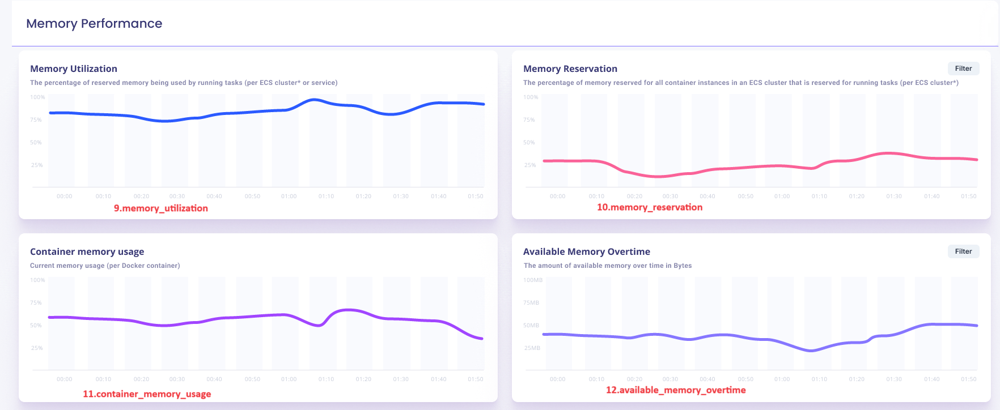

- [awsx-getelementdetails](#awsx-getelementdetails)
- [ui-analysys-and listing-methods](#ui-analysys-and-listing-methods)
  - [cpu\_utilization\_panel](#cpu_utilization_panel)
  - [memory\_utilization\_panel](#memory_utiization_panel)
  - [storage\_utilization\_panel](#storage_utiization_panel)
  - [network\_utilization\_panel](#network_utiization_panel)
  - [cpu\_utilization\_graph\_panel](#cpu_utilizaion_graph_panel)
  - [cpu\_reservation\_panel](#cpu_reservation_panel)   
  - [cpu\_usage\_sys\_panel](#cpu_usage_sys_panel)
  - [cpu\_usage\_nice\_panel](#cpu_usage_nice_panel)
  - [memory\_utilization\_graph\_panel](#memory_utilization_graph_panel)
  - [memory\_reservation\_panel](#memory_reservation_panel)
  - [container\_memory\_usage\_panel](#container_memory_usage_panel)
  - [available_memory_overtime_panel](#available_memory_overtime_panel)
  - [volume\_readBytes\_panel](#volume_readbytes_panel)
  - [volume\_writeBytes\_panel](#volume_writebytes_panel)
  - [I/O\_bytes\_panel](#input_output_bytes_panel)
  - [disk\_available\_panel](#disk_available_panel) 
  - [net\_ReceiveInBytes\_panel](#net_RecieveInBytes_panel)
  - [net\_TransmitInbytes\_panel](#net_transmitinbytes_panel)
  - [container_net_received_inbytes_panel](#container_net_received_inbytes_panel)
  - [container_net_transmit_inbytes_panel](#container_net_transmit_inbytes_panel)
  - [net\_RxInBytes\_panel](#net_rxinbytes_panel) 
  - [net\_TxInBytes\_panel](#net_txinbytes_panel)
  - [uptime_percentage_panel](#uptime_percentage_panel)
  - [active_connection_panel](#active_connection_panel)
  - [new_connection_panel](#new_connection_panel)
  - [active_services_panel](#active_services_panel)
  - [active_tasks_panel](#active_tasks_panel)
  - [failed_task_panel](#failed_task_panel)
  - [failed_task_panel](#failed_services_panel)
  - [service_error_panel](#service_error_panel)
  - [top_events_panel](#top_events_panel)
  - [resource_created_panel](#resource_created_panel)
  - [resource_updated_panel](#resource_updated_panel)
  - [resource_deleted_panel](#resource_deleted_panel)
  - [registration_events_panel](#registration_events_panel)
  - [deregistration_events_panel](#deregistration_events_panel)


- [pseudocode for matric based panels](#pseudocode-for-matric-based-panels)
- [pseudocode for log based panels](#pseudocode-for-log-based-panels)
- [list of subcommands and options for ECS](#list-of-subcommands-and-options-for-ecs)

list of subcommands and options for ECS
 
# awsx-getelementdetails
It implements the awsx plugin getElementDetails
 
# ui-analysys-and listing-methods

1. cpu_utilization_panel
2. memory_utilization_panel
3. storage_utilization_panel
4. network_utilization_panel
5. cpu_utilization_panel
6. cpu_usage_idle_panel
7. cpu_reservation_panel
8. cpu_usage_nice_panel
9.  memory_utilization_panel
10. memory_reservation_panel
11. memory_usage_panel
12. memory_overtime_panel
13. volume_readBytes_panel
14. volume_writeBytes_panel
15. I/O_Bytes_panel
16. disk_available_panel
17. net_ReceiveInBytes_panel
18. net_transmitInBytes_panel
19. container_net_received_inbytes_panel
20. container_net_transmit_inbytes_panel
21. net_RxInBytes_panel
22. net_TxInBytes_panel
23. uptime_percentage_panel
24. active_connection_panel
25. new_connection_panel
26. active_services_panel
27. active_tasks_panel
28. failed_task_panel
29. failed_services_panel
30. service_error_panel
31. top_events_panel
32. resource_created_panel
33. resource_updated_panel
34. resource_deleted_panel
35. registration_events_panel
36. deregistration_events_panel
37. deregistration_events_panel
_

**Algorithm:** 
## Algorithm for metric based panels

1. **Define a command to fetch metrics.**
2. **On command execution:**
   - Authenticate the command.
   - Call function to fetch metrics data.
   - Print metrics data.
3. **Define function to fetch metrics data:**
   - Get parameters and parse times from command flags.
   - Get additional data (e.g., log group name).
   - Construct an input for CloudWatch metrics and bring data using the AWS SDK for Go.
   - Process and return results.
4. **Initialize command flags.**

## Algorithm for log based panels
1. **Define a command to fetch logs data.**
2. **On command execution:**
   - Authenticate the command.
   - Call function to fetch logs data.
   - Print logs data.
3. **Define function to fetch logs data:**
    - Get log group name from command flags.
    - Parse start and end times.
    - Get log group name from CMDB data.
    - Construct and execute CloudWatch query.
    - Process and return results.
4. **Initialize command flags.**
_
# pseudocode for matric based panels
```
Define command to fetch metrics:

On command run:
    Authenticate the command
    If authentication fails:
        Print error and return
    Get responseType from command flags
    Retrieve metrics using GetMetricsPanel function
    If error occurs:
        Print error and return
    Format and print the response based on responseType

Function GetMetricsPanel(command, clientAuth, cloudWatchClient):
    Input: cmd *cobra.Command, clientAuth *model.Auth, cloudWatchClient *cloudwatch.CloudWatch
    Output: string, map[string]*cloudwatch.GetMetricDataOutput, error
    Get elementType and instanceId from command flags
    Parse startTime and endTime from command flags
    If error in parsing times:
        Return error
    Get instanceId using CMDB data
    If error in getting instanceId:
        Return error
    Initialize metricData map
    Get metric data and store in metricData if available
    Create jsonOutput map with metricData values
    Marshal jsonOutput to JSON string
    If error:
        Return error
    Return JSON string and metricData

Initialize command flags

```
# pseudocode-for-log-based-panels

```
Define command to fetch cloudwatch logs:

On command run:
    Authenticate the command
    If authentication fails:
        Print error and return
    Get responseType from command flags
    Retrieve metrics using function
    If error occurs:
        Print error and return
    Format and print the response based on responseType

Function to fetch panel data:
    Input: cmd (*cobra.Command), clientAuth (*model.Auth), cloudWatchLogs (*cloudwatchlogs.CloudWatchLogs)
    Output: results ([]*cloudwatchlogs.GetQueryResultsOutput), error

    Get the log group name from command flags
    Parse the start and end times from command flags
    If an error occurs during parsing times:
        Return nil for results and the error

    Get the log group name from CMDB data
    If an error occurs during fetching CMDB data:
        Return nil for results and the error

    Construct the CloudWatch query and fetch data
    If an error occurs during fetching data:
        Return nil for results and the error

    Process the fetched results
    Return the processed results and nil for error

Initialize command flags

```

# ui-analysys-and listing-methods

1. cpu_utilization_panel


## cpu_utilization_panel


**called from subcommand**
```shell
go run awsx-getelementdetails.go  --vaultUrl=<afreenXXXXXXX1309> --elementId=101 --query="cpu_utilization_panel" --elementType="ECS" --responseType=json --startTime=2023-12-01T00:00:00Z --endTime=2023-12-02T23:59:59Z
```


**called from maincommand**
```shell
awsx --vaultUrl=<afreenXXXXXXX1309> --elementId=90001  --query="cpu_utilization_panel" --elementType="ECS" --responseType=json --startTime=2023-12-01T00:00:00Z --endTime=2023-12-02T23:59:59Z
```


**Called from API**

[http://localhost:7000/awsx-api/getQueryOutput?vaultUrl=<afreenXXXX>&elementId=101&elementType=ECS&query=cpu_utilization_panel&responseType=json&startTime=2023-12-01T00:00:00Z&endTime=2023-12-02T23:59:59Z](http://localhost:7000/awsx-api/getQueryOutput?vaultUrl=<afreenXXXX>&elementId=101&elementType=ECS&query=cpu_utilization_panel&responseType=json&startTime=2023-12-01T00:00:00Z&endTime=2023-12-02T23:59:59Z)


**Desired Output in json / graph format:**
1. CPU utilization
```json
{
	"CurrentUsage":"25",
	"AverageUsage":"30",
	"MaxUsage":"40"
}
```

**Algorithm/ Pseudo Code**

**Algorithm:**
- Get ECS CPU Utilization Panel - Fetches and displays CPU usage statistics for ECS instances.

1. Initialize `authFlag`, `clientAuth`, and `err` for authentication.
2. Authenticate the command using `authenticate.AuthenticateCommand`.
3. If authentication fails, log the error and display command help.
4. If authenticated:
    - Get `responseType` from command flags.
    - Call `GetECScpuUtilizationPanel` to fetch CPU utilization data.
    - If there is an error fetching data, log the error.
    - Display the fetched data based on `responseType` ("frame" or JSON).

**Pseudo Code:**
```go
Initialize current_cpu_usage, average_cpu_usage, max_cpu_usage to 0
For each ECS instance metric data point:
    If metric is "current":
        Update current_cpu_usage with the value
    If metric is "average":
        Update average_cpu_usage with the value
    If metric is "max":
        Update max_cpu_usage with the value
Display current_cpu_usage, average_cpu_usage, max_cpu_usage
```
 
# ui-analysys-and listing-methods

2. memory_utilization_panel


## memory_utiization_panel


**called from subcommand**
```shell
go run awsx-getelementdetails.go  --vaultUrl=<afreenXXXXXXX1309> --elementId=101 --query="memory_utilization_panel" --elementType="ECS" --responseType=json --startTime=2023-12-01T00:00:00Z --endTime=2023-12-02T23:59:59Z
```

**called from maincommand**
```shell
awsx --vaultUrl=<afreenXXXXXXX1309> --elementId=90001  --query="memory_utilization_panel" --elementType="ECS" --responseType=json --startTime=2023-12-01T00:00:00Z --endTime=2023-12-02T23:59:59Z
```

**Called from API**

[http://localhost:7000/awsx-api/getQueryOutput?vaultUrl=<afreenXXXX>&elementId=101&elementType=ECS&query=memory_utilization_panel&responseType=json&startTime=2023-12-01T00:00:00Z&endTime=2023-12-02T23:59:59Z](http://localhost:7000/awsx-api/getQueryOutput?vaultUrl=<afreenXXXX>&elementId=101&elementType=ECS&query=memory_utilization_panel&responseType=json&startTime=2023-12-01T00:00:00Z&endTime=2023-12-02T23:59:59Z)


**Desired Output in json / graph format:**
2.  Memory utilization
```json
{
    "CurrentUsage":"15",
    "AverageUsage":"25",
	"MaxUsage":"50"
}
```
**Algorithm/ Pseudo Code**

**Algorithm:**
- Get ECS Memory Utilization Panel - Fetches and displays memory usage statistics for ECS instances.

1. Initialize `authFlag`, `clientAuth`, and `err` for authentication.
2. Authenticate the command using `authenticate.AuthenticateCommand`.
3. If authentication fails, log the error and display command help.
4. If authenticated:
    - Get `responseType` from command flags.
    - Call `GetMemoryUtilizationPanel` to fetch memory utilization data.
    - If there is an error fetching data, log the error and print "null".
    - Display the fetched data based on `responseType` ("frame" or JSON).

**Pseudo Code:**
```go
Initialize current_memory_usage, average_memory_usage, max_memory_usage to 0
For each ECS instance metric data point:
    If metric is "current":
        Update current_memory_usage with the value
    If metric is "average":
        Update average_memory_usage with the value
    If metric is "max":
        Update max_memory_usage with the value
Display current_memory_usage, average_memory_usage, max_memory_usage
```
 
 
 # ui-analysys-and listing-methods

3. storage_utilization_panel 


## storage_utiization_panel

**called from subcommand**

```shell
go run awsx-getelementdetails.go  --vaultUrl=<afreenXXXXXXX1309> --elementId=101 --query="storage_utilization_panel" --elementType="ECS" --responseType=json --startTime=2023-12-01T00:00:00Z --endTime=2023-12-02T23:59:59Z
```

**called from maincommand**

```shell
awsx --vaultUrl=<afreenXXXXXXX1309> --elementId=90001  --query="storage_utilization_panel" --elementType="ECS" --responseType=json --startTime=2023-12-01T00:00:00Z --endTime=2023-12-02T23:59:59Z
```

**Called from API**

[http://localhost:7000/awsx-api/getQueryOutput?vaultUrl=<afreenXXXX>&elementId=101&elementType=ECS&query=storage_utilization_panel&responseType=json&startTime=2023-12-01T00:00:00Z&endTime=2023-12-02T23:59:59Z](http://localhost:7000/awsx-api/getQueryOutput?vaultUrl=<afreenXXXX>&elementId=101&elementType=ECS&query=storage_utilization_panel&responseType=json&startTime=2023-12-01T00:00:00Z&endTime=2023-12-02T23:59:59Z)


**Desired Output in json / graph format:**
3.  Storage utilization
```json
{
    "RootVolumeUsage":"25",
    "EBSVolume1Usage":"30",
	"EBSVolume2Usage":"40"
}
```


**Algorithm/ Pseudo Code**

**Algorithm:**
- Get ECS Storage Utilization Panel - Fetches and displays storage usage statistics for ECS instances.

1. Initialize `authFlag`, `clientAuth`, and `err` for authentication.
2. Authenticate the command using `authenticate.AuthenticateCommand`.
3. If authentication fails, log the error and display command help.
4. If authenticated:
    - Get `responseType` from command flags.
    - Call `GetStorageUtilizationPanel` to fetch storage utilization data.
    - If there is an error fetching data, log the error and return.
    - Display the fetched data based on `responseType` ("frame" or JSON).

**Pseudo Code:**
```go
Initialize root_volume_usage, ebs_volume1_usage, ebs_volume2_usage to 0
For each ECS instance metric data point:
    If metric is "root volume":
        Update root_volume_usage with the value
    If metric is "EBS volume 1":
        Update ebs_volume1_usage with the value
    If metric is "EBS volume 2":
        Update ebs_volume2_usage with the value
Display root_volume_usage, ebs_volume1_usage, ebs_volume2_usage
```
 
 

 # ui-analysys-and listing-methods

4. network_utilization_panel 


## network_utiization_panel

**called from subcommand**
```shell
go run awsx-getelementdetails.go  --vaultUrl=<afreenXXXXXXX1309> --elementId=101 --query="storage_utilization_panel" --elementType="ECS" --responseType=json --startTime=2023-12-01T00:00:00Z --endTime=2023-12-02T23:59:59Z
```

**called from maincommand**
```shell
awsx --vaultUrl=<afreenXXXXXXX1309> --elementId=90001  --query="storage_utilization_panel" --elementType="ECS" --responseType=json --startTime=2023-12-01T00:00:00Z --endTime=2023-12-02T23:59:59Z
```

**Called from API**

[http://localhost:7000/awsx-api/getQueryOutput?vaultUrl=<afreenXXXX>&elementId=101&elementType=ECS&query=storage_utilization_panel&responseType=json&startTime=2023-12-01T00:00:00Z&endTime=2023-12-02T23:59:59Z](http://localhost:7000/awsx-api/getQueryOutput?vaultUrl=<afreenXXXX>&elementId=101&elementType=ECS&query=storage_utilization_panel&responseType=json&startTime=2023-12-01T00:00:00Z&endTime=2023-12-02T23:59:59Z)


**Desired Output in json / graph format:**
4.Network utilization
```json
{
    "Inbound traffic":"500",
    "Outbound traffic":"200",
	"Data Transferred":"10"
}
```

**Algorithm/ Pseudo Code**

**Algorithm:**
- Get ECS Network Utilization Panel - Fetches and displays network utilization statistics for ECS instances.

1. Initialize `authFlag`, `clientAuth`, and `err` for authentication.
2. Authenticate the command using `authenticate.AuthenticateCommand`.
3. If authentication fails, log the error and display command help.
4. If authenticated:
    - Get `responseType` from command flags.
    - Call `GetNetworkUtilizationPanel` to fetch network utilization data.
    - If there is an error fetching data, log the error.
    - Display the fetched data based on `responseType` ("frame" or JSON).

**Pseudo Code:**
```go
Initialize inbound_traffic, outbound_traffic, data_transferred to 0
For each ECS instance metric data point:
    If metric is "inbound":
        Update inbound_traffic with the value
    If metric is "outbound":
        Update outbound_traffic with the value
Calculate data_transferred as sum of inbound_traffic and outbound_traffic
Display inbound_traffic, outbound_traffic, data_transferred
```
 
 # ui-analysys-and listing-methods

## cpu_utilizaion_graph_panel

5. cpu_utilization_graph_panel


**called from subcommand**

```shell
go run awsx-getelementdetails.go  --vaultUrl=<afreenXXXXXXX1309> --elementId=101 --query="cpu_utilization_graph_panel" --elementType="ECS" --responseType=json --startTime=2023-12-01T00:00:00Z --endTime=2023-12-02T23:59:59Z
```

**called from maincommand**
```shell
awsx --vaultUrl=<afreenXXXXXXX1309> --elementId=90001  --query="cpu_utilization_graph_panel" --elementType="ECS" --responseType=json --startTime=2023-12-01T00:00:00Z --endTime=2023-12-02T23:59:59Z
```

**Called from API**

[http://localhost:7000/awsx-api/getQueryOutput?vaultUrl=<afreenXXXX>&elementId=101&elementType=ECS&query=cpu_utilization_graph_panel&responseType=json&startTime=2023-12-01T00:00:00Z&endTime=2023-12-02T23:59:59Z](http://localhost:7000/awsx-api/getQueryOutput?vaultUrl=<afreenXXXX>&elementId=101&elementType=ECS&query=cpu_utilization_graph_panel&responseType=json&startTime=2023-12-01T00:00:00Z&endTime=2023-12-02T23:59:59Z)


**Desired Output in json / graph format:**
5. CPU utilizaion  graph panel

	-CPUUtilization

**Algorithm/ Pseudo Code**

**Algorithm:**
- Get ECS CPU Utilization Graph Panel - Fetches and displays CPU utilization graph statistics for ECS instances.

1. Initialize `authFlag`, `clientAuth`, and `err` for authentication.
2. Authenticate the command using `authenticate.AuthenticateCommand`.
3. If authentication fails, log the error and display command help.
4. If authenticated:
    - Get `responseType` from command flags.
    - Call `GetCpuUtilizationGraphPanel` to fetch CPU utilization graph data.
    - If there is an error fetching data, log the error.
    - Display the fetched data based on `responseType` ("frame" or JSON).

**Pseudo Code:**
```go
Initialize cloudwatchMetricData as map[string]*cloudwatch.GetMetricDataOutput
Get element type and instance ID from command flags
Parse start and end time using comman_function.ParseTimes
Get instance ID using comman_function.GetCmdbData
Get raw data for CPU utilization using comman_function.GetMetricData
Store the raw data in cloudwatchMetricData with key "CPU Utilization"
Display cloudwatchMetricData
```

 # ui-analysys-and listing-methods


## cpu_reservation_panel


6. cpu_reservation_panel


**called from subcommand**
```shell
go run awsx-getelementdetails.go  --vaultUrl=<afreenXXXXXXX1309> --elementId=101 --query="cpu_reservation_panel" --elementType="ECS" --responseType=json --startTime=2023-12-01T00:00:00Z --endTime=2023-12-02T23:59:59Z
```

**called from maincommand**
```shell
awsx --vaultUrl=<afreenXXXXXXX1309> --elementId=90001  --query="cpu_reservation_panel" --elementType="ECS" --responseType=json --startTime=2023-12-01T00:00:00Z --endTime=2023-12-02T23:59:59Z
```

**Called from API**

[http://localhost:7000/awsx-api/getQueryOutput?vaultUrl=<afreenXXXX>&elementId=101&elementType=ECS&query=cpu_reservation_panel&responseType=json&startTime=2023-12-01T00:00:00Z&endTime=2023-12-02T23:59:59Z](http://localhost:7000/awsx-api/getQueryOutput?vaultUrl=<afreenXXXX>&elementId=101&elementType=ECS&query=cpu_reservation_panel&responseType=json&startTime=2023-12-01T00:00:00Z&endTime=2023-12-02T23:59:59Z)

**Desired Output in json / graph format:**
6. CPU reservation panel

	-CPUReservation


**Algorithm/ Pseudo Code**

**Algorithm:**
- Get ECS CPU Reserved Panel - Fetches and displays CPU reserved metrics data for ECS instances.

1. Initialize `authFlag`, `clientAuth`, and `err` for authentication.
2. Authenticate the command using `authenticate.AuthenticateCommand`.
3. If authentication fails, log the error and display command help.
4. If authenticated:
    - Get `responseType` from command flags.
    - Call `GetCPUReservationData` to fetch CPU reserved data.
    - If there is an error fetching data, log the error.
    - Display the fetched data based on `responseType` ("frame" or JSON).

**Pseudo Code:**
```go
Initialize cloudwatchMetricData as map[string]*cloudwatch.GetMetricDataOutput
Get element type and instance ID from command flags
Parse start and end time using comman_function.ParseTimes
Get instance ID using comman_function.GetCmdbData
Get raw data for CPU reservation using comman_function.GetMetricData
Store the raw data in cloudwatchMetricData with key "CPU_Reservation"
Display cloudwatchMetricData
```
# ui-analysys-and listing-methods

## cpu_usage_sys_panel

7. cpu_usage_system_panel


 
**called from subcommand**
```shell
go run awsx-getelementdetails.go  --vaultUrl=<afreenXXXXXXX1309> --elementId=101 --query="cpu_usage_system_panel" --elementType="ECS" --responseType=json --startTime=2023-12-01T00:00:00Z --endTime=2023-12-02T23:59:59Z
```

**called from maincommand**
```shell
awsx --vaultUrl=<afreenXXXXXXX1309> --elementId=90001  --query="cpu_usage_system_panel" --elementType="ECS" --responseType=json --startTime=2023-12-01T00:00:00Z --endTime=2023-12-02T23:59:59Z
```

**Called from API**

[http://localhost:7000/awsx-api/getQueryOutput?vaultUrl=<afreenXXXX>&elementId=101&elementType=ECS&query=cpu_usage_system_panel&responseType=json&startTime=2023-12-01T00:00:00Z&endTime=2023-12-02T23:59:59Z](http://localhost:7000/awsx-api/getQueryOutput?vaultUrl=<afreenXXXX>&elementId=101&elementType=ECS&query=cpu_usage_system_panel&responseType=json&startTime=2023-12-01T00:00:00Z&endTime=2023-12-02T23:59:59Z)


**Desired Output in json / graph format:**
7. CPU usage system panel

	-cpu_usage_system


**Algorithm/ Pseudo Code**

**Algorithm:** 
- CPU usage system  -Fire a cloudwatch query for cpu_usage_system_panel, using metric cpu_usage_system.

 **Pseudo Code:** 
 
# ui-analysys-and listing-methods

## cpu_usage_nice_panel

8. cpu_usage_nice_panel


**called from subcommand**
```shell
go run awsx-getelementdetails.go  --vaultUrl=<afreenXXXXXXX1309> --elementId=101 --query="cpu_usage_nice_panel" --elementType="ECS" --responseType=json --startTime=2023-12-01T00:00:00Z --endTime=2023-12-02T23:59:59Z
```

**called from maincommand**
```shell
awsx --vaultUrl=<afreenXXXXXXX1309> --elementId=90001  --query="cpu_usage_nice_panel" --elementType="ECS" --responseType=json --startTime=2023-12-01T00:00:00Z --endTime=2023-12-02T23:59:59Z
```

**Called from API**

[http://localhost:7000/awsx-api/getQueryOutput?vaultUrl=<afreenXXXX>&elementId=101&elementType=ECS&query=cpu_usage_nice_panel&responseType=json&startTime=2023-12-01T00:00:00Z&endTime=2023-12-02T23:59:59Z](http://localhost:7000/awsx-api/getQueryOutput?vaultUrl=<afreenXXXX>&elementId=101&elementType=ECS&query=cpu_usage_nice_panel&responseType=json&startTime=2023-12-01T00:00:00Z&endTime=2023-12-02T23:59:59Z)


**Desired Output in json / graph format:**
8. CPU usage nice panel

	-cpu_usage_nice


**Algorithm/ Pseudo Code**

**Algorithm:** 
- CPU usage nice  -Fire a cloudwatch query for cpu_usage_nice_panel, using metric cpu_usage_nice.

 **Pseudo Code:** 
 
 
 # ui-analysys-and listing-methods

##  memory_utilization_graph_panel

9. memory_utilization_graph_panel



**called from subcommand**
```shell
go run awsx-getelementdetails.go  --vaultUrl=<afreenXXXXXXX1309> --elementId=101 --query="memory_utilization_graph_panel" --elementType="ECS" --responseType=json --startTime=2023-12-01T00:00:00Z --endTime=2023-12-02T23:59:59Z
```

**called from maincommand**
```shell
awsx --vaultUrl=<afreenXXXXXXX1309> --elementId=90001  --query="memory_utilization_graph_panel" --elementType="ECS" --responseType=json --startTime=2023-12-01T00:00:00Z --endTime=2023-12-02T23:59:59Z
```


**Called from API**

[http://localhost:7000/awsx-api/getQueryOutput?vaultUrl=<afreenXXXX>&elementId=101&elementType=ECS&query=memory_utilization_graph_panel&responseType=json&startTime=2023-12-01T00:00:00Z&endTime=2023-12-02T23:59:59Z](http://localhost:7000/awsx-api/getQueryOutput?vaultUrl=<afreenXXXX>&elementId=101&elementType=ECS&query=memory_utilization_graph_panel&responseType=json&startTime=2023-12-01T00:00:00Z&endTime=2023-12-02T23:59:59Z)


 
**Desired Output in json / graph format:**
9. memory utilization graph  panel

	-MemoryUtilizaion_graph_panel


**Algorithm/ Pseudo Code**

**Algorithm:**
- Get ECS Memory Utilization Graph Panel - Fetches and displays memory utilization graph metrics data for ECS instances.

1. Initialize `authFlag`, `clientAuth`, and `err` for authentication.
2. Authenticate the command using `authenticate.AuthenticateCommand`.
3. If authentication fails, log the error and display command help.
4. If authenticated:
    - Get `responseType` from command flags.
    - Call `GetMemoryUtilizationGraphPanel` to fetch memory utilization graph data.
    - If there is an error fetching data, log the error.
    - Display the fetched data based on `responseType` ("frame" or JSON).

**Pseudo Code:**
```go
Initialize cloudwatchMetricData as map[string]*cloudwatch.GetMetricDataOutput
Get instance ID and element type from command flags
Parse start and end time using comman_function.ParseTimes
Get instance ID using comman_function.GetCmdbData
Get raw data for memory utilization using comman_function.GetMetricData
Store the raw data in cloudwatchMetricData with key "Memory utilization"
Display cloudwatchMetricData
```
 
 
 # ui-analysys-and listing-methods

##  memory_reservation_panel

10. memory_reservation_panel


**called from subcommand**
```shell
go run awsx-getelementdetails.go  --vaultUrl=<afreenXXXXXXX1309> --elementId=101 --query="memory_reservation_panel" --elementType="ECS" --responseType=json --startTime=2023-12-01T00:00:00Z --endTime=2023-12-02T23:59:59Z
```

**called from maincommand**
```shell
awsx --vaultUrl=<afreenXXXXXXX1309> --elementId=90001  --query="memory_reservation_panel" --elementType="ECS" --responseType=json --startTime=2023-12-01T00:00:00Z --endTime=2023-12-02T23:59:59Z
```

**Called from API**

[http://localhost:7000/awsx-api/getQueryOutput?vaultUrl=<afreenXXXX>&elementId=101&elementType=ECS&query=memory_reservation_panel&responseType=json&startTime=2023-12-01T00:00:00Z&endTime=2023-12-02T23:59:59Z](http://localhost:7000/awsx-api/getQueryOutput?vaultUrl=<afreenXXXX>&elementId=101&elementType=ECS&query=memory_reservation_panel&responseType=json&startTime=2023-12-01T00:00:00Z&endTime=2023-12-02T23:59:59Z)


**Desired Output in json / graph format:**
10. memory reservation panel

	-MemoryReservation_panel

**Algorithm/ Pseudo Code**

**Algorithm:**
- Get ECS Memory Reserved Panel - Fetches and displays memory reserved metrics data for ECS instances.

1. Initialize `authFlag`, `clientAuth`, and `err` for authentication.
2. Authenticate the command using `authenticate.AuthenticateCommand`.
3. If authentication fails, log the error and display command help.
4. If authenticated:
    - Get `responseType` from command flags.
    - Call `GetMemoryReservationData` to fetch memory reserved data.
    - If there is an error fetching data, log the error.
    - Display the fetched data based on `responseType` ("frame" or JSON).

**Pseudo Code:**
```go
Initialize cloudwatchMetricData as map[string]*cloudwatch.GetMetricDataOutput
Get instance ID, element type, start time, and end time from command flags
Parse start and end time using comman_function.ParseTimes
Get instance ID using comman_function.GetCmdbData
Get raw data for memory reserved using comman_function.GetMetricData
Store the raw data in cloudwatchMetricData with key "Memory_Reservation"
Display cloudwatchMetricData
```
 
# ui-analysys-and listing-methods
## container_memory_usage_panel

11. container_memory_usage_panel


**called from subcommand**
```shell
go run awsx-getelementdetails.go  --vaultUrl=<afreenXXXXXXX1309> --elementId=101 --query="container_memory_usage_panel" --elementType="ECS" --responseType=json --startTime=2023-12-01T00:00:00Z --endTime=2023-12-02T23:59:59Z
```

**called from maincommand**
```shell
awsx --vaultUrl=<afreenXXXXXXX1309> --elementId=90001  --query="container_memory_usage_panel" --elementType="ECS" --responseType=json --startTime=2023-12-01T00:00:00Z --endTime=2023-12-02T23:59:59Z
```

**Called from API**

[http://localhost:7000/awsx-api/getQueryOutput?vaultUrl=<afreenXXXX>&elementId=101&elementType=ECS&query=container_memory_usage_panel&responseType=json&startTime=2023-12-01T00:00:00Z&endTime=2023-12-02T23:59:59Z](http://localhost:7000/awsx-api/getQueryOutput?vaultUrl=<afreenXXXX>&elementId=101&elementType=ECS&query=container_memory_usage_panel&responseType=json&startTime=2023-12-01T00:00:00Z&endTime=2023-12-02T23:59:59Z)


**Desired Output in json / graph format:**
11. container_memory_usage_panel

	-mem_used_panel


**Algorithm/ Pseudo Code**

**Algorithm:**
- Get ECS Container Memory Usage Panel - Fetches and displays container memory usage metrics data for ECS instances.

1. Initialize `authFlag`, `clientAuth`, and `err` for authentication.
2. Authenticate the command using `authenticate.AuthenticateCommand`.
3. If authentication fails, log the error and display command help.
4. If authenticated:
    - Get `responseType` from command flags.
    - Call `GetContainerMemoryUsageData` to fetch container memory usage data.
    - If there is an error fetching data, log the error.
    - Display the fetched data based on `responseType` ("frame" or JSON).

**Pseudo Code:**
```go
Initialize cloudwatchMetricData as map[string]*cloudwatch.GetMetricDataOutput
Get instance ID, element type, start time, and end time from command flags
Parse start and end time using comman_function.ParseTimes
Get instance ID using comman_function.GetCmdbData
Get raw data for container memory usage using comman_function.GetMetricData
Store the raw data in cloudwatchMetricData with key "Container_memory_usage"
Display cloudwatchMetricData
```
 
 # ui-analysys-and listing-methods

##  available_memory_overtime_panel

12. available_memory_overtime_panel


**called from subcommand**
```shell
go run awsx-getelementdetails.go  --vaultUrl=<afreenXXXXXXX1309> --elementId=101 --query="available_memory_overtime_panel" --elementType="ECS" --responseType=json --startTime=2023-12-01T00:00:00Z --endTime=2023-12-02T23:59:59Z
```

**called from maincommand**
```shell
awsx --vaultUrl=<afreenXXXXXXX1309> --elementId=90001  --query="available_memory_overtime_panel" --elementType="ECS" --responseType=json --startTime=2023-12-01T00:00:00Z --endTime=2023-12-02T23:59:59Z
```

**Called from API**

[http://localhost:7000/awsx-api/getQueryOutput?vaultUrl=<afreenXXXX>&elementId=101&elementType=ECS&query=available_memory_overtime_panel&responseType=json&startTime=2023-12-01T00:00:00Z&endTime=2023-12-02T23:59:59Z](http://localhost:7000/awsx-api/getQueryOutput?vaultUrl=<afreenXXXX>&elementId=101&elementType=ECS&query=available_memory_overtime_panel&responseType=json&startTime=2023-12-01T00:00:00Z&endTime=2023-12-02T23:59:59Z)


**Desired Output in json / graph format:**
12. available memory overtime panel

	-available memory_overtime_panel


**Algorithm/ Pseudo Code**

**Algorithm:**
- Get ECS Available Memory Over Time Panel - Fetches and displays available memory over time metrics data for ECS instances.

1. Initialize `authFlag`, `clientAuth`, and `err` for authentication.
2. Authenticate the command using `authenticate.AuthenticateCommand`.
3. If authentication fails, log the error and display command help.
4. If authenticated:
    - Get `responseType`, `elementId`, `elementType`, `cmdbApiUrl`, `instanceId`, `startTime`, and `endTime` from command flags.
    - Fetch raw data for available memory over time using `GetAvailableMemoryOverTimeData`.
    - If there is an error fetching data, log the error.
    - Display the fetched data based on `responseType` ("frame" or JSON).

**Pseudo Code:**
```go
Initialize cloudwatchMetricData as map[string]*cloudwatch.GetMetricDataOutput
Get elementId, elementType, cmdbApiUrl, instanceId, startTime, endTime, and responseType from command flags
Authenticate the command using AuthenticateCommand
If authentication fails, log the error and display command help
If authenticated:
    Parse start and end time if provided
    Fetch raw data for available memory over time using GetAvailableMemoryOverTimeData
    Process the raw data using processAvailableMemoryOverTimeRawData
    Calculate available memory using calculateAvailableMemory
    Initialize availableMemoryOverTimeResult
    Populate TimeSeries field of availableMemoryOverTimeResult with timestamp and available memory
    Convert the result to JSON
    Display the fetched data based on responseType ("frame" or JSON)
```

 
# ui-analysys-and listing-methods

##  volume_readBytes_panel

13. volume_readBytes_panel


**called from subcommand**
```shell
go run awsx-getelementdetails.go  --vaultUrl=<afreenXXXXXXX1309> --elementId=101 --query="volume_readBytes_panel" --elementType="ECS" --responseType=json --startTime=2023-12-01T00:00:00Z --endTime=2023-12-02T23:59:59Z
```

**called from maincommand**
```shell
awsx --vaultUrl=<afreenXXXXXXX1309> --elementId=90001  --query="volume_readBytes_panel" --elementType="ECS" --responseType=json --startTime=2023-12-01T00:00:00Z --endTime=2023-12-02T23:59:59Z
```

**Called from API**

[http://localhost:7000/awsx-api/getQueryOutput?vaultUrl=<afreenXXXX>&elementId=101&elementType=ECS&query=volume_readBytes_panel&responseType=json&startTime=2023-12-01T00:00:00Z&endTime=2023-12-02T23:59:59Z](http://localhost:7000/awsx-api/getQueryOutput?vaultUrl=<afreenXXXX>&elementId=101&elementType=ECS&query=volume_readBytes_panel&responseType=json&startTime=2023-12-01T00:00:00Z&endTime=2023-12-02T23:59:59Z)


**Desired Output in json / graph format:**
13. volume_readBytes panel

	-volume_readBytes_panel


**Algorithm/ Pseudo Code**

**Algorithm:**
- Get ECS Read Bytes Panel - Fetches and displays volume read bytes metrics data for ECS instances.

1. Initialize `authFlag`, `clientAuth`, and `err` for authentication.
2. Authenticate the command using `authenticate.AuthenticateCommand`.
3. If authentication fails, log the error and display command help.
4. If authenticated:
    - Get `responseType`, `elementType`, `instanceId`, `startTime`, and `endTime` from command flags.
    - Fetch raw data for volume read bytes using `GetECSReadBytesPanel`.
    - If there is an error fetching data, log the error.
    - Display the fetched data based on `responseType` ("frame" or JSON).

**Pseudo Code:**
```go
Initialize cloudwatchMetricData as map[string]*cloudwatch.GetMetricDataOutput
Get elementType, instanceId, startTime, endTime, and responseType from command flags
Authenticate the command using AuthenticateCommand
If authentication fails, log the error and display command help
If authenticated:
    Fetch raw data for volume read bytes using GetECSReadBytesPanel
    Process the raw data if needed
    Display the fetched data based on responseType ("frame" or JSON)
```

# ui-analysys-and listing-methods

##  volume_writebytes_panel

14. volume_writeBytes_panel


**called from subcommand**
```shell
go run awsx-getelementdetails.go  --vaultUrl=<afreenXXXXXXX1309> --elementId=101 --query="volume_writeBytes_panel" --elementType="ECS" --responseType=json --startTime=2023-12-01T00:00:00Z --endTime=2023-12-02T23:59:59Z
```

**called from maincommand**
```shell
awsx --vaultUrl=<afreenXXXXXXX1309> --elementId=90001  --query="volume_writeBytes_panel" --elementType="ECS" --responseType=json --startTime=2023-12-01T00:00:00Z --endTime=2023-12-02T23:59:59Z
```

**Called from API**

[http://localhost:7000/awsx-api/getQueryOutput?vaultUrl=<afreenXXXX>&elementId=101&elementType=ECS&query=volume_writeBytes_panel&responseType=json&startTime=2023-12-01T00:00:00Z&endTime=2023-12-02T23:59:59Z](http://localhost:7000/awsx-api/getQueryOutput?vaultUrl=<afreenXXXX>&elementId=101&elementType=ECS&query=volume_writeBytes_panel&responseType=json&startTime=2023-12-01T00:00:00Z&endTime=2023-12-02T23:59:59Z)


**Desired Output in json / graph format:**
14. volume_writeBytes panel

	-volume_writebytes_panel


**Algorithm/ Pseudo Code**

**Algorithm:**
- Get ECS Write Bytes Panel - Fetches and displays volume write bytes metrics data for ECS instances.

1. Initialize `authFlag`, `clientAuth`, and `err` for authentication.
2. Authenticate the command using `authenticate.AuthenticateCommand`.
3. If authentication fails, log the error and display command help.
4. If authenticated:
    - Get `responseType`, `elementType`, `instanceId`, `startTime`, and `endTime` from command flags.
    - Fetch raw data for volume write bytes using `GetECSWriteBytesPanel`.
    - If there is an error fetching data, log the error.
    - Display the fetched data based on `responseType` ("frame" or JSON).

**Pseudo Code:**
```go
Initialize cloudwatchMetricData as map[string]*cloudwatch.GetMetricDataOutput
Get elementType, instanceId, startTime, endTime, and responseType from command flags
Authenticate the command using AuthenticateCommand
If authentication fails, log the error and display command help
If authenticated:
    Fetch raw data for volume write bytes using GetECSWriteBytesPanel
    Process the raw data if needed
    Display the fetched data based on responseType ("frame" or JSON)
```
 
 
 # ui-analysys-and listing-methods

##  input_output_bytes_panel

15. I/O_Bytes_panel


##  input_output_bytes_panel


**called from subcommand**
```shell
go run awsx-getelementdetails.go  --vaultUrl=<afreenXXXXXXX1309> --elementId=101 --query="input_output_bytes_panel" --elementType="ECS" --responseType=json --startTime=2023-12-01T00:00:00Z --endTime=2023-12-02T23:59:59Z
```

**called from maincommand**
```shell
awsx --vaultUrl=<afreenXXXXXXX1309> --elementId=90001  --query="input_output_bytes_panel" --elementType="ECS" --responseType=json --startTime=2023-12-01T00:00:00Z --endTime=2023-12-02T23:59:59Z
```

**Called from API**

[http://localhost:7000/awsx-api/getQueryOutput?vaultUrl=<afreenXXXX>&elementId=101&elementType=ECS&query=input_output_bytes_panel&responseType=json&startTime=2023-12-01T00:00:00Z&endTime=2023-12-02T23:59:59Z](http://localhost:7000/awsx-api/getQueryOutput?vaultUrl=<afreenXXXX>&elementId=101&elementType=ECS&query=input_output_bytes_panel&responseType=json&startTime=2023-12-01T00:00:00Z&endTime=2023-12-02T23:59:59Z)


**Desired Output in json / graph format:**
15. In/Out Bytes panel

	-in/out bytes_panel
	


**Algorithm/ Pseudo Code**

**Algorithm:** 
- in/Out bytes panel  -Fire a cloudwatch query for disk_used_panel, using metric InBytes, OutBytes.

 **Pseudo Code:**  
 
 # ui-analysys-and listing-methods

##  disk_available_panel

16. disk_available_panel


**called from subcommand**
```shell
go run awsx-getelementdetails.go  --vaultUrl=<afreenXXXXXXX1309> --elementId=101 --query="disk_available_panel" --elementType="ECS" --responseType=json --startTime=2023-12-01T00:00:00Z --endTime=2023-12-02T23:59:59Z
```

**called from maincommand**
```shell
awsx --vaultUrl=<afreenXXXXXXX1309> --elementId=90001  --query="disk_available_panel" --elementType="ECS" --responseType=json --startTime=2023-12-01T00:00:00Z --endTime=2023-12-02T23:59:59Z
```

**Called from API**

[http://localhost:7000/awsx-api/getQueryOutput?vaultUrl=<afreenXXXX>&elementId=101&elementType=ECS&query=disk_available_panel&responseType=json&startTime=2023-12-01T00:00:00Z&endTime=2023-12-02T23:59:59Z](http://localhost:7000/awsx-api/getQueryOutput?vaultUrl=<afreenXXXX>&elementId=101&elementType=ECS&query=disk_available_panel&responseType=json&startTime=2023-12-01T00:00:00Z&endTime=2023-12-02T23:59:59Z)


**Desired Output in json / graph format:**
16. disk_available panel

	-disk_available_panel
	  

**Algorithm/ Pseudo Code**

**Algorithm:** 
- disk available panel  -Fire a cloudwatch query for disk_available_panel, using metric disk_available_panel.

 **Pseudo Code:**  


 # ui-analysys-and listing-methods

17. net\_ReceiveInBytes\_panel


## net\_RecieveInBytes\_panel


**called from subcommand**
```shell
go run awsx-getelementdetails.go  --vaultUrl=<afreenXXXXXXX1309> --elementId=101 --query="net_recieveInBytes_panel" --elementType="ECS" --responseType=json --startTime=2023-12-01T00:00:00Z --endTime=2023-12-02T23:59:59Z
```

**called from maincommand**
```shell
awsx --vaultUrl=<afreenXXXXXXX1309> --elementId=90001  --query="net_recieveInBytes_panel" --elementType="ECS" --responseType=json --startTime=2023-12-01T00:00:00Z --endTime=2023-12-02T23:59:59Z
```

**Called from API**

[http://localhost:7000/awsx-api/getQueryOutput?vaultUrl=<afreenXXXX>&elementId=101&elementType=ECS&query=net_recieveInBytes_panel&responseType=json&startTime=2023-12-01T00:00:00Z&endTime=2023-12-02T23:59:59Z](http://localhost:7000/awsx-api/getQueryOutput?vaultUrl=<afreenXXXX>&elementId=101&elementType=ECS&query=net_recieveInBytes_panel&responseType=json&startTime=2023-12-01T00:00:00Z&endTime=2023-12-02T23:59:59Z)


**Desired Output in json / graph format:**
17 . network_ReceiveInBytes_panel

	-network_ReceiveInBytes_panel
	

**Algorithm:**
- Get ECS Network Rx In Bytes Panel - Fetches and displays network received inbytes metrics data for ECS instances.

1. Initialize `authFlag`, `clientAuth`, and `err` for authentication.
2. Authenticate the command using `authenticate.AuthenticateCommand`.
3. If authentication fails, log the error and display command help.
4. If authenticated:
    - Get `responseType`, `elementType`, `instanceId`, `startTime`, and `endTime` from command flags.
    - Fetch raw data for network received inbytes using `GetECSNetworkRxInBytesPanel`.
    - If there is an error fetching data, log the error.
    - Display the fetched data based on `responseType` ("frame" or JSON).

**Pseudo Code:**
```go
Initialize cloudwatchMetricData as map[string]*cloudwatch.GetMetricDataOutput
Get elementType, instanceId, startTime, endTime, and responseType from command flags
Authenticate the command using AuthenticateCommand
If authentication fails, log the error and display command help
If authenticated:
    Fetch raw data for network received inbytes using GetECSNetworkRxInBytesPanel
    Process the raw data if needed
    Display the fetched data based on responseType ("frame" or JSON)
```

 # ui-analysys-and listing-methods

##  net\_transmitInBytes\_panel

18. net\_transmitInBytes\_panel


**called from subcommand**
```shell
go run awsx-getelementdetails.go  --vaultUrl=<afreenXXXXXXX1309> --elementId=101 --query="net_transmitInBytes_panel" --elementType="ECS" --responseType=json --startTime=2023-12-01T00:00:00Z --endTime=2023-12-02T23:59:59Z
```

**called from maincommand**
```shell
awsx --vaultUrl=<afreenXXXXXXX1309> --elementId=90001  --query="net_transmitInBytes_panel" --elementType="ECS" --responseType=json --startTime=2023-12-01T00:00:00Z --endTime=2023-12-02T23:59:59Z
```

**Called from API**

[http://localhost:7000/awsx-api/getQueryOutput?vaultUrl=<afreenXXXX>&elementId=101&elementType=ECS&query=net_transmitInBytes_panel&responseType=json&startTime=2023-12-01T00:00:00Z&endTime=2023-12-02T23:59:59Z](http://localhost:7000/awsx-api/getQueryOutput?vaultUrl=<afreenXXXX>&elementId=101&elementType=ECS&query=net_transmitInBytes_panel&responseType=json&startTime=2023-12-01T00:00:00Z&endTime=2023-12-02T23:59:59Z)


**Desired Output in json / graph format:**
18. network_transmitInBytes_panel

	-network_transmitInBytes_panel
	

**Algorithm/ Pseudo Code**
**Algorithm/ Pseudo Code**

**Algorithm:**
- Get ECS Network Rx In Bytes Panel - Fetches and displays network received inbytes metrics data for ECS instances.

1. Initialize `authFlag`, `clientAuth`, and `err` for authentication.
2. Authenticate the command using `authenticate.AuthenticateCommand`.
3. If authentication fails, log the error and display command help.
4. If authenticated:
    - Get `responseType`, `elementType`, `instanceId`, `startTime`, and `endTime` from command flags.
    - Fetch raw data for network received inbytes using `GetECSNetworkRxInBytesPanel`.
    - If there is an error fetching data, log the error.
    - Display the fetched data based on `responseType` ("frame" or JSON).

**Pseudo Code:**
```go
Initialize cloudwatchMetricData as map[string]*cloudwatch.GetMetricDataOutput
Get elementType, instanceId, startTime, endTime, and responseType from command flags
Authenticate the command using AuthenticateCommand
If authentication fails, log the error and display command help
If authenticated:
    Fetch raw data for network received inbytes using GetECSNetworkRxInBytesPanel
    Process the raw data if needed
    Display the fetched data based on responseType ("frame" or JSON)
```
 
 # ui-analysys-and listing-methods

19. container_net_received_inbytes_panel


##  container_net_received_inbytes_panel


**called from subcommand**
```shell
go run awsx-getelementdetails.go  --vaultUrl=<afreenXXXXXXX1309> --elementId=101 --query="container_net_received_inbytes_panel" --elementType="ECS" --responseType=json --startTime=2023-12-01T00:00:00Z --endTime=2023-12-02T23:59:59Z
```

**called from maincommand**
```shell
awsx --vaultUrl=<afreenXXXXXXX1309> --elementId=90001  --query="container_net_received_inbytes_panel" --elementType="ECS" --responseType=json --startTime=2023-12-01T00:00:00Z --endTime=2023-12-02T23:59:59Z
```

**Called from API**

[http://localhost:7000/awsx-api/getQueryOutput?vaultUrl=<afreenXXXX>&elementId=101&elementType=ECS&query=container_net_received_inbytes_panel&responseType=json&startTime=2023-12-01T00:00:00Z&endTime=2023-12-02T23:59:59Z](http://localhost:7000/awsx-api/getQueryOutput?vaultUrl=<afreenXXXX>&elementId=101&elementType=ECS&query=container_net_received_inbytes_panel&responseType=json&startTime=2023-12-01T00:00:00Z&endTime=2023-12-02T23:59:59Z)


**Desired Output in json / graph format:**
19. container_net_received_inbytes_panel

	-container_net_received_inbytes_panel
	
**Algorithm/ Pseudo Code**

**Algorithm:**
- Get ECS Container Net Rx In Bytes Panel - Fetches and displays container network received inbytes metrics data for ECS instances.

1. Initialize `authFlag`, `clientAuth`, and `err` for authentication.
2. Authenticate the command using `authenticate.AuthenticateCommand`.
3. If authentication fails, log the error and display command help.
4. If authenticated:
    - Get `responseType`, `elementType`, `instanceId`, `startTime`, and `endTime` from command flags.
    - Fetch raw data for container network received inbytes using `GetECSContainerNetRxInBytesPanel`.
    - If there is an error fetching data, log the error.
    - Display the fetched data based on `responseType` ("frame" or JSON).

**Pseudo Code:**
```go
Initialize cloudwatchMetricData as map[string]*cloudwatch.GetMetricDataOutput
Get elementType, instanceId, startTime, endTime, and responseType from command flags
Authenticate the command using AuthenticateCommand
If authentication fails, log the error and display command help
If authenticated:
    Fetch raw data for container network received inbytes using GetECSContainerNetRxInBytesPanel
    Process the raw data if needed
    Display the fetched data based on responseType ("frame" or JSON)

20. container_net_transmit_inbytes_panel

```

## container_net_transmit_inbytes_panel


**called from subcommand**
```shell
go run awsx-getelementdetails.go  --vaultUrl=<afreenXXXXXXX1309> --elementId=101 --query="container_net_transmit_inbytes_panel" --elementType="ECS" --responseType=json --startTime=2023-12-01T00:00:00Z --endTime=2023-12-02T23:59:59Z
```

**called from maincommand**
```shell
awsx --vaultUrl=<afreenXXXXXXX1309> --elementId=90001  --query="container_net_transmit_inbytes_panel" --elementType="ECS" --responseType=json --startTime=2023-12-01T00:00:00Z --endTime=2023-12-02T23:59:59Z
```

**Called from API**

[http://localhost:7000/awsx-api/getQueryOutput?vaultUrl=<afreenXXXX>&elementId=101&elementType=ECS&query=container_net_transmit_inbytes_panel&responseType=json&startTime=2023-12-01T00:00:00Z&endTime=2023-12-02T23:59:59Z](http://localhost:7000/awsx-api/getQueryOutput?vaultUrl=<afreenXXXX>&elementId=101&elementType=ECS&query=container_net_transmit_inbytes_panel&responseType=json&startTime=2023-12-01T00:00:00Z&endTime=2023-12-02T23:59:59Z)


**Desired Output in json / graph format:**
20. container_net_transmit_inbytes_panel

	-container_net_transmit_inbytes_panel
	
**Algorithm/ Pseudo Code**

**Algorithm:**
- Get ECS Container Net Tx In Bytes Panel - Fetches and displays container network transmit inbytes metrics data for ECS instances.

1. Initialize `authFlag`, `clientAuth`, and `err` for authentication.
2. Authenticate the command using `authenticate.AuthenticateCommand`.
3. If authentication fails, log the error and display command help.
4. If authenticated:
    - Get `responseType`, `elementType`, `instanceId`, `startTime`, and `endTime` from command flags.
    - Fetch raw data for container network transmit inbytes using `GetECSContainerNetTxInBytesPanel`.
    - If there is an error fetching data, log the error.
    - Display the fetched data based on `responseType` ("frame" or JSON).

**Pseudo Code:**
```go
Initialize cloudwatchMetricData as map[string]*cloudwatch.GetMetricDataOutput
Get elementType, instanceId, startTime, endTime, and responseType from command flags
Authenticate the command using AuthenticateCommand
If authentication fails, log the error and display command help
If authenticated:
    Fetch raw data for container network transmit inbytes using GetECSContainerNetTxInBytesPanel
    Process the raw data if needed
    Display the fetched data based on responseType ("frame" or JSON)
```

 
 
 # ui-analysys-and listing-methods

##  net\_RxInBytes\_panel

21. net\_RxInBytes\_panel


**called from subcommand**
```shell
go run awsx-getelementdetails.go  --vaultUrl=<afreenXXXXXXX1309> --elementId=101 --query="net_rxinbytes_panel" --elementType="ECS" --responseType=json --startTime=2023-12-01T00:00:00Z --endTime=2023-12-02T23:59:59Z
```

**called from maincommand**
```shell
awsx --vaultUrl=<afreenXXXXXXX1309> --elementId=90001  --query="net_rxinbytes_panel" --elementType="ECS" --responseType=json --startTime=2023-12-01T00:00:00Z --endTime=2023-12-02T23:59:59Z
```

**Called from API**

[http://localhost:7000/awsx-api/getQueryOutput?vaultUrl=<afreenXXXX>&elementId=101&elementType=ECS&query=net_rxinbytes_panel&responseType=json&startTime=2023-12-01T00:00:00Z&endTime=2023-12-02T23:59:59Z](http://localhost:7000/awsx-api/getQueryOutput?vaultUrl=<afreenXXXX>&elementId=101&elementType=ECS&query=net_rxinbytes_panel&responseType=json&startTime=2023-12-01T00:00:00Z&endTime=2023-12-02T23:59:59Z)


**Desired Output in json / graph format:**
21. net_rxinbytes_panel

	-net_rxinbytes_panel
	

**Algorithm/ Pseudo Code**

**Algorithm:**
- Get ECS Network Rx In Bytes Panel - Fetches and displays network received inbytes metrics data for ECS instances.

1. Initialize `authFlag`, `clientAuth`, and `err` for authentication.
2. Authenticate the command using `authenticate.AuthenticateCommand`.
3. If authentication fails, log the error and display command help.
4. If authenticated:
    - Get `responseType`, `elementType`, `instanceId`, `startTime`, and `endTime` from command flags.
    - Fetch raw data for network received inbytes using `GetECSNetworkRxInBytesPanel`.
    - If there is an error fetching data, log the error.
    - Display the fetched data based on `responseType` ("frame" or JSON).

**Pseudo Code:**
```go
Initialize cloudwatchMetricData as map[string]*cloudwatch.GetMetricDataOutput
Get elementType, instanceId, startTime, endTime, and responseType from command flags
Authenticate the command using AuthenticateCommand
If authentication fails, log the error and display command help
If authenticated:
    Fetch raw data for network received inbytes using GetECSNetworkRxInBytesPanel
    Process the raw data if needed
    Display the fetched data based on responseType ("frame" or JSON)
```

 # ui-analysys-and listing-methods

##  net\_TxInBytes\_panel

22. net\_TxInBytes\_panel


**called from subcommand**
```shell
go run awsx-getelementdetails.go  --vaultUrl=<afreenXXXXXXX1309> --elementId=101 --query="net_txinbytes_panel" --elementType="ECS" --responseType=json --startTime=2023-12-01T00:00:00Z --endTime=2023-12-02T23:59:59Z
```

**called from maincommand**
```shell
awsx --vaultUrl=<afreenXXXXXXX1309> --elementId=90001  --query="net_txinbytes_panel" --elementType="ECS" --responseType=json --startTime=2023-12-01T00:00:00Z --endTime=2023-12-02T23:59:59Z
```

**Called from API**

[http://localhost:7000/awsx-api/getQueryOutput?vaultUrl=<afreenXXXX>&elementId=101&elementType=ECS&query=net_txinbytes_panel&responseType=json&startTime=2023-12-01T00:00:00Z&endTime=2023-12-02T23:59:59Z](http://localhost:7000/awsx-api/getQueryOutput?vaultUrl=<afreenXXXX>&elementId=101&elementType=ECS&query=net_txinbytes_panel&responseType=json&startTime=2023-12-01T00:00:00Z&endTime=2023-12-02T23:59:59Z)


**Desired Output in json / graph format:**
22. network_TxInBytes_panel

	-network_TxInBytes_panel
	

**Algorithm/ Pseudo Code**

**Algorithm:**
- Get ECS Network Tx In Bytes Panel - Fetches and displays network transmitted inbytes metrics data for ECS instances.

1. Initialize `authFlag`, `clientAuth`, and `err` for authentication.
2. Authenticate the command using `authenticate.AuthenticateCommand`.
3. If authentication fails, log the error and display command help.
4. If authenticated:
    - Get `responseType`, `elementType`, `instanceId`, `startTime`, and `endTime` from command flags.
    - Fetch raw data for network transmitted inbytes using `GetECSNetworkTxInBytesPanel`.
    - If there is an error fetching data, log the error.
    - Display the fetched data based on `responseType` ("frame" or JSON).

**Pseudo Code:**
```go
Initialize cloudwatchMetricData as map[string]*cloudwatch.GetMetricDataOutput
Get elementType, instanceId, startTime, endTime, and responseType from command flags
Authenticate the command using AuthenticateCommand
If authentication fails, log the error and display command help
If authenticated:
    Fetch raw data for network transmitted inbytes using GetECSNetworkTxInBytesPanel
    Process the raw data if needed
    Display the fetched data based on responseType ("frame" or JSON)
```

# ui-analysys-and listing-methods

##  uptime_percentage_panel

23. uptime_percentage_panel


**called from subcommand**
```shell
go run awsx-getelementdetails.go  --vaultUrl=<afreenXXXXXXX1309> --elementId=101 --query="uptime_percentage_panel" --elementType="ECS" --responseType=json --startTime=2023-12-01T00:00:00Z --endTime=2023-12-02T23:59:59Z
```

**called from maincommand**
```shell
awsx --vaultUrl=<afreenXXXXXXX1309> --elementId=90001  --query="uptime_percentage_panel" --elementType="ECS" --responseType=json --startTime=2023-12-01T00:00:00Z --endTime=2023-12-02T23:59:59Z
```

**Called from API**

[http://localhost:7000/awsx-api/getQueryOutput?vaultUrl=<afreenXXXX>&elementId=101&elementType=ECS&query=uptime_percentage_panel&responseType=json&startTime=2023-12-01T00:00:00Z&endTime=2023-12-02T23:59:59Z](http://localhost:7000/awsx-api/getQueryOutput?vaultUrl=<afreenXXXX>&elementId=101&elementType=ECS&query=uptime_percentage_panel&responseType=json&startTime=2023-12-01T00:00:00Z&endTime=2023-12-02T23:59:59Z)


**Desired Output in json / graph format:**
23. uptime_percentage_panel

	-uptime_percentage_panel
	

**Algorithm/ Pseudo Code**
**Algorithm:**
- Get ECS Uptime Panel - Fetches and displays uptime metrics data for ECS.

1. Authenticate using `authenticate.AuthenticateCommand`.
2. If authentication fails, log error and show help message.
3. Get cluster name, start time, and end time from flags; use current time if not provided.
4. Fetch raw task and service count data for the given time range.
5. Calculate uptime percentage.
6. Prepare time series data.
7. Marshal data into JSON string.
8. Return JSON string and time series data.

**Pseudo Code:**
```go
Authenticate using AuthenticateCommand
If authentication fails, log error and show help message
Get cluster name, start time, and end time from flags; use current time if not provided
Fetch raw task and service count data for the given time range
Calculate uptime percentage
Prepare time series data
Marshal data into JSON string
Return JSON string and time series data
```


# ui-analysys-and listing-methods

##  active_connection_panel

24. active_connection_panel


**called from subcommand**
```shell
go run awsx-getelementdetails.go  --vaultUrl=<afreenXXXXXXX1309> --elementId=101 --query="active_connection_panel" --elementType="ECS" --responseType=json --startTime=2023-12-01T00:00:00Z --endTime=2023-12-02T23:59:59Z
```

**called from maincommand**
```shell
awsx --vaultUrl=<afreenXXXXXXX1309> --elementId=90001  --query="active_connection_panel" --elementType="ECS" --responseType=json --startTime=2023-12-01T00:00:00Z --endTime=2023-12-02T23:59:59Z
```

**Called from API**

[http://localhost:7000/awsx-api/getQueryOutput?vaultUrl=<afreenXXXX>&elementId=101&elementType=ECS&query=active_connection_panel&responseType=json&startTime=2023-12-01T00:00:00Z&endTime=2023-12-02T23:59:59Z](http://localhost:7000/awsx-api/getQueryOutput?vaultUrl=<afreenXXXX>&elementId=101&elementType=ECS&query=active_connection_panel&responseType=json&startTime=2023-12-01T00:00:00Z&endTime=2023-12-02T23:59:59Z)


**Desired Output in json / graph format:**
24. active_connection_panel

	-active_connection_panel
	

**Algorithm/ Pseudo Code**

**Algorithm:**

- Get ECS Active Connection Panel:

1. Authenticate user using `authenticate.AuthenticateCommand`.
2. Handle authentication failure by logging an error and showing a help message.
3. Retrieve log group name, start time, and end time from command flags; handle parsing errors.
4. Fetch ECS active connection events using `comman_function.GetLogsData`.
5. Process and filter results for complete queries.
6. Display the processed panel.

**Pseudo Code:**

```go
Authenticate user using AuthenticateCommand
If authentication fails, log error and show help message
Retrieve log group name, start time, and end time from command flags; handle parsing errors
Fetch ECS active connection events using GetLogsData
Process and filter results for complete queries
Display the processed panel
```

# ui-analysys-and listing-methods

##  new_connection_panel

25. new_connection_panel


**called from subcommand**
```shell
go run awsx-getelementdetails.go  --vaultUrl=<afreenXXXXXXX1309> --elementId=101 --query="new_connection_panel" --elementType="ECS" --responseType=json --startTime=2023-12-01T00:00:00Z --endTime=2023-12-02T23:59:59Z
```

**called from maincommand**
```shell
awsx --vaultUrl=<afreenXXXXXXX1309> --elementId=90001  --query="new_connection_panel" --elementType="ECS" --responseType=json --startTime=2023-12-01T00:00:00Z --endTime=2023-12-02T23:59:59Z
```

**Called from API**

[http://localhost:7000/awsx-api/getQueryOutput?vaultUrl=<afreenXXXX>&elementId=101&elementType=ECS&query=new_connection_panel&responseType=json&startTime=2023-12-01T00:00:00Z&endTime=2023-12-02T23:59:59Z](http://localhost:7000/awsx-api/getQueryOutput?vaultUrl=<afreenXXXX>&elementId=101&elementType=ECS&query=new_connection_panel&responseType=json&startTime=2023-12-01T00:00:00Z&endTime=2023-12-02T23:59:59Z)


**Desired Output in json / graph format:**
25. new_connection_panel

	-new_connection_panel
	

**Algorithm/ Pseudo Code**
**Algorithm:**
- Get ECS Uptime Panel - Fetches and displays uptime metrics data for ECS.

1. Authenticate using `authenticate.AuthenticateCommand`.
2. If authentication fails, log error and show help message.
3. Get cluster name, start time, and end time from flags; use current time if not provided.
4. Fetch raw task and service count data for the given time range.
5. Calculate uptime percentage.
6. Prepare time series data.
7. Marshal data into JSON string.
8. Return JSON string and time series data.

**Pseudo Code:**
```go
Authenticate using AuthenticateCommand
If authentication fails, log error and show help message
Get cluster name, start time, and end time from flags; use current time if not provided
Fetch raw task and service count data for the given time range
Calculate uptime percentage
Prepare time series data
Marshal data into JSON string
Return JSON string and time series data
```
# ui-analysys-and listing-methods

##  active_services_panel

26. active_services_panel


**called from subcommand**
```shell
go run awsx-getelementdetails.go  --vaultUrl=<afreenXXXXXXX1309> --elementId=101 --query="active_services_panel" --elementType="ECS" --responseType=json --startTime=2023-12-01T00:00:00Z --endTime=2023-12-02T23:59:59Z
```

**called from maincommand**
```shell
awsx --vaultUrl=<afreenXXXXXXX1309> --elementId=90001  --query="active_services_panel" --elementType="ECS" --responseType=json --startTime=2023-12-01T00:00:00Z --endTime=2023-12-02T23:59:59Z
```

**Called from API**

[http://localhost:7000/awsx-api/getQueryOutput?vaultUrl=<afreenXXXX>&elementId=101&elementType=ECS&query=active_services_panel&responseType=json&startTime=2023-12-01T00:00:00Z&endTime=2023-12-02T23:59:59Z](http://localhost:7000/awsx-api/getQueryOutput?vaultUrl=<afreenXXXX>&elementId=101&elementType=ECS&query=active_services_panel&responseType=json&startTime=2023-12-01T00:00:00Z&endTime=2023-12-02T23:59:59Z)


**Desired Output in json / graph format:**
26. active_services_panel

	-active_services_panel
	

**Algorithm/ Pseudo Code**

**Algorithm:**

- Get ECS Active Service Panel:

1. Authenticate user using `authenticate.AuthenticateCommand`.
2. Handle authentication failure by logging an error and showing a help message.
3. Retrieve log group name, start time, and end time from command flags; handle parsing errors.
4. Fetch ECS active service events using `comman_function.GetLogsData`.
5. Process and filter results for complete queries.
6. Display the processed panel.

**Pseudo Code:**

```go
Authenticate user using AuthenticateCommand
If authentication fails, log error and show help message
Retrieve log group name, start time, and end time from command flags; handle parsing errors
Fetch ECS active service events using GetLogsData
Process and filter results for complete queries
Display the processed panel
```
# ui-analysys-and listing-methods

##  active_tasks_panel

27. active_tasks_panel


**called from subcommand**
```shell
go run awsx-getelementdetails.go  --vaultUrl=<afreenXXXXXXX1309> --elementId=101 --query="active_tasks_panel" --elementType="ECS" --responseType=json --startTime=2023-12-01T00:00:00Z --endTime=2023-12-02T23:59:59Z
```

**called from maincommand**
```shell
awsx --vaultUrl=<afreenXXXXXXX1309> --elementId=90001  --query="active_tasks_panel" --elementType="ECS" --responseType=json --startTime=2023-12-01T00:00:00Z --endTime=2023-12-02T23:59:59Z
```

**Called from API**

[http://localhost:7000/awsx-api/getQueryOutput?vaultUrl=<afreenXXXX>&elementId=101&elementType=ECS&query=active_tasks_panel&responseType=json&startTime=2023-12-01T00:00:00Z&endTime=2023-12-02T23:59:59Z](http://localhost:7000/awsx-api/getQueryOutput?vaultUrl=<afreenXXXX>&elementId=101&elementType=ECS&query=active_tasks_panel&responseType=json&startTime=2023-12-01T00:00:00Z&endTime=2023-12-02T23:59:59Z)


**Desired Output in json / graph format:**
27. active_tasks_panel

	-active_tasks_panel
	

**Algorithm/ Pseudo Code**

**Algorithm:**

- Get ECS Active Task Panel:

1. Authenticate user using `authenticate.AuthenticateCommand`.
2. Handle authentication failure by logging an error and showing a help message.
3. Retrieve log group name, start time, and end time from command flags; handle parsing errors.
4. Fetch ECS active task events using `FilterActiveTask`.
5. Process and filter results for complete queries.
6. Display the processed panel.

**Pseudo Code:**

```go
Authenticate user using AuthenticateCommand
If authentication fails, log error and show help message
Retrieve log group name, start time, and end time from command flags; handle parsing errors
Fetch ECS active task events using FilterActiveTask
Process and filter results for complete queries
Display the processed panel

```
# ui-analysys-and listing-methods

##  failed_task_panel

28. failed_task_panel


**called from subcommand**
```shell
go run awsx-getelementdetails.go  --vaultUrl=<afreenXXXXXXX1309> --elementId=101 --query="failed_task_panel" --elementType="ECS" --responseType=json --startTime=2023-12-01T00:00:00Z --endTime=2023-12-02T23:59:59Z
```

**called from maincommand**
```shell
awsx --vaultUrl=<afreenXXXXXXX1309> --elementId=90001  --query="failed_task_panel" --elementType="ECS" --responseType=json --startTime=2023-12-01T00:00:00Z --endTime=2023-12-02T23:59:59Z
```

**Called from API**

[http://localhost:7000/awsx-api/getQueryOutput?vaultUrl=<afreenXXXX>&elementId=101&elementType=ECS&query=failed_task_panel&responseType=json&startTime=2023-12-01T00:00:00Z&endTime=2023-12-02T23:59:59Z](http://localhost:7000/awsx-api/getQueryOutput?vaultUrl=<afreenXXXX>&elementId=101&elementType=ECS&query=failed_task_panel&responseType=json&startTime=2023-12-01T00:00:00Z&endTime=2023-12-02T23:59:59Z)


**Desired Output in json / graph format:**
28. failed_task_panel

	-failed_task_panel
	

**Algorithm/ Pseudo Code**

**Algorithm:**

- Get ECS Failed Task Panel:

1. Authenticate user using `authenticate.AuthenticateCommand`.
2. Handle authentication failure by logging an error and showing a help message.
3. Retrieve log group name, element ID, CMDB API URL, start time, and end time from command flags.
4. If element ID is provided, fetch log group name from CMDB using `cmdb.GetCloudElementData`.
5. Parse start time and end time; use default values if not provided.
6. Fetch ECS failed task events using `FilterFailedTasks`.
7. Process and filter results for complete queries.
8. Display the processed panel.

**Pseudo Code:**

```go
Authenticate user using AuthenticateCommand
If authentication fails, log error and show help message
Retrieve log group name, element ID, CMDB API URL, start time, and end time from command flags
If element ID is provided, fetch log group name from CMDB using cmdb.GetCloudElementData
Parse start time and end time; use default values if not provided
Fetch ECS failed task events using FilterFailedTasks
Process and filter results for complete queries
Display the processed panel

```
# ui-analysys-and listing-methods

##  failed_services_panel

29. failed_services_panel


**called from subcommand**
```shell
go run awsx-getelementdetails.go  --vaultUrl=<afreenXXXXXXX1309> --elementId=101 --query="failed_services_panel" --elementType="ECS" --responseType=json --startTime=2023-12-01T00:00:00Z --endTime=2023-12-02T23:59:59Z
```

**called from maincommand**
```shell
awsx --vaultUrl=<afreenXXXXXXX1309> --elementId=90001  --query="failed_services_panel" --elementType="ECS" --responseType=json --startTime=2023-12-01T00:00:00Z --endTime=2023-12-02T23:59:59Z
```

**Called from API**

[http://localhost:7000/awsx-api/getQueryOutput?vaultUrl=<afreenXXXX>&elementId=101&elementType=ECS&query=failed_services_panel&responseType=json&startTime=2023-12-01T00:00:00Z&endTime=2023-12-02T23:59:59Z](http://localhost:7000/awsx-api/getQueryOutput?vaultUrl=<afreenXXXX>&elementId=101&elementType=ECS&query=failed_services_panel&responseType=json&startTime=2023-12-01T00:00:00Z&endTime=2023-12-02T23:59:59Z)


**Desired Output in json / graph format:**
29. failed_services_panel

	-failed_services_panel
	

## Algorithm/ Pseudo Code

### Algorithm:

#### Get ECS Failed Service Panel:

1. Authenticate the user using `authenticate.AuthenticateCommand`.
2. Handle authentication failure by logging an error and showing a help message.
3. Retrieve log group name, element ID, CMDB API URL, start time, and end time from command flags.
4. If an element ID is provided, fetch the log group name from CMDB using `cmdb.GetCloudElementData`.
5. Parse the start time and end time; use default values if not provided.
6. Fetch ECS failed service events using `FilterFailedService`.
7. Process and filter results for complete queries.
8. Display the processed panel.

### Pseudo Code:

```go
Authenticate user using AuthenticateCommand
If authentication fails, log error and show help message
Retrieve log group name, element ID, CMDB API URL, start time, and end time from command flags
If element ID is provided, fetch log group name from CMDB using cmdb.GetCloudElementData
Parse start time and end time; use default values if not provided
Fetch ECS failed service events using FilterFailedService
Process and filter results for complete queries
Display the processed panel


```
# ui-analysys-and listing-methods

##  service_error_panel

30. service_error_panel


**called from subcommand**
```shell
go run awsx-getelementdetails.go  --vaultUrl=<afreenXXXXXXX1309> --elementId=101 --query="service_error_panel" --elementType="ECS" --responseType=json --startTime=2023-12-01T00:00:00Z --endTime=2023-12-02T23:59:59Z
```

**called from maincommand**
```shell
awsx --vaultUrl=<afreenXXXXXXX1309> --elementId=90001  --query="service_error_panel" --elementType="ECS" --responseType=json --startTime=2023-12-01T00:00:00Z --endTime=2023-12-02T23:59:59Z
```

**Called from API**

[http://localhost:7000/awsx-api/getQueryOutput?vaultUrl=<afreenXXXX>&elementId=101&elementType=ECS&query=service_error_panel&responseType=json&startTime=2023-12-01T00:00:00Z&endTime=2023-12-02T23:59:59Z](http://localhost:7000/awsx-api/getQueryOutput?vaultUrl=<afreenXXXX>&elementId=101&elementType=ECS&query=service_error_panel&responseType=json&startTime=2023-12-01T00:00:00Z&endTime=2023-12-02T23:59:59Z)


**Desired Output in json / graph format:**
30. service_error_panel

	-service_error_panel
	

**Algorithm/ Pseudo Code**

**Algorithm:**

**List AWS ECS Service Errors:**

1. Define the `ServiceError` struct to represent service error details.
2. Implement `ListServiceErrors` function to return a list of `ServiceError` instances.
3. Create the `AwsxEcsServiceErrorCmd` command using `cobra`.
4. Add flags for start time and end time to `AwsxEcsServiceErrorCmd`.
5. Execute the `ListServiceErrors` function when the command is run, and handle any errors.

**Pseudo Code:**

```go
Define ServiceError struct to represent service error details

Implement ListServiceErrors function:
    Create a list of ServiceError instances with sample data
    Return the list

Create AwsxEcsServiceErrorCmd command using cobra

Add flags for start time and end time to AwsxEcsServiceErrorCmd

When the command is run:
    Call ListServiceErrors function
    If an error occurs, handle it appropriately

```

# ui-analysys-and listing-methods

##  top_events_panel

31. top_events_panel


**called from subcommand**
```shell
go run awsx-getelementdetails.go  --vaultUrl=<afreenXXXXXXX1309> --elementId=101 --query="top_events_panel" --elementType="ECS" --responseType=json --startTime=2023-12-01T00:00:00Z --endTime=2023-12-02T23:59:59Z
```

**called from maincommand**
```shell
awsx --vaultUrl=<afreenXXXXXXX1309> --elementId=90001  --query="top_events_panel" --elementType="ECS" --responseType=json --startTime=2023-12-01T00:00:00Z --endTime=2023-12-02T23:59:59Z
```

**Called from API**

[http://localhost:7000/awsx-api/getQueryOutput?vaultUrl=<afreenXXXX>&elementId=101&elementType=ECS&query=top_events_panel&responseType=json&startTime=2023-12-01T00:00:00Z&endTime=2023-12-02T23:59:59Z](http://localhost:7000/awsx-api/getQueryOutput?vaultUrl=<afreenXXXX>&elementId=101&elementType=ECS&query=top_events_panel&responseType=json&startTime=2023-12-01T00:00:00Z&endTime=2023-12-02T23:59:59Z)


**Desired Output in json / graph format:**
31. top_events_panel

	-top_events_panel
	

**Algorithm/ Pseudo Code**

**List AWS ECS Top Events:**

1. Authenticate the user using `AuthenticateCommand`.
2. Handle authentication failure by logging an error and showing a help message.
3. Retrieve log group name, start time, and end time from command flags; parse times using `ParseTimes` function.
4. Fetch top event metrics data using `GetLogsData`.
5. Process query results to extract event names and counts using `ProcessQueryResults`.
6. Display the processed panel.

**Pseudo Code:**

```go
Authenticate the user using AuthenticateCommand
If authentication fails, log error and show help message
Retrieve log group name, start time, and end time from command flags; parse times using ParseTimes function
Fetch top event metrics data using GetLogsData
Process query results to extract event names and counts using ProcessQueryResults
Display the processed panel

```

# ui-analysys-and listing-methods

##  resource_created_panel

32. resource_created_panel


**called from subcommand**
```shell
go run awsx-getelementdetails.go  --vaultUrl=<afreenXXXXXXX1309> --elementId=101 --query="resource_created_panel" --elementType="ECS" --responseType=json --startTime=2023-12-01T00:00:00Z --endTime=2023-12-02T23:59:59Z
```

**called from maincommand**
```shell
awsx --vaultUrl=<afreenXXXXXXX1309> --elementId=90001  --query="resource_created_panel" --elementType="ECS" --responseType=json --startTime=2023-12-01T00:00:00Z --endTime=2023-12-02T23:59:59Z
```

**Called from API**

[http://localhost:7000/awsx-api/getQueryOutput?vaultUrl=<afreenXXXX>&elementId=101&elementType=ECS&query=resource_created_panel&responseType=json&startTime=2023-12-01T00:00:00Z&endTime=2023-12-02T23:59:59Z](http://localhost:7000/awsx-api/getQueryOutput?vaultUrl=<afreenXXXX>&elementId=101&elementType=ECS&query=resource_created_panel&responseType=json&startTime=2023-12-01T00:00:00Z&endTime=2023-12-02T23:59:59Z)


**Desired Output in json / graph format:**
32. resource_created_panel

	-resource_created_panel
	

**Algorithm/ Pseudo Code**

**Get ECS Resource Creation Events:**

1. Authenticate the user using `AuthenticateCommand`.
2. Handle authentication failure by logging an error and showing a help message.
3. Retrieve log group name, start time, and end time from command flags; parse times using `ParseTimes` function.
4. Fetch ECS resource creation events using `GetLogsData`.
5. Process query results to extract event names and counts for resource creation events.
6. Display the retrieved resource creation events.

**Pseudo Code:**

```go
Authenticate the user using AuthenticateCommand
If authentication fails, log error and show help message
Retrieve log group name, start time, and end time from command flags; parse times using ParseTimes function
Fetch ECS resource creation events using GetLogsData
Process query results to extract event names and counts for resource creation events
Display the retrieved resource creation events


```

# ui-analysys-and listing-methods

##  resource_updated_panel

33. resource_updated_panel


**called from subcommand**
```shell
go run awsx-getelementdetails.go  --vaultUrl=<afreenXXXXXXX1309> --elementId=101 --query="resource_updated_panel" --elementType="ECS" --responseType=json --startTime=2023-12-01T00:00:00Z --endTime=2023-12-02T23:59:59Z
```

**called from maincommand**
```shell
awsx --vaultUrl=<afreenXXXXXXX1309> --elementId=90001  --query="resource_updated_panel" --elementType="ECS" --responseType=json --startTime=2023-12-01T00:00:00Z --endTime=2023-12-02T23:59:59Z
```

**Called from API**

[http://localhost:7000/awsx-api/getQueryOutput?vaultUrl=<afreenXXXX>&elementId=101&elementType=ECS&query=resource_updated_panel&responseType=json&startTime=2023-12-01T00:00:00Z&endTime=2023-12-02T23:59:59Z](http://localhost:7000/awsx-api/getQueryOutput?vaultUrl=<afreenXXXX>&elementId=101&elementType=ECS&query=resource_updated_panel&responseType=json&startTime=2023-12-01T00:00:00Z&endTime=2023-12-02T23:59:59Z)


**Desired Output in json / graph format:**
33. resource_updated_panel

	-resource_updated_panel
	

**Algorithm/ Pseudo Code**

**Get ECS Resource Update Events:**

1. Authenticate the user using `AuthenticateCommand`.
2. Handle authentication failure by logging an error and showing a help message.
3. Retrieve log group name, start time, and end time from command flags; parse times using `ParseTimes` function.
4. Fetch ECS resource update events using `GetLogsData`.
5. Process query results to extract event names and counts for resource update events.
6. Display the retrieved resource update events.

**Pseudo Code:**

```go
Authenticate the user using AuthenticateCommand
If authentication fails, log error and show help message
Retrieve log group name, start time, and end time from command flags; parse times using ParseTimes function
Fetch ECS resource update events using GetLogsData
Process query results to extract event names and counts for resource update events
Display the retrieved resource update events

```

# ui-analysys-and listing-methods

##  resource_deleted_panel

34. resource_deleted_panel


**called from subcommand**
```shell
go run awsx-getelementdetails.go  --vaultUrl=<afreenXXXXXXX1309> --elementId=101 --query="resource_deleted_panel" --elementType="ECS" --responseType=json --startTime=2023-12-01T00:00:00Z --endTime=2023-12-02T23:59:59Z
```

**called from maincommand**
```shell
awsx --vaultUrl=<afreenXXXXXXX1309> --elementId=90001  --query="resource_deleted_panel" --elementType="ECS" --responseType=json --startTime=2023-12-01T00:00:00Z --endTime=2023-12-02T23:59:59Z
```

**Called from API**

[http://localhost:7000/awsx-api/getQueryOutput?vaultUrl=<afreenXXXX>&elementId=101&elementType=ECS&query=resource_deleted_panel&responseType=json&startTime=2023-12-01T00:00:00Z&endTime=2023-12-02T23:59:59Z](http://localhost:7000/awsx-api/getQueryOutput?vaultUrl=<afreenXXXX>&elementId=101&elementType=ECS&query=resource_deleted_panel&responseType=json&startTime=2023-12-01T00:00:00Z&endTime=2023-12-02T23:59:59Z)


**Desired Output in json / graph format:**
34. resource_deleted_panel

	-resource_deleted_panel
	
**Algorithm/ Pseudo Code**

**Get ECS Resource Deletion Events:**

1. Authenticate the user using `AuthenticateCommand`.
2. Handle authentication failure by logging an error and showing a help message.
3. Retrieve log group name, start time, and end time from command flags; parse times using `ParseTimes` function.
4. Fetch ECS resource deletion events using `GetLogsData`.
5. Process query results to extract event names and counts for resource deletion events.
6. Display the retrieved resource deletion events.

**Pseudo Code:**

```go
Authenticate the user using AuthenticateCommand
If authentication fails, log error and show help message
Retrieve log group name, start time, and end time from command flags; parse times using ParseTimes function
Fetch ECS resource deletion events using GetLogsData
Process query results to extract event names and counts for resource deletion events
Display the retrieved resource deletion events

```
# ui-analysys-and listing-methods

##  registration_events_panel

35. registration_events_panel


**called from subcommand**
```shell
go run awsx-getelementdetails.go  --vaultUrl=<afreenXXXXXXX1309> --elementId=101 --query="registration_events_panel" --elementType="ECS" --responseType=json --startTime=2023-12-01T00:00:00Z --endTime=2023-12-02T23:59:59Z
```

**called from maincommand**
```shell
awsx --vaultUrl=<afreenXXXXXXX1309> --elementId=90001  --query="registration_events_panel" --elementType="ECS" --responseType=json --startTime=2023-12-01T00:00:00Z --endTime=2023-12-02T23:59:59Z
```

**Called from API**

[http://localhost:7000/awsx-api/getQueryOutput?vaultUrl=<afreenXXXX>&elementId=101&elementType=ECS&query=registration_events_panel&responseType=json&startTime=2023-12-01T00:00:00Z&endTime=2023-12-02T23:59:59Z](http://localhost:7000/awsx-api/getQueryOutput?vaultUrl=<afreenXXXX>&elementId=101&elementType=ECS&query=registration_events_panel&responseType=json&startTime=2023-12-01T00:00:00Z&endTime=2023-12-02T23:59:59Z)


**Desired Output in json / graph format:**
35. registration_events_panel

	-registration_events_panel
	
**Algorithm/ Pseudo Code**

**Get Registration Events Logs Data:**

1. Authenticate the user using `AuthenticateCommand`.
2. Handle authentication failure by logging an error and showing a help message.
3. Retrieve log group name, start time, and end time from command flags; parse times using `ParseTimes` function.
4. Fetch registration events logs data using `GetLogsData`.
5. Process query results to extract relevant fields such as event time, AWS region, cluster name, resource, and instance ID.
6. Display the processed registration events logs data.

**Pseudo Code:**

```go
Authenticate the user using AuthenticateCommand
If authentication fails, log error and show help message
Retrieve log group name, start time, and end time from command flags; parse times using ParseTimes function
Fetch registration events logs data using GetLogsData
Process query results to extract relevant fields such as event time, AWS region, cluster name, resource, and instance ID
Display the processed registration events logs data
```
# ui-analysys-and listing-methods

##  deregistration_events_panel

36. deregistration_events_panel


**called from subcommand**
```shell
go run awsx-getelementdetails.go  --vaultUrl=<afreenXXXXXXX1309> --elementId=101 --query="deregistration_events_panel" --elementType="ECS" --responseType=json --startTime=2023-12-01T00:00:00Z --endTime=2023-12-02T23:59:59Z
```

**called from maincommand**
```shell
awsx --vaultUrl=<afreenXXXXXXX1309> --elementId=90001  --query="deregistration_events_panel" --elementType="ECS" --responseType=json --startTime=2023-12-01T00:00:00Z --endTime=2023-12-02T23:59:59Z
```

**Called from API**

[http://localhost:7000/awsx-api/getQueryOutput?vaultUrl=<afreenXXXX>&elementId=101&elementType=ECS&query=deregistration_events_panel&responseType=json&startTime=2023-12-01T00:00:00Z&endTime=2023-12-02T23:59:59Z](http://localhost:7000/awsx-api/getQueryOutput?vaultUrl=<afreenXXXX>&elementId=101&elementType=ECS&query=deregistration_events_panel&responseType=json&startTime=2023-12-01T00:00:00Z&endTime=2023-12-02T23:59:59Z)


**Desired Output in json / graph format:**
36. deregistration_events_panel

	-deregistration_events_panel
	
**Algorithm/ Pseudo Code**

**Get Deregistration Events Logs Data:**

1. Authenticate the user using `AuthenticateCommand`.
2. Handle authentication failure by logging an error and showing a help message.
3. Retrieve log group name, start time, and end time from command flags; parse times using `ParseTimes` function.
4. Fetch deregistration events logs data using `GetLogsData`.
5. Process query results to extract relevant fields such as event time, AWS region, cluster name, resource, and instance ID.
6. Display the processed deregistration events logs data.

**Pseudo Code:**

```go
Authenticate the user using AuthenticateCommand
If authentication fails, log error and show help message
Retrieve log group name, start time, and end time from command flags; parse times using ParseTimes function
Fetch deregistration events logs data using GetLogsData
Process query results to extract relevant fields such as event time, AWS region, cluster name, resource, and instance ID
Display the processed deregistration events logs data

```


# list of subcommands and options for ECS
 

| S.No | CLI Spec|  Description                          
|------|----------------|----------------------|
| 1    | awsx --vaultURL=vault.synectiks.net getElementDetails --elementId="101" --elementType=ECS --query="cpu_utilization_panel"  | This will get the specific ECS  cpu utilization panel data in hybrid structure |
| 2    | awsx --vaultURL=vault.synectiks.net getElementDetails --elementId="101" --elementType=ECS --query="memory_utilization_panel" | This will get the specific ECS  memory utilization panel data in hybrid structure|
| 3    | awsx --vaultURL=vault.synectiks.net getElementDetails --elementId="101" --elementType=ECS --query="storage_utilization_panel"  | This will get the specific ECS  storage utilization panel data in hybrid structure |
| 4    | awsx --vaultURL=vault.synectiks.net getElementDetails --elementId="101" --elementType=ECS --query="network_utilization_panel"  | This will get the specific ECS  network utilization panel data in hybrid structure |
| 5    | awsx --vaultURL=vault.synectiks.net getElementDetails --elementId="101" --elementType=ECS --query="cpu_utilizaion_graph_panel"  | This will get the specific ECS  cpu utilizaion graph panel data in hybrid structure |
| 6    | awsx --vaultURL=vault.synectiks.net getElementDetails --elementId="101" --elementType=ECS --query="cpu_reservation_panel"  | This will get the specific ECS  cpu reservation panel data in hybrid structure |
| 7    | awsx --vaultURL=vault.synectiks.net getElementDetails --elementId="101" --elementType=ECS --query="cpu_usage_sys_panel"  | This will get the specific ECS  total cpu usage system panel data in hybrid structure |
| 8    | awsx --vaultURL=vault.synectiks.net getElementDetails --elementId="101" --elementType=ECS --query="cpu_usage_nice_panel"  | This will get the specific ECS  cpu usage nice panel data in hybrid structure |
| 9    | awsx --vaultURL=vault.synectiks.net getElementDetails --elementId="101" --elementType=ECS --query="memory_utilization_graph_panel"  | This will get the specific ECS  memory utilization graph panel data in hybrid structure |
| 10    | awsx --vaultURL=vault.synectiks.net getElementDetails --elementId="101" --elementType=ECS --query="memory_reservation_panel"  | This will get the specific ECS  memory reservation panel data in hybrid structure |
| 11    | awsx --vaultURL=vault.synectiks.net getElementDetails --elementId="101" --elementType=ECS --query="container_memory_usage_panel"  | This will get the specific ECS container memory usage panel data in hybrid structure |
| 13    | awsx --vaultURL=vault.synectiks.net getElementDetails --elementId="101" --elementType=ECS --query="available_memory_overtime_panel"  | This will get the specific ECS available memory overtime panel data in hybrid structure |
| 14   | awsx --vaultURL=vault.synectiks.net getElementDetails --elementId="101" --elementType=ECS --query="volume_readbytes_panel"  | This will get the specific ECS volume readbytes panel data in hybrid structure | 
| 15   | awsx --vaultURL=vault.synectiks.net getElementDetails --elementId="101" --elementType=ECS --query="volume_writebytes_panel"  | This will get the specific ECS  volume writebytes panel data in hybrid structure |
| 16   | awsx --vaultURL=vault.synectiks.net getElementDetails --elementId="101" --elementType=ECS --query="input_output_bytes_panel"  | This will get the specific ECS  input output bytes panel data in hybrid structure |
| 17   | awsx --vaultURL=vault.synectiks.net getElementDetails --elementId="101" --elementType=ECS --query="disk_available_panel"  | This will get the specific ECS  disk available panel data in hybrid structure |
| 18   | awsx --vaultURL=vault.synectiks.net getElementDetails --elementId="101" --elementType=ECS --query="net_RecieveInBytes_panel"  | This will get the specific ECS  net RecieveInBytes panel data in hybrid structure |
| 19   | awsx --vaultURL=vault.synectiks.net getElementDetails --elementId="101" --elementType=ECS --query="net_transmitinbytes_panel"  | This will get the specific ECS  net transmitinbytes panel data in hybrid structure |
| 20   | awsx --vaultURL=vault.synectiks.net getElementDetails --elementId="101" --elementType=ECS --query="container_net_received_inbytes_panel"  | This will get the specific ECS container net received inbytes panel data in hybrid structure |
| 21   | awsx --vaultURL=vault.synectiks.net getElementDetails --elementId="101" --elementType=ECS --query="container_net_transmit_inbytes_panel"  | This will get the specific ECS container net transmit inbytes panel panel data in hybrid structure |
| 22   | awsx --vaultURL=vault.synectiks.net getElementDetails --elementId="101" --elementType=ECS --query="net_rxinbytes_panel"  | This will get the specific ECS net rxinbytes panel data in hybrid structure |
| 23   | awsx --vaultURL=vault.synectiks.net getElementDetails --elementId="101" --elementType=ECS --query="net_txinbytes_panel"  | This will get the specific ECS net txinbytes panel data in hybrid structure |
| 24   | awsx --vaultURL=vault.synectiks.net getElementDetails --elementId="101" --elementType=ECS --query="uptime_percentage_panel"  | This will get the specific ECS uptime percentage panel data in hybrid structure |
| 25   | awsx --vaultURL=vault.synectiks.net getElementDetails --elementId="101" --elementType=ECS --query="active_connection_panel"  | This will get the specific ECS  active connection panel data in hybrid structure |
| 26   | awsx --vaultURL=vault.synectiks.net getElementDetails --elementId="101" --elementType=ECS --query="new_connection_panel"  | This will get the specific ECS  new connection panel data in hybrid structure |
| 27   | awsx --vaultURL=vault.synectiks.net getElementDetails --elementId="101" --elementType=ECS --query="active_services_panel"  | This will get the specific ECS  active services panel data in hybrid structure |
| 28   | awsx --vaultURL=vault.synectiks.net getElementDetails --elementId="101" --elementType=ECS --query="active_tasks_panel"  | This will get the specific ECS  active tasks panel data in hybrid structure |
| 29   | awsx --vaultURL=vault.synectiks.net getElementDetails --elementId="101" --elementType=ECS --query="failed_task_panel"  | This will get the specific ECS  failed task panel data in hybrid structure |
| 30   | awsx --vaultURL=vault.synectiks.net getElementDetails --elementId="101" --elementType=ECS --query="failed_services_panel"  | This will get the specific ECS  failed services panel data in hybrid structure |
| 31   | awsx --vaultURL=vault.synectiks.net getElementDetails --elementId="101" --elementType=ECS --query="service_error_panel"  | This will get the specific ECS  service error panel data in hybrid structure |
| 32   | awsx --vaultURL=vault.synectiks.net getElementDetails --elementId="101" --elementType=ECS --query="top_events_panel"  | This will get the specific ECS  top events panel data in hybrid structure |
| 33   | awsx --vaultURL=vault.synectiks.net getElementDetails --elementId="101" --elementType=ECS --query="resource_created_panel"  | This will get the specific ECS  resource created panel data in hybrid structure |
| 34   | awsx --vaultURL=vault.synectiks.net getElementDetails --elementId="101" --elementType=ECS --query="resource_updated_panel"  | This will get the specific ECS  resource updated panel data in hybrid structure |
| 35   | awsx --vaultURL=vault.synectiks.net getElementDetails --elementId="101" --elementType=ECS --query="resource_deleted_panel"  | This will get the specific ECS  resource deleted panel data in hybrid structure |
| 36   | awsx --vaultURL=vault.synectiks.net getElementDetails --elementId="101" --elementType=ECS --query="registration_events_panel"  | This will get the specific ECS  registration events panel data in hybrid structure |
| 37   | awsx --vaultURL=vault.synectiks.net getElementDetails --elementId="101" --elementType=ECS --query="deregistration_events_panel"  | This will get the specific ECS  deregistration events panel data in hybrid structure |


## Acknowledgements

 - [Awesome Readme Templates](https://awesomeopensource.com/project/elangosundar/awesome-README-templates)
 - [Awesome README](https://github.com/matiassingers/awesome-readme)
 - [How to write a Good readme](https://bulldogjob.com/news/449-how-to-write-a-good-readme-for-your-github-project)


## API Reference

#### Get all items

```http
  GET /api/items
```

| Parameter | Type     | Description                |
| :-------- | :------- | :------------------------- |
| `api_key` | `string` | **Required**. Your API key |

#### Get item

```http
  GET /api/items/${id}
```

| Parameter | Type     | Description                       |
| :-------- | :------- | :-------------------------------- |
| `id`      | `string` | **Required**. Id of item to fetch |

#### add(num1, num2)

Takes two numbers and returns the sum.


## Appendix

Any additional information goes here

