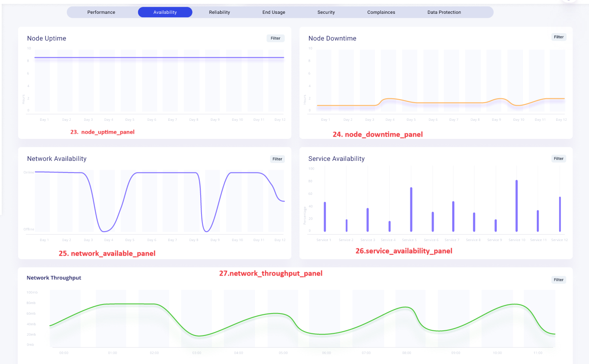

- [awsx-getelementdetails](#awsx-getelementdetails)
- [ui-analysys and listing methods](#ui-analysys-and-listing-methods)
  - [cpu\_utilization\_panel](#cpu_utilization_panel)
  - [memory\_utilization\_panel](#memory_utilization_panel)
  - [storage\_utilization\_panel](#storage_utiization_panel)
  - [network\_utilization\_panel](#network_utiization_panel)
  - [cpu\_requests\_panel](#cpu_requests_panel)
  - [allocatable\_cpu\_panel](#allocatable_cpu_panel)
  - [cpu\_limits\_panel](#cpu_limits_panel)
  - [cpu\_utilization\_graph\_panel](#cpu_utilization_graph_panel)
  - [memory\_requests\_panel](#memory_requests_panel)
  - [memory\_limits\_panel](#memory_limits_panel)
  - [allocatable\_memory\_panel](#allocatable_memory_panel)
  - [memory\_utilization\_graph\_panel](#memory_utilization_graph_panel)
  - [disk\_utilization\_panel](#disk_utiization_panel)
  - [network\_in\_out\_panel](#network_in_out_panel)
  - [cpu\_utilization\_graph\_panel](#cpu_utilization_graph_panel)
  - [memory\_usage\_panel](#memory_usage-panel)
  - [alerts\_warnings\_panel](#alerts-and-warning)
  - [network\_throughput\_single\_panel](#network_throughput_single_panel)
  - [node\_capacity\_panel](#node_capacity)
  - [node\_condition\_panel](#node_condition)
  - [disk\_io\_performance\_panel](#disk_io_performance_panel)
  - [node\_event\_logs\_panel](#node_event_logs_panel)
  - [node\_uptime\_panel](#node_uptime_panel)
  - [node\_downtime\_panel](#node_downtime_panel)
  - [network\_availablility\_panel](#network_availablility_panel)
  - [service\_availability\_panel](#service_availablility_panel)

  

- [List of subcommands and options for EKS](#list-of-subcommands-and-options-for-eks)

# awsx-getelementdetails
It implements the awsx plugin getElementDetails 

# ui-analysys-and listing-methods
## cpu_utilization_panel
 

1. cpu_utilization_panel

**called from subcommand**

go run awsx-getelementdetails.go  --vaultUrl=<afreenXXXXXXX1309> --elementId=9315 --query="cpu_utilization_panel" --elementType="EKS" --responseType=json --startTime=2023-12-01T00:00:00Z --endTime=2023-12-02T23:59:59Z

**called from maincommand**

awsx --vaultUrl=<afreenXXXXXXX1309> --elementId=9315  --query="cpu_utilization_panel" --elementType="EKS" --responseType=json --startTime=2023-12-01T00:00:00Z --endTime=2023-12-02T23:59:59Z

**Called from API**

http://localhost:7000/awsx-api/getQueryOutput?vaultUrl=<afreenXXXX>&elementId=9315&elementType=EKS&query=cpu_utilization_panel&responseType=json&startTime=2023-12-01T00:00:00Z&endTime=2023-12-02T23:59:59Z

**Desired Output in json format:**
- CPU utilization
{
	CurrentUsage:25%,
	AverageUsage:30%,
	MaxUsage:40%
}

**Algorithm/ Pseudo Code**

**Algorithm:** 
- CPU utilization panel - Write a custom metric for cpu utilization, where we shall write a program for current, avg and max, using cloudwatch API

 **Pseudo Code:**   

## memory_utilization_panel

2. memory_utilization_panel 

**called from subcommand**

go run awsx-getelementdetails.go  --vaultUrl=<afreenXXXXXXX1309> --elementId=9315 --query="memory_utilization_panel" --elementType="EKS" --responseType=json --startTime=2023-12-01T00:00:00Z --endTime=2023-12-02T23:59:59Z

**called from maincommand**

awsx --vaultUrl=<afreenXXXXXXX1309> --elementId=9315  --query="memory_utilization_panel" --elementType="EKS" --responseType=json --startTime=2023-12-01T00:00:00Z --endTime=2023-12-02T23:59:59Z

**Called from API**

http://localhost:7000/awsx-api/getQueryOutput?vaultUrl=<afreenXXXX>&elementId=9315&elementType=EKS&query=memory_utilization_panel&responseType=json&startTime=2023-12-01T00:00:00Z&endTime=2023-12-02T23:59:59Z

**Desired Output in json format:**
- Memory utilization
{
    CurrentUsage:25GB,
    AverageUsage:30GB,
	MaxUsage:40GB
}

**Algorithm/ Pseudo Code**

**Algorithm:** 
- Memory Utilization panel - Write a custom metric for memory utilization, where we shall write a program for current, avg and max.

**Pseudo Code:**  

# ui-analysys-and listing-methods
## storage_utiization_panel

3. storage_utilization_panel 

**called from subcommand**

go run awsx-getelementdetails.go  --vaultUrl=<afreenXXXXXXX1309> --elementId=9315 --query="storage_utilization_panel" --elementType="EKS" --responseType=json --startTime=2023-12-01T00:00:00Z --endTime=2023-12-02T23:59:59Z

**called from maincommand**

awsx --vaultUrl=<afreenXXXXXXX1309> --elementId=9315  --query="storage_utilization_panel" --elementType="EKS" --responseType=json --startTime=2023-12-01T00:00:00Z --endTime=2023-12-02T23:59:59Z

**Called from API**

http://localhost:7000/awsx-api/getQueryOutput?vaultUrl=<afreenXXXX>&elementId=9315&elementType=EKS&query=storage_utilization_panel&responseType=json&startTime=2023-12-01T00:00:00Z&endTime=2023-12-02T23:59:59Z

**Desired Output in json / graph format:**
- Storage utilization
{
    RootVolumeUsage:25GB,
    EBSVolume1Usage:30GB,
	EBSVolume2Usage:40GB
}

**Algorithm/ Pseudo Code**

**Algorithm:** 
- Storage Utilization panel - Write a custom metric for storage utilization, where we shall write a program for root volume usage and ebs disks usage.
    Pseudo Code -

 **Pseudo Code:**

# ui-analysys-and listing-methods

## network_utiization_panel

4. network_utilization_panel 

**called from subcommand**

go run awsx-getelementdetails.go  --vaultUrl=<afreenXXXXXXX1309> --elementId=9315 --query="network_utilization_panel" --elementType="EKS" --responseType=json --startTime=2023-12-01T00:00:00Z --endTime=2023-12-02T23:59:59Z

**called from maincommand**

awsx --vaultUrl=<afreenXXXXXXX1309> --elementId=9315  --query="network_utilization_panel" --elementType="EKS" --responseType=json --startTime=2023-12-01T00:00:00Z --endTime=2023-12-02T23:59:59Z

**Called from API**

http://localhost:7000/awsx-api/getQueryOutput?vaultUrl=<afreenXXXX>&elementId=9315&elementType=EKS&query=network_utilization_panel&responseType=json&startTime=2023-12-01T00:00:00Z&endTime=2023-12-02T23:59:59Z

**Desired Output in json / graph format:**
- Network utilization
{
    Inbound traffic:500Mbps,
    Outbound traffic:200Mbps,
	Data Transferred:10GB
}

**Algorithm/ Pseudo Code**

**Algorithm:** 
- Network utilization panel - Write a custom metric for Network utilization, where we shall write a program for metric name of node_network_total_bytes. Metric Namespace - ContainerInsights
 **Pseudo Code:**

# ui-analysys-and listing-methods

## cpu_requests_panel

5. cpu_requests_panel 

**called from subcommand**

go run awsx-getelementdetails.go  --vaultUrl=<afreenXXXXXXX1309> --elementId=9315 --query="cpu_requests_panel" --elementType="EKS" --responseType=json --startTime=2023-12-01T00:00:00Z --endTime=2023-12-02T23:59:59Z

**called from maincommand**

awsx --vaultUrl=<afreenXXXXXXX1309> --elementId=9315  --query="cpu_requests_panel" --elementType="EKS" --responseType=json --startTime=2023-12-01T00:00:00Z --endTime=2023-12-02T23:59:59Z

**Called from API**

http://localhost:7000/awsx-api/getQueryOutput?vaultUrl=<afreenXXXX>&elementId=9315&elementType=EKS&query=cpu_requests_panel&responseType=json&startTime=2023-12-01T00:00:00Z&endTime=2023-12-02T23:59:59Z

**Desired Output in  graph format:**
- CPU Requests 

**Algorithm/ Pseudo Code**

**Algorithm:** 
- CPU requests panel - metric name - node_cpu_request, Metric Namespace - EKS, node_cpu_request is not reported directly as a metric, but is a field in performance log events.

 **Pseudo Code:**

# ui-analysys-and listing-methods

## cpu_requests_panel
## allocatable_cpu_panel

6. allocatable_cpu_panel 

**called from subcommand**

go run awsx-getelementdetails.go  --vaultUrl=<afreenXXXXXXX1309> --elementId=9315 --query="allocatable_cpu_panel" --elementType="EKS" --responseType=json --startTime=2023-12-01T00:00:00Z --endTime=2023-12-02T23:59:59Z

**called from maincommand**

awsx --vaultUrl=<afreenXXXXXXX1309> --elementId=9315  --query="allocatable_cpu_panel" --elementType="EKS" --responseType=json --startTime=2023-12-01T00:00:00Z --endTime=2023-12-02T23:59:59Z

**Called from API**

http://localhost:7000/awsx-api/getQueryOutput?vaultUrl=<afreenXXXX>&elementId=9315&elementType=EKS&query=allocatable_cpu_panel&responseType=json&startTime=2023-12-01T00:00:00Z&endTime=2023-12-02T23:59:59Z

**Desired Output in  graph format:**
- allocatable_cpu 

**Algorithm/ Pseudo Code**

**Algorithm:** 
- allocatable cpu panel - - Metric name - node_cpu_limit, metric namespace - EKS, dimmensions to add - ClusterName, InstanceId, NodeName

 **Pseudo Code:**

# ui-analysys-and listing-methods
## cpu_limits_panel

7. cpu_limits_panel 

**called from subcommand**

go run awsx-getelementdetails.go  --vaultUrl=<afreenXXXXXXX1309> --elementId=9315 --query="cpu_limits_panel" --elementType="EKS" --responseType=json --startTime=2023-12-01T00:00:00Z --endTime=2023-12-02T23:59:59Z

**called from maincommand**

awsx --vaultUrl=<afreenXXXXXXX1309> --elementId=9315  --query="cpu_limits_panel" --elementType="EKS" --responseType=json --startTime=2023-12-01T00:00:00Z --endTime=2023-12-02T23:59:59Z

**Called from API**

http://localhost:7000/awsx-api/getQueryOutput?vaultUrl=<afreenXXXX>&elementId=9315&elementType=EKS&query=cpu_limits_panel&responseType=json&startTime=2023-12-01T00:00:00Z&endTime=2023-12-02T23:59:59Z

**Desired Output in  graph format:**
- cpu_limits_panel

**Algorithm/ Pseudo Code**

**Algorithm:** 
- cpu_limits_panel - Fire a cloudwatch query for  Metric name - node_cpu_limit, metric namespace - EKS, dimmensions to add - ClusterName, InstanceId, NodeName.

 **Pseudo Code:**

# ui-analysys-and listing-methods
## cpu_utilization_graph_panel

8. cpu_utilization_graph_panel 

**called from subcommand**

go run awsx-getelementdetails.go  --vaultUrl=<afreenXXXXXXX1309> --elementId=9315 --query="cpu_utilization_graph_panel" --elementType="EKS" --responseType=json --startTime=2023-12-01T00:00:00Z --endTime=2023-12-02T23:59:59Z

**called from maincommand**

awsx --vaultUrl=<afreenXXXXXXX1309> --elementId=9315  --query="cpu_utilization_graph_panel" --elementType="EKS" --responseType=json --startTime=2023-12-01T00:00:00Z --endTime=2023-12-02T23:59:59Z

**Called from API**

http://localhost:7000/awsx-api/getQueryOutput?vaultUrl=<afreenXXXX>&elementId=9315&elementType=EKS&query=cpu_utilization_graph_panel&responseType=json&startTime=2023-12-01T00:00:00Z&endTime=2023-12-02T23:59:59Z

**Desired Output in  graph format:**
- cpu_utilization_graph_panel

**Algorithm/ Pseudo Code**

**Algorithm:** 
- cpu_utilization_graph_panel - Fire a cloudwatch query for cpu_utilization_graph_panel, using metric node_cpu_utilization. Note - The metric namespace should be EKS.

 **Pseudo Code:**

 # ui-analysys-and listing-methods
 ## memory_requests_panel

9. memory_requests_panel 

**called from subcommand**

go run awsx-getelementdetails.go  --vaultUrl=<afreenXXXXXXX1309> --elementId=9315 --query="memory_requests_panel" --elementType="EKS" --responseType=json --startTime=2023-12-01T00:00:00Z --endTime=2023-12-02T23:59:59Z

**called from maincommand**

awsx --vaultUrl=<afreenXXXXXXX1309> --elementId=9315  --query="memory_requests_panel" --elementType="EKS" --responseType=json --startTime=2023-12-01T00:00:00Z --endTime=2023-12-02T23:59:59Z

**Called from API**

http://localhost:7000/awsx-api/getQueryOutput?vaultUrl=<afreenXXXX>&elementId=9315&elementType=EKS&query=memory_requests_panel&responseType=json&startTime=2023-12-01T00:00:00Z&endTime=2023-12-02T23:59:59Z

**Desired Output in  graph format:**
- memory_requests_panel

**Algorithm/ Pseudo Code**

**Algorithm:** 
- memory_requests_panel - Write a cloudwatch query for memory_requests_panel, where we shall retrieve in graph format. metric name - node_memory_reserved_capacity, formula - node_memory_request,NOTE - node_memory_request is not reported directly as a metric, but is a field in performance log events. For more information, see Relevant fields in performance log events for Amazon EKS and Kubernetes.

 **Pseudo Code:**

# ui-analysys-and listing-methods

10. memory_limits_panel 

## memory_limits_panel

**called from subcommand**

go run awsx-getelementdetails.go  --vaultUrl=<afreenXXXXXXX1309> --elementId=9315 --query="memory_limits_panel" --elementType="EKS" --responseType=json --startTime=2023-12-01T00:00:00Z --endTime=2023-12-02T23:59:59Z

**called from maincommand**

awsx --vaultUrl=<afreenXXXXXXX1309> --elementId=9315  --query="memory_limits_panel" --elementType="EKS" --responseType=json --startTime=2023-12-01T00:00:00Z --endTime=2023-12-02T23:59:59Z

**Called from API**

http://localhost:7000/awsx-api/getQueryOutput?vaultUrl=<afreenXXXX>&elementId=9315&elementType=EKS&query=memory_limits_panel&responseType=json&startTime=2023-12-01T00:00:00Z&endTime=2023-12-02T23:59:59Z

**Desired Output in  graph format:**
- Memory Limits 

**Algorithm/ Pseudo Code**

**Algorithm:** 
- Memory Limits panel - Fire a cloudwatch query for Memory Limits, using metric name as node_memory_reserved_capacity, Formula - node_memory_limit. This is a container insight metric. 

 **Pseudo Code:**

# ui-analysys-and listing-methods
## allocatable_memory_panel

11. allocatable_memory_panel 

**called from subcommand**

go run awsx-getelementdetails.go  --vaultUrl=<afreenXXXXXXX1309> --elementId=9315 --query="allocatable_memory_panel" --elementType="EKS" --responseType=json --startTime=2023-12-01T00:00:00Z --endTime=2023-12-02T23:59:59Z

**called from maincommand**

awsx --vaultUrl=<afreenXXXXXXX1309> --elementId=9315  --query="allocatable_memory_panel" --elementType="EKS" --responseType=json --startTime=2023-12-01T00:00:00Z --endTime=2023-12-02T23:59:59Z

**Called from API**

http://localhost:7000/awsx-api/getQueryOutput?vaultUrl=<afreenXXXX>&elementId=9315&elementType=EKS&query=allocatable_memory_panel&responseType=json&startTime=2023-12-01T00:00:00Z&endTime=2023-12-02T23:59:59Z

**Desired Output in  graph format:**
- allocatable_memory_panel 

**Algorithm/ Pseudo Code**

**Algorithm:** 
- allocatable memory panel - Fire a cloudwatch query for allocatable memory, using metric namespace as allocatable_memory. 

 **Pseudo Code:**

# ui-analysys-and listing-methods
## memory_utilization_graph_panel 

12. memory_utilization_graph_panel 

**called from subcommand**

go run awsx-getelementdetails.go  --vaultUrl=<afreenXXXXXXX1309> --elementId=9315 --query="memory_utilization_graph_panel" --elementType="EKS" --responseType=json --startTime=2023-12-01T00:00:00Z --endTime=2023-12-02T23:59:59Z

**called from maincommand**

awsx --vaultUrl=<afreenXXXXXXX1309> --elementId=9315  --query="memory_utilization_graph_panel" --elementType="EKS" --responseType=json --startTime=2023-12-01T00:00:00Z --endTime=2023-12-02T23:59:59Z

**Called from API**

http://localhost:7000/awsx-api/getQueryOutput?vaultUrl=<afreenXXXX>&elementId=9315&elementType=EKS&query=memory_utilization_graph_panel&responseType=json&startTime=2023-12-01T00:00:00Z&endTime=2023-12-02T23:59:59Z

**Desired Output in  graph format:**
- memory_utilization_graph_panel 

**Algorithm/ Pseudo Code**

**Algorithm:** 
- memory_utilization_graph_panel - Fire a cloudwatch query for memory_utilization_panel, using metric name as node_memory_utilization. NOTE - The percentage of memory currently being used by the node or nodes. It is the percentage of node memory usage divided by the node memory limitation.

Formula: node_memory_working_set / node_memory_limit. 

 **Pseudo Code:**

# ui-analysys-and listing-methods
## Disk_utiization_panel

13. disk_utilization_panel

disk_utilization_panel (incomplete)

**called from subcommand**

go run awsx-getelementdetails.go  --vaultUrl=<afreenXXXXXXX1309> --elementId=9315 --query="disk_utilization_panel" --elementType="EKS" --responseType=json --startTime=2023-12-01T00:00:00Z --endTime=2023-12-02T23:59:59Z

**called from maincommand**

awsx --vaultUrl=<afreenXXXXXXX1309> --elementId=9315  --query="disk_utilization_panel" --elementType="EKS" --responseType=json --startTime=2023-12-01T00:00:00Z --endTime=2023-12-02T23:59:59Z

**Called from API**

http://localhost:7000/awsx-api/getQueryOutput?vaultUrl=<afreenXXXX>&elementId=9315&elementType=EKS&query=disk_utilization_panel&responseType=json&startTime=2023-12-01T00:00:00Z&endTime=2023-12-02T23:59:59Z
called from subcommand

**Desired Output in graph format:**

 -disk_utilization_panel

**Algorithm/ Pseudo Code**

**Algorithm:** 
-disk_utilization_panel - Write a cloudwatch query for disk_utilization_panel, where we shall retrieve the data in graph format.

**Pseudo Code:**

# ui-analysys-and listing-methods
## Network_in_out_panel

14. network_in_out_panel

Network_in_out_panel

**called from subcommand**

go run awsx-getelementdetails.go  --vaultUrl=<afreenXXXXXXX1309> --elementId=9315 --query="network_in_out_panel" --elementType="EKS" --responseType=json --startTime=2023-12-01T00:00:00Z --endTime=2023-12-02T23:59:59Z

**called from maincommand**

awsx --vaultUrl=<afreenXXXXXXX1309> --elementId=9315  --query="network_in_out_panel" --elementType="EKS" --responseType=json --startTime=2023-12-01T00:00:00Z --endTime=2023-12-02T23:59:59Z

**Called from API**

http://localhost:7000/awsx-api/getQueryOutput?vaultUrl=<afreenXXXX>&elementId=9315&elementType=EKS&query=network_in_out_panel&responseType=json&startTime=2023-12-01T00:00:00Z&endTime=2023-12-02T23:59:59Z

**Desired Output in graph format:**

 -Network_in_out_panel

**Algorithm/ Pseudo Code**

**Algorithm:**

-Network_in_out_panel - Write a cloudwatch query for Network_in_out_panel, where we shall retrieve the data in graph format, metrics used -- pod_network_rx_bytes, pod_network_tx_bytes
  NOTE - These are container insights metrics which is a custom namespace in cloudwatch when enabled.

**Pseudo Code:**

# ui-analysys-and listing-methods
## cpu_utilization_graph_panel

15. cpu utilization graph panel

cpu_utilization_graph_panel

**called from subcommand**

go run awsx-getelementdetails.go  --vaultUrl=<afreenXXXXXXX1309> --elementId=9315 --query="cpu_utilization_graph_panel
" --elementType="EKS" --responseType=json --startTime=2023-12-01T00:00:00Z --endTime=2023-12-02T23:59:59Z

**called from maincommand**

awsx --vaultUrl=<afreenXXXXXXX1309> --elementId=9315  --query="cpu_utilization_graph_panel
" --elementType="EKS" --responseType=json --startTime=2023-12-01T00:00:00Z --endTime=2023-12-02T23:59:59Z

**Called from API**

http://localhost:7000/awsx-api/getQueryOutput?vaultUrl=<afreenXXXX>&elementId=9315&elementType=EKS&query=cpu_utilization_graph_panel
&responseType=json&startTime=2023-12-01T00:00:00Z&endTime=2023-12-02T23:59:59Z

**Desired Output in graph format:**

-cpu_utilization_graph_panel

**Algorithm/ Pseudo Code**
**Algorithm:**
-cpu_utilization_panel - Write a cloudwatch query for cpu_utilization_graph_panel
, where we shall retrieve the data in graph format, metrics used -- node_cpu_utilization, metric namespace - container Insights

**Pseudo Code:**

# ui-analysys-and listing-methods
## memory_usage panel

16. memory usage panel

**called from subcommand**

go run awsx-getelementdetails.go  --vaultUrl=<afreenXXXXXXX1309> --elementId=9315 --query="memory_usage_panel" --elementType="EKS" --responseType=json --startTime=2023-12-01T00:00:00Z --endTime=2023-12-02T23:59:59Z

**called from maincommand**

awsx --vaultUrl=<afreenXXXXXXX1309> --elementId=9315  --query="memory_usage_panel" --elementType="EKS" --responseType=json --startTime=2023-12-01T00:00:00Z --endTime=2023-12-02T23:59:59Z

**Called from API**

http://localhost:7000/awsx-api/getQueryOutput?vaultUrl=<afreenXXXX>&elementId=9315&elementType=EKS&query=memory_usage_panel&responseType=json&startTime=2023-12-01T00:00:00Z&endTime=2023-12-02T23:59:59Z

**Desired Output in graph format:**

-memory_usage_panel

**Algorithm/ Pseudo Code**

**Algorithm:**
memory_usage_panel -  metric namespace - container insights. metric name - node_memory_reserved_capacity, Formula - node_memory_request / node_memory_limit

**Pseudo Code:**

# ui-analysys-and listing-methods
## network_throughput_panel

17. network throughput panel

**called from subcommand**

go run awsx-getelementdetails.go  --vaultUrl=<afreenXXXXXXX1309> --elementId=9315 --query="network_throughput_panel" --elementType="EKS" --responseType=json --startTime=2023-12-01T00:00:00Z --endTime=2023-12-02T23:59:59Z

**called from maincommand**

awsx --vaultUrl=<afreenXXXXXXX1309> --elementId=9315  --query="network_throughput_panel" --elementType="EKS" --responseType=json --startTime=2023-12-01T00:00:00Z --endTime=2023-12-02T23:59:59Z

**Called from API**

http://localhost:7000/awsx-api/getQueryOutput?vaultUrl=<afreenXXXX>&elementId=9315&elementType=EKS&query=network_throughput_panel&responseType=json&startTime=2023-12-01T00:00:00Z&endTime=2023-12-02T23:59:59Z

**Desired Output in graph format:**

-network_throughput_panel

**Algorithm/ Pseudo Code**

**Algorithm:**
Write a cloudwatch query for Network_in_out_panel, where we shall retrieve the data in graph format, metrics used -- pod_network_rx_bytes, pod_network_tx_bytes
  NOTE - These are container insights metrics which is a custom namespace in cloudwatch when enabled. Metric NameSpace - Container Insights.

**Pseudo Code:**

# ui-analysys-and listing-methods
## node_capacity

18. node capacity

**called from subcommand**

go run awsx-getelementdetails.go  --vaultUrl=<afreenXXXXXXX1309> --elementId=9315 --query="node_capacity_panel" --elementType="EKS" --responseType=json --startTime=2023-12-01T00:00:00Z --endTime=2023-12-02T23:59:59Z

**called from maincommand**

awsx --vaultUrl=<afreenXXXXXXX1309> --elementId=9315  --query="node_capacity_panel" --elementType="EKS" --responseType=json --startTime=2023-12-01T00:00:00Z --endTime=2023-12-02T23:59:59Z

**Called from API**

http://localhost:7000/awsx-api/getQueryOutput?vaultUrl=<afreenXXXX>&elementId=9315&elementType=EKS&query=node_capacity_panel&responseType=json&startTime=2023-12-01T00:00:00Z&endTime=2023-12-02T23:59:59Z

**Desired Output in pie chart format:**

-node_capacity_panel

**Algorithm/ Pseudo Code**

**Algorithm:**
-node_capacity_panel - metric namespace - Container Insights, metric name - node_status_capacity_pods.

**Pseudo Code:**

# ui-analysys-and listing-methods
## node_condition

19. node condition

**called from subcommand**

go run awsx-getelementdetails.go  --vaultUrl=<afreenXXXXXXX1309> --elementId=9315 --query="node_condition_panel" --elementType="EKS" --responseType=json --startTime=2023-12-01T00:00:00Z --endTime=2023-12-02T23:59:59Z

**called from maincommand**

awsx --vaultUrl=<afreenXXXXXXX1309> --elementId=9315  --query="node_condition_panel" --elementType="EKS" --responseType=json --startTime=2023-12-01T00:00:00Z --endTime=2023-12-02T23:59:59Z

**Called from API**

http://localhost:7000/awsx-api/getQueryOutput?vaultUrl=<afreenXXXX>&elementId=9315&elementType=EKS&query=node_condition_panel&responseType=json&startTime=2023-12-01T00:00:00Z&endTime=2023-12-02T23:59:59Z

**Desired Output in pie cahrt format:**
-node_condition_panel

**Algorithm/ Pseudo Code**

**Algorithm:**
-node_condition_panel - metric name - node_status_condition_ready,node_status_condition_memory_pressure, node_status_condition_pid_pressure, node_status_condition_disk_pressure, node_status_condition_unknown. Metric Namespace - Container Insights. Use all given metrics to specify a condition of a node.

**Pseudo Code:**

# ui-analysys-and listing-methods
## disk_io_performance_panel

20. Disk I/O performance

**called from subcommand**

go run awsx-getelementdetails.go  --vaultUrl=<afreenXXXXXXX1309> --elementId=9315 --query="disk_io_performance_panel" --elementType="EKS" --responseType=json --startTime=2023-12-01T00:00:00Z --endTime=2023-12-02T23:59:59Z

**called from maincommand**

awsx --vaultUrl=<afreenXXXXXXX1309> --elementId=9315  --query="disk_io_performance_panel" --elementType="EKS" --responseType=json --startTime=2023-12-01T00:00:00Z --endTime=2023-12-02T23:59:59Z

**Called from API**

http://localhost:7000/awsx-api/getQueryOutput?vaultUrl=<afreenXXXX>&elementId=9315&elementType=EKS&query=disk_io_performance_panel&responseType=json&startTime=2023-12-01T00:00:00Z&endTime=2023-12-02T23:59:59Z

**Desired Output in graph format:**

-disk_io_performance_panel

**Algorithm/ Pseudo Code**
**Algorithm:**
-disk_io_performance_panel -  metric namespace - EKS, metric name - node_diskio_io_serviced_total, This metric is related to Container Insights metrics.

**Pseudo Code:**

# ui-analysys-and listing-methods

## node_event_logs_panel

21. Node Event Logs

**called from subcommand**

go run awsx-getelementdetails.go  --vaultUrl=<afreenXXXXXXX1309> --elementId=9315 --query="node_event_logs_panel" --elementType="EKS" --responseType=json --startTime=2023-12-01T00:00:00Z --endTime=2023-12-02T23:59:59Z

**called from maincommand**

awsx --vaultUrl=<afreenXXXXXXX1309> --elementId=9315  --query="node_event_logs_panel" --elementType="EKS" --responseType=json --startTime=2023-12-01T00:00:00Z --endTime=2023-12-02T23:59:59Z

**Called from API**

http://localhost:7000/awsx-api/getQueryOutput?vaultUrl=<afreenXXXX>&elementId=9315&elementType=EKS&query=node_event_logs_panel&responseType=json&startTime=2023-12-01T00:00:00Z&endTime=2023-12-02T23:59:59Z

**Desired Output in graph format:**

-node_event_logs_panel

**Algorithm/ Pseudo Code**

Algorithm:
node_event_logs_panel - NA metric namespace - EKS

**Pseudo Code:**

# ui-analysys-and listing-methods
## alerts and warning

22. Alerts and warnings - 

**called from subcommand**

go run awsx-getelementdetails.go  --vaultUrl=<afreenXXXXXXX1309> --elementId=9315 --query="alerts_and_warnings_panel" --elementType="EKS" --responseType=json --startTime=2023-12-01T00:00:00Z --endTime=2023-12-02T23:59:59Z

**called from maincommand**

awsx --vaultUrl=<afreenXXXXXXX1309> --elementId=9315  --query="alerts_and_warnings_panel" --elementType="EKS" --responseType=json --startTime=2023-12-01T00:00:00Z --endTime=2023-12-02T23:59:59Z

**Called from API**

http://localhost:7000/awsx-api/getQueryOutput?vaultUrl=<afreenXXXX>&elementId=9315&elementType=EKS&query=alerts_and_warnings_panel&responseType=json&startTime=2023-12-01T00:00:00Z&endTime=2023-12-02T23:59:59Z

**Desired Output in graph format:**

-node_event_logs_panel

**Algorithm/ Pseudo Code**
Algorithm:
-node_event_logs_panel - NA metric namespace - EKS

**Pseudo Code:**

 # ui-analysys-and listing-methods
 ## node_uptime_panel

23. Node Uptime

**called from subcommand**

go run awsx-getelementdetails.go  --vaultUrl=<afreenXXXXXXX1309> --elementId=9315 --query="node_uptime_panel" --elementType="EKS" --responseType=json --startTime=2023-12-01T00:00:00Z --endTime=2023-12-02T23:59:59Z

**called from maincommand**

awsx --vaultUrl=<afreenXXXXXXX1309> --elementId=9315  --query="node_uptime_panel" --elementType="EKS" --responseType=json --startTime=2023-12-01T00:00:00Z --endTime=2023-12-02T23:59:59Z

**Called from API**

http://localhost:7000/awsx-api/getQueryOutput?vaultUrl=<afreenXXXX>&elementId=9315&elementType=EKS&query=node_uptime_panel&responseType=json&startTime=2023-12-01T00:00:00Z&endTime=2023-12-02T23:59:59Z

**Desired Output in graph format:**

-node_uptime_panel

**Algorithm/ Pseudo Code**

Algorithm:
-node_uptime_panel - NA metric namespace - EKS

**Pseudo Code:**

# ui-analysys-and listing-methods
## node_downtime_panel

24. Node Downtime

**called from subcommand**

go run awsx-getelementdetails.go  --vaultUrl=<afreenXXXXXXX1309> --elementId=9315 --query="node_downtime_panel" --elementType="EKS" --responseType=json --startTime=2023-12-01T00:00:00Z --endTime=2023-12-02T23:59:59Z

**called from maincommand**

awsx --vaultUrl=<afreenXXXXXXX1309> --elementId=9315  --query="node_downtime_panel" --elementType="EKS" --responseType=json --startTime=2023-12-01T00:00:00Z --endTime=2023-12-02T23:59:59Z

**Called from API**

http://localhost:7000/awsx-api/getQueryOutput?vaultUrl=<afreenXXXX>&elementId=9315&elementType=EKS&query=node_downtime_panel&responseType=json&startTime=2023-12-01T00:00:00Z&endTime=2023-12-02T23:59:59Z

**Desired Output in graph format:**

-node_downtime_panel

**Algorithm/ Pseudo Code**
Algorithm:
-node_downtime_panel - NA metric namespace - EKS

**Pseudo Code:**

# ui-analysys-and listing-methods

## network_availablility_panel

25. Network Availability

**called from subcommand**

go run awsx-getelementdetails.go  --vaultUrl=<afreenXXXXXXX1309> --elementId=9315 --query="network_availability_panel" --elementType="EKS" --responseType=json --startTime=2023-12-01T00:00:00Z --endTime=2023-12-02T23:59:59Z

**called from maincommand**

awsx --vaultUrl=<afreenXXXXXXX1309> --elementId=9315  --query="network_availability_panel" --elementType="EKS" --responseType=json --startTime=2023-12-01T00:00:00Z --endTime=2023-12-02T23:59:59Z

**Called from API**

http://localhost:7000/awsx-api/getQueryOutput?vaultUrl=<afreenXXXX>&elementId=9315&elementType=EKS&query=network_availability_panel&responseType=json&startTime=2023-12-01T00:00:00Z&endTime=2023-12-02T23:59:59Z

**Desired Output in graph format:**

-network_availability_panel

**Algorithm/ Pseudo Code**

Algorithm:
-network_availability_panel - NA metric namespace - EKS

**Pseudo Code:**

# ui-analysys-and listing-methods

## service_availability_panel

26. Service Availability

**called from subcommand**

go run awsx-getelementdetails.go  --vaultUrl=<afreenXXXXXXX1309> --elementId=9315 --query="service_availability_panel" --elementType="EKS" --responseType=json --startTime=2023-12-01T00:00:00Z --endTime=2023-12-02T23:59:59Z

**called from maincommand**

awsx --vaultUrl=<afreenXXXXXXX1309> --elementId=9315  --query="service_availability_panel" --elementType="EKS" --responseType=json --startTime=2023-12-01T00:00:00Z --endTime=2023-12-02T23:59:59Z

**Called from API**

http://localhost:7000/awsx-api/getQueryOutput?vaultUrl=<afreenXXXX>&elementId=9315&elementType=EKS&query=service_availability_panel&responseType=json&startTime=2023-12-01T00:00:00Z&endTime=2023-12-02T23:59:59Z

**Desired Output in graph format:**

-service_availability_panel

**Algorithm/ Pseudo Code**

Algorithm:
-service_availability_panel - NA metric namespace - EKS

**Pseudo Code:**

# ui-analysys-and listing-methods

## network_throughput_single_panel

27. Network Throughput single 

**called from subcommand**

go run awsx-getelementdetails.go  --vaultUrl=<afreenXXXXXXX1309> --elementId=9315 --query="network_throughput_single_panel" --elementType="EKS" --responseType=json --startTime=2023-12-01T00:00:00Z --endTime=2023-12-02T23:59:59Z

**called from maincommand**

awsx --vaultUrl=<afreenXXXXXXX1309> --elementId=9315  --query="network_throughput_single_panel" --elementType="EKS" --responseType=json --startTime=2023-12-01T00:00:00Z --endTime=2023-12-02T23:59:59Z

**Called from API**

http://localhost:7000/awsx-api/getQueryOutput?vaultUrl=<afreenXXXX>&elementId=9315&elementType=EKS&query=network_throughput_single_panel&responseType=json&startTime=2023-12-01T00:00:00Z&endTime=2023-12-02T23:59:59Z

**Desired Output in graph format:**

-network_throughput_single_panel

**Algorithm/ Pseudo Code**

Algorithm:
-network_throughput_single_panel - NA metric namespace - EKS

**Pseudo Code:**

##  List of subcommands and options for eks

| S.No | CLI Spec|  Description                           
|------|----------------|----------------------|
| 1    | awsx --vaultURL=vault.synectiks.net getElementDetails --elementId="9315" --elementType=EKS --query="cpu_utilization_panel"  | This will get the specific EKS Cluster cpu utilization panel data in hybrid structure |
| 2    | awsx --vaultURL=vault.synectiks.net getElementDetails --elementId="9315" --elementType=EKS --query="storage_utilization_panel" | This will get the specific EKS Cluster storage utilization panel data in hybrid structure|
| 3    | awsx --vaultURL=vault.synectiks.net getElementDetails --elementId="9315" --elementType=EKS --query="network_utilization_panel"  | This will get the specific EKS Cluster network utilization panel data in hybrid structure |
| 4    | awsx --vaultURL=vault.synectiks.net getElementDetails --elementId="9315" --elementType=EKS --query="memory_utilization_panel"  | This will get the specific EKS Cluster memory utilization panel data in hybrid structure |
| 5    | awsx --vaultURL=vault.synectiks.net getElementDetails --elementId="9315" --elementType=EKS --query="cpu_requests_panel"  | This will get the specific EKS Cluster cpu requests to a pod panel data in hybrid structure |
| 6    | awsx --vaultURL=vault.synectiks.net getElementDetails --elementId="9315" --elementType=EKS --query="allocatable_cpu_panel"  | This will get the specific EKS Cluster allocatable cpu panel data in hybrid structure |
| 7    | awsx --vaultURL=vault.synectiks.net getElementDetails --elementId="9315" --elementType=EKS --query="cpu_limits_panel"  | This will get the specific EKS Cluster cpu limits in a pod, data in hybrid structure |
| 8    | awsx --vaultURL=vault.synectiks.net getElementDetails --elementId="9315" --elementType=EKS --query="cpu_graph_utilization_panel"  | This will get the specific EKS Cluster cpu graph utilization panel data in hybrid structure |
| 9    | awsx --vaultURL=vault.synectiks.net getElementDetails --elementId="9315" --elementType=EKS --query="memory_requests_panel"  | This will get the specific EKS Cluster memory request panel data in hybrid structure |
| 10    | awsx --vaultURL=vault.synectiks.net getElementDetails --elementId="9315" --elementType=EKS --query="memory_limits_panel"  | This will get the specific EKS Cluster memory limits panel over a pod data in hybrid structure |
| 11    | awsx --vaultURL=vault.synectiks.net getElementDetails --elementId="9315" --elementType=EKS --query="cpu_node_utilization_panel"  | This will get the specific EKS Cluster cpu node utilization panel data in hybrid structure |
| 12    | awsx --vaultURL=vault.synectiks.net getElementDetails --elementId="9315" --elementType=EKS --query="memory_graph_utilization_panel"  | This will get the specific EKS memory graph utilization utilization panel data in hybrid structure |
| 13    | awsx --vaultURL=vault.synectiks.net getElementDetails --elementId="9315" --elementType=EKS --query="disk_utilization_panel"  | This will get the specific EKS Cluster disk utilization(ebs) panel data in hybrid structure |
| 14    | awsx --vaultURL=vault.synectiks.net getElementDetails --elementId="9315" --elementType=EKS --query="network_in_out_panel"  | This will get the specific EKS Cluster network in & out panel data in hybrid structure |
| 15    | awsx --vaultURL=vault.synectiks.net getElementDetails --elementId="9315" --elementType=EKS --query="memory_usage_panel"  | This will get the specific EKS Cluster memory usage panel data in hybrid structure |
| 16    | awsx --vaultURL=vault.synectiks.net getElementDetails --elementId="9315" --elementType=EKS --query="network_throughput_panel"  | This will get the specific EKS Cluster network throughput panel data in hybrid structure |
| 17    | awsx --vaultURL=vault.synectiks.net getElementDetails --elementId="9315" --elementType=EKS --query="node_capacity_panel"  | This will get the specific EKS Cluster node capacity panel data in hybrid structure |
| 18    | awsx --vaultURL=vault.synectiks.net getElementDetails --elementId="9315" --elementType=EKS --query="node_uptime_panel"  | This will get the specific EKS Cluster network in & out panel data in hybrid structure |
| 19    | awsx --vaultURL=vault.synectiks.net getElementDetails --elementId="9315" --elementType=EKS --query="network_throughput_single_panel"  | This will get the specific EKS Cluster network throughput single panel data in hybrid structure |
| 20    | awsx --vaultURL=vault.synectiks.net getElementDetails --elementId="9315" --elementType=EKS --query="node_downtime_panel"  | This will get the specific EKS Cluster node downtime panel data in hybrid structure |
| 21    | awsx --vaultURL=vault.synectiks.net getElementDetails --elementId="9315" --elementType=EKS --query="network_availability_panel"  | This will get the specific EKS Cluster network availability panel data in hybrid structure |
| 22    | awsx --vaultURL=vault.synectiks.net getElementDetails --elementId="9315" --elementType=EKS --query="service_availability_panel"  | This will get the specific EKS Cluster service availability panel data in hybrid structure |
| 23    | awsx --vaultURL=vault.synectiks.net getElementDetails --elementId="9315" --elementType=EKS --query="node_event_logs_panel"  | This will get the specific EKS Cluster node event logs panel data in hybrid structure |
| 24    | awsx --vaultURL=vault.synectiks.net getElementDetails --elementId="9315" --elementType=EKS --query="allocatable_memory_panel"  | This will get the specific EKS Cluster allocatable memory panel data in hybrid structure |
| 25    | awsx --vaultURL=vault.synectiks.net getElementDetails --elementId="9315" --elementType=EKS --query="resource_utilization_patterns_panel"  | This will get the specific EKS Cluster resource utilization patterns panel data in hybrid structure |
| 26    | awsx --vaultURL=vault.synectiks.net getElementDetails --elementId="9315" --elementType=EKS --query="disk_io_performance_panel"  | This will get the specific EKS Cluster disk io performance panel data in hybrid structure |
| 27    | awsx --vaultURL=vault.synectiks.net getElementDetails --elementId="9315" --elementType=EKS --query="node_stability_index_panel"  | This will get the specific EKS Cluster node stability index panel data in hybrid structure |
| 28    | awsx --vaultURL=vault.synectiks.net getElementDetails --elementId="9315" --elementType=EKS --query="incident_response_time_panel"  | This will get the specific EKS Cluster incident response timepanel data in hybrid structure |

