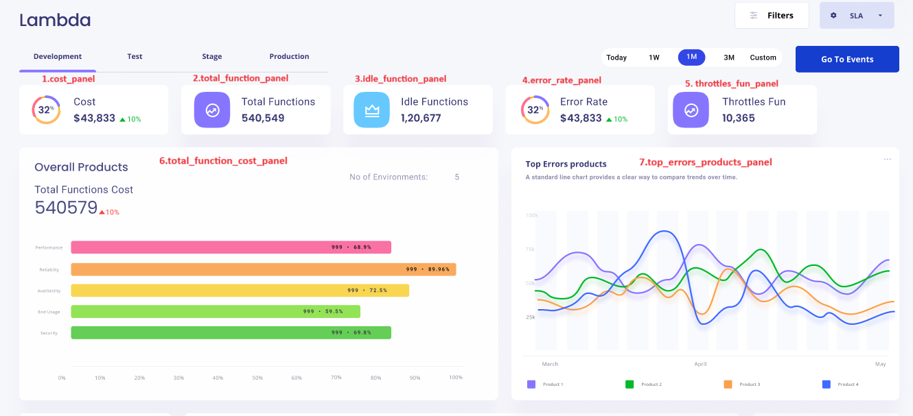

# Table of Contents

- [awsx-getelementdetails](#awsx-getelementdetails)
- [ui-analysis-and-listing-methods](#ui-analysis-and-listing-methods)
   - [cost_panel](#cost-panel)
   - [total_function_panel](#total-function-panel)
   - [idle_function_panel](#idle-function-panel)
   - [error_rate_panel](#error-rate-panel)
   - [throttles_fun_panel](#throttles-fun-panel)
   - [total_function_cost_panel](#total-function-cost-panel)
   - [top_errors_products_panel](#top-errors-products-panel)
   - [top_used_function_panel](#top-used-function-panel)
   - [function_panel](#function-panel)
   - [errors_panel](#errors-panel)
   - [throttles_panel](#throttles-panel)
   - [latency_panel](#latency-panel)
   - [trends_panel](#trends-panel)
   - [failure_function_panel](#failure-function-panel)
   - [cpu_used_panel](#cpu-used-panel)
   - [net_received_panel](#net-received-panel)
  - [request_panel](#request-panel)
  - [memory_used_panel](#memory-used-panel)
  - [top_failure_function_panel](#top-failure-function-panel)
  

 
# awsx-getelementdetails
It implements the awsx plugin getElementDetails
 
# ui analysis and listing methods

1. cost_panel
2. total_function_panel
3. idle_function_panel
4. error_rate_panel
5. throttles_fun_panel
6. total_function_cost_panel
7. top_errors_products_panel
8. top_used_function_panel
9.  function_panel
10. error_panel
11. throttles_panel
12. latency_panel
13. trends_panel
14. failure_function_panel
15. cpu_used_panel
16. net_received_panel
17. request_panel
18. memory_used_panel
19. top_failure_function_panel

_
# ui-analysys-and listing-methods
## cost panel

1. cost_panel

**called from subcommand**

go run awsx-getelementdetails.go  --vaultUrl=<afreenxxxx1309> --elementId=9387 --query="cost_panel" --elementType="Lambda" --responseType=json --startTime=2023-12-01T00:00:00Z --endTime=2023-12-02T23:59:59Z
 

**called from maincommand**

awsx --vaultUrl=<afreenxxxx1309> elementId=9387 --query="cost_panel" --elementType="Lambda" --responseType=json --startTime=2023-12-01T00:00:00Z --endTime=2023-12-02T23:59:59Z

**Called from API**

http://localhost:7000/awsx-api/getQueryOutput?vaultUrl=<afreenxxxx1309>&elementId=9387&elementType=Lambda&&query=cost_panel&responseType=json

**Desired Output in json / graph format:**
1 Cost data 

	$43,833

**Algorithm/ Pseudo Code**

**Algorithm:** 
- Cost panel - Write a custom cli for cost data , where we shall write a program for finding actual cost.

 **Pseudo Code:**  
 
 

# ui-analysys-and listing-methods
## total function panel

2. total_function_panel

**called from subcommand**

go run awsx-getelementdetails.go  --vaultUrl=<afreenxxxx1309> --elementId=9387 --query="total_function_panel" --elementType="Lambda" --responseType=json --startTime=2023-12-01T00:00:00Z --endTime=2023-12-02T23:59:59Z

**called from maincommand**

awsx --zone=us-east-1 --vaultUrl=<afreenxxxx1309> --elementId=9387 --query="total_function_panel" --elementType="Lambda" --responseType=json --startTime=2023-12-01T00:00:00Z --endTime=2023-12-02T23:59:59Z

**Called from API**

http://localhost:7000/awsx-api/getQueryOutput?vaultUrl=<afreenxxxx1309>&elementId=9387&elementType=Lambda&query=total_function_panel&responseType=json

**Desired Output in json / graph format:**
2.  total functions

   5,40,579

**Algorithm/ Pseudo Code**

**Algorithm:** 
- total function  - Write a custom function  for lambda, where we shall write a program to find total function.

 **Pseudo Code:** 

 
 
 # ui-analysys-and listing-methods
 ## idle function panel

3. idle_function_panel 

**called from subcommand**

go run awsx-getelementdetails.go  --vaultUrl=<afreenxxxx1309> --elementId=9387 --query="idle_function_panel" --elementType="Lambda" --responseType=json --startTime=2023-12-01T00:00:00Z --endTime=2023-12-02T23:59:59Z

 

**called from maincommand**

awsx --zone=us-east-1 --vaultUrl=<afreenxxxx1309> --elementId=9387 --query="idle_function_panel" --elementType="Lambda" --responseType=frame --startTime=2023-12-01T00:00:00Z --endTime=2023-12-02T23:59:59Z

**Called from API**

http://localhost:7000/awsx-api/getQueryOutput?vaultUrl=<afreenxxxx1309>&elemetId=9387&elementType=Lambda&query=idle_function_panel&responseType=json

**Desired Output in json / graph format:**
3.  Idle Function

   12,06,777

**Algorithm/ Pseudo Code**

**Algorithm:** 
- idle function panel - Write a custom cli for idle function, where we shall write a program for count the functions.

 **Pseudo Code:**  
 
 

 # ui-analysys-and listing-methods
 ## error rate panel

4. error_rate_panel 

**called from subcommand**

go run awsx-getelementdetails.go  --vaultUrl=<afreenxxxx1309> --elementId=9387 --query="error_rate_panel" --elementType="Lambda" --responseType=json --startTime=2023-12-01T00:00:00Z --endTime=2023-12-02T23:59:59Z

 

**called from maincommand**

awsx --zone=us-east-1 --vaultUrl=<afreenxxxx1309> --elementId=9387--query="error_rate_panel" --elementType="Lambda" --responseType=json --startTime=2023-12-01T00:00:00Z --endTime=2023-12-02T23:59:59Z

**Called from API**

http://localhost:7000/awsx-api/getQueryOutput?vaultUrl=<afreenxxxx1309>&elemetId=9387&elementType=Lambda&query=error_rate_panel&responseType=json 

**Desired Output in json / graph format:**
4.Error Rate

    $43,833

**Algorithm/ Pseudo Code**

**Algorithm:** 
- Error Rate panel - Write a custom cli for error rate , where we shall write a program for error rate.

 **Pseudo Code:**
 
 
 # ui-analysys-and listing-methods
 ## throttles fun panel

5. throttles_fun_panel

**called from subcommand**

go run awsx-getelementdetails.go  --vaultUrl=<afreenxxxx1309> --elementId=9387 --query="throttles_fun_panel" --elementType="Lambda" --responseType=json --startTime=2023-12-01T00:00:00Z --endTime=2023-12-02T23:59:59Z

 

**called from maincommand**

awsx --zone=us-east-1 --vaultUrl=<afreenxxxx1309> --elementId=9387--query="throttles_fun_panel" --elementType="Lambda" --responseType=json --startTime=2023-12-01T00:00:00Z --endTime=2023-12-02T23:59:59Z

**Called from API**

http://localhost:7000/awsx-api/getQueryOutput?vaultUrl=<afreenxxxx1309>&elementId=9387&elementType=Lambda&query=throttles_fun_panel&responseType=json

**Desired Output in json / graph format:**
5. throttles_fun_panel

	10,365

**Algorithm/ Pseudo Code**

**Algorithm:** 
- throttles_fun_panel  -Write a custom cli for throttles_fun_panel , where we shall write a program for finding throttles_fun_panel.

 **Pseudo Code:** 

 
 # ui-analysys-and listing-methods
## total function cost panel

6. total_function_cost_panel

**called from subcommand**

go run awsx-getelementdetails.go  --vaultUrl=<afreenxxxx1309> --elementId=9387 --query="total_function_cost_panel" --elementType="Lambda" --responseType=json --startTime=2023-12-01T00:00:00Z --endTime=2023-12-02T23:59:59Z

**called from maincommand**

awsx --zone=us-east-1 --vaultUrl=<afreenxxxx1309> --elementId=9387 --query="total_function_cost_panel" --elementType="Lambda" --responseType=json --startTime=2023-12-01T00:00:00Z --endTime=2023-12-02T23:59:59Z

**Called from API**

http://localhost:7000/awsx-api/getQueryOutput?vaultUrl=<afreenxxxx1309>&elemntId=9387&elementType=Lambda&query=total_function_cost_panel&responseType=json

**Desired Output in json / graph format:**
6. total_function_cost_panel

	5,40,579

**Algorithm/ Pseudo Code**

**Algorithm:** 
- total_function_cost_panel  -Write a custom cli for total_function_cost_panel , where we shall write a program for finding total function cost panel.

 **Pseudo Code:** 

 
 # ui-analysys-and listing-methods
## top_errors_products_panel

7. top_errors_products_panel

**called from subcommand**

go run awsx-getelementdetails.go  --vaultUrl=<afreenxxxx1309> --elementId=9387 --query="top_errors_products_panel" --elementType="Lambda" --responseType=json --startTime=2023-12-01T00:00:00Z --endTime=2023-12-02T23:59:59Z

 

**called from maincommand**

awsx --zone=us-east-1 --vaultUrl=<afreenxxxx1309> --elementId=9387 --query="top_errors_products_panel" --elementType="Lambda" --responseType=json --startTime=2023-12-01T00:00:00Z --endTime=2023-12-02T23:59:59Z

**Called from API**

http://localhost:7000/awsx-api/getQueryOutput?vaultUrl=<afreenxxxx1309>&elementId=9387&elementType=Lambda&query=top_errors_products_panel&responseType=json

**Desired Output in json / graph format:**
7. top_errors_products_panel

	-graph form

**Algorithm/ Pseudo Code**

**Algorithm:** 
- top_errors_products_panel-Write a custom cli for top errors products panel, where we shall write a program for finding top errors of products.

 **Pseudo Code:** 
 
 # ui-analysys-and listing-methods
## top used function panel

8. top_used_function_panel

**called from subcommand**

go run awsx-getelementdetails.go  --vaultUrl=<afreenxxxx1309> --elementId=9387 --query="top_used_function_panel" --elementType="Lambda" --responseType=json --startTime=2023-12-01T00:00:00Z --endTime=2023-12-02T23:59:59Z

 

**called from maincommand**

awsx --zone=us-east-1 --vaultUrl=<afreenxxxx1309> --elementId=9387 --query="top_used_function_panel" --elementType="Lambda" --responseType=json --startTime=2023-12-01T00:00:00Z --endTime=2023-12-02T23:59:59Z

**Called from API**

http://localhost:7000/awsx-api/getQueryOutput?vaultUrl=<afreenxxxx1309>&elementId=9387&elementType=Lambda&query=top_used_function_pan&responseType=json 

**Desired Output in json / graph format:**
8. Top used function panel

	-

**Algorithm/ Pseudo Code**

**Algorithm:** 
- Top used function   -Write a custom cli for top used functions  panel, where we shall write a program for finding top used functions.

 **Pseudo Code:** 
 
 
 # ui-analysys-and listing-methods
##  function panel

9. function_panel

**called from subcommand**

go run awsx-getelementdetails.go  --vaultUrl=<afreenxxxx1309> --elementId=9387 --query="function_panel" --elementType="Lambda" --responseType=json --startTime=2023-12-01T00:00:00Z --endTime=2023-12-02T23:59:59Z

 

**called from maincommand**

awsx --zone=us-east-1 --vaultUrl=<afreenxxxx1309> --elementId=9387 --query="function_panel" --elementType="Lambda" --responseType=json --startTime=2023-12-01T00:00:00Z --endTime=2023-12-02T23:59:59Z

**Called from API**

http://localhost:7000/awsx-api/getQueryOutput?vaultUrl=<afreenxxxx1309>&elementId=9387&elementType=Lambda&7&queryfunction_panel&responseType=json 

**Desired Output in json / graph format:**
9. function 

	1,86,875

**Algorithm/ Pseudo Code**

**Algorithm:** 
- function panel  -Write a custom cli for functions  panel, where we shall write a program for finding  functions.

 **Pseudo Code:** 
 
 

 # ui-analysys-and listing-methods

##  errors panel

10. errors_panel

**called from subcommand**

go run awsx-getelementdetails.go  --vaultUrl=<afreenxxxx1309> --elementId=9387 --query="errors_panel" --elementType="Lambda" --responseType=json --startTime=2023-12-01T00:00:00Z --endTime=2023-12-02T23:59:59Z

 

**called from maincommand**

awsx --zone=us-east-1 --vaultUrl=<afreenxxxx1309> --elementId=9387 --query="errors_panel" --elementType="Lambda" --responseType=json --startTime=2023-12-01T00:00:00Z --endTime=2023-12-02T23:59:59Z

**Called from API**

http://localhost:7000/awsx-api/getQueryOutput?vaultUrl=<afreenxxxx1309>&elementId=9387&elementType=Lambda&query=errors_panel&responseType=json

**Desired Output in json / graph format:**
10. errors panel

	2,875

**Algorithm/ Pseudo Code**

**Algorithm:** 
- errors panel  -Write a custom cli for errors  panel, where we shall write a program for finding  errors.

 **Pseudo Code:** 
 
 # ui-analysys-and listing-methods
 ## throttles panel

11. throttles_panel

**called from subcommand**

go run awsx-getelementdetails.go  --vaultUrl=<afreenxxxx1309> --elementId=9387 --query="throttles_panel" --elementType="Lambda" --responseType=json --startTime=2023-12-01T00:00:00Z --endTime=2023-12-02T23:59:59Z
 

**called from maincommand**

awsx --zone=us-east-1 --vaultUrl=<afreenxxxx1309> --elementId=9387 --query="throttles_panel" --elementType="Lambda" --responseType=json --startTime=2023-12-01T00:00:00Z --endTime=2023-12-02T23:59:59Z

**Called from API**

http://localhost:7000/awsx-api/getQueryOutput?vaultUrl=<afreenxxxx1309>&elementId=9387&elementType=Lambda&query=throttles_panel&responseType=json 

**Desired Output in json / graph format:**
11. throttles_panel

	285

**Algorithm/ Pseudo Code**

**Algorithm:** 
- Throttles panel  -Write a custom cli for throttles  panel, where we shall write a program for finding  throttles.

 **Pseudo Code:** 
 
 
 # ui-analysys-and listing-methods

##  latency_panel

12. latency_panel

**called from subcommand**

go run awsx-getelementdetails.go  --vaultUrl=<afreenxxxx1309> --elementId=9387 --query="latency_panel" --elementType="Lambda" --responseType=json --startTime=2023-12-01T00:00:00Z --endTime=2023-12-02T23:59:59Z

**called from maincommand**

awsx --zone=us-east-1 --vaultUrl=<afreenxxxx1309> --elementId=9387 --query="latency_panel" --elementType="Lambda" --responseType=json --startTime=2023-12-01T00:00:00Z --endTime=2023-12-02T23:59:59Z

**Called from API**

http://localhost:7000/awsx-api/getQueryOutput?vaultUrl=<afreenxxxx1309>&elementId=9387&elementType=Lambda&query=latency_panel&responseType=json 

**Desired Output in json / graph format:**
12. latency panel

	365

**Algorithm/ Pseudo Code**

**Algorithm:** 
- Latency panel  -Write a custom cli for latency  panel, where we shall write a program for finding  latency.

 **Pseudo Code:**  
 
 
 
 # ui-analysys-and listing-methods
##  trends panel

13. trends_panel

**called from subcommand**

go run awsx-getelementdetails.go  --vaultUrl=<afreenxxxx1309> --elementId=9387 --query="trends_panel" --elementType="Lambda" --responseType=json --startTime=2023-12-01T00:00:00Z --endTime=2023-12-02T23:59:59Z

 

**called from maincommand**

awsx --zone=us-east-1 --vaultUrl=<afreenxxxx1309> --elementId=9387 --query="trends_panel" --elementType="Lambda" --responseType=json --startTime=2023-12-01T00:00:00Z --endTime=2023-12-02T23:59:59Z

**Called from API**

http://localhost:7000/awsx-api/getQueryOutput?vaultUrl=<afreenxxxx1309>&elementId=9387&elementType=Lambda&query=trends_panel&responseType=json 

**Desired Output in json / graph format:**
13.Trends panel

	123

**Algorithm/ Pseudo Code**

**Algorithm:** 
- trends panel  -Write a custom cli for latency  panel, where we shall write a program for finding  latency.

 **Pseudo Code:**  
 

 # ui-analysys-and listing-methods
##  failure function panel

14. failure_function_panel

**called from subcommand**

go run awsx-getelementdetails.go  --vaultUrl=<afreenxxxx1309> --elementId=9387 --query="failure_function_panel" --elementType="Lambda" --responseType=json --startTime=2023-12-01T00:00:00Z --endTime=2023-12-02T23:59:59Z

 

**called from maincommand**

awsx --zone=us-east-1 --vaultUrl=<afreenxxxx1309> --elementId=9387 --query="failure_function_panel" --elementType="Lambda" --responseType=json --startTime=2023-12-01T00:00:00Z --endTime=2023-12-02T23:59:59Z

**Called from API**

http://localhost:7000/awsx-api/getQueryOutput?vaultUrl=<afreenxxxx1309>&elementId=9387&elementType=Lambda&query=failure_function_panel&responseType=json 

**Desired Output in json / graph format:**
14. failure function panel

    15

**Algorithm/ Pseudo Code**

**Algorithm:** 
- failure function panel -Write a custom cli for failure function panel  panel, where we shall write a program for finding  failure function panel.

 **Pseudo Code:**  
 
 
 # ui-analysys-and listing-methods
##  cpu used panel

15. cpu_used_panel

**called from subcommand**

go run awsx-getelementdetails.go  --vaultUrl=<afreenxxxx1309> --elementId=9387 --query="cpu_used_panel" --elementType="Lambda" --responseType=json --startTime=2023-12-01T00:00:00Z --endTime=2023-12-02T23:59:59Z

 

**called from maincommand**

awsx --zone=us-east-1 --vaultUrl=<afreenxxxx1309> --elementId=9387 --query="cpu_used_panel" --elementType="Lambda" --responseType=json --startTime=2023-12-01T00:00:00Z --endTime=2023-12-02T23:59:59Z

**Called from API**

http://localhost:7000/awsx-api/getQueryOutput?vaultUrl=<afreenxxxx1309>&elementId=9387&elementType=Lambda&query=cpu_used_panel&responseType=json 

**Desired Output in json / graph format:**
15. cpu_used panel

	-cpu_used_panel
	

**Algorithm/ Pseudo Code**

**Algorithm:** 
- cpu used panel  -Write a custom cli for  cpu used panel, where we shall write a program for finding  cpu used panel.

 **Pseudo Code:**  
 
 # ui-analysys-and listing-methods
##  net received panel

16. net_received_panel

**called from subcommand**

go run awsx-getelementdetails.go  --vaultUrl=<afreenxxxx1309> --elementId=9387 --query="net_received_panel" --elementType="Lambda" --responseType=json --startTime=2023-12-01T00:00:00Z --endTime=2023-12-02T23:59:59Z
 

**called from maincommand**

awsx --zone=us-east-1 --vaultUrl=<afreenxxxx1309> --elementId=9387 --query="net_received_panel" --elementType="Lambda" --responseType=json --startTime=2023-12-01T00:00:00Z --endTime=2023-12-02T23:59:59Z

**Called from API**

http://localhost:7000/awsx-api/getQueryOutput?vaultUrl=<afreenxxxx1309>&elementId=9387&elementType=Lambda&query=net_received_panel&responseType=json 

**Desired Output in json / graph format:**
16. net received panel  
	  

**Algorithm/ Pseudo Code**

**Algorithm:** 
- net_received_panel -Write a custom cli for net received panel, where we shall write a program for finding  net received panel.

 **Pseudo Code:**  
 
 
# ui-analysys-and listing-methods
##  request panel

17. request_panel

**called from subcommand**

go run awsx-getelementdetails.go  --vaultUrl=<afreenxxxx1309> --elementId=9387 --query="request_panel" --elementType="Lambda" --responseType=json --startTime=2023-12-01T00:00:00Z --endTime=2023-12-02T23:59:59Z

**called from maincommand**

awsx --zone=us-east-1 --vaultUrl=<afreenxxxx1309> --elementId=9387 --query="request_panel" --elementType="Lambda" --responseType=json --startTime=2023-12-01T00:00:00Z --endTime=2023-12-02T23:59:59Z

**Called from API**

http://localhost:7000/awsx-api/getQueryOutput?vaultUrl=<afreenxxxx1309>&elementId=9387&elementType=Lambda&query=request_panel&responseType=json 

**Desired Output in json / graph format:**
17. request_panel

	16522
	

**Algorithm/ Pseudo Code**

**Algorithm:** 
- request panel  -Write a custom cli for  request panel, where we shall write a program for finding  request panel.

 **Pseudo Code:**  
 
# ui-analysys-and listing-methods
##  memory used panel

18. memory_used_panel

**called from subcommand**

go run awsx-getelementdetails.go  --vaultUrl=<afreenxxxx1309> --elementId=9387 --query="memory_used_panel" --elementType="Lambda" --responseType=json --startTime=2023-12-01T00:00:00Z --endTime=2023-12-02T23:59:59Z

 

**called from maincommand**

awsx --zone=us-east-1 --vaultUrl=<afreenxxxx1309> --elementId=9387 --query="memory_used_panel" --elementType="Lambda" --responseType=json --startTime=2023-12-01T00:00:00Z --endTime=2023-12-02T23:59:59Z

**Called from API**

http://localhost:7000/awsx-api/getQueryOutput?vaultUrl=<afreenxxxx1309>&elementId=9387&elementType=Lambda&query=memory_used_panel&responseType=json 

**Desired Output in json / graph format:**
18. memory_used_panel

	512 MB
	

**Algorithm/ Pseudo Code**

**Algorithm:** 
- memory used panel  -Write a custom cli for  request panel, where we shall write a program for finding  request panel.

 **Pseudo Code:**  
 
 # ui-analysys-and listing-methods
##  top failure function panel

19. top_failure_function_panel

**called from subcommand**

go run awsx-getelementdetails.go  --vaultUrl=<afreenxxxx1309> --elementId=9387 --query="top_failure_function_panel" --elementType="Lambda" --responseType=json --startTime=2023-12-01T00:00:00Z --endTime=2023-12-02T23:59:59Z

**called from maincommand**

awsx --zone=us-east-1 --vaultUrl=<afreenxxxx1309> --elementId=9387 --query="top_failure_function_panel" --elementType="Lambda" --responseType=json --startTime=2023-12-01T00:00:00Z --endTime=2023-12-02T23:59:59Z

**Called from API**

http://localhost:7000/awsx-api/getQueryOutput?vaultUrl=<afreenxxxx1309>&elementId=9387&elementType=Lambda&query=top_failure_function_panel&responseType=json

**Desired Output in json / graph format:**
19. top failure function panel

	43,833
	

**Algorithm/ Pseudo Code**

**Algorithm:** 
- top failure function panel  --Write a custom cli for  top failure function panel, where we shall write a program for finding  top failure function panel.

 **Pseudo Code:**  

 

