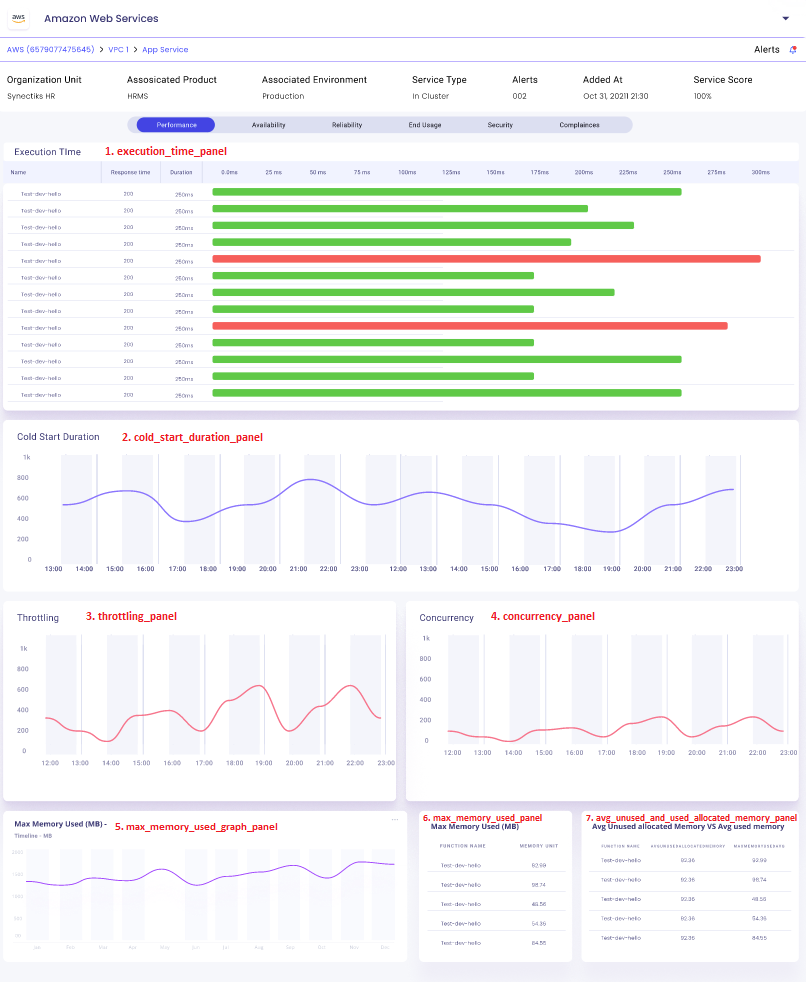
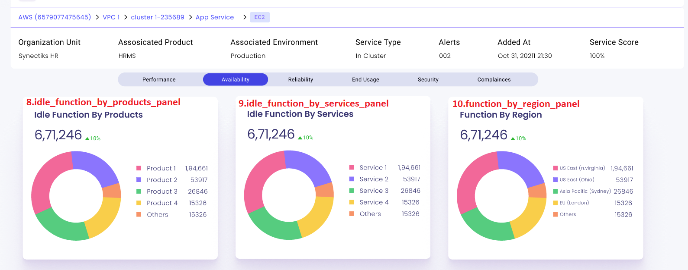

# Table of Contents

- [awsx-getelementdetails](#awsx-getelementdetails)
- [ui-analysis-and-listing-methods](#ui-analysis-and-listing-methods)
   - [execution_time_panel](#execution-time-panel)
   - [cold_start_duration_panel](#cold-start-duration-panel)
   - [throttling_panel](#throttling-panel)
   - [concurrency_panel](#concurrency-panel)
   - [max_memory_used_graph_panel](#max-memory-used-graph-panel)
   - [max_memory_used_panel](#max-memory-used-panel)
   - [avg_unused_and_used_allocated_memory_panel](#avg-unused-and-used-allocated-memory-panel)
   - [idle_functions_by_products_panel](#idle-functions-by-products-panel)
   - [idle_functions_by_services_panel](#idle-functions-by-services-panel)
   - [idle_functions_by_region_panel](#idle-functions-by-region-panel)
   - [dead_letter_errors_trends_panel](#dead-letter-errors-trends-panel)
   - [error_and_warning_events_panel](#error-and-warning-events-panel)
   - [throttling_trends_panel](#throttling-trends-panel)
   - [success_and_failed_function_panel](#success-and-failed-function-panel)
   - [error_messages_count_panel](#error-messages-count-panel)
   - [number_of_calls_panel](#number-of-calls-panel)
  - [invocation_trend_panel](#invocation-trend-panel)
  - [location_of_callers_panel](#location-of-callers-panel)
  - [function_caller_details_panel](#function-caller-details-panel)
  - [number_of_threats_and_severity_level_panel](#number-of-threats_and_severity_level_panel)
  

 
# awsx-getelementdetails
It implements the awsx plugin getElementDetails
 
# ui analysis and listing methods

1. execution_time_panel
2. cold_start_duration_panel
3. throttling_panel
4. concurrency_panel
5. max_memory_used_graph_panel
6. max_memory_used_panel
7. avg_unused_and_used_allocated_memory_panel
8. idle_functions_by_products_panel
9.  idle_functions_by_services_panel
10. idle_functions_by_region_panel
11. dead_letter_errors_trends_panel
12. error_and_warning_events_panel
13. throttling_trends_panel
14. success_and_failed_function_panel
15. error_messages_count_panel
16. number_of_calls_panel
17. invocation_trend_panel
18. location_of_callers_panel
19. function_caller_details_panel
20. number_of_threats_and_severity_level_panel

_
# ui-analysys-and listing-methods
## execution time panel

1. execution_time_panel

**called from subcommand**

go run awsx-getelementdetails.go  --vaultUrl=<afreenxxxx1309> --elementId=9387 --query="execution_time_panel" --elementType="Lambda" --responseType=json --startTime=2023-12-01T00:00:00Z --endTime=2023-12-02T23:59:59Z
 

**called from maincommand**

awsx --vaultUrl=<afreenxxxx1309> elementId=9387 --query="execution_time_panel" --elementType="Lambda" --responseType=json --startTime=2023-12-01T00:00:00Z --endTime=2023-12-02T23:59:59Z

**Called from API**

http://localhost:7000/awsx-api/getQueryOutput?vaultUrl=<afreenxxxx1309>&elementId=9387&elementType=Lambda&&query=execution_time_panel&responseType=json&startTime=2023-12-01T00:00:00Z&endTime=2023-12-02T23:59:59Z

**Desired Output in json / graph format:**
1 Execution Time

	-output in tablular  form

**Algorithm/ Pseudo Code**

**Algorithm:** 
- execution time panel - Write a custom cli for execution time data , where we shall write a program for finding actual execution time.

 **Pseudo Code:**  
 
 

# ui-analysys-and listing-methods
## cold start duration panel

2. cold_start_duration_panel

**called from subcommand**

go run awsx-getelementdetails.go  --vaultUrl=<afreenxxxx1309> --elementId=9387 --query="cold_start_duration_panel" --elementType="Lambda" --responseType=json --startTime=2023-12-01T00:00:00Z --endTime=2023-12-02T23:59:59Z

**called from maincommand**

awsx --zone=us-east-1 --vaultUrl=<afreenxxxx1309> --elementId=9387 --query="cold_start_duration_panel" --elementType="Lambda" --responseType=json --startTime=2023-12-01T00:00:00Z --endTime=2023-12-02T23:59:59Z

**Called from API**

http://localhost:7000/awsx-api/getQueryOutput?vaultUrl=<afreenxxxx1309>&elementId=9387&elementType=Lambda&query=cold_start_duration_panel&responseType=json&startTime=2023-12-01T00:00:00Z&endTime=2023-12-02T23:59:59Z

**Desired Output in json / graph format:**
2.  cold start duration 

   -graph form

**Algorithm/ Pseudo Code**

**Algorithm:** 
- cold start duration - Write a custom function  for lambda, where we shall write a program to find timeserires data for cold start duration.

 **Pseudo Code:** 

 
 
 # ui-analysys-and listing-methods
 ## throttling panel

3. throttling_panel 

**called from subcommand**

go run awsx-getelementdetails.go  --vaultUrl=<afreenxxxx1309> --elementId=9387 --query="throttling_panel" --elementType="Lambda" --responseType=json --startTime=2023-12-01T00:00:00Z --endTime=2023-12-02T23:59:59Z

 

**called from maincommand**

awsx --zone=us-east-1 --vaultUrl=<afreenxxxx1309> --elementId=9387 --query="throttling_panel" --elementType="Lambda" --responseType=frame --startTime=2023-12-01T00:00:00Z --endTime=2023-12-02T23:59:59Z

**Called from API**

http://localhost:7000/awsx-api/getQueryOutput?vaultUrl=<afreenxxxx1309>&elemetId=9387&elementType=Lambda&query=throttling_panel&responseType=json&startTime=2023-12-01T00:00:00Z&endTime=2023-12-02T23:59:59Z

**Desired Output in json / graph format:**
3.  throttling panel

   -graph form

**Algorithm/ Pseudo Code**

**Algorithm:** 
- throttling panel - Write a custom cli for throttling panel, where we shall write a program for finding timeseries data for throttling panel.

 **Pseudo Code:**  
 
 

 # ui-analysys-and listing-methods
 ## concurrency panel

4. concurrency_panel

**called from subcommand**

go run awsx-getelementdetails.go  --vaultUrl=<afreenxxxx1309> --elementId=9387 --query="concurrency_panel" --elementType="Lambda" --responseType=json --startTime=2023-12-01T00:00:00Z --endTime=2023-12-02T23:59:59Z

 

**called from maincommand**

awsx --zone=us-east-1 --vaultUrl=<afreenxxxx1309> --elementId=9387--query="concurrency_panel" --elementType="Lambda" --responseType=json --startTime=2023-12-01T00:00:00Z --endTime=2023-12-02T23:59:59Z

**Called from API**

http://localhost:7000/awsx-api/getQueryOutput?vaultUrl=<afreenxxxx1309>&elemetId=9387&elementType=Lambda&query=concurrency_panel&responseType=json&startTime=2023-12-01T00:00:00Z&endTime=2023-12-02T23:59:59Z

**Desired Output in json / graph format:**
4.concurrency_panel

    -graph form

**Algorithm/ Pseudo Code**

**Algorithm:** 
- concurrency panel - Write a custom cli for concurrency panel , where we shall write a program for finding timeseries data for concurrency.

 **Pseudo Code:**
 
 
# ui-analysys-and listing-methods
## max memory used graph panel

5. max_memory_used_graph_panel

**called from subcommand**

go run awsx-getelementdetails.go  --vaultUrl=<afreenxxxx1309> --elementId=9387 --query="max_memory_used_graph_panel" --elementType="Lambda" --responseType=json --startTime=2023-12-01T00:00:00Z --endTime=2023-12-02T23:59:59Z

 

**called from maincommand**

awsx --zone=us-east-1 --vaultUrl=<afreenxxxx1309> --elementId=9387--query="max_memory_used_graph_panel" --elementType="Lambda" --responseType=json --startTime=2023-12-01T00:00:00Z --endTime=2023-12-02T23:59:59Z

**Called from API**

http://localhost:7000/awsx-api/getQueryOutput?vaultUrl=<afreenxxxx1309>&elementId=9387&elementType=Lambda&query=max_memory_used_graph_panel&responseType=json&startTime=2023-12-01T00:00:00Z&endTime=2023-12-02T23:59:59Z

**Desired Output in json / graph format:**
5. max memory used graph 

	-graph form

**Algorithm/ Pseudo Code**

**Algorithm:** 
- max_memory_used_graph_panel  -Write a custom cli for max memory used graph , where we shall write a program for finding max memory used graph panel.

 **Pseudo Code:** 

 
# ui-analysys-and listing-methods
## max memory used panel

6. max_memory_used_panel

**called from subcommand**

go run awsx-getelementdetails.go  --vaultUrl=<afreenxxxx1309> --elementId=9387 --query="max_memory_used_panel" --elementType="Lambda" --responseType=json --startTime=2023-12-01T00:00:00Z --endTime=2023-12-02T23:59:59Z

**called from maincommand**

awsx --zone=us-east-1 --vaultUrl=<afreenxxxx1309> --elementId=9387 --query="max_memory_used_panel" --elementType="Lambda" --responseType=json --startTime=2023-12-01T00:00:00Z --endTime=2023-12-02T23:59:59Z

**Called from API**

http://localhost:7000/awsx-api/getQueryOutput?vaultUrl=<afreenxxxx1309>&elemntId=9387&elementType=Lambda&query=max_memory_used_panel&responseType=json&startTime=2023-12-01T00:00:00Z&endTime=2023-12-02T23:59:59Z

**Desired Output in json / graph format:**
6. max_memory_used_panel

	--tabular form

**Algorithm/ Pseudo Code**

**Algorithm:** 
- max memory used panel  -Write a custom cli for max memory used panel , where we shall write a program for finding max memory used panel.

 **Pseudo Code:** 

 
# ui-analysys-and listing-methods
## avg unused and used allocated memory panel

7. avg_unused_and_used_allocated_memory_panel

**called from subcommand**

go run awsx-getelementdetails.go  --vaultUrl=<afreenxxxx1309> --elementId=9387 --query="avg_unused_and_used_allocated_memory_panel" --elementType="Lambda" --responseType=json --startTime=2023-12-01T00:00:00Z --endTime=2023-12-02T23:59:59Z

 

**called from maincommand**

awsx --zone=us-east-1 --vaultUrl=<afreenxxxx1309> --elementId=9387 --query="avg_unused_and_used_allocated_memory_panel" --elementType="Lambda" --responseType=json --startTime=2023-12-01T00:00:00Z --endTime=2023-12-02T23:59:59Z

**Called from API**

http://localhost:7000/awsx-api/getQueryOutput?vaultUrl=<afreenxxxx1309>&elementId=9387&elementType=Lambda&query=avg_unused_and_used_allocated_memory_panel&responseType=json&startTime=2023-12-01T00:00:00Z&endTime=2023-12-02T23:59:59Z

**Desired Output in json / graph format:**
7. avg_unused_and_used_allocated_memory_panel

	-tabular form

**Algorithm/ Pseudo Code**

**Algorithm:** 
- avg_unused_and_used_allocated_memory_panel-Write a custom cli for avg unused and used allocated memory panel, where we shall write a program for finding avg of used and unused allocated memory.

 **Pseudo Code:** 
 
# ui-analysys-and listing-methods
## idle functions by products panel

8. idle_functions_by_products_panel

**called from subcommand**

go run awsx-getelementdetails.go  --vaultUrl=<afreenxxxx1309> --elementId=9387 --query="idle_functions_by_products_panel" --elementType="Lambda" --responseType=json --startTime=2023-12-01T00:00:00Z --endTime=2023-12-02T23:59:59Z

 

**called from maincommand**

awsx --zone=us-east-1 --vaultUrl=<afreenxxxx1309> --elementId=9387 --query="idle_functions_by_products_panel" --elementType="Lambda" --responseType=json --startTime=2023-12-01T00:00:00Z --endTime=2023-12-02T23:59:59Z

**Called from API**

http://localhost:7000/awsx-api/getQueryOutput?vaultUrl=<afreenxxxx1309>&elementId=9387&elementType=Lambda&query=idle_functions_by_products_panel&responseType=json&startTime=2023-12-01T00:00:00Z&endTime=2023-12-02T23:59:59Z 

**Desired Output in json / graph format:**
8. idle functions by products

	-Product1     1,94,661(poduct name and their count)

**Algorithm/ Pseudo Code**

**Algorithm:** 
- idle functions by products  -Write a custom cli for idle functions by products panel, where we shall write a program for finding idle functions by products.

 **Pseudo Code:** 
 
 
# ui-analysys-and listing-methods
##  idle_functions_by_services_panel

9. idle_functions_by_services_panel

**called from subcommand**

go run awsx-getelementdetails.go  --vaultUrl=<afreenxxxx1309> --elementId=9387 --query="idle_functions_by_services_panel" --elementType="Lambda" --responseType=json --startTime=2023-12-01T00:00:00Z --endTime=2023-12-02T23:59:59Z

 

**called from maincommand**

awsx --zone=us-east-1 --vaultUrl=<afreenxxxx1309> --elementId=9387 --query="idle_functions_by_services_panel" --elementType="Lambda" --responseType=json --startTime=2023-12-01T00:00:00Z --endTime=2023-12-02T23:59:59Z

**Called from API**

http://localhost:7000/awsx-api/getQueryOutput?vaultUrl=<afreenxxxx1309>&elementId=9387&elementType=Lambda&7&query=idle_functions_by_services_panel&responseType=jsonquery=idle_functions_by_products_panel&responseType=json&startTime=2023-12-01T00:00:00Z&endTime=2023-12-02T23:59:59Z

**Desired Output in json / graph format:**
9. idle_functions_by_services_panel

	-Service1     1,94,661(service name and their count)

**Algorithm/ Pseudo Code**

**Algorithm:** 
- idle_functions_by_services_panel  -Write a custom cli for idle functions by services panel, where we shall write a program for finding  idle functions by services panels.

 **Pseudo Code:** 
 
 

# ui-analysys-and listing-methods

##  idle functions by region panel

10. idle_functions_by_region_panel

**called from subcommand**

go run awsx-getelementdetails.go  --vaultUrl=<afreenxxxx1309> --elementId=9387 --query="idle_functions_by_region_panel" --elementType="Lambda" --responseType=json --startTime=2023-12-01T00:00:00Z --endTime=2023-12-02T23:59:59Z

 

**called from maincommand**

awsx --zone=us-east-1 --vaultUrl=<afreenxxxx1309> --elementId=9387 --query="idle_functions_by_region_panel" --elementType="Lambda" --responseType=json --startTime=2023-12-01T00:00:00Z --endTime=2023-12-02T23:59:59Z

**Called from API**

http://localhost:7000/awsx-api/getQueryOutput?vaultUrl=<afreenxxxx1309>&elementId=9387&elementType=Lambda&query=idle_functions_by_region_panel&responseType=json&responseType=json&startTime=2023-12-01T00:00:00Z&endTime=2023-12-02T23:59:59Z

**Desired Output in json / graph format:**
10. idle_functions_by_region_panel

	---US East(virginia)     1,94,661(region and their count)

**Algorithm/ Pseudo Code**

**Algorithm:** 
- -idle functions by region panel  -Write a custom cli foridle functions by region panel, where we shall write a program for finding  idle functions by region panel.

 **Pseudo Code:** 
 
# ui-analysys-and listing-methods
## dead letter errors trends panel

11. dead_letter_errors_trends_panel

**called from subcommand**

go run awsx-getelementdetails.go  --vaultUrl=<afreenxxxx1309> --elementId=9387 --query="dead_letter_errors_trends_panel" --elementType="Lambda" --responseType=json --startTime=2023-12-01T00:00:00Z --endTime=2023-12-02T23:59:59Z
 

**called from maincommand**

awsx --zone=us-east-1 --vaultUrl=<afreenxxxx1309> --elementId=9387 --query="dead_letter_errors_trends_panel" --elementType="Lambda" --responseType=json --startTime=2023-12-01T00:00:00Z --endTime=2023-12-02T23:59:59Z

**Called from API**

http://localhost:7000/awsx-api/getQueryOutput?vaultUrl=<afreenxxxx1309>&elementId=9387&elementType=Lambda&query=dead_letter_errors_trends_panel&responseType=json&startTime=2023-12-01T00:00:00Z&endTime=2023-12-02T23:59:59Z

**Desired Output in json / graph format:**
11. dead_letter_errors_trends_panel

	--graph form

**Algorithm/ Pseudo Code**

**Algorithm:** 
- idle functions by region panel  -Write a custom cli for idle functions by region panel, where we shall write a program for finding  idle functions by region panel.

 **Pseudo Code:** 
 
 
# ui-analysys-and listing-methods
##  error and warning events panel

12. error_and_warning_events_panel

**called from subcommand**

go run awsx-getelementdetails.go  --vaultUrl=<afreenxxxx1309> --elementId=9387 --query="error_and_warning_events_panel" --elementType="Lambda" --responseType=json --startTime=2023-12-01T00:00:00Z --endTime=2023-12-02T23:59:59Z

**called from maincommand**

awsx --zone=us-east-1 --vaultUrl=<afreenxxxx1309> --elementId=9387 --query="error_and_warning_events_panel" --elementType="Lambda" --responseType=json --startTime=2023-12-01T00:00:00Z --endTime=2023-12-02T23:59:59Z

**Called from API**

http://localhost:7000/awsx-api/getQueryOutput?vaultUrl=<afreenxxxx1309>&elementId=9387&elementType=Lambda&query=error_and_warning_events_panel&responseType=json&startTime=2023-12-01T00:00:00Z&endTime=2023-12-02T23:59:59Z 

**Desired Output in json / graph format:**
12. error_and_warning_events_panel

	-graph form

**Algorithm/ Pseudo Code**

**Algorithm:** 
- error and warning events panel  -Write a custom cli for error and warning events panel, where we shall write a program for finding timeseries data for  error and warning events panel.

 **Pseudo Code:**  
 
 
 
# ui-analysys-and listing-methods
##  throttling trends panel

13. throttling_trends_panel

**called from subcommand**

go run awsx-getelementdetails.go  --vaultUrl=<afreenxxxx1309> --elementId=9387 --query="throttling_trends_panel" --elementType="Lambda" --responseType=json --startTime=2023-12-01T00:00:00Z --endTime=2023-12-02T23:59:59Z

 

**called from maincommand**

awsx --zone=us-east-1 --vaultUrl=<afreenxxxx1309> --elementId=9387 --query="throttling_trends_panel" --elementType="Lambda" --responseType=json --startTime=2023-12-01T00:00:00Z --endTime=2023-12-02T23:59:59Z

**Called from API**

http://localhost:7000/awsx-api/getQueryOutput?vaultUrl=<afreenxxxx1309>&elementId=9387&elementType=Lambda&query=throttling_trends_panel&responseType=json&startTime=2023-12-01T00:00:00Z&endTime=2023-12-02T23:59:59Z

**Desired Output in json / graph format:**
13.throttling_trends_panel

	-graph form

**Algorithm/ Pseudo Code**

**Algorithm:** 
- throttling trends panel  -Write a custom cli for throttling trends panel, where we shall write a program for finding  throttling trends panel.

 **Pseudo Code:**  
 

# ui-analysys-and listing-methods
##  success and failed function panel

14. success_and_failed_function_panel

**called from subcommand**

go run awsx-getelementdetails.go  --vaultUrl=<afreenxxxx1309> --elementId=9387 --query="success_and_failed_function_panel" --elementType="Lambda" --responseType=json --startTime=2023-12-01T00:00:00Z --endTime=2023-12-02T23:59:59Z

 

**called from maincommand**

awsx --zone=us-east-1 --vaultUrl=<afreenxxxx1309> --elementId=9387 --query="success_and_failed_function_panel" --elementType="Lambda" --responseType=json --startTime=2023-12-01T00:00:00Z --endTime=2023-12-02T23:59:59Z

**Called from API**

http://localhost:7000/awsx-api/getQueryOutput?vaultUrl=<afreenxxxx1309>&elementId=9387&elementType=Lambda&query=success_and_failed_function_panel&responseType=json&startTime=2023-12-01T00:00:00Z&endTime=2023-12-02T23:59:59Z

**Desired Output in json / graph format:**
14. success and failed function

    -success&Failed

**Algorithm/ Pseudo Code**

**Algorithm:** 
- success and failed function -Write a custom cli for success and failed function panel, where we shall write a program for finding  success and failed function.

 **Pseudo Code:**  
 
 
# ui-analysys-and listing-methods
##  error messages count panel

15. error_messages_count_panel

**called from subcommand**

go run awsx-getelementdetails.go  --vaultUrl=<afreenxxxx1309> --elementId=9387 --query="error_messages_count_panel" --elementType="Lambda" --responseType=json --startTime=2023-12-01T00:00:00Z --endTime=2023-12-02T23:59:59Z

 

**called from maincommand**

awsx --zone=us-east-1 --vaultUrl=<afreenxxxx1309> --elementId=9387 --query="error_messages_count_panel" --elementType="Lambda" --responseType=json --startTime=2023-12-01T00:00:00Z --endTime=2023-12-02T23:59:59Z

**Called from API**

http://localhost:7000/awsx-api/getQueryOutput?vaultUrl=<afreenxxxx1309>&elementId=9387&elementType=Lambda&query=error_messages_count_panel&responseType=json&startTime=2023-12-01T00:00:00Z&endTime=2023-12-02T23:59:59Z 

**Desired Output in json / graph format:**
15. error messages count

	-graph form
	

**Algorithm/ Pseudo Code**

**Algorithm:** 
- error messages count  -Write a custom cli for  error messages count panel, where we shall write a program for finding  error messages count.

 **Pseudo Code:**  
 
# ui-analysys-and listing-methods
##  number of calls panel

16. number_of_calls_panel

**called from subcommand**

go run awsx-getelementdetails.go  --vaultUrl=<afreenxxxx1309> --elementId=9387 --query="number_of_calls_panel" --elementType="Lambda" --responseType=json --startTime=2023-12-01T00:00:00Z --endTime=2023-12-02T23:59:59Z
 

**called from maincommand**

awsx --zone=us-east-1 --vaultUrl=<afreenxxxx1309> --elementId=9387 --query="number_of_calls_panel" --elementType="Lambda" --responseType=json --startTime=2023-12-01T00:00:00Z --endTime=2023-12-02T23:59:59Z

**Called from API**

http://localhost:7000/awsx-api/getQueryOutput?vaultUrl=<afreenxxxx1309>&elementId=9387&elementType=Lambda&query=number_of_calls_panel&responseType=json&startTime=2023-12-01T00:00:00Z&endTime=2023-12-02T23:59:59Z  

**Desired Output in json / graph format:**
16. net received panel  

-graph form
	  

**Algorithm/ Pseudo Code**

**Algorithm:** 
- number of calls panel -Write a custom cli for number of calls panel, where we shall write a program for finding timeseries data for  number of calls panel.

 **Pseudo Code:**  
 
 
# ui-analysys-and listing-methods
##  invocation trend panel

17. invocation_trend_panel

**called from subcommand**

go run awsx-getelementdetails.go  --vaultUrl=<afreenxxxx1309> --elementId=9387 --query="invocation_trend_panel" --elementType="Lambda" --responseType=json --startTime=2023-12-01T00:00:00Z --endTime=2023-12-02T23:59:59Z

**called from maincommand**

awsx --zone=us-east-1 --vaultUrl=<afreenxxxx1309> --elementId=9387 --query="invocation_trend_panel" --elementType="Lambda" --responseType=json --startTime=2023-12-01T00:00:00Z --endTime=2023-12-02T23:59:59Z

**Called from API**

http://localhost:7000/awsx-api/getQueryOutput?vaultUrl=<afreenxxxx1309>&elementId=9387&elementType=Lambda&query=invocation_trend_panel&responseType=json&startTime=2023-12-01T00:00:00Z&endTime=2023-12-02T23:59:59Z  

**Desired Output in json / graph format:**
17. invocation trend panel

	-graph form
	

**Algorithm/ Pseudo Code**

**Algorithm:** 
- invocation trend panel -Write a custom cli for invocation trend panel, where we shall write a program for finding  timeseries data for invocation trend panel.

 **Pseudo Code:**  
 
# ui-analysys-and listing-methods
##  location of callers panel

18. location_of_callers_panel

**called from subcommand**

go run awsx-getelementdetails.go  --vaultUrl=<afreenxxxx1309> --elementId=9387 --query="location_of_callers_panel" --elementType="Lambda" --responseType=json --startTime=2023-12-01T00:00:00Z --endTime=2023-12-02T23:59:59Z

 

**called from maincommand**

awsx --zone=us-east-1 --vaultUrl=<afreenxxxx1309> --elementId=9387 --query="location_of_callers_panel" --elementType="Lambda" --responseType=json --startTime=2023-12-01T00:00:00Z --endTime=2023-12-02T23:59:59Z

**Called from API**

http://localhost:7000/awsx-api/getQueryOutput?vaultUrl=<afreenxxxx1309>&elementId=9387&elementType=Lambda&query=location_of_callers_panel&responseType=json&startTime=2023-12-01T00:00:00Z&endTime=2023-12-02T23:59:59Z 

**Desired Output in json / graph format:**
18. location_of_callers_panel

	--count
	

**Algorithm/ Pseudo Code**

**Algorithm:** 
- location of callers panel  -Write a custom cli for  location of callers panel, where we shall write a program for finding  location of callers panel.

 **Pseudo Code:**  
 
# ui-analysys-and listing-methods
##  function caller details panel

19. function_caller_details_panel

**called from subcommand**

go run awsx-getelementdetails.go  --vaultUrl=<afreenxxxx1309> --elementId=9387 --query="function_caller_details_panel" --elementType="Lambda" --responseType=json --startTime=2023-12-01T00:00:00Z --endTime=2023-12-02T23:59:59Z

**called from maincommand**

awsx --zone=us-east-1 --vaultUrl=<afreenxxxx1309> --elementId=9387 --query="function_caller_details_panel" --elementType="Lambda" --responseType=json --startTime=2023-12-01T00:00:00Z --endTime=2023-12-02T23:59:59Z

**Called from API**

http://localhost:7000/awsx-api/getQueryOutput?vaultUrl=<afreenxxxx1309>&elementId=9387&elementType=Lambda&query=function_caller_details_panel&responseType=json&startTime=2023-12-01T00:00:00Z&endTime=2023-12-02T23:59:59Z 

**Desired Output in json / graph format:**
19. function_caller_details_panel

	--tabular form
	

**Algorithm/ Pseudo Code**

**Algorithm:** 
- function caller details panel  --Write a custom cli for  function caller details panel, where we shall write a program for finding  function caller details panel.

 **Pseudo Code:**  

# ui-analysys-and listing-methods
##  number of threats and severity level panel

20. number_of_threats_and_severity_level_panel

**called from subcommand**

go run awsx-getelementdetails.go  --vaultUrl=<afreenxxxx1309> --elementId=9387 --query="number_of_threats_and_severity_level_panel" --elementType="Lambda" --responseType=json --startTime=2023-12-01T00:00:00Z --endTime=2023-12-02T23:59:59Z

**called from maincommand**

awsx --zone=us-east-1 --vaultUrl=<afreenxxxx1309> --elementId=9387 --query="number_of_threats_and_severity_level_panel" --elementType="Lambda" --responseType=json --startTime=2023-12-01T00:00:00Z --endTime=2023-12-02T23:59:59Z

**Called from API**

http://localhost:7000/awsx-api/getQueryOutput?vaultUrl=<afreenxxxx1309>&elementId=9387&elementType=Lambda&query=number_of_threats_and_severity_level_panel&responseType=json&startTime=2023-12-01T00:00:00Z&endTime=2023-12-02T23:59:59Z 

**Desired Output in json / graph format:**
20. number_of_threats_and_severity_level_panel

	--calculate count in high,medium and low
	

**Algorithm/ Pseudo Code**

**Algorithm:** 
- number of threats and severity level panel  --Write a custom cli for  number of threats and severity level panel, where we shall write a program for finding  number of threats and severity level panel.

 **Pseudo Code:**  

 

 

