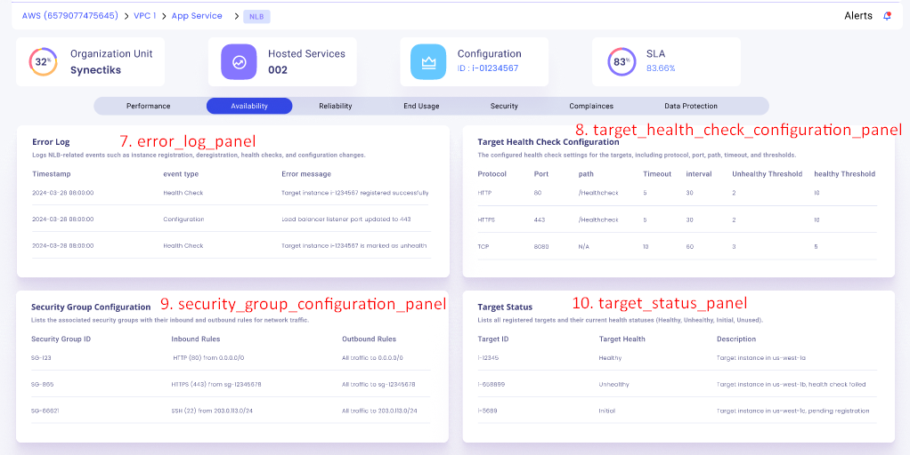
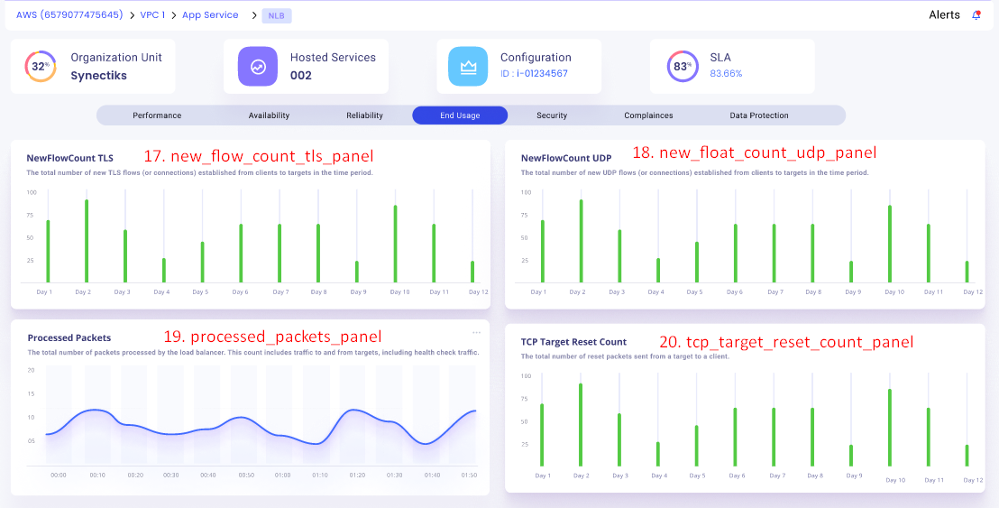

# Table of Contents

- [awsx-getelementdetails](#awsx-getelementdetails)
- [ui-analysis-and-listing-methods](#ui-analysis-and-listing-methods)
   - [active_connections_panel](#active-connections-panel)
   - [new_connections_panel](#new-connections-panel)
   - [processed_bytes_panel](#processed-bytes-panel)
   - [healthy_host_count_panel](#healthy-host-count-panel)
   - [unhealthy_host_count_panel](#unhealthy-host-count-panel)
   - [ssl_tls_negotiation_time_panel](#ssl-tls-negotiation-time-panel)
   - [error_log_panel](#error-log-panel)
   - [target_health_check_configuration_panel](#target-health-check-configuration-panel)
   - [security_group_configuration_panel](#security-group-configuration-panel)
   - [target_status_panel](#target-status-panel)
   - [connection_errors_panel](#connection-errors-panel)
   - [target_deregistrations_panel](#target-deregistrations-panel)
   - [target_tls_negotiation_error_count_panel](#target-tls-negotiation-error-count-panel)
   - [target_health_check_panel](#target-health-check-panel)
   - [availability_zone_failure_panel](#availability-zone-failure-panel)
   - [port_allocation_error_count_panel](#port-allocation-error-count-panel)
   - [new_flow_count_tls_panel](#new-flow-count-tls-panel)
   - [new_flow_count_udp_panel](#new-flow-count-udp-panel)
   - [processed_packets_panel](#processed-packets-panel)
   - [tcp_target_reset_count_panel](#tcp-target-reset-count-panel)

- [List of Subcommands and Options for NLB](#list-of-subcommands-and-options-for-nlb)


# awsx-getelementdetails
It implements the awsx plugin getElementDetails.

# ui analysis and listing methods


 1. active_connections_panel
 2. new_connections_panel
 3. processed_bytes_panel
 4. healthy_host_count_panel
 5. unhealthy_host_count_panel
 6. ssl_tls_negotiation_time_panel
 7. error_log_panel
 8. target_health_check_configuration_panel
 9. security_group_configuration_panel
10. target_status_panel
11. connection_errors_panel
12. target_deregistrations_panel
13. target_tls_negotiation_error_count_panel
14. target_health_check_panel
15. availability_zone_failure_panel
16. port_allocation_error_count_panel
17. new_flow_count_tls_panel
18. new_flow_count_udp_panel
19. processed_packets_panel
20. tcp_target_reset_count_panel


## Algorithm for Metric-Based Panels

1. **Define a command to fetch metrics.**
2. **On command execution:**
   - Authenticate the command.
   - If authentication fails:
     - Print error and return.
   - Retrieve response type from command flags.
   - Call function to fetch metrics data.
   - If error occurs:
     - Print error and return.
   - Format and print the response based on response type.
3. **Define function to fetch metrics data:**
   - Get element type and instance ID from command flags.
   - Parse start time and end time from command flags.
   - If error in parsing times:
     - Return error.
   - Get instance ID using CMDB data.
   - If error in getting instance ID:
     - Return error.
   - Initialize metric data map.
   - Get metric data and store in metric data map if available.
   - Create JSON output map with metric data values.
   - Marshal JSON output to JSON string.
   - If error occurs:
     - Return error.
   - Return JSON string and metric data.
4. **Initialize command flags.**

## Algorithm for Log-Based Panels

1. **Define a command to fetch logs data.**
2. **On command execution:**
   - Authenticate the command.
   - If authentication fails:
     - Print error and return.
   - Retrieve response type from command flags.
   - Call function to fetch logs data.
   - If error occurs:
     - Print error and return.
   - Format and print the response based on response type.
3. **Define function to fetch logs data:**
   - Get log group name from command flags.
   - Parse start and end times from command flags.
   - If error in parsing times:
     - Return error.
   - Get log group name using CMDB data.
   - If error in getting log group name:
     - Return error.
   - Construct CloudWatch query and fetch data.
   - If error occurs:
     - Return error.
   - Process fetched results.
   - Return processed results and nil for error.
4. **Initialize command flags.**


## Pseudo code for Metric-Based Panels

```pseudo
COMMAND fetch_metrics

ON EXECUTION:
    // Step 1: Authenticate the command
    IF NOT authenticate_command():
        PRINT "Authentication Error"
        RETURN

    // Step 2: Retrieve response type from command flags
    response_type = get_flag("response_type")

    // Step 3: Call function to fetch metrics data
    metrics_data, error = fetch_metrics_data()
    IF error:
        PRINT error
        RETURN

    // Step 4: Format and print the response based on response type
    formatted_response = format_response(metrics_data, response_type)
    PRINT formatted_response

//FUNCTION TO FETCH METRICS DATA
FUNCTION fetch_metrics_data():
    // Step 1: Get element type and instance ID from command flags
    element_type = get_flag("element_type")
    instance_id = get_flag("instance_id")

    // Step 2: Parse start time and end time from command flags
    start_time, end_time, time_error = parse_times(get_flag("start_time"), get_flag("end_time"))
    IF time_error:
        RETURN NULL, "Time Parsing Error"

    // Step 3: Get instance ID using CMDB data
    cmdb_instance_id, cmdb_error = get_cmdb_instance_id(instance_id)
    IF cmdb_error:
        RETURN NULL, "CMDB Instance ID Error"

    // Step 4: Initialize metric data map
    metric_data_map = {}

    // Step 5: Get metric data and store in metric data map if available
    metric_data, metric_error = get_metric_data(element_type, cmdb_instance_id, start_time, end_time)
    IF metric_error:
        RETURN NULL, "Metric Data Error"

    // Step 6: Create JSON output map with metric data values
    json_output_map = { "metrics": metric_data }

    // Step 7: Marshal JSON output to JSON string
    json_string, marshal_error = marshal_json(json_output_map)
    IF marshal_error:
        RETURN NULL, "JSON Marshalling Error"
    RETURN json_string, NULL

// Function to parse times from flags
FUNCTION parse_times(start_time_flag, end_time_flag):
    TRY:
        parsed_start_time = parse_time(start_time_flag)
        parsed_end_time = parse_time(end_time_flag)
    EXCEPT:
        RETURN NULL, NULL, "Time Parsing Error"
    RETURN parsed_start_time, parsed_end_time, NULL

// Function to authenticate the command
FUNCTION authenticate_command():
    // Dummy authentication logic
    IF command_has_valid_token():
        RETURN TRUE
    ELSE:
        RETURN FALSE
// Function to get a flag value
FUNCTION get_flag(flag_name):
    // Retrieve flag value from command input
    RETURN command_flags[flag_name]

// Function to get CMDB instance ID
FUNCTION get_cmdb_instance_id(instance_id):
    // Simulate CMDB lookup
    IF instance_id in CMDB:
        RETURN CMDB[instance_id], NULL
    ELSE:
        RETURN NULL, "CMDB Instance ID Error"

// Function to get metric data
FUNCTION get_metric_data(element_type, cmdb_instance_id, start_time, end_time):
    // Simulate fetching metrics from a data source
    metric_data = fetch_from_data_source(element_type, cmdb_instance_id, start_time, end_time)
    IF metric_data IS EMPTY:
        RETURN NULL, "Metric Data Error"
    RETURN metric_data, NULL

// Function to create JSON output map with metric data values
FUNCTION create_json_output_map(metric_data):
    // Create and return the JSON output map
    RETURN { "metrics": metric_data }

// Function to marshal JSON output to JSON string
FUNCTION marshal_json(json_output_map):
    TRY:
        json_string = json_encode(json_output_map)
    EXCEPT:
        RETURN NULL, "JSON Marshalling Error"
    RETURN json_string, NULL

// Function to format response based on response type
FUNCTION format_response(data, response_type):
    // Format the data based on the response type
    IF response_type == "json":
        RETURN data
    ELSE IF response_type == "text":
        RETURN convert_json_to_text(data)
    ELSE:
        RETURN "Unknown response type"

// Initialize command flags
COMMAND_FLAGS:
    response_type: STRING
    element_type: STRING
    instance_id: STRING
    start_time: STRING
    end_time: STRING
```


## Pseudo code to Fetch Logs Data

```pseudo
COMMAND fetch_logs

ON EXECUTION:
    // Step 1: Authenticate the command
    IF NOT authenticate_command():
        PRINT "Authentication Error"
        RETURN

    // Step 2: Retrieve response type from command flags
    response_type = get_flag("response_type")

    // Step 3: Call function to fetch logs data
    logs_data, error = fetch_logs_data()
    IF error:
        PRINT error
        RETURN

    // Step 4: Format and print the response based on response type
    formatted_response = format_response(logs_data, response_type)
    PRINT formatted_response

//FUNCTION TO FETCH LOGS DATA:
FUNCTION fetch_logs_data():
    // Step 1: Get log group name from command flags
    log_group_name = get_flag("log_group_name")

    // Step 2: Parse start and end times from command flags
    start_time, end_time, time_error = parse_times(get_flag("start_time"), get_flag("end_time"))
    IF time_error:
        RETURN NULL, "Time Parsing Error"

    // Step 3: Get log group name using CMDB data
    cmdb_log_group_name, cmdb_error = get_cmdb_log_group_name(log_group_name)
    IF cmdb_error:
        RETURN NULL, "CMDB Log Group Name Error"

    // Step 4: Construct CloudWatch query and fetch data
    cloudwatch_query = construct_cloudwatch_query(cmdb_log_group_name, start_time, end_time)
    log_data, query_error = execute_cloudwatch_query(cloudwatch_query)
    IF query_error:
        RETURN NULL, "CloudWatch Query Error"

    // Step 5: Process fetched results
    processed_results = process_log_data(log_data)

    RETURN processed_results, NULL

// Function to parse times from flags
FUNCTION parse_times(start_time_flag, end_time_flag):
    // Assume some parsing logic here
    IF parsing_fails:
        RETURN NULL, NULL, "Time Parsing Error"
    RETURN parsed_start_time, parsed_end_time, NULL

// Function to authenticate the command
FUNCTION authenticate_command():
    // Assume some authentication logic here
    RETURN authentication_status

// Function to get a flag value
FUNCTION get_flag(flag_name):
    // Assume logic to retrieve flag value
    RETURN flag_value

// Function to get CMDB log group name
FUNCTION get_cmdb_log_group_name(log_group_name):
    // Assume logic to get log group name from CMDB
    IF cmdb_lookup_fails:
        RETURN NULL, "CMDB Log Group Name Error"
    RETURN cmdb_log_group_name, NULL

// Function to construct CloudWatch query
FUNCTION construct_cloudwatch_query(cmdb_log_group_name, start_time, end_time):
    // Assume logic to construct CloudWatch query
    RETURN cloudwatch_query

// Function to execute CloudWatch query
FUNCTION execute_cloudwatch_query(cloudwatch_query):
    // Assume logic to execute query
    IF query_fails:
        RETURN NULL, "CloudWatch Query Error"
    RETURN log_data, NULL

// Function to process log data
FUNCTION process_log_data(log_data):
    // Assume logic to process log data
    RETURN processed_results

// Function to format response based on response type
FUNCTION format_response(data, response_type):
    // Assume logic to format response
    RETURN formatted_response

// Initialize command flags
COMMAND_FLAGS:
    response_type: STRING
    log_group_name: STRING
    start_time: STRING
    end_time: STRING
```

# ui-analysys-and listing-methods
## Active Connections Panel


1. active_connections_panel

**called from subcommand**
```shell
go run awsx-getelementdetails.go  --vaultUrl=<afreenxxxx1309> --elementId=14933 --query="active_connections_panel" --elementType="NLB" --responseType=frame --startTime=2023-12-01T00:00:00Z --endTime=2023-12-02T23:59:59Z
```

**called from maincommand**
```shell
awsx --vaultUrl=<afreenxxxx1309> --elementId=14933 --query="active_connections_panel" --elementType="NLB" --responseType=frame --startTime=2023-12-01T00:00:00Z --endTime=2023-12-02T23:59:59Z
```

**Called from API**

[http://localhost:7000/awsx-api/getQueryOutput?vaultUrl=<afreenxxxx1309>&elementType=NLB&elementId=14933&query=active_connections_panel&responseType=frame&startTime=2023-12-01T00:00:00Z&endTime=2023-12-02T23:59:59Z](http://localhost:7000/awsx-api/getQueryOutput?vaultUrl=<afreenxxxx1309>&elementType=NLB&elementId=14933&query=active_connections_panel&responseType=frame&startTime=2023-12-01T00:00:00Z&endTime=2023-12-02T23:59:59Z)

**Desired Output in json / graph format:**
1. Active Connection Panel

```json


```

**Algorithm/ Pseudo Code**

**Algorithm:** 
- Active Connections Panel - Displays the number of active connections currently handled by the NLB.

1. Initialize an active_connections counter to 0.
2. Iterate through the NLB metrics data.
3. For each data point with the metric "active_connections", increase the counter by the value.
4. Display the active_connections counter.

 **Pseudo Code:** 
 ```
 Initialize active_connections to 0

For each NLB metric data point:
    If metric is active_connections:
        Update active_connections with the data point value

Display active_connections
 ```

# ui-analysys-and listing-methods
## New Connections Panel


2. new_connections_panel 

**called from subcommand**
```
go run awsx-getelementdetails.go  --vaultUrl=<afreenXXXXXXX1309> --elementId=14933 --query="new_connections_panel" --elementType="NLB" --responseType=frame --startTime=2023-12-01T00:00:00Z --endTime=2023-12-02T23:59:59Z
```

**called from maincommand**
```
awsx --vaultUrl=<afreenXXXXXXX1309> --elementId=14933 --query="new_connections_panel" --elementType="NLB" --responseType=frame --startTime=2023-12-01T00:00:00Z --endTime=2023-12-02T23:59:59Z
```

**Called from API**

[http://localhost:7000/awsx-api/getQueryOutput?vaultUrl=<afreen1309XXX>&elementType=NLB&elementId=14933&query=new_connections_panel&responseType=frame&startTime=2023-12-01T00:00:00Z&endTime=2023-12-02T23:59:59Z](http://localhost:7000/awsx-api/getQueryOutput?vaultUrl=<afreen1309XXX>&elementType=NLB&elementId=14933&query=new_connections_panel&responseType=frame&startTime=2023-12-01T00:00:00Z&endTime=2023-12-02T23:59:59Z)

**Desired Output in json / graph format:**
2.  New Connections Panel
```json


```

**Algorithm/ Pseudo Code**

**Algorithm:** 
- New Connections Panel - Shows the rate of new connections established per second.
1. Initialize a new_connections counter to 0.
2. Iterate through the NLB metrics data.
3. For each data point with the metric "new_connections", increase the counter by the value.
4. Display the new_connections counter.

 **Pseudo Code:** 
```
Initialize new_connections to 0

For each NLB metric data point:
    If metric is new_connections:
        Update new_connections with the data point value

Display new_connections
```

# ui-analysys-and listing-methods
## Processed Bytes Panel


3. processed_bytes_panel 

**called from subcommand**
```shell
go run awsx-getelementdetails.go  --vaultUrl=<afreenXXXXXXX1309> --elementId=14933 --query="processed_bytes_panel" --elementType="NLB" --responseType=frame --startTime=2023-12-01T00:00:00Z --endTime=2023-12-02T23:59:59Z
```

**called from maincommand**
```shell
awsx --vaultUrl=<afreenXXXXXXX1309> --elementId=14933 --query="processed_bytes_panel" --elementType="NLB" --responseType=frame --startTime=2023-12-01T00:00:00Z --endTime=2023-12-02T23:59:59Z
```

**Called from API**

[http://localhost:7000/awsx-api/getQueryOutput?vaultUrl=<afreen1309XXX>&elementType=NLB&elementId=14933&query=processed_bytes_panel&responseType=frame&startTime=2023-12-01T00:00:00Z&endTime=2023-12-02T23:59:59Z](http://localhost:7000/awsx-api/getQueryOutput?vaultUrl=<afreen1309XXX>&elementType=NLB&elementId=14933&query=processed_bytes_panel&responseType=frame&startTime=2023-12-01T00:00:00Z&endTime=2023-12-02T23:59:59

**Desired Output in json / graph format:**
3.  Processed Bytes Panel
```json


```

**Algorithm/ Pseudo Code**

**Algorithm:** 
- Processed Bytes Panel - Displays the rate at which bytes are processed by the NLB per second.
1. Initialize a processed_bytes counter to 0.
2. Iterate through the NLB metrics data.
3. For each data point with the metric "processed_bytes", increase the counter by the value.
4. Display the processed_bytes counter.

 **Pseudo Code:** 
```
Initialize processed_bytes to 0

For each NLB metric data point:
    If metric is processed_bytes:
        Update processed_bytes with the data point value

Display processed_bytes
```
# ui-analysys-and listing-methods
## Healthy Host Count Panel


4. healthy_host_count_panel

**called from subcommand**
```shell
go run awsx-getelementdetails.go  --vaultUrl=<afreenxxxx1309> --elementId=14933 --query="healthy_host_count_panel" --elementType="NLB" --responseType=frame --startTime=2023-12-01T00:00:00Z --endTime=2023-12-02T23:59:59Z
```

**called from maincommand**
```shell
awsx --vaultUrl=<afreenxxxx1309> --elementId=14933 --query="healthy_host_count_panel" --elementType="NLB" --responseType=frame --startTime=2023-12-01T00:00:00Z --endTime=2023-12-02T23:59:59Z
```

**Called from API**

[http://localhost:7000/awsx-api/getQueryOutput?vaultUrl=<afreenxxxx1309>&elementType=NLB&elementId=14933&query=healthy_host_count_panel&responseType=frame&startTime=2023-12-01T00:00:00Z&endTime=2023-12-02T23:59:59Z](http://localhost:7000/awsx-api/getQueryOutput?vaultUrl=<afreenxxxx1309>&elementType=NLB&elementId=14933&query=healthy_host_count_panel&responseType=frame&startTime=2023-12-01T00:00:00Z&endTime=2023-12-02T23:59:59Z)

**Desired Output in json / graph format:**
4. healthy_host_count_panel
```json


```

**Algorithm/ Pseudo Code**
**Algorithm:** 
- healthy host count - Displays the number of healthy backend targets registered with the NLB.
1. Initialize a healthy_host_count counter to 0.
2. Iterate through the NLB metrics data.
3. For each data point with the metric "healthy_host_count", increase the counter by the value.
4. Display the healthy_host_count counter.

 **Pseudo Code:** 
 ```
Initialize healthy_host_count to 0

For each NLB metric data point:
    If metric is healthy_host_count:
        Update healthy_host_count with the data point value

Display healthy_host_count
```
# ui-analysys-and listing-methods
## Unhealthy Host Count Panel


5. unhealthy_host_count_panel 

**called from subcommand**
```shell
go run awsx-getelementdetails.go  --vaultUrl=<afreenxxxx1309> --elementId=15281 --query="unhealthy_host_count_panel" --elementType="NLB" --responseType=frame --startTime=2023-12-01T00:00:00Z --endTime=2023-12-02T23:59:59Z
```
 
**called from maincommand**
```shell
awsx --vaultUrl=<afreenxxxx1309> --elementId=15281 --query="unhealthy_host_count_panel" --elementType="NLB" --responseType=frame --startTime=2023-12-01T00:00:00Z --endTime=2023-12-02T23:59:59Z
```

**Called from API**

[http://localhost:7000/awsx-api/getQueryOutput?vaultUrl=<afreenxxxx1309>&elementType=AWS/NLB&elementId=15281&query=unhealthy_host_count_panel&responseType=frame&startTime=2023-12-01T00:00:00Z&endTime=2023-12-02T23:59:59Z](http://localhost:7000/awsx-api/getQueryOutput?vaultUrl=<afreenxxxx1309>&elementType=AWS/NLB&elementId=15281&query=unhealthy_host_count_panel&responseType=frame&startTime=2023-12-01T00:00:00Z&endTime=2023-12-02T23:59:59Z)

**Desired Output in json / graph format:**
5. Unhealthy Host Count Panel
```json


```
**Algorithm/ Pseudo Code**

**Algorithm:** 
- Unhealthy Host Count Panel - Shows the number of unhealthy backend targets registered with the NLB.
1. Initialize an unhealthy_host_count counter to 0.
2. Iterate through the NLB metrics data.
3. For each data point with the metric "unhealthy_host_count", increase the counter by the value.
4. Display the unhealthy_host_count counter.

 **Pseudo Code:**
 ```
Initialize unhealthy_host_count to 0

For each NLB metric data point:
    If metric is unhealthy_host_count:
        Update unhealthy_host_count with the data point value

Display unhealthy_host_count
```

# ui-analysys-and listing-methods
## SSL TLS Negotiation Time Panel


6. ssl_tls_negotiation_time_panel

**called from subcommand**
```shell
go run awsx-getelementdetails.go  --vaultUrl=<afreenxxxx1309> --elementId=14933 --query="ssl_tls_negotiation_time_panel" --elementType="NLB" --responseType=frame --startTime=2023-12-01T00:00:00Z --endTime=2023-12-02T23:59:59Z
```

**called from maincommand**
```shell
awsx --vaultUrl=<afreenxxxx1309> --elementId=14933 --query="ssl_tls_negotiation_time_panel" --elementType="NLB" --responseType=frame --startTime=2023-12-01T00:00:00Z --endTime=2023-12-02T23:59:59Z
```

**Called from API**

[http://localhost:7000/awsx-api/getQueryOutput?vaultUrl=<afreenxxxx1309>&elementType=NLB&elementId=14933&query=ssl_tls_negotiation_time_panel&responseType=frame&startTime=2023-12-01T00:00:00Z&endTime=2023-12-02T23:59:59Z](http://localhost:7000/awsx-api/getQueryOutput?vaultUrl=<afreenxxxx1309>&elementType=NLB&elementId=14933&query=ssl_tls_negotiation_time_panel&responseType=frame&startTime=2023-12-01T00:00:00Z&endTime=2023-12-02T23:59:59Z)


**Desired Output in json / graph format:**
6. ssl_tls_negotiation_time_panel
```json


```

**Algorithm/ Pseudo Code**

**Algorithm:** 
- SSL/TLS Negotiation Time - Displays the average time taken for SSL/TLS negotiation between the NLB and clients.

1. Initialize an ssl_or_tls_negotiation_time counter to 0.
2. Iterate through the NLB metrics data.
3. For each data point with the metric "ssl_or_tls_negotiation_time", increase the counter by the value.
4. Divide the ssl_or_tls_negotiation_time counter by the number of data points.
5. Display the ssl_or_tls_negotiation_time counter.

 **Pseudo Code:** 
 ```
Initialize ssl_or_tls_negotiation_time to 0
Initialize data_point_count to 0

For each NLB metric data point:
    If metric is ssl_or_tls_negotiation_time:
        Update ssl_or_tls_negotiation_time with the data point value
        Increment data_point_count by 1

Display ssl_or_tls_negotiation_time / data_point_count
```
# ui-analysys-and listing-methods
## Error Log Panel



7. error_log_panel 

**called from subcommand**
```shell
go run awsx-getelementdetails.go  --vaultUrl=<afreenxxxx1309> --elementId=15281 --query="error_log_panel" --elementType="NLB" --responseType=json --startTime=2023-12-01T00:00:00Z --endTime=2023-12-02T23:59:59Z
```
 
**called from maincommand**
```shell
awsx --vaultUrl=<afreenxxxx1309> --elementId=15281 --query="error_log_panel" --elementType="NLB" --responseType=json --startTime=2023-12-01T00:00:00Z --endTime=2023-12-02T23:59:59Z
```

**Called from API**

[http://localhost:7000/awsx-api/getQueryOutput?vaultUrl=<afreenxxxx1309>&elementType=AWS/NLB&elementId=15281&query=error_log_panel&responseType=json&startTime=2023-12-01T00:00:00Z&endTime=2023-12-02T23:59:59Z](http://localhost:7000/awsx-api/getQueryOutput?vaultUrl=<afreenxxxx1309>&elementType=AWS/NLB&elementId=15281&query=error_log_panel&responseType=json&startTime=2023-12-01T00:00:00Z&endTime=2023-12-02T23:59:59Z)

**Desired Output in json / graph format:**
7. error_log_panel 
```json


```
**Algorithm/ Pseudo Code**

**Algorithm:** 
- Error Log Panel - Displays the error logs related to the NLB, including instance registration, deregistration, health checks, and configuration changes.
1. Extract the error log events from the log.
2. For each error log event, extract the timestamp, event type, error message, and target instance ID.
3. Group the error log events by event type.
4. Display the results in a table format with event type, number of occurrences, and a list of error messages.2

 **Pseudo Code:**
 ```
 Initialize error_logs = {}

For each error log event:
    Extract timestamp, event_type, error_message, target_instance_id

For each event_type in error_logs:
    Display event_type, error_logs[event_type]["occurrences"], error_logs[event_type]["error_messages"]
```

# ui-analysys-and listing-methods
## Target Health Check Configuration Panel


8. target_health_check_configuration_panel

**called from subcommand**
```shell
go run awsx-getelementdetails.go  --vaultUrl=<afreenxxxx1309> --elementId=14933 --query="target_health_check_configuration_panel" --elementType="NLB" --responseType=json --startTime=2023-12-01T00:00:00Z --endTime=2023-12-02T23:59:59Z
```

**called from maincommand**
```shell
awsx --vaultUrl=<afreenxxxx1309> --elementId=14933 --query="target_health_check_configuration_panel" --elementType="NLB" --responseType=json --startTime=2023-12-01T00:00:00Z --endTime=2023-12-02T23:59:59Z
```

**Called from API**

[http://localhost:7000/awsx-api/getQueryOutput?vaultUrl=<afreenxxxx1309>&elementType=NLB&elementId=14933&query=target_health_check_configuration_panel&responseType=json&startTime=2023-12-01T00:00:00Z&endTime=2023-12-02T23:59:59Z](http://localhost:7000/awsx-api/getQueryOutput?vaultUrl=<afreenxxxx1309>&elementType=NLB&elementId=14933&query=target_health_check_configuration_panel&responseType=json&startTime=2023-12-01T00:00:00Z&endTime=2023-12-02T23:59:59Z)

**Desired Output in json / graph format:**
8. Target Health Check Configuration Panel
```json


```

**Algorithm/ Pseudo Code**

**Algorithm:** 
- Target Health Check Configuration Panel - Displays the configured health check settings for the targets, including protocol, port, path, timeout, and thresholds.

1. Extract the target health check configurations from the NLB configuration.
2. Display the results in a table format with target health check details and their corresponding protocol, port, path, timeout, and thresholds.

 **Pseudo Code:**
 ```
Initialize target_health_check_configurations = {}

For each target health check configuration in NLB configuration:
    Extract target_id, protocol, port, path, timeout, healthy_threshold, unhealthy_threshold
    target_health_check_configurations[target_id] = {"protocol": protocol, "port": port, "path": path, "timeout": timeout, "healthy_threshold": healthy_threshold, "unhealthy_threshold": unhealthy_threshold}

Display table with target health check details and their corresponding protocol, port, path, timeout, and thresholds
 ```
 
# ui-analysys-and listing-methods
## Security Group Configuration Panel


9. security_group_configuration_panel

**called from subcommand**
```shell
go run awsx-getelementdetails.go  --vaultUrl=<afreenxxxx1309> --elementId=14933 --query="security_group_configuration_panel" --elementType="NLB" --responseType=frame --startTime=2023-12-01T00:00:00Z --endTime=2023-12-02T23:59:59Z
```

**called from maincommand**
```shell
awsx --vaultUrl=<afreenxxxx1309> --elementId=14933 --query="security_group_configuration_panel" --elementType="NLB" --responseType=frame --startTime=2023-12-01T00:00:00Z --endTime=2023-12-02T23:59:59Z
```

**Called from API**

[http://localhost:7000/awsx-api/getQueryOutput?vaultUrl=<afreenxxxx1309>&elementType=NLB&elementId=14933&query=security_group_configuration_panel&responseType=jsoframen&startTime=2023-12-01T00:00:00Z&endTime=2023-12-02T23:59:59Z](http://localhost:7000/awsx-api/getQueryOutput?vaultUrl=<afreenxxxx1309>&elementType=NLB&elementId=14933&query=security_group_configuration_panel&responseType=frame&startTime=2023-12-01T00:00:00Z&endTime=2023-12-02T23:59:59Z)

**Desired Output in json / graph format:**
9. Security Group Configuration Panel
```json


```

**Algorithm/ Pseudo Code**

**Algorithm:** 
- Security Group Configuration Panel - Displays the uptime percentage of each deployment stage.

1. Extract the security group configurations from the NLB configuration.
2. Display the results in a table format with security group details and their corresponding inbound and outbound rules.

 **Pseudo Code:** 
 ```
Initialize security_groups = {}

For each security group in NLB configuration:
    Extract security_group_id, inbound_rules, outbound_rules
    security_groups[security_group_id] = {"inbound_rules": inbound_rules, "outbound_rules": outbound_rules}

Display table with security group details and their corresponding inbound and outbound rules
 ```

# ui-analysys-and listing-methods
##  Target Status Panel


10. target_status_panel

**called from subcommand**
```shell
go run awsx-getelementdetails.go  --vaultUrl=<afreenxxxx1309> --elementId=14933 --query="target_status_panel" --elementType="NLB" --responseType=frame --startTime=2023-12-01T00:00:00Z --endTime=2023-12-02T23:59:59Z
```

**called from maincommand**
```shell
awsx --vaultUrl=<afreenxxxx1309> --elementId=14933 --query="target_status_panel" --elementType="NLB" --responseType=frame --startTime=2023-12-01T00:00:00Z --endTime=2023-12-02T23:59:59Z
```

**Called from API**

[http://localhost:7000/awsx-api/getQueryOutput?vaultUrl=<afreenxxxx1309>&elementType=NLB&elementId=14933&query=target_status_panel&responseType=frame](http://localhost:7000/awsx-api/getQueryOutput?vaultUrl=<afreenxxxx1309>&elementType=NLB&elementId=14933&query=target_status_panel&responseType=frame)


**Desired Output in json / graph format:**
10. Target Status Panel
```json


```

**Algorithm/ Pseudo Code**

**Algorithm:** 
- Target Status Panel - Displays the total number of 4xx errors with their corresponding timestamps.

1. Extract the target statuses from the NLB configuration.
2. Display the results in a table format with target details and their corresponding health status.

 **Pseudo Code:**
 ```
Initialize target_statuses = {}

For each target status in NLB configuration:
    Extract target_id, health_status
    target_statuses[target_id] = health_status

Display table with target details and their corresponding health status
```

 # ui-analysys-and listing-methods
 ##  Connection Errors Panel


11. connection_errors_panel


**called from subcommand**
```shell
go run awsx-getelementdetails.go  --vaultUrl=<afreenxxxx1309> --elementId=14933 --query="connection_errors_panel" --elementType="NLB" --responseType=frame --startTime=2023-12-01T00:00:00Z --endTime=2023-12-02T23:59:59Z
```

**called from maincommand**
```shell
awsx --vaultUrl=<afreenxxxx1309> --elementId=14933 --query="connection_errors_panel" --elementType="NLB" --responseType=frame --startTime=2023-12-01T00:00:00Z --endTime=2023-12-02T23:59:59Z
```

**Called from API**

[http://localhost:7000/awsx-api/getQueryOutput?vaultUrl=<afreenxxxx1309>&elementType=NLB&elementId=14933&query=connection_errors_panel&responseType=frame](http://localhost:7000/awsx-api/getQueryOutput?vaultUrl=<afreenxxxx1309>&elementType=NLB&elementId=14933&query=connection_errors_panel&responseType=frame)

**Desired Output in json / graph format:**
11. connection_errors_panel
```json


```
**Algorithm/ Pseudo Code**

**Algorithm:** 
- Connection Errors Panel - The Connection Errors panel displays the total number of TCP connection errors and resets observed by the NLB over time.

1. Initialize a variable, connection_errors, to 0.
2. Iterate through the connection data points.
3. For each data point, check if it is a TCP connection error or reset.
4. If it is, increment the connection_errors by 1.
5. Print the connection_errors with their corresponding timestamps.

 **Pseudo Code:** 
 ```
Initialize connection_errors = 0
For each connection_data_point:
    If connection_data_point is a TCP error or reset:
        Increment connection_errors by 1
Print (connection_errors)
 ```

# ui-analysys-and listing-methods
## Target Deregistrations Panel


12. target_deregistrations_panel

**called from subcommand**
```shell
go run awsx-getelementdetails.go  --vaultUrl=<afreenxxxx1309> --elementId=15281 --query="target_deregistrations_panel" --elementType="NLB" --responseType=json --startTime=2023-12-01T00:00:00Z --endTime=2023-12-02T23:59:59Z
```

**called from maincommand**
```shell
awsx --vaultUrl=<afreenxxxx1309> --elementId=15281 --query="target_deregistrations_panel" --elementType="NLB" --responseType=json --startTime=2023-12-01T00:00:00Z --endTime=2023-12-02T23:59:59Z
```

**Called from API**

[http://localhost:7000/awsx-api/getQueryOutput?vaultUrl=<afreenxxxx1309>&elementType=NLB&elementId=15281&query=target_deregistrations_panel&responseType=json&startTime=2023-12-01T00:00:00Z&endTime=2023-12-02T23:59:59Z](http://localhost:7000/awsx-api/getQueryOutput?vaultUrl=<afreenxxxx1309>&elementType=NLB&elementId=15281&query=target_deregistrations_panel&responseType=json&startTime=2023-12-01T00:00:00Z&endTime=2023-12-02T23:59:59Z)

**Desired Output in json / graph format:**
12. target_deregistrations_panel
```json


```

**Algorithm/ Pseudo Code**

**Algorithm:** 
- Target Deregistrations Panel - The Target Deregistrations panel displays the count of target deregistrations from the NLB over time.

1. Initialize a variable, target_deregistrations, to 0.
2. Iterate through the target data points.
3. For each data point, check if it is a target deregistration.
4. If it is, increment the target_deregistrations by 1.
5. Print the target_deregistrations with their corresponding timestamps.

 **Pseudo Code:**  
```
Initialize target_deregistrations = 0
For each target_data_point:
    If target_data_point is a deregistration:
        Increment target_deregistrations by 1
Print (target_deregistrations)
``` 

# ui-analysys-and listing-methods
##  Target TLS Negotiation Error Count Panel


13. target_tls_negotiation_error_count_panel

**called from subcommand**
```shell
go run awsx-getelementdetails.go  --vaultUrl=<afreenxxxx1309> --elementId=14933 --query="target_tls_negotiation_error_count_panel" --elementType="NLB" --responseType=json --startTime=2023-12-01T00:00:00Z --endTime=2023-12-02T23:59:59Z
```

**called from maincommand**
```shell
awsx --vaultUrl=<afreenxxxx1309> --elementId=14933 --query="target_tls_negotiation_error_count_panel" --elementType="NLB" --responseType=json --startTime=2023-12-01T00:00:00Z --endTime=2023-12-02T23:59:59Z
```

**Called from API**

[http://localhost:7000/awsx-api/getQueryOutput?vaultUrl=<afreenxxxx1309>&elementType=NLB&elementId=14933&query=target_tls_negotiation_error_count_panel&responseType=json&startTime=2023-12-01T00:00:00Z&endTime=2023-12-02T23:59:59Z](http://localhost:7000/awsx-api/getQueryOutput?vaultUrl=<afreenxxxx1309>&elementType=NLB&elementId=14933&query=target_tls_negotiation_error_count_panel&responseType=json&startTime=2023-12-01T00:00:00Z&endTime=2023-12-02T23:59:59Z)

**Desired Output in json / graph format:**
13. Target TLS Negotiation Error Count Panel
```json


```

**Algorithm/ Pseudo Code**

**Algorithm:** 
Target TLS Negotiation Error Count - The Target TLS Negotiation Errors panel displays the count of TLS negotiation errors encountered by the NLB during connections with targets.

1. Initialize a variable, tls_errors, to 0.
2. Iterate through the connection data points.
3. For each data point, check if it is a TLS negotiation error.
4. If it is, increment the tls_errors by 1.
5. Print the tls_errors with their corresponding timestamps.

 **Pseudo Code:**  
 ```
Initialize tls_errors = 0
For each connection_data_point:
    If connection_data_point is a TLS negotiation error:
        Increment tls_errors by 1
Print (tls_errors)
 ```

# ui-analysys-and listing-methods
## Target Health Check Panel


14. target_health_check_panel


**called from subcommand**
```shell
go run awsx-getelementdetails.go  --vaultUrl=<afreenxxxx1309> --elementId=14933 --query="target_health_check_panel" --elementType="NLB" --responseType=frame --startTime=2023-12-01T00:00:00Z --endTime=2023-12-02T23:59:59Z
```
 
**called from maincommand**
```shell
awsx --vaultUrl=<afreenxxxx1309> --elementId=14933 --query="target_health_check_panel" --elementType="NLB" --responseType=frame --startTime=2023-12-01T00:00:00Z --endTime=2023-12-02T23:59:59Z
```

**Called from API**

[http://localhost:7000/awsx-api/getQueryOutput?vaultUrl=<afreenxxxx1309>&elementType=NLB&elementId=14933&query=target_health_check_panel&responseType=frame&startTime=2023-12-01T00:00:00Z&endTime=2023-12-02T23:59:59Z](http://localhost:7000/awsx-api/getQueryOutput?vaultUrl=<afreenxxxx1309>&elementType=NLB&elementId=14933&query=target_health_check_panel&responseType=frame&startTime=2023-12-01T00:00:00Z&endTime=2023-12-02T23:59:59Z)

**Desired Output in json / graph format:**
14. Target Health Checks Panel
```json


```
**Algorithm/ Pseudo Code**

**Algorithm:** 
- Target Health Checks Panel - The Target Health Checks panel displays the counts of successful and failed target health checks performed by the NLB (Network Load Balancer) over time.

1. Initialize two variables, successful_health_checks and failed_health_checks, to 0.
2. Iterate through the target health check data points.
3. For each data point, check if it is a successful or failed health check.
4. If it is a successful health check, increment the successful_health_checks by 1.
5. If it is a failed health check, increment the failed_health_checks by 1.
6. Print the successful_health_checks and failed_health_checks with their corresponding timestamps.

 **Pseudo Code:** 
 ```
Initialize successful_health_checks = 0
Initialize failed_health_checks = 0
For each target_health_check_data_point:
    If target_health_check_data_point is a successful health check:
        Increment successful_health_checks by 1
    If target_health_check_data_point is a failed health check:
        Increment failed_health_checks by 1
Print (successful_health_checks, failed_health_checks)
 ```

# ui-analysys-and listing-methods
##  Availability Zone Failure Panel


15. availability_zone_failure_panel

**called from subcommand**
```shell
go run awsx-getelementdetails.go  --vaultUrl=<afreenxxxx1309> --elementId=14933 --query="availability_zone_failure_panel" --elementType="NLB" --responseType=json --startTime=2023-12-01T00:00:00Z --endTime=2023-12-02T23:59:59Z
 ```

**called from maincommand**
```shell
awsx --vaultUrl=<afreenxxxx1309> --elementId=14933 --query="availability_zone_failure_panel" --elementType="NLB" --responseType=json --startTime=2023-12-01T00:00:00Z --endTime=2023-12-02T23:59:59Z
```

**Called from API**

[http://localhost:7000/awsx-api/getQueryOutput?vaultUrl=<afreenxxxx1309>&elementType=NLB&elementId=14933&query=availability_zone_failure_panel&responseType=json&startTime=2023-12-01T00:00:00Z&endTime=2023-12-02T23:59:59Z](http://localhost:7000/awsx-api/getQueryOutput?vaultUrl=<afreenxxxx1309>&elementType=NLB&elementId=14933&query=availability_zone_failure_panel&responseType=json&startTime=2023-12-01T00:00:00Z&endTime=2023-12-02T23:59:59Z)

**Desired Output in json / graph format:**
15. Availability Zone Failures Panel
```json


```

**Algorithm/ Pseudo Code**

**Algorithm:** 
- Availability Zone Failures Panel - The Availability Zone Failures panel displays the count of isolated availability zones and the number of unhealthy hosts per availability zone over time.

1. Initialize two variables, isolated_zones and unhealthy_hosts, to 0.
2. Iterate through the availability zone data points.
3. For each data point, check if it is an isolated zone or an unhealthy host.
4. If it is an isolated zone, increment the isolated_zones by 1.
5. If it is an unhealthy host, increment the unhealthy_hosts by 1.
6. Print the isolated_zones and unhealthy_hosts with their corresponding timestamps.

**Pseudo Code:**  
 ```
Initialize isolated_zones = 0
Initialize unhealthy_hosts = 0
For each availability_zone_data_point:
    If availability_zone_data_point is an isolated zone:
        Increment isolated_zones by 1
    If availability_zone_data_point is an unhealthy host:
        Increment unhealthy_hosts by 1
Print (isolated_zones, unhealthy_hosts)
 ```
 
 # ui-analysys-and listing-methods
##  Port Allocation Error Count Panel


16. port_allocation_error_count_panel

**called from subcommand**
```shell
go run awsx-getelementdetails.go  --vaultUrl=<afreenxxxx1309> --elementId=14933 --query="port_allocation_error_count_panel" --elementType="NLB" --responseType=json --startTime=2023-12-01T00:00:00Z --endTime=2023-12-02T23:59:59Z
```
 
**called from maincommand**
```shell
awsx --vaultUrl=<afreenxxxx1309> --elementId=14933 --query="port_allocation_error_count_panel --elementType="NLB" --responseType=json --startTime=2023-12-01T00:00:00Z --endTime=2023-12-02T23:59:59Z
```

**Called from API**

[http://localhost:7000/awsx-api/getQueryOutput?vaultUrl=<afreenxxxx1309>&elementType=NLB&elementId=14933&query=port_allocation_error_count_panel&responseType=json](http://localhost:7000/awsx-api/getQueryOutput?vaultUrl=<afreenxxxx1309>&elementType=NLB&elementId=14933&query=port_allocation_error_count_panel&responseType=json)

**Desired Output in json / graph format:**
16. Port Allocation Error Count Panel
```json


```

**Algorithm/ Pseudo Code**

**Algorithm:** 
- Port Allocation Error Count Panel  - The Port Allocation Error Count panel displays the total number of ephemeral port allocation errors during a client IP translation operation.

1.  Initialize a variable, port_allocation_errors, to 0.
2. Iterate through the client IP translation data points.
3. For each data point, check if it is a port allocation error.
4. If it is, increment the port_allocation_errors by 1.
5. Print the port_allocation_errors with their corresponding timestamps.

 **Pseudo Code:**  
 ```
Initialize port_allocation_errors = 0
For each client_ip_translation_data_point:
    If client_ip_translation_data_point is a port allocation error:
        Increment port_allocation_errors by 1
Print (port_allocation_errors_count_panel)
 ```


# ui-analysys-and listing-methods
## New Flow Count TLS Panel


17. new_flow_count_tls_panel

**called from subcommand**
```shell
go run awsx-getelementdetails.go  --vaultUrl=<afreenxxxx1309> --elementId=14933 --query="new_flow_count_tls_panel" --elementType="NLB" --responseType=json --startTime=2023-12-01T00:00:00Z --endTime=2023-12-02T23:59:59Z
```

**called from maincommand**
```shell
awsx --vaultUrl=<afreenxxxx1309> --elementId=14933 --query="new_flow_count_tls_panel" --elementType="NLB" --responseType=json --startTime=2023-12-01T00:00:00Z --endTime=2023-12-02T23:59:59Z
```

**Called from API**

[http://localhost:7000/awsx-api/getQueryOutput?vaultUrl=<afreenxxxx1309>&elementType=NLB&elementId=14933&query=new_flow_count_tls_panel&responseType=json&startTime=2023-12-01T00:00:00Z&endTime=2023-12-02T23:59:59Z](http://localhost:7000/awsx-api/getQueryOutput?vaultUrl=<afreenxxxx1309>&elementType=NLB&elementId=14933&query=new_flow_count_tls_panel&responseType=json&startTime=2023-12-01T00:00:00Z&endTime=2023-12-02T23:59:59Z)

**Desired Output in json / graph format:**
17. New Flow Count TLS Panel
```json


```

**Algorithm/ Pseudo Code**

**Algorithm:** 
New Flow Count TLS Panel - Displays the total number of new TLS flows (or connections) established from clients to targets in the time period.

1. Initialize a counter for new TLS flows (new_tls_flows).
2. Iterate through the connection logs.
3. For each data point, check if the connection is a new TLS flow.
4. If it is, increment the new_tls_flows counter.
5. Print the new_tls_flows counter.

 **Pseudo Code:**  
 ```
Initialize new_tls_flows = 0
For each connection log:
    If connection is a new TLS flow:
        Increment new_tls_flows
Display new_tls_flows
 ```

# ui-analysys-and listing-methods
## New Flow Count UDP Panel


18. new_flow_count_udp_panel

**called from subcommand**
```shell
go run awsx-getelementdetails.go  --vaultUrl=<afreenxxxx1309> --elementId=14933 --query="new_flow_count_udp_panel" --elementType="NLB" --responseType=json --startTime=2023-12-01T00:00:00Z --endTime=2023-12-02T23:59:59Z
```

**called from maincommand**
```shell
awsx --vaultUrl=<afreenxxxx1309> --elementId=14933 --query="new_flow_count_udp_panel" --elementType="NLB" --responseType=json --startTime=2023-12-01T00:00:00Z --endTime=2023-12-02T23:59:59Z
```

**Called from API**

[http://localhost:7000/awsx-api/getQueryOutput?vaultUrl=<afreenxxxx1309>&elementType=NLB&elementId=14933&query=new_flow_count_udp_panel&responseType=json&startTime=2023-12-01T00:00:00Z&endTime=2023-12-02T23:59:59Z](http://localhost:7000/awsx-api/getQueryOutput?vaultUrl=<afreenxxxx1309>&elementType=NLB&elementId=14933&query=new_flow_count_udp_panel&responseType=json&startTime=2023-12-01T00:00:00Z&endTime=2023-12-02T23:59:59Z)

**Desired Output in json / graph format:**
18. New Flow Count UDP Panel
```json


```

**Algorithm/ Pseudo Code**

**Algorithm:** 
NewFlowCount UDP Panel - Displays the total number of new TLS flows (or connections) established from clients to targets in the time period.

1. Initialize a counter for new UDP flows (new_udp_flows).
2. Iterate through the connection logs.
3. For each data point, check if the connection is a new UDP flow.
4. If it is, increment the new_udp_flows counter.
5. Print the new_udp_flows counter.

 **Pseudo Code:**  
 ```
Initialize new_udp_flows = 0
For each connection log:
    If connection is a new UDP flow:
        Increment new_udp_flows
Display new_udp_flows
 ```

# ui-analysys-and listing-methods
##  Processed Packets panel

19. processed_packets_panel

**called from subcommand**
```shell
go run awsx-getelementdetails.go  --vaultUrl=<afreenxxxx1309> --elementId=14933 --query="processed_packets_panel" --elementType="NLB" --responseType=json --startTime=2023-12-01T00:00:00Z --endTime=2023-12-02T23:59:59Z
 ```

**called from maincommand**
```shell
awsx --vaultUrl=<afreenxxxx1309> --elementId=14933 --query="processed_packets_panel" --elementType="NLB" --responseType=json --startTime=2023-12-01T00:00:00Z --endTime=2023-12-02T23:59:59Z
```

**Called from API**

[http://localhost:7000/awsx-api/getQueryOutput?vaultUrl=<afreenxxxx1309>&elementType=NLB&elementId=14933&query=processed_packets_panel&responseType=json&startTime=2023-12-01T00:00:00Z&endTime=2023-12-02T23:59:59Z](http://localhost:7000/awsx-api/getQueryOutput?vaultUrl=<afreenxxxx1309>&elementType=NLB&elementId=14933&query=processed_packets_panel&responseType=json&startTime=2023-12-01T00:00:00Z&endTime=2023-12-02T23:59:59Z)

**Desired Output in json / graph format:**
19. Processed Packets panel
```json


```

**Algorithm/ Pseudo Code**

**Algorithm:** 
- Processed Packets panel - Displays the total number of packets processed by the load balancer. This count includes traffic to and from targets, including health check traffic.

1. Initialize a counter for processed packets (processed_packets).
2. Iterate through the packet logs.
3. For each data point, increment the processed_packets counter.
4. Print the processed_packets counter.

**Pseudo Code:**  
 ```
Initialize processed_packets = 0
For each packet log:
    Increment processed_packets
Display processed_packets
 ```
 
 # ui-analysys-and listing-methods
##  TCP Target Reset Count Panel


20. tcp_target_reset_count_panel

**called from subcommand**
```shell
go run awsx-getelementdetails.go  --vaultUrl=<afreenxxxx1309> --elementId=14933 --query="tcp_target_reset_count_panel" --elementType="NLB" --responseType=json --startTime=2023-12-01T00:00:00Z --endTime=2023-12-02T23:59:59Z
```
 
**called from maincommand**
```shell
awsx --vaultUrl=<afreenxxxx1309> --elementId=14933 --query="tcp_target_reset_count_panel --elementType="NLB" --responseType=json --startTime=2023-12-01T00:00:00Z --endTime=2023-12-02T23:59:59Z
```

**Called from API**

[http://localhost:7000/awsx-api/getQueryOutput?vaultUrl=<afreenxxxx1309>&elementType=NLB&elementId=14933&query=tcp_target_reset_count_panel&responseType=json](http://localhost:7000/awsx-api/getQueryOutput?vaultUrl=<afreenxxxx1309>&elementType=NLB&elementId=14933&query=tcp_target_reset_count_panel&responseType=json)

**Desired Output in json / graph format:**
20. TCP Target Reset Count Panel
```json


```

**Algorithm/ Pseudo Code**

**Algorithm:** 
- TCP Target Reset Count Panel  - Displays the total number of reset packets sent from a target to a client.


1. Initialize a counter for TCP target reset packets (tcp_reset_packets).
2. Iterate through the packet logs.
3. For each data point, check if the packet is a TCP reset packet sent from a target to a client.
4. If it is, increment the tcp_reset_packets counter.
5. Print the tcp_reset_packets counter.
 
 **Pseudo Code:**  
 ```
Initialize tcp_reset_packets = 0
For each packet log:
    If packet is a TCP reset packet sent from target to client:
        Increment tcp_reset_packets
Display tcp_reset_packets
 ```

# List of Subcommands and Options for NLB

| S.No | CLI Spec                                                                                           | Description                                                                           |
|------|----------------------------------------------------------------------------------------------------|---------------------------------------------------------------------------------------|
| 1    | awsx --vaultURL=vault.synectiks.net getElementDetails --elementId="14933" --elementType=NLB --query="active_connections_panel"  | Retrieve the number of active connections for a specific Network Load Balancer (NLB). |
| 2    | awsx --vaultURL=vault.synectiks.net getElementDetails --elementId="14933" --elementType=NLB --query="new_connections_panel"     | Retrieve the number of new connections for a specific Network Load Balancer (NLB).    |
| 3    | awsx --vaultURL=vault.synectiks.net getElementDetails --elementId="14933" --elementType=NLB --query="processed_bytes_panel"     | Retrieve the amount of data processed by a specific Network Load Balancer (NLB).      |
| 4    | awsx --vaultURL=vault.synectiks.net getElementDetails --elementId="14933" --elementType=NLB --query="healthy_host_count_panel"  | Retrieve the count of healthy hosts for a specific Network Load Balancer (NLB).       |
| 5    | awsx --vaultURL=vault.synectiks.net getElementDetails --elementId="15281" --elementType=NLB --query="unhealthy_host_count_panel" | Retrieve the count of unhealthy hosts for a specific Network Load Balancer (NLB).     |
| 6    | awsx --vaultURL=vault.synectiks.net getElementDetails --elementId="14933" --elementType=NLB --query="ssl_tls_negotiation_time_panel" | Retrieve the SSL/TLS negotiation time for a specific Network Load Balancer (NLB).     |
| 7    | awsx --vaultURL=vault.synectiks.net getElementDetails --elementId="15281" --elementType=NLB --query="error_log_panel"           | Retrieve error logs for a specific Network Load Balancer (NLB).                       |
| 8    | awsx --vaultURL=vault.synectiks.net getElementDetails --elementId="14933" --elementType=NLB --query="target_health_check_configuration_panel" | Retrieve the health check configuration for targets of a specific Network Load Balancer (NLB). |
| 9    | awsx --vaultURL=vault.synectiks.net getElementDetails --elementId="14933" --elementType=NLB --query="security_group_configuration_panel" | Retrieve the security group configuration for a specific Network Load Balancer (NLB). |
| 10   | awsx --vaultURL=vault.synectiks.net getElementDetails --elementId="14933" --elementType=NLB --query="target_status_panel"       | Retrieve the status of targets for a specific Network Load Balancer (NLB).            |
| 11   | awsx --vaultURL=vault.synectiks.net getElementDetails --elementId="14933" --elementType=NLB --query="connection_errors_panel"   | Retrieve connection error metrics for a specific Network Load Balancer (NLB).         |
| 12   | awsx --vaultURL=vault.synectiks.net getElementDetails --elementId="15281" --elementType=NLB --query="target_deregistrations_panel" | Retrieve data on target deregistrations for a specific Network Load Balancer (NLB).   |
| 13   | awsx --vaultURL=vault.synectiks.net getElementDetails --elementId="14933" --elementType=NLB --query="target_tls_negotiation_error_count_panel" | Retrieve the count of TLS negotiation errors for targets of a specific Network Load Balancer (NLB). |
| 14   | awsx --vaultURL=vault.synectiks.net getElementDetails --elementId="14933" --elementType=NLB --query="target_health_check_panel" | Retrieve the health check results for targets of a specific Network Load Balancer (NLB). |
| 15   | awsx --vaultURL=vault.synectiks.net getElementDetails --elementId="14933" --elementType=NLB --query="availability_zone_failure_panel" | Retrieve information on availability zone failures for a specific Network Load Balancer (NLB). |
| 16   | awsx --vaultURL=vault.synectiks.net getElementDetails --elementId="14933" --elementType=NLB --query="port_allocation_error_count_panel" | Retrieve the count of port allocation errors for a specific Network Load Balancer (NLB). |
| 17   | awsx --vaultURL=vault.synectiks.net getElementDetails --elementId="14933" --elementType=NLB --query="new_flow_count_tls_panel"    | Retrieve the count of new TLS flows for a specific Network Load Balancer (NLB).       |
| 18   | awsx --vaultURL=vault.synectiks.net getElementDetails --elementId="14933" --elementType=NLB --query="new_flow_count_udp_panel"    | Retrieve the count of new UDP flows for a specific Network Load Balancer (NLB).       |
| 19   | awsx --vaultURL=vault.synectiks.net getElementDetails --elementId="14933" --elementType=NLB --query="processed_packets_panel"   | Retrieve the count of packets processed by a specific Network Load Balancer (NLB).    |
| 20   | awsx --vaultURL=vault.synectiks.net getElementDetails --elementId="14933" --elementType=NLB --query="tcp_target_reset_count_panel" | Retrieve the count of TCP target resets for a specific Network Load Balancer (NLB).   |


## Acknowledgements

 - [Awesome Readme Templates](https://awesomeopensource.com/project/elangosundar/awesome-README-templates)
 - [Awesome README](https://github.com/matiassingers/awesome-readme)
 - [How to write a Good readme](https://bulldogjob.com/news/449-how-to-write-a-good-readme-for-your-github-project)


## API Reference

#### Get all items

```http
  GET /api/items
```

| Parameter | Type     | Description                |
| :-------- | :------- | :------------------------- |
| `api_key` | `string` | **Required**. Your API key |

#### Get item

```http
  GET /api/items/${id}
```

| Parameter | Type     | Description                       |
| :-------- | :------- | :-------------------------------- |
| `id`      | `string` | **Required**. Id of item to fetch |

#### add(num1, num2)

Takes two numbers and returns the sum.


## Appendix

Any additional information goes here
