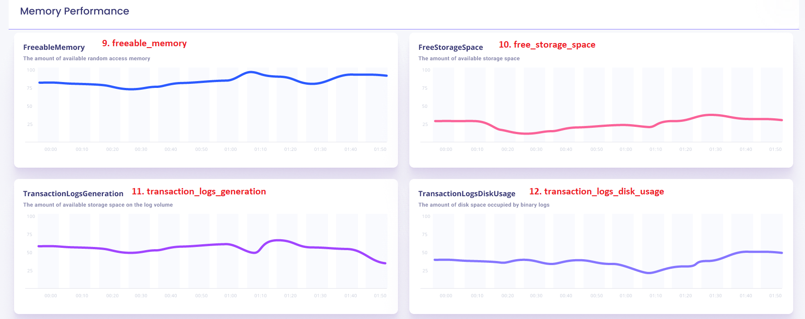
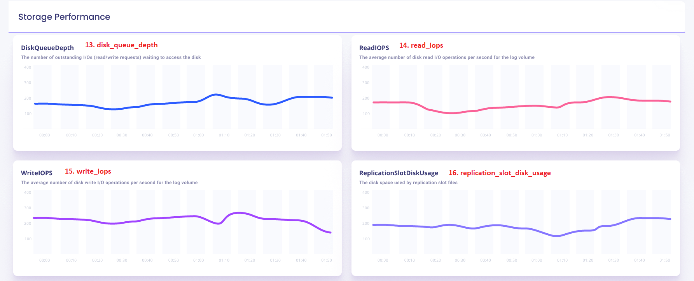
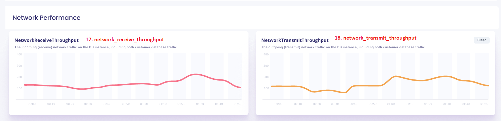
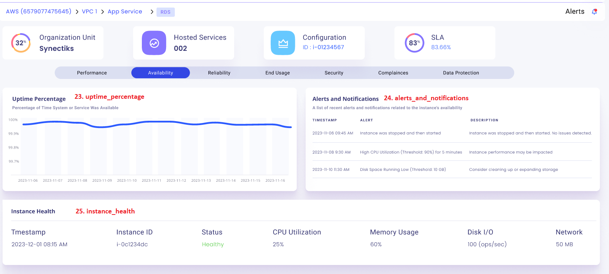
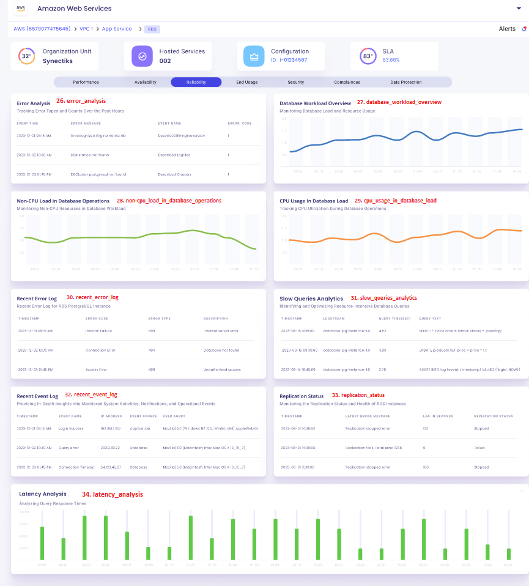
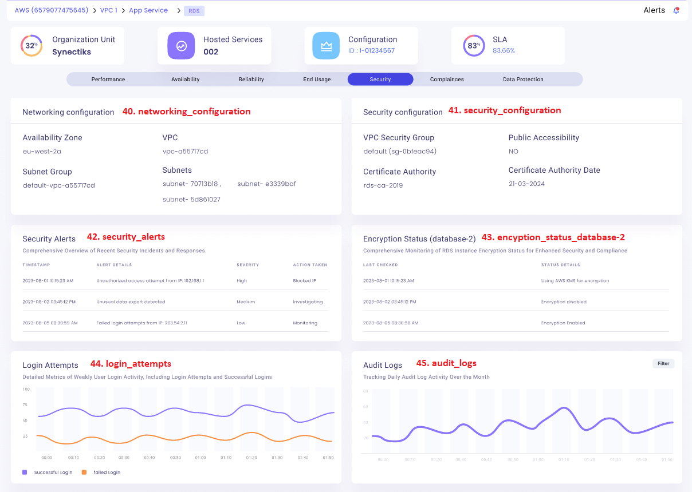

# Table of Contents

- [awsx-getelementdetails](#awsx-getelementdetails)
- [ui-analysis-and-listing-methods](#ui-analysis-and-listing-methods)
   - [cpu_utilization_panel](#cpu-utilization-panel)
   - [memory_utilization_panel](#memory-utilization-panel)
   - [storage_utilization_panel](#storage-utilization-panel)
   - [network_utilization_panel](#network-utilization-panel)
   - [cpu_credit_usage_panel](#cpu-credit-usage-panel)
   - [cpu_credit_balance_panel](#cpu-credit-balance-panel)
   - [cpu_surplus_credit_balance_panel](#cpu-surplus-credit-balance-panel)
   - [cpu_surplus_credits_charged_panel](#cpu-surplus-credits-charged-panel)
   - [freeable_memory_panel](#freeable-memory-panel)
   - [free_storage_space_panel](#free-storage-space-panel)
   - [transaction_logs_generation_panel](#transaction-logs-generation-panel)
   - [transaction_logs_disk_usage_panel](#transaction-logs-disk-usage-panel)
   - [disk_queue_depth_panel](#disk-queue-depth-panel)
   - [read_iops_panel](#read-iops-panel)
   - [write_iops_panel](#write-iops-panel)
   - [replication_slot_disk_usage_panel](#replication-slot-disk-usage-panel)
   - [network_receive_throughput_panel](#network-receive-throughput-panel)
   - [network_transmit_throughput_panel](#network-transmit-throughput-panel)
   - [cpu_utilization_graph_panel](#cpu-utilization-graph-panel)
   - [memory_utilization_panel](#memory-utilization-panel)
   - [network_traffic_panel](#network-traffic-panel)
   - [iops_in_count_or_seconds_panel](#iops-in-count-or-seconds-panel)
   - [uptime_percentage_panel](#uptime-percentage-panel)
   - [alerts_and_notifications_panel](#alerts-and-notifications-panel)
   - [instance_health_panel](#instance-health-panel)
   - [error_analysis_panel](#error-analysis-panel)
   - [database_workload_overview_panel](#database-workload-overview-panel)
   - [non_cpu_load_in_database_operations_panel](#non-cpu-load-in-database-operations-panel)
   - [cpu_usage_in_Database_load_panel](#cpu-usage-in-Database-load-panel)
   - [recent_error_log_panel](#recent-error-log-panel)
   - [slow_queries_analytics_panel](#slow-queries-analytics-panel)
   - [recent_event_log_panel](#recent-event-log-panel)
   - [replication_status_panel](#replication-status-panel)
   - [latency_analysis_panel](#latency-analysis-panel)
   - [throughput_rows_panel](#throughput-rows-panel)
   - [connection_attempts_panel](#connection-attempts-panel)
   - [database_connections_panel](#database-connections-panel)
   - [index_size_panel](#index-size-panel)
   - [maintenance_schedule_overview_panel](#maintenance-schedule-overview-panel)
   - [networking_configuration_panel](#networking-configuration-panel)
   - [security_configuration_panel](#security-configuration-panel)
   - [security_alerts_panel](#security-alerts-panel)
   - [encryption_status_databse_2_panel](#encryption-status-databse-2-panel)
   - [login_attempts_panel](#login-attempts-panel)
   - [audit_logs_panel](#audit-logs-panel)
   - [security_compliance_panel](#security-compliance-panel)
   - [patch_management_panel](#patch-management-panel)
   - [access_control_compliance_panel](#access-control-compliance-panel)
   - [regulatory_compliance_panel](#regulatory-compliance-panel)

- [List of Subcommands and Options for RDS](#list-of-subcommands-and-options-for-RDS)


# awsx-getelementdetails
It implements the awsx plugin getElementDetails.

# ui analysis and listing methods


 1. cpu_utilization_panel
 2. memory_utilization_panel
 3. storage_utilization_panel
 4. network_utilization_panel
 5. cpu_credit_usage_panel
 6. cpu_credit_balance_panel
 7. cpu_surplus_credit_balance_panel
 8. cpu_surplus_credits_charged_panel
 9. freeable_memory_panel
10. free_storage_space_panel
11. transaction_logs_generation_panel
12. transaction_logs_disk_usage_panel
13. disk_queue_depth_panel
14. read_iops_panel
15. write_iops_panel
16. replication_slot_disk_usage_panel
17. network_receive_throughput_panel
18. network_transmit_throughput_panel
19. cpu_utilization_graph_panel
20. memory_utilization_panel
21. network_traffic_panel
22. iops_in_count_or_seconds_panel
23. uptime_percentage_panel
24. alert_and_notification_panel
25. instance_health_check_panel
26. error_analysis_panel
27. database_workload_overview_panel
28. non_cpu_load_in_database_operations_panel
29. cpu_usage_in_Database_load_panel
30. recent_error_log_panel
31. slow_queries_analytics_panel
32. recent_event_log_panel
33. replication_status_panel
34. latency_analysis_panelthroughput_rows_panel
35. throughput_rows_panel
36. connection_attempts_panel
37. database_connections_panel
38. index_size_panel
39. maintenance_schedule_overview_panel
40. networking_configuration_panel
41. security_configuration_panel
42. security_alerts_panel
43. encryption_status_databse-2_panel
44. login_attempts_panel
45. audit_logs_panel
46. security_compliance_panel
47. patch_management_panel
48. access_control_compliance_panel
49. regulatory_compliance_panel


## Algorithm for Metric-Based Panels

1. **Define a command to fetch metrics.**
2. **On command execution:**
   - Authenticate the command.
   - If authentication fails:
     - Print error and return.
   - Retrieve response type from command flags.
   - Call function to fetch metrics data.
   - If error occurs:
     - Print error and return.
   - Format and print the response based on response type.
3. **Define function to fetch metrics data:**
   - Get element type and instance ID from command flags.
   - Parse start time and end time from command flags.
   - If error in parsing times:
     - Return error.
   - Get instance ID using CMDB data.
   - If error in getting instance ID:
     - Return error.
   - Initialize metric data map.
   - Get metric data and store in metric data map if available.
   - Create JSON output map with metric data values.
   - Marshal JSON output to JSON string.
   - If error occurs:
     - Return error.
   - Return JSON string and metric data.
4. **Initialize command flags.**

## Algorithm for Log-Based Panels

1. **Define a command to fetch logs data.**
2. **On command execution:**
   - Authenticate the command.
   - If authentication fails:
     - Print error and return.
   - Retrieve response type from command flags.
   - Call function to fetch logs data.
   - If error occurs:
     - Print error and return.
   - Format and print the response based on response type.
3. **Define function to fetch logs data:**
   - Get log group name from command flags.
   - Parse start and end times from command flags.
   - If error in parsing times:
     - Return error.
   - Get log group name using CMDB data.
   - If error in getting log group name:
     - Return error.
   - Construct CloudWatch query and fetch data.
   - If error occurs:
     - Return error.
   - Process fetched results.
   - Return processed results and nil for error.
4. **Initialize command flags.**


## Pseudo code for Metric-Based Panels

```pseudo
COMMAND fetch_metrics

ON EXECUTION:
    // Step 1: Authenticate the command
    IF NOT authenticate_command():
        PRINT "Authentication Error"
        RETURN

    // Step 2: Retrieve response type from command flags
    response_type = get_flag("response_type")

    // Step 3: Call function to fetch metrics data
    metrics_data, error = fetch_metrics_data()
    IF error:
        PRINT error
        RETURN

    // Step 4: Format and print the response based on response type
    formatted_response = format_response(metrics_data, response_type)
    PRINT formatted_response

//FUNCTION TO FETCH METRICS DATA
FUNCTION fetch_metrics_data():
    // Step 1: Get element type and instance ID from command flags
    element_type = get_flag("element_type")
    instance_id = get_flag("instance_id")

    // Step 2: Parse start time and end time from command flags
    start_time, end_time, time_error = parse_times(get_flag("start_time"), get_flag("end_time"))
    IF time_error:
        RETURN NULL, "Time Parsing Error"

    // Step 3: Get instance ID using CMDB data
    cmdb_instance_id, cmdb_error = get_cmdb_instance_id(instance_id)
    IF cmdb_error:
        RETURN NULL, "CMDB Instance ID Error"

    // Step 4: Initialize metric data map
    metric_data_map = {}

    // Step 5: Get metric data and store in metric data map if available
    metric_data, metric_error = get_metric_data(element_type, cmdb_instance_id, start_time, end_time)
    IF metric_error:
        RETURN NULL, "Metric Data Error"

    // Step 6: Create JSON output map with metric data values
    json_output_map = { "metrics": metric_data }

    // Step 7: Marshal JSON output to JSON string
    json_string, marshal_error = marshal_json(json_output_map)
    IF marshal_error:
        RETURN NULL, "JSON Marshalling Error"
    RETURN json_string, NULL

// Function to parse times from flags
FUNCTION parse_times(start_time_flag, end_time_flag):
    TRY:
        parsed_start_time = parse_time(start_time_flag)
        parsed_end_time = parse_time(end_time_flag)
    EXCEPT:
        RETURN NULL, NULL, "Time Parsing Error"
    RETURN parsed_start_time, parsed_end_time, NULL

// Function to authenticate the command
FUNCTION authenticate_command():
    // Dummy authentication logic
    IF command_has_valid_token():
        RETURN TRUE
    ELSE:
        RETURN FALSE
// Function to get a flag value
FUNCTION get_flag(flag_name):
    // Retrieve flag value from command input
    RETURN command_flags[flag_name]

// Function to get CMDB instance ID
FUNCTION get_cmdb_instance_id(instance_id):
    // Simulate CMDB lookup
    IF instance_id in CMDB:
        RETURN CMDB[instance_id], NULL
    ELSE:
        RETURN NULL, "CMDB Instance ID Error"

// Function to get metric data
FUNCTION get_metric_data(element_type, cmdb_instance_id, start_time, end_time):
    // Simulate fetching metrics from a data source
    metric_data = fetch_from_data_source(element_type, cmdb_instance_id, start_time, end_time)
    IF metric_data IS EMPTY:
        RETURN NULL, "Metric Data Error"
    RETURN metric_data, NULL

// Function to create JSON output map with metric data values
FUNCTION create_json_output_map(metric_data):
    // Create and return the JSON output map
    RETURN { "metrics": metric_data }

// Function to marshal JSON output to JSON string
FUNCTION marshal_json(json_output_map):
    TRY:
        json_string = json_encode(json_output_map)
    EXCEPT:
        RETURN NULL, "JSON Marshalling Error"
    RETURN json_string, NULL

// Function to format response based on response type
FUNCTION format_response(data, response_type):
    // Format the data based on the response type
    IF response_type == "json":
        RETURN data
    ELSE IF response_type == "text":
        RETURN convert_json_to_text(data)
    ELSE:
        RETURN "Unknown response type"

// Initialize command flags
COMMAND_FLAGS:
    response_type: STRING
    element_type: STRING
    instance_id: STRING
    start_time: STRING
    end_time: STRING
```


## Pseudo code to Fetch Logs Data

```pseudo
COMMAND fetch_logs

ON EXECUTION:
    // Step 1: Authenticate the command
    IF NOT authenticate_command():
        PRINT "Authentication Error"
        RETURN

    // Step 2: Retrieve response type from command flags
    response_type = get_flag("response_type")

    // Step 3: Call function to fetch logs data
    logs_data, error = fetch_logs_data()
    IF error:
        PRINT error
        RETURN

    // Step 4: Format and print the response based on response type
    formatted_response = format_response(logs_data, response_type)
    PRINT formatted_response

//FUNCTION TO FETCH LOGS DATA:
FUNCTION fetch_logs_data():
    // Step 1: Get log group name from command flags
    log_group_name = get_flag("log_group_name")

    // Step 2: Parse start and end times from command flags
    start_time, end_time, time_error = parse_times(get_flag("start_time"), get_flag("end_time"))
    IF time_error:
        RETURN NULL, "Time Parsing Error"

    // Step 3: Get log group name using CMDB data
    cmdb_log_group_name, cmdb_error = get_cmdb_log_group_name(log_group_name)
    IF cmdb_error:
        RETURN NULL, "CMDB Log Group Name Error"

    // Step 4: Construct CloudWatch query and fetch data
    cloudwatch_query = construct_cloudwatch_query(cmdb_log_group_name, start_time, end_time)
    log_data, query_error = execute_cloudwatch_query(cloudwatch_query)
    IF query_error:
        RETURN NULL, "CloudWatch Query Error"

    // Step 5: Process fetched results
    processed_results = process_log_data(log_data)

    RETURN processed_results, NULL

// Function to parse times from flags
FUNCTION parse_times(start_time_flag, end_time_flag):
    // Assume some parsing logic here
    IF parsing_fails:
        RETURN NULL, NULL, "Time Parsing Error"
    RETURN parsed_start_time, parsed_end_time, NULL

// Function to authenticate the command
FUNCTION authenticate_command():
    // Assume some authentication logic here
    RETURN authentication_status

// Function to get a flag value
FUNCTION get_flag(flag_name):
    // Assume logic to retrieve flag value
    RETURN flag_value

// Function to get CMDB log group name
FUNCTION get_cmdb_log_group_name(log_group_name):
    // Assume logic to get log group name from CMDB
    IF cmdb_lookup_fails:
        RETURN NULL, "CMDB Log Group Name Error"
    RETURN cmdb_log_group_name, NULL

// Function to construct CloudWatch query
FUNCTION construct_cloudwatch_query(cmdb_log_group_name, start_time, end_time):
    // Assume logic to construct CloudWatch query
    RETURN cloudwatch_query

// Function to execute CloudWatch query
FUNCTION execute_cloudwatch_query(cloudwatch_query):
    // Assume logic to execute query
    IF query_fails:
        RETURN NULL, "CloudWatch Query Error"
    RETURN log_data, NULL

// Function to process log data
FUNCTION process_log_data(log_data):
    // Assume logic to process log data
    RETURN processed_results

// Function to format response based on response type
FUNCTION format_response(data, response_type):
    // Assume logic to format response
    RETURN formatted_response

// Initialize command flags
COMMAND_FLAGS:
    response_type: STRING
    log_group_name: STRING
    start_time: STRING
    end_time: STRING
```

# ui-analysys-and listing-methods
## CPU Utilization Panel


1. cpu_utilization_panel

**called from subcommand**
```shell
go run awsx-getelementdetails.go  --vaultUrl=<afreenxxxx1309> --elementId=15025 --query="cpu_utilization_panel" --elementType="RDS" --responseType=frame --startTime=2023-12-01T00:00:00Z --endTime=2023-12-02T23:59:59Z
```

**called from maincommand**
```shell
awsx --vaultUrl=<afreenxxxx1309> --elementId=15025 --query="cpu_utilization_panel" --elementType="RDS" --responseType=frame --startTime=2023-12-01T00:00:00Z --endTime=2023-12-02T23:59:59Z
```

**Called from API**

[http://localhost:7000/awsx-api/getQueryOutput?vaultUrl=<afreenxxxx1309>&elementType=RDS&elementId=15025&query=cpu_utilization_panel&responseType=frame&startTime=2023-12-01T00:00:00Z&endTime=2023-12-02T23:59:59Z](http://localhost:7000/awsx-api/getQueryOutput?vaultUrl=<afreenxxxx1309>&elementType=RDS&elementId=15025&query=cpu_utilization_panel&responseType=frame&startTime=2023-12-01T00:00:00Z&endTime=2023-12-02T23:59:59Z)

**Desired Output in json / graph format:**
1. cpu_utilization_panel

```json


```

**Algorithm/ Pseudo Code**

**Algorithm:** 
- CPU Utilization Panel - Tracks and displays CPU usage statistics.

1. Initialize current_cpu_usage, average_cpu_usage, max_cpu_usage to 0.
2. Iterate through the CPU utilization data points.
3. For each data point:
    If metric is "current", update current_cpu_usage with the value.
    If metric is "average", update average_cpu_usage with the value.
    If metric is "max", update max_cpu_usage with the value.
4. Display current_cpu_usage, average_cpu_usage, max_cpu_usage.


 **Pseudo Code:** 
 ```
Initialize cpu_usage to an empty list

For each instance metric data point:
    If metric is CPU utilization:
        Append the data point value to cpu_usage

Display cpu_usage
 ```

# ui-analysys-and listing-methods
## Memory Utilization Panel


2. memory_utilization_panel 

**called from subcommand**
```
go run awsx-getelementdetails.go  --vaultUrl=<afreenXXXXXXX1309> --elementId=15025 --query="memory_utilization_panel" --elementType="RDS" --responseType=frame --startTime=2023-12-01T00:00:00Z --endTime=2023-12-02T23:59:59Z
```

**called from maincommand**
```
awsx --vaultUrl=<afreenXXXXXXX1309> --elementId=15025 --query="memory_utilization_panel" --elementType="RDS" --responseType=frame --startTime=2023-12-01T00:00:00Z --endTime=2023-12-02T23:59:59Z
```

**Called from API**

[http://localhost:7000/awsx-api/getQueryOutput?vaultUrl=<afreen1309XXX>&elementType=RDS&elementId=15025&query=memory_utilization_panel&responseType=frame&startTime=2023-12-01T00:00:00Z&endTime=2023-12-02T23:59:59Z](http://localhost:7000/awsx-api/getQueryOutput?vaultUrl=<afreen1309XXX>&elementType=RDS&elementId=15025&query=memory_utilization_panel&responseType=frame&startTime=2023-12-01T00:00:00Z&endTime=2023-12-02T23:59:59Z)

**Desired Output in json / graph format:**

2.  memory_utilization_panel
```json


```

**Algorithm/ Pseudo Code**

**Algorithm:** 
- Memory Utilization Panel - Tracks and displays memory usage statistics.
1. Initialize current_memory_usage, average_memory_usage, max_memory_usage to 0.
2. Iterate through the memory utilization data points.
3. For each data point:
    If metric is "current", update current_memory_usage with the value.
    If metric is "average", update average_memory_usage with the value.
    If metric is "max", update max_memory_usage with the value.
4. Display current_memory_usage, average_memory_usage, max_memory_usage.

 **Pseudo Code:** 
```
Initialize memory_usage to an empty list

For each instance metric data point:
    If metric is memory usage:
        Append the data point value to memory_usage

Display the sum of values in memory_usage
```

# ui-analysys-and listing-methods
## Storage Utilization Panel


3. storage_utilization_panel 

**called from subcommand**
```shell
go run awsx-getelementdetails.go  --vaultUrl=<afreenXXXXXXX1309> --elementId=15025 --query="storage_utilization_panel" --elementType="RDS" --responseType=frame --startTime=2023-12-01T00:00:00Z --endTime=2023-12-02T23:59:59Z
```

**called from maincommand**
```shell
awsx --vaultUrl=<afreenXXXXXXX1309> --elementId=15025 --query="storage_utilization_panel" --elementType="RDS" --responseType=frame --startTime=2023-12-01T00:00:00Z --endTime=2023-12-02T23:59:59Z
```

**Called from API**

[http://localhost:7000/awsx-api/getQueryOutput?vaultUrl=<afreen1309XXX>&elementType=RDS&elementId=15025&query=storage_utilization_panel&responseType=frame&startTime=2023-12-01T00:00:00Z&endTime=2023-12-02T23:59:59Z](http://localhost:7000/awsx-api/getQueryOutput?vaultUrl=<afreen1309XXX>&elementType=RDS&elementId=15025&query=storage_utilization_panel&responseType=frame&startTime=2023-12-01T00:00:00Z&endTime=2023-12-02T23:59:59

**Desired Output in json / graph format:**
3.  storage_utilization_panel
```json


```

**Algorithm/ Pseudo Code**

**Algorithm:** 
- Storage Utilization Panel - Tracks and displays storage usage statistics.

1. Initialize root_volume_usage, ebs_volume1_usage, ebs_volume2_usage to 0.
2. Iterate through the storage utilization data points.
3. For each data point:
    If metric is "root", update root_volume_usage with the value.
    If metric is "ebs1", update ebs_volume1_usage with the value.
    If metric is "ebs2", update ebs_volume2_usage with the value.
4. Display root_volume_usage, ebs_volume1_usage, ebs_volume2_usage.

 **Pseudo Code:** 
```
Initialize storage_usage to an empty list

For each instance metric data point:
    If metric is root volume usage:
        Append the data point value to storage_usage
    If metric is EBS volume 1 usage:
        Append the data point value to storage_usage
    If metric is EBS volume 2 usage:
        Append the data point value to storage_usage

Display the sum of values in storage_usage

```

# ui-analysys-and listing-methods
## Network Utilization Panel


4. network_utilization_panel

**called from subcommand**
```shell
go run awsx-getelementdetails.go  --vaultUrl=<afreenxxxx1309> --elementId=15025 --query="network_utilization_panel" --elementType="RDS" --responseType=frame --startTime=2023-12-01T00:00:00Z --endTime=2023-12-02T23:59:59Z
```

**called from maincommand**
```shell
awsx --vaultUrl=<afreenxxxx1309> --elementId=15025 --query="network_utilization_panel" --elementType="RDS" --responseType=frame --startTime=2023-12-01T00:00:00Z --endTime=2023-12-02T23:59:59Z
```

**Called from API**

[http://localhost:7000/awsx-api/getQueryOutput?vaultUrl=<afreenxxxx1309>&elementType=RDS&elementId=15025&query=network_utilization_panel&responseType=frame&startTime=2023-12-01T00:00:00Z&endTime=2023-12-02T23:59:59Z](http://localhost:7000/awsx-api/getQueryOutput?vaultUrl=<afreenxxxx1309>&elementType=RDS&elementId=15025&query=network_utilization_panel&responseType=frame&startTime=2023-12-01T00:00:00Z&endTime=2023-12-02T23:59:59Z)

**Desired Output in json / graph format:**
4. network_utilization_panel
```json


```

**Algorithm/ Pseudo Code**
**Algorithm:** 
- Network Utilization Panel - DTracks and displays network usage statistics.
1. Initialize network_rx, network_tx, data_transferred to 0.
2. Iterate through the network utilization data points.
3. For each data point:
    If metric is "RX", update network_rx with the value.
    If metric is "TX", update network_tx with the value.
    If metric is "data_transferred", update data_transferred with the value.
4. Display network_rx, network_tx, data_transferred.


 **Pseudo Code:** 
 ```
Initialize network_rx to an empty list
Initialize network_tx to an empty list
Initialize data_transferred to an empty list

For each instance metric data point:
    If metric is Network RX:
        Append the data point value to network_rx
    If metric is Network TX:
        Append the data point value to network_tx
    If metric is Data Transferred:
        Append the data point value to data_transferred

Display the sum of values in network_rx
Display the sum of values in network_tx
Display the sum of values in data_transferred

```

# ui-analysys-and listing-methods
## CPU Credit Usage Panel


5. cpu_credit_usage_panel

**called from subcommand**
```shell
go run awsx-getelementdetails.go  --vaultUrl=<afreenxxxx1309> --elementId=15025 --query="cpu_credit_usage_panel" --elementType="RDS" --responseType=frame --startTime=2023-12-01T00:00:00Z --endTime=2023-12-02T23:59:59Z
```
 
**called from maincommand**
```shell
awsx --vaultUrl=<afreenxxxx1309> --elementId=15025 --query="cpu_credit_usage_panel" --elementType="RDS" --responseType=frame --startTime=2023-12-01T00:00:00Z --endTime=2023-12-02T23:59:59Z
```

**Called from API**

[http://localhost:7000/awsx-api/getQueryOutput?vaultUrl=<afreenxxxx1309>&elementType=AWS/RDS&elementId=15025&query=cpu_credit_usage_panel&responseType=frame&startTime=2023-12-01T00:00:00Z&endTime=2023-12-02T23:59:59Z](http://localhost:7000/awsx-api/getQueryOutput?vaultUrl=<afreenxxxx1309>&elementType=AWS/RDS&elementId=15025&query=cpu_credit_usage_panel&responseType=frame&startTime=2023-12-01T00:00:00Z&endTime=2023-12-02T23:59:59Z)

**Desired Output in json / graph format:**

5. cpu_credit_usage_panel
```json


```
**Algorithm/ Pseudo Code**

**Algorithm:** 
- CPU Credit Usage Panel - Displays the number of CPU credits used by the instance for CPU utilization.
1. Initialize an empty list cpu_credit_usage.
2. Iterate through the CPU credit usage data points.
3. Append each data point value to cpu_credit_usage.
4. Display cpu_credit_usage as a graph.

 **Pseudo Code:**
 ```
Initialize cpu_credit_usage to empty list

For each data point in CPU credit usage data:
    Append data point value to cpu_credit_usage

Display cpu_credit_usage as graph
```

# ui-analysys-and listing-methods
## CPU Credit Balance Panel


6. cpu_credit_balance_panel

**called from subcommand**
```shell
go run awsx-getelementdetails.go  --vaultUrl=<afreenxxxx1309> --elementId=15025 --query="cpu_credit_balance_panel" --elementType="RDS" --responseType=frame --startTime=2023-12-01T00:00:00Z --endTime=2023-12-02T23:59:59Z
```

**called from maincommand**
```shell
awsx --vaultUrl=<afreenxxxx1309> --elementId=15025 --query="cpu_credit_balance_panel" --elementType="RDS" --responseType=frame --startTime=2023-12-01T00:00:00Z --endTime=2023-12-02T23:59:59Z
```

**Called from API**

[http://localhost:7000/awsx-api/getQueryOutput?vaultUrl=<afreenxxxx1309>&elementType=RDS&elementId=15025&query=cpu_credit_balance_panel&responseType=frame&startTime=2023-12-01T00:00:00Z&endTime=2023-12-02T23:59:59Z](http://localhost:7000/awsx-api/getQueryOutput?vaultUrl=<afreenxxxx1309>&elementType=RDS&elementId=15025&query=cpu_credit_balance_panel&responseType=frame&startTime=2023-12-01T00:00:00Z&endTime=2023-12-02T23:59:59Z)


**Desired Output in json / graph format:**
6. cpu_credit_balance_panel
```json


```

**Algorithm/ Pseudo Code**

**Algorithm:** 
- CPU Credit Balance Panel - Displays the number of earned CPU credits that an instance has accrued since it was launched or started.

1. Initialize an empty list cpu_credit_balance.
2. Iterate through the CPU credit balance data points.
3. Append each data point value to cpu_credit_balance.
4. Display cpu_credit_balance as a graph.

 **Pseudo Code:** 
 ```
Initialize cpu_credit_balance to empty list

For each data point in CPU credit balance data:
    Append data point value to cpu_credit_balance

Display cpu_credit_balance as graph

```

# ui-analysys-and listing-methods
## CPU Surplus Credit Balance Panel


7. cpu_surplus_credit_balance_panel 

**called from subcommand**
```shell
go run awsx-getelementdetails.go  --vaultUrl=<afreenxxxx1309> --elementId=15025 --query="cpu_surplus_credit_balance_panel" --elementType="RDS" --responseType=json --startTime=2023-12-01T00:00:00Z --endTime=2023-12-02T23:59:59Z
```
 
**called from maincommand**
```shell
awsx --vaultUrl=<afreenxxxx1309> --elementId=15025 --query="cpu_surplus_credit_balance_panel" --elementType="RDS" --responseType=json --startTime=2023-12-01T00:00:00Z --endTime=2023-12-02T23:59:59Z
```

**Called from API**

[http://localhost:7000/awsx-api/getQueryOutput?vaultUrl=<afreenxxxx1309>&elementType=AWS/RDS&elementId=15025&query=cpu_surplus_credit_balance_panel&responseType=json&startTime=2023-12-01T00:00:00Z&endTime=2023-12-02T23:59:59Z](http://localhost:7000/awsx-api/getQueryOutput?vaultUrl=<afreenxxxx1309>&elementType=AWS/RDS&elementId=15025&query=cpu_surplus_credit_balance_panel&responseType=json&startTime=2023-12-01T00:00:00Z&endTime=2023-12-02T23:59:59Z)

**Desired Output in json / graph format:**
7. cpu_surplus_credit_balance_panel 
```json


```
**Algorithm/ Pseudo Code**

**Algorithm:** 
- CPU Surplus Credits Charged Panel - Displays the number of surplus credits that have been earned by an unlimited instance when its CPUCreditBalance value is zero.
1. Initialize an empty list cpu_surplus_credit_balance.
2. Iterate through the CPU surplus credit balance data points.
3. Append each data point value to cpu_surplus_credit_balance.
4. Display cpu_surplus_credit_balance as a graph.

 **Pseudo Code:**
 ```
Initialize cpu_surplus_credit_balance to empty list

For each data point in CPU surplus credit balance data:
    Append data point value to cpu_surplus_credit_balance

Display cpu_surplus_credit_balance as graph

```

# ui-analysys-and listing-methods
## CPU Surplus Credits Charged Panel


8. cpu_surplus_credits_charged_panel 

**called from subcommand**
```shell
go run awsx-getelementdetails.go  --vaultUrl=<afreenxxxx1309> --elementId=15025 --query="cpu_surplus_credits_charged_panel" --elementType="RDS" --responseType=json --startTime=2023-12-01T00:00:00Z --endTime=2023-12-02T23:59:59Z
```
 
**called from maincommand**
```shell
awsx --vaultUrl=<afreenxxxx1309> --elementId=15025 --query="cpu_surplus_credits_charged_panel" --elementType="RDS" --responseType=json --startTime=2023-12-01T00:00:00Z --endTime=2023-12-02T23:59:59Z
```

**Called from API**

[http://localhost:7000/awsx-api/getQueryOutput?vaultUrl=<afreenxxxx1309>&elementType=AWS/RDS&elementId=15025&query=cpu_surplus_credits_charged_panel&responseType=json&startTime=2023-12-01T00:00:00Z&endTime=2023-12-02T23:59:59Z](http://localhost:7000/awsx-api/getQueryOutput?vaultUrl=<afreenxxxx1309>&elementType=AWS/RDS&elementId=15025&query=cpu_surplus_credits_charged_panel&responseType=json&startTime=2023-12-01T00:00:00Z&endTime=2023-12-02T23:59:59Z)

**Desired Output in json / graph format:**
8. cpu_surplus_credits_charged_panel 
```json


```
**Algorithm/ Pseudo Code**

**Algorithm:** 
- CPU Surplus Credits Charged Panel - Displays the number of spent surplus credits that are not paid down by earned CPU credits.
1. Initialize an empty list cpu_surplus_credits_charged.
2. Iterate through the CPU surplus credits charged data points.
3. Append each data point value to cpu_surplus_credits_charged.
4. Display cpu_surplus_credits_charged as a graph.

 **Pseudo Code:**
 ```
Initialize cpu_surplus_credits_charged to empty list

For each data point in CPU surplus credits charged data:
    Append data point value to cpu_surplus_credits_charged

Display cpu_surplus_credits_charged as graph

```
 
# ui-analysys-and listing-methods
## Freeable Memory Panel


9. freeable_memory_panel

**called from subcommand**
```shell
go run awsx-getelementdetails.go  --vaultUrl=<afreenxxxx1309> --elementId=15025 --query="freeable_memory_panel" --elementType="RDS" --responseType=frame --startTime=2023-12-01T00:00:00Z --endTime=2023-12-02T23:59:59Z
```

**called from maincommand**
```shell
awsx --vaultUrl=<afreenxxxx1309> --elementId=15025 --query="freeable_memory_panel" --elementType="RDS" --responseType=frame --startTime=2023-12-01T00:00:00Z --endTime=2023-12-02T23:59:59Z
```

**Called from API**

[http://localhost:7000/awsx-api/getQueryOutput?vaultUrl=<afreenxxxx1309>&elementType=RDS&elementId=15025&query=freeable_memory_panel&responseType=jsoframen&startTime=2023-12-01T00:00:00Z&endTime=2023-12-02T23:59:59Z](http://localhost:7000/awsx-api/getQueryOutput?vaultUrl=<afreenxxxx1309>&elementType=RDS&elementId=15025&query=freeable_memory_panel&responseType=frame&startTime=2023-12-01T00:00:00Z&endTime=2023-12-02T23:59:59Z)

**Desired Output in json / graph format:**

9. freeable_memory_panel
```json


```

**Algorithm/ Pseudo Code**

**Algorithm:** 
- Freeable Memory Panel - Displays the amount of available random access memory.

1. Initialize an empty list freeable_memory.
2. Iterate through the freeable memory data points.
3. Append each data point value to freeable_memory.
4. Display freeable_memory as a graph.

 **Pseudo Code:** 
 ```
Initialize freeable_memory to empty list

For each data point in freeable memory data:
    Append data point value to freeable_memory

Display freeable_memory as graph

 ```

# ui-analysys-and listing-methods
## Free Storage Space Panel


10. free_storage_space_panel

**called from subcommand**
```shell
go run awsx-getelementdetails.go  --vaultUrl=<afreenxxxx1309> --elementId=15025 --query="free_storage_space_panel" --elementType="RDS" --responseType=frame --startTime=2023-12-01T00:00:00Z --endTime=2023-12-02T23:59:59Z
```

**called from maincommand**
```shell
awsx --vaultUrl=<afreenxxxx1309> --elementId=15025 --query="free_storage_space_panel" --elementType="RDS" --responseType=frame --startTime=2023-12-01T00:00:00Z --endTime=2023-12-02T23:59:59Z
```

**Called from API**

[http://localhost:7000/awsx-api/getQueryOutput?vaultUrl=<afreenxxxx1309>&elementType=RDS&elementId=15025&query=free_storage_space_panel&responseType=frame](http://localhost:7000/awsx-api/getQueryOutput?vaultUrl=<afreenxxxx1309>&elementType=RDS&elementId=15025&query=free_storage_space_panel&responseType=frame)


**Desired Output in json / graph format:**
10. free_storage_space_panel
```json


```

**Algorithm/ Pseudo Code**

**Algorithm:** 
- Free Storage Space Panel - Displays the total number of 4xx errors with their corresponding timestamps.

1. Initialize an empty list free_storage_space.
2. Iterate through the free storage space data points.
3. Append each data point value to free_storage_space.
4. Display free_storage_space as a graph.

 **Pseudo Code:**
 ```
Initialize free_storage_space to empty list

For each data point in free storage space data:
    Append data point value to free_storage_space

Display free_storage_space as graph
```

 # ui-analysys-and listing-methods
 ##  Transaction Logs Generation Panel


11. transaction_logs_generation_panel


**called from subcommand**
```shell
go run awsx-getelementdetails.go  --vaultUrl=<afreenxxxx1309> --elementId=15025 --query="transaction_logs_generation_panel" --elementType="RDS" --responseType=frame --startTime=2023-12-01T00:00:00Z --endTime=2023-12-02T23:59:59Z
```

**called from maincommand**
```shell
awsx --vaultUrl=<afreenxxxx1309> --elementId=15025 --query="transaction_logs_generation_panel" --elementType="RDS" --responseType=frame --startTime=2023-12-01T00:00:00Z --endTime=2023-12-02T23:59:59Z
```

**Called from API**

[http://localhost:7000/awsx-api/getQueryOutput?vaultUrl=<afreenxxxx1309>&elementType=RDS&elementId=15025&query=transaction_logs_generation_panel&responseType=frame](http://localhost:7000/awsx-api/getQueryOutput?vaultUrl=<afreenxxxx1309>&elementType=RDS&elementId=15025&query=transaction_logs_generation_panel&responseType=frame)

**Desired Output in json / graph format:**
11. transaction_logs_generation_panel
```json


```
**Algorithm/ Pseudo Code**

**Algorithm:** 
- Transaction Logs Generation Panel - The Transaction Logs Generation panel displays the amount of available storage space on the log volume over time.

1. Initialize a variable, transaction_logs_generation.
2. Iterate through the log generation data points.
3. Record each data point's value and timestamp.
4. Print the transaction_logs_generation values with their corresponding timestamps.

 **Pseudo Code:** 
 ```
Initialize transaction_logs_generation = []
For each log_generation_data_point:
    Append (timestamp, log_value) to transaction_logs_generation
Print (transaction_logs_generation)
 ```

# ui-analysys-and listing-methods
## Transaction Logs Disk Usage Panel


12. transaction_logs_disk_usage_panel

**called from subcommand**
```shell
go run awsx-getelementdetails.go  --vaultUrl=<afreenxxxx1309> --elementId=15025 --query="transaction_logs_disk_usage_panel" --elementType="RDS" --responseType=json --startTime=2023-12-01T00:00:00Z --endTime=2023-12-02T23:59:59Z
```

**called from maincommand**
```shell
awsx --vaultUrl=<afreenxxxx1309> --elementId=15025 --query="transaction_logs_disk_usage_panel" --elementType="RDS" --responseType=json --startTime=2023-12-01T00:00:00Z --endTime=2023-12-02T23:59:59Z
```

**Called from API**

[http://localhost:7000/awsx-api/getQueryOutput?vaultUrl=<afreenxxxx1309>&elementType=RDS&elementId=15025&query=transaction_logs_disk_usage_panel&responseType=json&startTime=2023-12-01T00:00:00Z&endTime=2023-12-02T23:59:59Z](http://localhost:7000/awsx-api/getQueryOutput?vaultUrl=<afreenxxxx1309>&elementType=RDS&elementId=15025&query=transaction_logs_disk_usage_panel&responseType=json&startTime=2023-12-01T00:00:00Z&endTime=2023-12-02T23:59:59Z)

**Desired Output in json / graph format:**
12. transaction_logs_disk_usage_panel
```json


```

**Algorithm/ Pseudo Code**

**Algorithm:** 
- Transaction Logs Disk Usage Panel - The Transaction Logs Disk Usage panel displays the amount of disk space occupied by binary logs over time.

1. Initialize a variable, transaction_logs_disk_usage.
2. Iterate through the disk usage data points.
3. Record each data point's value and timestamp.
4. Print the transaction_logs_disk_usage values with their corresponding timestamps.

 **Pseudo Code:**  
```
Initialize transaction_logs_disk_usage = []
For each disk_usage_data_point:
    Append (timestamp, usage_value) to transaction_logs_disk_usage
Print (transaction_logs_disk_usage)
``` 

# ui-analysys-and listing-methods
##  Disk Queue Depth Panel


13. disk_queue_depth_panel

**called from subcommand**
```shell
go run awsx-getelementdetails.go  --vaultUrl=<afreenxxxx1309> --elementId=15025 --query="disk_queue_depth_panel" --elementType="RDS" --responseType=json --startTime=2023-12-01T00:00:00Z --endTime=2023-12-02T23:59:59Z
```

**called from maincommand**
```shell
awsx --vaultUrl=<afreenxxxx1309> --elementId=15025 --query="disk_queue_depth_panel" --elementType="RDS" --responseType=json --startTime=2023-12-01T00:00:00Z --endTime=2023-12-02T23:59:59Z
```

**Called from API**

[http://localhost:7000/awsx-api/getQueryOutput?vaultUrl=<afreenxxxx1309>&elementType=RDS&elementId=15025&query=disk_queue_depth_panel&responseType=json&startTime=2023-12-01T00:00:00Z&endTime=2023-12-02T23:59:59Z](http://localhost:7000/awsx-api/getQueryOutput?vaultUrl=<afreenxxxx1309>&elementType=RDS&elementId=15025&query=disk_queue_depth_panel&responseType=json&startTime=2023-12-01T00:00:00Z&endTime=2023-12-02T23:59:59Z)

**Desired Output in json / graph format:**
13. Disk Queue Depth Panel
```json


```

**Algorithm/ Pseudo Code**

**Algorithm:** 
Disk Queue Depth Panel - The Disk Queue Depth panel displays the number of outstanding I/O requests waiting to access the disk over time.

1. Initialize a variable, disk_queue_depth.
2. Iterate through the queue depth data points.
3. Record each data point's value and timestamp.
4. Print the disk_queue_depth values with their corresponding timestamps.

 **Pseudo Code:**  
 ```
Initialize disk_queue_depth = []
For each queue_depth_data_point:
    Append (timestamp, depth_value) to disk_queue_depth
Print (disk_queue_depth)
 ```

# ui-analysys-and listing-methods
## Read IOPS Panel


14. read_iops_panel


**called from subcommand**
```shell
go run awsx-getelementdetails.go  --vaultUrl=<afreenxxxx1309> --elementId=15025 --query="read_iops_panel" --elementType="RDS" --responseType=frame --startTime=2023-12-01T00:00:00Z --endTime=2023-12-02T23:59:59Z
```
 
**called from maincommand**
```shell
awsx --vaultUrl=<afreenxxxx1309> --elementId=15025 --query="read_iops_panel" --elementType="RDS" --responseType=frame --startTime=2023-12-01T00:00:00Z --endTime=2023-12-02T23:59:59Z
```

**Called from API**

[http://localhost:7000/awsx-api/getQueryOutput?vaultUrl=<afreenxxxx1309>&elementType=RDS&elementId=15025&query=read_iops_panel&responseType=frame&startTime=2023-12-01T00:00:00Z&endTime=2023-12-02T23:59:59Z](http://localhost:7000/awsx-api/getQueryOutput?vaultUrl=<afreenxxxx1309>&elementType=RDS&elementId=15025&query=read_iops_panel&responseType=frame&startTime=2023-12-01T00:00:00Z&endTime=2023-12-02T23:59:59Z)

**Desired Output in json / graph format:**
14. Read IOPS Panel

```json


```
**Algorithm/ Pseudo Code**

**Algorithm:** 
- Read IOPS Panel - The Read IOPS panel displays the average number of disk read I/O operations per second for the log volume over time.

1. Initialize a variable, read_iops.
2. Iterate through the read IOPS data points.
3. Record each data point's value and timestamp.
4. Print the read_iops values with their corresponding timestamps.

 **Pseudo Code:** 
 ```
Initialize read_iops = []
For each read_iops_data_point:
    Append (timestamp, iops_value) to read_iops
Print (read_iops)
 ```

# ui-analysys-and listing-methods
##  Write IOPS Panel


15. write_iops_panel

**called from subcommand**
```shell
go run awsx-getelementdetails.go  --vaultUrl=<afreenxxxx1309> --elementId=15025 --query="write_iops_panel" --elementType="RDS" --responseType=json --startTime=2023-12-01T00:00:00Z --endTime=2023-12-02T23:59:59Z
 ```

**called from maincommand**
```shell
awsx --vaultUrl=<afreenxxxx1309> --elementId=15025 --query="write_iops_panel" --elementType="RDS" --responseType=json --startTime=2023-12-01T00:00:00Z --endTime=2023-12-02T23:59:59Z
```

**Called from API**

[http://localhost:7000/awsx-api/getQueryOutput?vaultUrl=<afreenxxxx1309>&elementType=RDS&elementId=15025&query=write_iops_panel&responseType=json&startTime=2023-12-01T00:00:00Z&endTime=2023-12-02T23:59:59Z](http://localhost:7000/awsx-api/getQueryOutput?vaultUrl=<afreenxxxx1309>&elementType=RDS&elementId=15025&query=write_iops_panel&responseType=json&startTime=2023-12-01T00:00:00Z&endTime=2023-12-02T23:59:59Z)

**Desired Output in json / graph format:**
15. Write IOPS Panel

```json


```

**Algorithm/ Pseudo Code**

**Algorithm:** 
- Write IOPS Panel - The Write IOPS panel displays the average number of disk write I/O operations per second for the log volume over time.

1. Initialize a variable, write_iops.
2. Iterate through the write IOPS data points.
3. Record each data point's value and timestamp.
4. Print the write_iops values with their corresponding timestamps.

**Pseudo Code:**  
 ```
Initialize write_iops = []
For each write_iops_data_point:
    Append (timestamp, iops_value) to write_iops
Print (write_iops)
 ```
 
 # ui-analysys-and listing-methods
##  Replication Slot Disk Usage Panel


16. replication_slot_disk_usage

**called from subcommand**
```shell
go run awsx-getelementdetails.go  --vaultUrl=<afreenxxxx1309> --elementId=15025 --query="replication_slot_disk_usage" --elementType="RDS" --responseType=json --startTime=2023-12-01T00:00:00Z --endTime=2023-12-02T23:59:59Z
```
 
**called from maincommand**
```shell
awsx --vaultUrl=<afreenxxxx1309> --elementId=15025 --query="replication_slot_disk_usage --elementType="RDS" --responseType=json --startTime=2023-12-01T00:00:00Z --endTime=2023-12-02T23:59:59Z
```

**Called from API**

[http://localhost:7000/awsx-api/getQueryOutput?vaultUrl=<afreenxxxx1309>&elementType=RDS&elementId=15025&query=replication_slot_disk_usage&responseType=json](http://localhost:7000/awsx-api/getQueryOutput?vaultUrl=<afreenxxxx1309>&elementType=RDS&elementId=15025&query=replication_slot_disk_usage&responseType=json)

**Desired Output in json / graph format:**
16. Replication Slot Disk Usage Panel
```json


```

**Algorithm/ Pseudo Code**

**Algorithm:** 
- Replication Slot Disk Usage Panel  - The Replication Slot Disk Usage panel displays the disk space used by replication slot files over time.

1. Initialize a variable, replication_slot_disk_usage.
2. Iterate through the replication slot data points.
3. Record each data point's value and timestamp.
4. Print the replication_slot_disk_usage values with their corresponding timestamps.

 **Pseudo Code:**  
 ```
Initialize replication_slot_disk_usage = []
For each replication_slot_data_point:
    Append (timestamp, usage_value) to replication_slot_disk_usage
Print (replication_slot_disk_usage)
 ```


# ui-analysys-and listing-methods
## Network Receive Throughput Panel


17. network_receive_throughput_panel

**called from subcommand**
```shell
go run awsx-getelementdetails.go  --vaultUrl=<afreenxxxx1309> --elementId=15025 --query="network_receive_throughput_panel" --elementType="RDS" --responseType=json --startTime=2023-12-01T00:00:00Z --endTime=2023-12-02T23:59:59Z
```

**called from maincommand**
```shell
awsx --vaultUrl=<afreenxxxx1309> --elementId=15025 --query="network_receive_throughput_panel" --elementType="RDS" --responseType=json --startTime=2023-12-01T00:00:00Z --endTime=2023-12-02T23:59:59Z
```

**Called from API**

[http://localhost:7000/awsx-api/getQueryOutput?vaultUrl=<afreenxxxx1309>&elementType=RDS&elementId=15025&query=network_receive_throughput_panel&responseType=json&startTime=2023-12-01T00:00:00Z&endTime=2023-12-02T23:59:59Z](http://localhost:7000/awsx-api/getQueryOutput?vaultUrl=<afreenxxxx1309>&elementType=RDS&elementId=15025&query=network_receive_throughput_panel&responseType=json&startTime=2023-12-01T00:00:00Z&endTime=2023-12-02T23:59:59Z)

**Desired Output in json / graph format:**
17. Network Receive Throughput Panel
```json


```

**Algorithm/ Pseudo Code**

**Algorithm:** 
Network Receive Throughput Panel - The NetworkReceiveThroughput panel displays the incoming (receive) network traffic on the database instance, including both customer database traffic.

1. Initialize a variable, total_receive_throughput, to 0.
2. Iterate through the network receive throughput data points.
3. For each data point, add the throughput value to total_receive_throughput.
4. Print the total_receive_throughput.

 **Pseudo Code:**  
 ```
Initialize total_receive_throughput = 0
For each receive_data_point in network_receive_throughput_data:
    Add receive_data_point to total_receive_throughput
Print (total_receive_throughput)
 ```

# ui-analysys-and listing-methods
## Network Transmit Throughput Panel


18. network_transmit_throughput_panel

**called from subcommand**
```shell
go run awsx-getelementdetails.go  --vaultUrl=<afreenxxxx1309> --elementId=15025 --query="network_transmit_throughput_panel" --elementType="RDS" --responseType=json --startTime=2023-12-01T00:00:00Z --endTime=2023-12-02T23:59:59Z
```

**called from maincommand**
```shell
awsx --vaultUrl=<afreenxxxx1309> --elementId=15025 --query="network_transmit_throughput_panel" --elementType="RDS" --responseType=json --startTime=2023-12-01T00:00:00Z --endTime=2023-12-02T23:59:59Z
```

**Called from API**

[http://localhost:7000/awsx-api/getQueryOutput?vaultUrl=<afreenxxxx1309>&elementType=RDS&elementId=15025&query=network_transmit_throughput_panel&responseType=json&startTime=2023-12-01T00:00:00Z&endTime=2023-12-02T23:59:59Z](http://localhost:7000/awsx-api/getQueryOutput?vaultUrl=<afreenxxxx1309>&elementType=RDS&elementId=15025&query=network_transmit_throughput_panel&responseType=json&startTime=2023-12-01T00:00:00Z&endTime=2023-12-02T23:59:59Z)

**Desired Output in json / graph format:**
18. Network Transmit Throughput Panel
```json


```

**Algorithm/ Pseudo Code**

**Algorithm:** 
Network Transmit Throughput Panel - The NetworkTransmitThroughput panel displays the outgoing (transmit) network traffic on the database instance, including both customer database traffic.

1. Initialize a variable, total_transmit_throughput, to 0.
2. Iterate through the network transmit throughput data points.
3. For each data point, add the throughput value to total_transmit_throughput.
4. Print the total_transmit_throughput.

 **Pseudo Code:**  
 ```
Initialize new_udp_flows = 0
For each connection log:
    If connection is a new UDP flow:
        Increment new_udp_flows
Display new_udp_flows
 ```

# ui-analysys-and listing-methods
##  CPU Utilization Graph panel


19. cpu_utilization_graph_panel

**called from subcommand**
```shell
go run awsx-getelementdetails.go  --vaultUrl=<afreenxxxx1309> --elementId=15025 --query="cpu_utilization_graph_panel" --elementType="RDS" --responseType=json --startTime=2023-12-01T00:00:00Z --endTime=2023-12-02T23:59:59Z
 ```

**called from maincommand**
```shell
awsx --vaultUrl=<afreenxxxx1309> --elementId=15025 --query="cpu_utilization_graph_panel" --elementType="RDS" --responseType=json --startTime=2023-12-01T00:00:00Z --endTime=2023-12-02T23:59:59Z
```

**Called from API**

[http://localhost:7000/awsx-api/getQueryOutput?vaultUrl=<afreenxxxx1309>&elementType=RDS&elementId=15025&query=cpu_utilization_graph_panel&responseType=json&startTime=2023-12-01T00:00:00Z&endTime=2023-12-02T23:59:59Z](http://localhost:7000/awsx-api/getQueryOutput?vaultUrl=<afreenxxxx1309>&elementType=RDS&elementId=15025&query=cpu_utilization_graph_panel&responseType=json&startTime=2023-12-01T00:00:00Z&endTime=2023-12-02T23:59:59Z)

**Desired Output in json / graph format:**
19. CPU Utilization Graph panel
```json


```

**Algorithm/ Pseudo Code**

**Algorithm:** 
- CPU Utilization Graph panel - The CPU Utilization Graph panel displays the percentage of CPU capacity used by the instance over time.

1. Initialize a variable, total_cpu_utilization, to 0.
2. Iterate through the CPU utilization data points.
3. For each data point, add the CPU utilization percentage to total_cpu_utilization.
4. Calculate the average_cpu_utilization by dividing total_cpu_utilization by the number of data points.
5. Print the average_cpu_utilization.

**Pseudo Code:**  
 ```
Initialize total_cpu_utilization = 0
For each cpu_data_point in cpu_utilization_data:
    Add cpu_data_point to total_cpu_utilization
Calculate average_cpu_utilization = total_cpu_utilization / number_of_data_points
Print (average_cpu_utilization)
 ```
 
 # ui-analysys-and listing-methods
##  Memory Utilization Graph Panel


20. memory_utilization_panel

**called from subcommand**
```shell
go run awsx-getelementdetails.go  --vaultUrl=<afreenxxxx1309> --elementId=15025 --query="memory_utilization_panel" --elementType="RDS" --responseType=json --startTime=2023-12-01T00:00:00Z --endTime=2023-12-02T23:59:59Z
```
 
**called from maincommand**
```shell
awsx --vaultUrl=<afreenxxxx1309> --elementId=15025 --query="memory_utilization_panel --elementType="RDS" --responseType=json --startTime=2023-12-01T00:00:00Z --endTime=2023-12-02T23:59:59Z
```

**Called from API**

[http://localhost:7000/awsx-api/getQueryOutput?vaultUrl=<afreenxxxx1309>&elementType=RDS&elementId=15025&query=memory_utilization_panel&responseType=json](http://localhost:7000/awsx-api/getQueryOutput?vaultUrl=<afreenxxxx1309>&elementType=RDS&elementId=15025&query=memory_utilization_panel&responseType=json)

**Desired Output in json / graph format:**
20. Memory Utilization Graph Panel
```json


```

**Algorithm/ Pseudo Code**

**Algorithm:** 
- Memory Utilization Graph Panel  - The Memory Utilization Graph panel displays the memory usage of the instance over time.


1. Initialize a variable, total_memory_utilization, to 0.
2. Iterate through the memory utilization data points.
3. For each data point, add the memory utilization value to total_memory_utilization.
4. Calculate the average_memory_utilization by dividing total_memory_utilization by the number of data points.
5. Print the average_memory_utilization.
 
 **Pseudo Code:**  
 ```
Initialize total_memory_utilization = 0
For each memory_data_point in memory_utilization_data:
    Add memory_data_point to total_memory_utilization
Calculate average_memory_utilization = total_memory_utilization / number_of_data_points
Print (average_memory_utilization)
 ```

# ui-analysys-and listing-methods
## Network Traffic Panel


21. network_traffic_panel

**called from subcommand**
```shell
go run awsx-getelementdetails.go  --vaultUrl=<afreenxxxx1309> --elementId=15025 --query="network_traffic_panel" --elementType="RDS" --responseType=frame --startTime=2023-12-01T00:00:00Z --endTime=2023-12-02T23:59:59Z
```

**called from maincommand**
```shell
awsx --vaultUrl=<afreenxxxx1309> --elementId=15025 --query="network_traffic_panel" --elementType="RDS" --responseType=frame --startTime=2023-12-01T00:00:00Z --endTime=2023-12-02T23:59:59Z
```

**Called from API**

[http://localhost:7000/awsx-api/getQueryOutput?vaultUrl=<afreenxxxx1309>&elementType=RDS&elementId=15025&query=network_traffic_panel&responseType=frame&startTime=2023-12-01T00:00:00Z&endTime=2023-12-02T23:59:59Z](http://localhost:7000/awsx-api/getQueryOutput?vaultUrl=<afreenxxxx1309>&elementType=RDS&elementId=15025&query=network_traffic_panel&responseType=frame&startTime=2023-12-01T00:00:00Z&endTime=2023-12-02T23:59:59Z)

**Desired Output in json / graph format:**
21. network_traffic_panel

```json


```

**Algorithm/ Pseudo Code**

**Algorithm:** 
- Network Traffic Panel - The Network Traffic panel displays the data transfer rates for inbound and outbound traffic over time.

1. Initialize variables, total_inbound_traffic and total_outbound_traffic, to 0.
2. Iterate through the network traffic data points.
3. For each data point, add the inbound and outbound traffic values to total_inbound_traffic and total_outbound_traffic respectively.
4. Calculate the average_inbound_traffic and average_outbound_traffic by dividing the respective totals by the number of data points.
5. Print the average_inbound_traffic and average_outbound_traffic.


 **Pseudo Code:** 
 ```
Initialize total_inbound_traffic = 0
Initialize total_outbound_traffic = 0
For each traffic_data_point in network_traffic_data:
    Add inbound_traffic from traffic_data_point to total_inbound_traffic
    Add outbound_traffic from traffic_data_point to total_outbound_traffic
Calculate average_inbound_traffic = total_inbound_traffic / number_of_data_points
Calculate average_outbound_traffic = total_outbound_traffic / number_of_data_points
Print (average_inbound_traffic, average_outbound_traffic)
 ```

# ui-analysys-and listing-methods
## Iops in Count Or Seconds Panel


22. iops_in_count_or_seconds_panel 

**called from subcommand**
```
go run awsx-getelementdetails.go  --vaultUrl=<afreenXXXXXXX1309> --elementId=15025 --query="iops_in_count_or_seconds_panel" --elementType="RDS" --responseType=frame --startTime=2023-12-01T00:00:00Z --endTime=2023-12-02T23:59:59Z
```

**called from maincommand**
```
awsx --vaultUrl=<afreenXXXXXXX1309> --elementId=15025 --query="iops_in_count_or_seconds_panel" --elementType="RDS" --responseType=frame --startTime=2023-12-01T00:00:00Z --endTime=2023-12-02T23:59:59Z
```

**Called from API**

[http://localhost:7000/awsx-api/getQueryOutput?vaultUrl=<afreen1309XXX>&elementType=RDS&elementId=15025&query=iops_in_count_or_seconds_panel&responseType=frame&startTime=2023-12-01T00:00:00Z&endTime=2023-12-02T23:59:59Z](http://localhost:7000/awsx-api/getQueryOutput?vaultUrl=<afreen1309XXX>&elementType=RDS&elementId=15025&query=iops_in_count_or_seconds_panel&responseType=frame&startTime=2023-12-01T00:00:00Z&endTime=2023-12-02T23:59:59Z)

**Desired Output in json / graph format:**

22.  iops_in_count_or_seconds_panel
```json


```

**Algorithm/ Pseudo Code**

**Algorithm:** 
- Iops in Count Or Seconds Panel - The IOPS (Count/Sec) panel displays the input/output operations per second for read and write operations over time.

1. Initialize variables, total_read_iops and total_write_iops, to 0.
2. Iterate through the IOPS data points.
3. For each data point, add the read and write IOPS values to total_read_iops and total_write_iops respectively.
4. Calculate the average_read_iops and average_write_iops by dividing the respective totals by the number of data points.
5. Print the average_read_iops and average_write_iops.

 **Pseudo Code:** 
```
Initialize total_read_iops = 0
Initialize total_write_iops = 0
For each iops_data_point in iops_data:
    Add read_iops from iops_data_point to total_read_iops
    Add write_iops from iops_data_point to total_write_iops
Calculate average_read_iops = total_read_iops / number_of_data_points
Calculate average_write_iops = total_write_iops / number_of_data_points
Print (average_read_iops, average_write_iops)
```

# ui-analysys-and listing-methods
##  Uptime Percentage panel


23. uptime_percentage

**called from subcommand**
```shell
go run awsx-getelementdetails.go  --vaultUrl=<afreenxxxx1309> --elementId=15025 --query="uptime_percentage" --elementType="RDS" --responseType=json --startTime=2023-12-01T00:00:00Z --endTime=2023-12-02T23:59:59Z
 ```

**called from maincommand**
```shell
awsx --vaultUrl=<afreenxxxx1309> --elementId=15025 --query="uptime_percentage" --elementType="RDS" --responseType=json --startTime=2023-12-01T00:00:00Z --endTime=2023-12-02T23:59:59Z
```

**Called from API**

[http://localhost:7000/awsx-api/getQueryOutput?vaultUrl=<afreenxxxx1309>&elementType=RDS&elementId=15025&query=uptime_percentage&responseType=json&startTime=2023-12-01T00:00:00Z&endTime=2023-12-02T23:59:59Z](http://localhost:7000/awsx-api/getQueryOutput?vaultUrl=<afreenxxxx1309>&elementType=RDS&elementId=15025&query=uptime_percentage&responseType=json&startTime=2023-12-01T00:00:00Z&endTime=2023-12-02T23:59:59Z)

**Desired Output in json / graph format:**
23. Uptime Percentage panel
```json


```

**Algorithm/ Pseudo Code**

**Algorithm:** 
- Uptime Percentage panel - The Uptime Percentage panel displays the percentage of time the system or service was available.

1. Initialize a variable, total_uptime, to 0.
2. Iterate through the uptime data points.
3. For each data point, add the uptime percentage to total_uptime.
4. Calculate average_uptime by dividing total_uptime by the number of data points.
5. Print the average_uptime.

**Pseudo Code:**  
 ```
Initialize total_uptime = 0
For each uptime_data_point in uptime_percentage_data:
    Add uptime_data_point to total_uptime
Calculate average_uptime = total_uptime / number_of_data_points
Print (average_uptime)
 ```
 
# ui-analysys-and listing-methods
## Alerts and Notifications Panel


24. alert_and_notification_panel

**called from subcommand**
```shell
go run awsx-getelementdetails.go  --vaultUrl=<afreenxxxx1309> --elementId=15025 --query="alert_and_notification_panel" --elementType="RDS" --responseType=frame --startTime=2023-12-01T00:00:00Z --endTime=2023-12-02T23:59:59Z
```

**called from maincommand**
```shell
awsx --vaultUrl=<afreenxxxx1309> --elementId=15025 --query="alert_and_notification_panel" --elementType="RDS" --responseType=frame --startTime=2023-12-01T00:00:00Z --endTime=2023-12-02T23:59:59Z
```

**Called from API**

[http://localhost:7000/awsx-api/getQueryOutput?vaultUrl=<afreenxxxx1309>&elementType=RDS&elementId=15025&query=alert_and_notification_panel&responseType=frame&startTime=2023-12-01T00:00:00Z&endTime=2023-12-02T23:59:59Z](http://localhost:7000/awsx-api/getQueryOutput?vaultUrl=<afreenxxxx1309>&elementType=RDS&elementId=15025&query=alert_and_notification_panel&responseType=frame&startTime=2023-12-01T00:00:00Z&endTime=2023-12-02T23:59:59Z)

**Desired Output in json / graph format:**
24. Alerts and Notifications Panel

```json


```

**Algorithm/ Pseudo Code**

**Algorithm:** 
- Alerts and Notifications Panel - The Alerts and Notifications panel lists recent alerts and notifications related to the instance's availability.

1. Initialize an empty list, alerts_list.
2. Iterate through the alerts and notifications data points.
3. For each data point, check if it is an alert or notification.
4. If it is, add the alert or notification to alerts_list.
5. Print the alerts_list with their corresponding timestamps.

 **Pseudo Code:** 
 ```
Initialize alerts_list = []
For each alert_data_point in alerts_and_notifications_data:
    If alert_data_point is an alert or notification:
        Add alert_data_point to alerts_list
Print (alerts_list)

 ```

# ui-analysys-and listing-methods
## Instance Health Panel


25. instance_health_check_panel 

**called from subcommand**
```
go run awsx-getelementdetails.go  --vaultUrl=<afreenXXXXXXX1309> --elementId=15025 --query="instance_health_check_panel" --elementType="RDS" --responseType=frame --startTime=2023-12-01T00:00:00Z --endTime=2023-12-02T23:59:59Z
```

**called from maincommand**
```
awsx --vaultUrl=<afreenXXXXXXX1309> --elementId=15025 --query="instance_health_check_panel" --elementType="RDS" --responseType=frame --startTime=2023-12-01T00:00:00Z --endTime=2023-12-02T23:59:59Z
```

**Called from API**

[http://localhost:7000/awsx-api/getQueryOutput?vaultUrl=<afreen1309XXX>&elementType=RDS&elementId=15025&query=instance_health_check_panel&responseType=frame&startTime=2023-12-01T00:00:00Z&endTime=2023-12-02T23:59:59Z](http://localhost:7000/awsx-api/getQueryOutput?vaultUrl=<afreen1309XXX>&elementType=RDS&elementId=15025&query=instance_health_check_panel&responseType=frame&startTime=2023-12-01T00:00:00Z&endTime=2023-12-02T23:59:59Z)

**Desired Output in json / graph format:**
25.  Instance Health Panel
```json


```

**Algorithm/ Pseudo Code**

**Algorithm:** 
- Instance Health Panel - The Instance Health panel displays the current status and key metrics of the instance, such as CPU utilization, memory usage, disk I/O, and network usage.

1. Retrieve the current instance health data.
2. Extract CPU utilization, memory usage, disk I/O, and network usage values.
3. Print the instance health metrics with their corresponding values.

 **Pseudo Code:** 
```
Retrieve instance_health_data
Extract CPU_utilization, memory_usage, disk_IO, network_usage from instance_health_data
Print (CPU_utilization, memory_usage, disk_IO, network_usage)
```

# ui-analysys-and listing-methods
## Error Analysis Panel


26. error_analysis_panel 

**called from subcommand**
```shell
go run awsx-getelementdetails.go  --vaultUrl=<afreenXXXXXXX1309> --elementId=15373 --query="error_analysis_panel" --elementType="RDS" --responseType=frame --startTime=2023-12-01T00:00:00Z --endTime=2023-12-02T23:59:59Z
```

**called from maincommand**
```shell
awsx --vaultUrl=<afreenXXXXXXX1309> --elementId=15373 --query="error_analysis_panel" --elementType="RDS" --responseType=frame --startTime=2023-12-01T00:00:00Z --endTime=2023-12-02T23:59:59Z
```

**Called from API**

[http://localhost:7000/awsx-api/getQueryOutput?vaultUrl=<afreen1309XXX>&elementType=RDS&elementId=15373&query=error_analysis_panel&responseType=frame&startTime=2023-12-01T00:00:00Z&endTime=2023-12-02T23:59:59Z](http://localhost:7000/awsx-api/getQueryOutput?vaultUrl=<afreen1309XXX>&elementType=RDS&elementId=15373&query=error_analysis_panel&responseType=frame&startTime=2023-12-01T00:00:00Z&endTime=2023-12-02T23:59:59

**Desired Output in json / graph format:**
26.  Error Analysis Panel
```json


```

**Algorithm/ Pseudo Code**

**Algorithm:** 
- Error Analysis Panel - Displays the number and types of errors encountered in the RDS instance over time.
1. Initialize an empty dictionary error_count to store error types and their counts.
2. Iterate through the RDS error log data.
3. For each error log entry, check the error type.
4. Increment the count of the corresponding error type in the error_count dictionary.
5. Display the error types and their counts.

 **Pseudo Code:** 
```
Initialize error_count as an empty dictionary

For each error log entry in RDS error log data:
    Get the error type from the entry
    If error type is in error_count:
        Increment the count of error type
    Else:
        Add error type to error_count with count 1

Display error_count

```

# ui-analysys-and listing-methods
## Database Workload Overview Panel


27. database_workload_overview_panel

**called from subcommand**
```shell
go run awsx-getelementdetails.go  --vaultUrl=<afreenxxxx1309> --elementId=15025 --query="database_workload_overview_panel" --elementType="RDS" --responseType=frame --startTime=2023-12-01T00:00:00Z --endTime=2023-12-02T23:59:59Z
```

**called from maincommand**
```shell
awsx --vaultUrl=<afreenxxxx1309> --elementId=15025 --query="database_workload_overview_panel" --elementType="RDS" --responseType=frame --startTime=2023-12-01T00:00:00Z --endTime=2023-12-02T23:59:59Z
```

**Called from API**

[http://localhost:7000/awsx-api/getQueryOutput?vaultUrl=<afreenxxxx1309>&elementType=RDS&elementId=15025&query=database_workload_overview_panel&responseType=frame&startTime=2023-12-01T00:00:00Z&endTime=2023-12-02T23:59:59Z](http://localhost:7000/awsx-api/getQueryOutput?vaultUrl=<afreenxxxx1309>&elementType=RDS&elementId=15025&query=database_workload_overview_panel&responseType=frame&startTime=2023-12-01T00:00:00Z&endTime=2023-12-02T23:59:59Z)

**Desired Output in json / graph format:**
27. database_workload_overview_panel
```json


```

**Algorithm/ Pseudo Code**
Database Workload Overview Panel - Displays the database workload over time.

1. Initialize an empty list workload_data to store workload data points.
2. Iterate through the RDS workload metrics.
3. For each data point, extract the workload value and timestamp.
4. Append the workload value and timestamp to the workload_data list.
5. Display the workload_data list as a graph over time.

 **Pseudo Code:** 
 ```
Initialize workload_data as an empty list

For each workload metric data point:
    Extract workload value and timestamp
    Append workload value and timestamp to workload_data

Display workload_data as a graph over time
```

# ui-analysys-and listing-methods
## Non CPU Load in Database Operations Panel


28. non_cpu_load_in_database_operations_panel 

**called from subcommand**
```shell
go run awsx-getelementdetails.go  --vaultUrl=<afreenxxxx1309> --elementId=15025 --query="non_cpu_load_in_database_operations_panel" --elementType="RDS" --responseType=frame --startTime=2023-12-01T00:00:00Z --endTime=2023-12-02T23:59:59Z
```
 
**called from maincommand**
```shell
awsx --vaultUrl=<afreenxxxx1309> --elementId=15025 --query="non_cpu_load_in_database_operations_panel" --elementType="RDS" --responseType=frame --startTime=2023-12-01T00:00:00Z --endTime=2023-12-02T23:59:59Z
```

**Called from API**

[http://localhost:7000/awsx-api/getQueryOutput?vaultUrl=<afreenxxxx1309>&elementType=AWS/RDS&elementId=15025&query=non_cpu_load_in_database_operations_panel&responseType=frame&startTime=2023-12-01T00:00:00Z&endTime=2023-12-02T23:59:59Z](http://localhost:7000/awsx-api/getQueryOutput?vaultUrl=<afreenxxxx1309>&elementType=AWS/RDS&elementId=15025&query=non_cpu_load_in_database_operations_panel&responseType=frame&startTime=2023-12-01T00:00:00Z&endTime=2023-12-02T23:59:59Z)

**Desired Output in json / graph format:**
28. Non-CPU Load in Database Operations Panel
```json


```
**Algorithm/ Pseudo Code**

**Algorithm:** 
- Non-CPU Load in Database Operations Panel - Monitors non-CPU resource usage in database operations.
1. Initialize a list non_cpu_load_data to store non-CPU load values.
2. Iterate through the RDS non-CPU load metrics.
3. For each data point, extract the non-CPU load value and timestamp.
4. Append the non-CPU load value and timestamp to non_cpu_load_data.
5. Display the non_cpu_load_data as a graph over time.

 **Pseudo Code:**
 ```
Initialize non_cpu_load_data as an empty list

For each non-CPU load metric data point:
    Extract non-CPU load value and timestamp
    Append non-CPU load value and timestamp to non_cpu_load_data

Display non_cpu_load_data as a graph over time
```

# ui-analysys-and listing-methods
## CPU Usage in Database Load Panel


29. cpu_usage_in_Database_load_panel

**called from subcommand**
```shell
go run awsx-getelementdetails.go  --vaultUrl=<afreenxxxx1309> --elementId=15025 --query="cpu_usage_in_Database_load_panel" --elementType="RDS" --responseType=frame --startTime=2023-12-01T00:00:00Z --endTime=2023-12-02T23:59:59Z
```

**called from maincommand**
```shell
awsx --vaultUrl=<afreenxxxx1309> --elementId=15025 --query="cpu_usage_in_Database_load_panel" --elementType="RDS" --responseType=frame --startTime=2023-12-01T00:00:00Z --endTime=2023-12-02T23:59:59Z
```

**Called from API**

[http://localhost:7000/awsx-api/getQueryOutput?vaultUrl=<afreenxxxx1309>&elementType=RDS&elementId=15025&query=cpu_usage_in_Database_load_panel&responseType=frame&startTime=2023-12-01T00:00:00Z&endTime=2023-12-02T23:59:59Z](http://localhost:7000/awsx-api/getQueryOutput?vaultUrl=<afreenxxxx1309>&elementType=RDS&elementId=15025&query=cpu_usage_in_Database_load_panel&responseType=frame&startTime=2023-12-01T00:00:00Z&endTime=2023-12-02T23:59:59Z)


**Desired Output in json / graph format:**
29. cpu_usage_in_Database_load_panel
```json


```

**Algorithm/ Pseudo Code**

**Algorithm:** 
- CPU Usage in Database Load Panel - Tracks CPU utilization during database operations.

1. Initialize a list cpu_usage_data to store CPU usage values.
2. Iterate through the RDS CPU usage metrics.
3. For each data point, extract the CPU usage value and timestamp.
4. Append the CPU usage value and timestamp to cpu_usage_data.
5. Display the cpu_usage_data as a graph over time.

 **Pseudo Code:** 
 ```
Initialize cpu_usage_data as an empty list

For each CPU usage metric data point:
    Extract CPU usage value and timestamp
    Append CPU usage value and timestamp to cpu_usage_data

Display cpu_usage_data as a graph over time
```

# ui-analysys-and listing-methods
## Recent Error Log Panel


30. recent_error_log_panel 

**called from subcommand**
```shell
go run awsx-getelementdetails.go  --vaultUrl=<afreenxxxx1309> --elementId=15373 --query="recent_error_log_panel" --elementType="RDS" --responseType=json --startTime=2023-12-01T00:00:00Z --endTime=2023-12-02T23:59:59Z
```
 
**called from maincommand**
```shell
awsx --vaultUrl=<afreenxxxx1309> --elementId=15373 --query="recent_error_log_panel" --elementType="RDS" --responseType=json --startTime=2023-12-01T00:00:00Z --endTime=2023-12-02T23:59:59Z
```

**Called from API**

[http://localhost:7000/awsx-api/getQueryOutput?vaultUrl=<afreenxxxx1309>&elementType=AWS/RDS&elementId=15373&query=recent_error_log_panel&responseType=json&startTime=2023-12-01T00:00:00Z&endTime=2023-12-02T23:59:59Z](http://localhost:7000/awsx-api/getQueryOutput?vaultUrl=<afreenxxxx1309>&elementType=AWS/RDS&elementId=15373&query=recent_error_log_panel&responseType=json&startTime=2023-12-01T00:00:00Z&endTime=2023-12-02T23:59:59Z)

**Desired Output in json / graph format:**
30. recent_error_log_panel 
```json


```
**Algorithm/ Pseudo Code**

**Algorithm:** 
- Recent Error Log Panel - Displays recent errors logged by the RDS instance.

1. Initialize a list recent_errors to store recent error log entries.
2. Iterate through the RDS error log data.
3. For each error log entry within a specified recent time range, extract the error details.
4. Append the error details to recent_errors.
5. Display the recent_errors list.

 **Pseudo Code:**
 ```
Initialize recent_errors as an empty list

For each error log entry in RDS error log data:
    If entry timestamp is within recent time range:
        Extract error details
        Append error details to recent_errors

Display recent_errors
```

# ui-analysys-and listing-methods
## Slow Queries Analytics Panel


31. slow_queries_analytics_panel

**called from subcommand**
```shell
go run awsx-getelementdetails.go  --vaultUrl=<afreenxxxx1309> --elementId=15025 --query="slow_queries_analytics_panel" --elementType="RDS" --responseType=json --startTime=2023-12-01T00:00:00Z --endTime=2023-12-02T23:59:59Z
```

**called from maincommand**
```shell
awsx --vaultUrl=<afreenxxxx1309> --elementId=15025 --query="slow_queries_analytics_panel" --elementType="RDS" --responseType=json --startTime=2023-12-01T00:00:00Z --endTime=2023-12-02T23:59:59Z
```

**Called from API**

[http://localhost:7000/awsx-api/getQueryOutput?vaultUrl=<afreenxxxx1309>&elementType=RDS&elementId=15025&query=slow_queries_analytics_panel&responseType=json&startTime=2023-12-01T00:00:00Z&endTime=2023-12-02T23:59:59Z](http://localhost:7000/awsx-api/getQueryOutput?vaultUrl=<afreenxxxx1309>&elementType=RDS&elementId=15025&query=slow_queries_analytics_panel&responseType=json&startTime=2023-12-01T00:00:00Z&endTime=2023-12-02T23:59:59Z)

**Desired Output in json / graph format:**
31. Slow Queries Analytics Panel
```json


```

**Algorithm/ Pseudo Code**

**Algorithm:** 
- Slow Queries Analytics Panel - Identifies and optimizes resource-intensive database queries.

1. Initialize a list slow_queries to store slow query details.
2. Iterate through the RDS query performance metrics.
3. For each query entry with execution time above a specified threshold, extract the query details.
4. Append the query details to slow_queries.
5. Display the slow_queries list.

 **Pseudo Code:**
 ```
Initialize slow_queries as an empty list

For each query entry in RDS query performance metrics:
    If execution time of query is above threshold:
        Extract query details
        Append query details to slow_queries

Display slow_queries
 ```
 
# ui-analysys-and listing-methods
## Recent Event Log Panel


32. recent_event_log_panel

**called from subcommand**
```shell
go run awsx-getelementdetails.go  --vaultUrl=<afreenxxxx1309> --elementId=15373 --query="recent_event_log_panel" --elementType="RDS" --responseType=frame --startTime=2023-12-01T00:00:00Z --endTime=2023-12-02T23:59:59Z
```

**called from maincommand**
```shell
awsx --vaultUrl=<afreenxxxx1309> --elementId=15373 --query="recent_event_log_panel" --elementType="RDS" --responseType=frame --startTime=2023-12-01T00:00:00Z --endTime=2023-12-02T23:59:59Z
```

**Called from API**

[http://localhost:7000/awsx-api/getQueryOutput?vaultUrl=<afreenxxxx1309>&elementType=RDS&elementId=15373&query=recent_event_log_panel&responseType=jsoframen&startTime=2023-12-01T00:00:00Z&endTime=2023-12-02T23:59:59Z](http://localhost:7000/awsx-api/getQueryOutput?vaultUrl=<afreenxxxx1309>&elementType=RDS&elementId=15373&query=recent_event_log_panel&responseType=frame&startTime=2023-12-01T00:00:00Z&endTime=2023-12-02T23:59:59Z)

**Desired Output in json / graph format:**
32. Recent Event Log Panel
```json


```

**Algorithm/ Pseudo Code**

**Algorithm:** 
- Recent Event Log Panel - Provides insights into monitored system activities and operational events.

1. Initialize a list recent_events to store recent event log entries.
2. Iterate through the RDS event log data.
3. For each event log entry within a specified recent time range, extract the event details.
4. Append the event details to recent_events.
5. Display the recent_events list.

 **Pseudo Code:** 
 ```
Initialize recent_events as an empty list

For each event log entry in RDS event log data:
    If entry timestamp is within recent time range:
        Extract event details
        Append event details to recent_events

Display recent_events
 ```

# ui-analysys-and listing-methods
##  Replication Status Panel


33. replication_status_panel

**called from subcommand**
```shell
go run awsx-getelementdetails.go  --vaultUrl=<afreenxxxx1309> --elementId=15025 --query="replication_status_panel" --elementType="RDS" --responseType=frame --startTime=2023-12-01T00:00:00Z --endTime=2023-12-02T23:59:59Z
```

**called from maincommand**
```shell
awsx --vaultUrl=<afreenxxxx1309> --elementId=15025 --query="replication_status_panel" --elementType="RDS" --responseType=frame --startTime=2023-12-01T00:00:00Z --endTime=2023-12-02T23:59:59Z
```

**Called from API**

[http://localhost:7000/awsx-api/getQueryOutput?vaultUrl=<afreenxxxx1309>&elementType=RDS&elementId=15025&query=replication_status_panel&responseType=frame](http://localhost:7000/awsx-api/getQueryOutput?vaultUrl=<afreenxxxx1309>&elementType=RDS&elementId=15025&query=replication_status_panel&responseType=frame)


**Desired Output in json / graph format:**
33. Replication Status Panel
```json


```

**Algorithm/ Pseudo Code**

**Algorithm:** 
- Replication Status Panel - Monitors the replication status and health of RDS instances.

1. Initialize a list replication_status_data to store replication status entries.
2. Iterate through the RDS replication metrics.
3. For each data point, extract the replication status details.
4. Append the replication status details to replication_status_data.
5. Display the replication_status_data.

 **Pseudo Code:**
 ```
Initialize replication_status_data as an empty list

For each replication status metric data point:
    Extract replication status details
    Append replication status details to replication_status_data

Display replication_status_data

```

 # ui-analysys-and listing-methods
 ##  Latency Analysis Panel


34. latency_analysis_panel


**called from subcommand**
```shell
go run awsx-getelementdetails.go  --vaultUrl=<afreenxxxx1309> --elementId=15025 --query="latency_analysis_panel" --elementType="RDS" --responseType=frame --startTime=2023-12-01T00:00:00Z --endTime=2023-12-02T23:59:59Z
```

**called from maincommand**
```shell
awsx --vaultUrl=<afreenxxxx1309> --elementId=15025 --query="latency_analysis_panel" --elementType="RDS" --responseType=frame --startTime=2023-12-01T00:00:00Z --endTime=2023-12-02T23:59:59Z
```

**Called from API**

[http://localhost:7000/awsx-api/getQueryOutput?vaultUrl=<afreenxxxx1309>&elementType=RDS&elementId=15025&query=latency_analysis_panel&responseType=frame](http://localhost:7000/awsx-api/getQueryOutput?vaultUrl=<afreenxxxx1309>&elementType=RDS&elementId=15025&query=latency_analysis_panel&responseType=frame)

**Desired Output in json / graph format:**
34. latency_analysis_panel
```json


```
**Algorithm/ Pseudo Code**

**Algorithm:** 
- Latency Analysis Panel - Analyzes query response times.

1. Initialize a list latency_data to store query latency values.
2. Iterate through the RDS query performance metrics.
3. For each query entry, extract the latency value and timestamp.
4. Append the latency value and timestamp to latency_data.
5. Display the latency_data as a graph over time.

 **Pseudo Code:** 
 ```
Initialize latency_data as an empty list

For each query entry in RDS query performance metrics:
    Extract latency value and timestamp
    Append latency value and timestamp to latency_data

Display latency_data as a graph over time

 ```

# ui-analysys-and listing-methods
## Throughput Rows Panel


35. throughput_rows_panel

**called from subcommand**
```shell
go run awsx-getelementdetails.go  --vaultUrl=<afreenxxxx1309> --elementId=15025 --query="throughput_rows_panel" --elementType="RDS" --responseType=json --startTime=2023-12-01T00:00:00Z --endTime=2023-12-02T23:59:59Z
```

**called from maincommand**
```shell
awsx --vaultUrl=<afreenxxxx1309> --elementId=15025 --query="throughput_rows_panel" --elementType="RDS" --responseType=json --startTime=2023-12-01T00:00:00Z --endTime=2023-12-02T23:59:59Z
```

**Called from API**

[http://localhost:7000/awsx-api/getQueryOutput?vaultUrl=<afreenxxxx1309>&elementType=RDS&elementId=15025&query=throughput_rows_panel&responseType=json&startTime=2023-12-01T00:00:00Z&endTime=2023-12-02T23:59:59Z](http://localhost:7000/awsx-api/getQueryOutput?vaultUrl=<afreenxxxx1309>&elementType=RDS&elementId=15025&query=throughput_rows_panel&responseType=json&startTime=2023-12-01T00:00:00Z&endTime=2023-12-02T23:59:59Z)

**Desired Output in json / graph format:**
35. throughput_rows_panel
```json


```

**Algorithm/ Pseudo Code**

**Algorithm:** 
- Throughput- Rows Panel - Tracks the daily trends of rows inserted, updated, and deleted in the database.

1. Initialize lists rows_inserted, rows_updated, and rows_deleted to store corresponding throughput values.
2. Iterate through the RDS throughput metrics.
3. For each data point, extract the values for rows inserted, updated, and deleted, and their timestamps.
4. Append these values and timestamps to the respective lists.
5. Display the rows_inserted, rows_updated, and rows_deleted as a graph over time.

 **Pseudo Code:**  
```
Initialize rows_inserted, rows_updated, rows_deleted as empty lists

For each throughput metric data point:
    Extract values for rows inserted, updated, deleted and timestamp
    Append values and timestamp to respective lists

Display rows_inserted, rows_updated, rows_deleted as a graph over time

``` 

# ui-analysys-and listing-methods
##  Connection Attempts Panel


36. connection_attempts_panel

**called from subcommand**
```shell
go run awsx-getelementdetails.go  --vaultUrl=<afreenxxxx1309> --elementId=15025 --query="connection_attempts_panel" --elementType="RDS" --responseType=json --startTime=2023-12-01T00:00:00Z --endTime=2023-12-02T23:59:59Z
```

**called from maincommand**
```shell
awsx --vaultUrl=<afreenxxxx1309> --elementId=15025 --query="connection_attempts_panel" --elementType="RDS" --responseType=json --startTime=2023-12-01T00:00:00Z --endTime=2023-12-02T23:59:59Z
```

**Called from API**

[http://localhost:7000/awsx-api/getQueryOutput?vaultUrl=<afreenxxxx1309>&elementType=RDS&elementId=15025&query=connection_attempts_panel&responseType=json&startTime=2023-12-01T00:00:00Z&endTime=2023-12-02T23:59:59Z](http://localhost:7000/awsx-api/getQueryOutput?vaultUrl=<afreenxxxx1309>&elementType=RDS&elementId=15025&query=connection_attempts_panel&responseType=json&startTime=2023-12-01T00:00:00Z&endTime=2023-12-02T23:59:59Z)

**Desired Output in json / graph format:**
36. Connection Attempts Panel
```json


```

**Algorithm/ Pseudo Code**

**Algorithm:** 
- Connection Attempts Panel - Displays the number of attempts to connect to the RDS instance.

1. Initialize a list connection_attempts_data to store connection attempts data points.
2. Iterate through the RDS connection metrics.
3. For each data point, extract the number of connection attempts and timestamp.
4. Append the number of connection attempts and timestamp to connection_attempts_data.
5. Display the connection_attempts_data as a graph over time.

 **Pseudo Code:**  
 ```
Initialize connection_attempts_data as an empty list

For each connection metric data point:
    Extract number of connection attempts and timestamp
    Append number of connection attempts and timestamp to connection_attempts_data

Display connection_attempts_data as a graph over time
 ```

# ui-analysys-and listing-methods
## Database Connections Panel


37. database_connections_panel


**called from subcommand**
```shell
go run awsx-getelementdetails.go  --vaultUrl=<afreenxxxx1309> --elementId=15025 --query="database_connections_panel" --elementType="RDS" --responseType=frame --startTime=2023-12-01T00:00:00Z --endTime=2023-12-02T23:59:59Z
```
 
**called from maincommand**
```shell
awsx --vaultUrl=<afreenxxxx1309> --elementId=15025 --query="database_connections_panel" --elementType="RDS" --responseType=frame --startTime=2023-12-01T00:00:00Z --endTime=2023-12-02T23:59:59Z
```

**Called from API**

[http://localhost:7000/awsx-api/getQueryOutput?vaultUrl=<afreenxxxx1309>&elementType=RDS&elementId=15025&query=database_connections_panel&responseType=frame&startTime=2023-12-01T00:00:00Z&endTime=2023-12-02T23:59:59Z](http://localhost:7000/awsx-api/getQueryOutput?vaultUrl=<afreenxxxx1309>&elementType=RDS&elementId=15025&query=database_connections_panel&responseType=frame&startTime=2023-12-01T00:00:00Z&endTime=2023-12-02T23:59:59Z)

**Desired Output in json / graph format:**
37. Database Connections Panel
```json


```
**Algorithm/ Pseudo Code**

**Algorithm:** 
- Database Connections Panel - Displays the number of client network connections to the database instance.

1. Database Connections Panel - Displays the number of client network connections to the database instance.
2. Initialize a list database_connections_data to store database connection data points.
3. Iterate through the RDS connection metrics.
4. For each data point, extract the number of connections and timestamp.
5. Append the number of connections and timestamp to database_connections_data.
6. Display the database_connections_data as a graph over time.

 **Pseudo Code:** 
 ```
Initialize database_connections_data as an empty list

For each connection metric data point:
    Extract number of connections and timestamp
    Append number of connections and timestamp to database_connections_data

Display database_connections_data as a graph over time
 ```

# ui-analysys-and listing-methods
##  Index Size Panel


38. index_size_panel

**called from subcommand**
```shell
go run awsx-getelementdetails.go  --vaultUrl=<afreenxxxx1309> --elementId=15025 --query="index_size_panel" --elementType="RDS" --responseType=json --startTime=2023-12-01T00:00:00Z --endTime=2023-12-02T23:59:59Z
 ```

**called from maincommand**
```shell
awsx --vaultUrl=<afreenxxxx1309> --elementId=15025 --query="index_size_panel" --elementType="RDS" --responseType=json --startTime=2023-12-01T00:00:00Z --endTime=2023-12-02T23:59:59Z
```

**Called from API**

[http://localhost:7000/awsx-api/getQueryOutput?vaultUrl=<afreenxxxx1309>&elementType=RDS&elementId=15025&query=index_size_panel&responseType=json&startTime=2023-12-01T00:00:00Z&endTime=2023-12-02T23:59:59Z](http://localhost:7000/awsx-api/getQueryOutput?vaultUrl=<afreenxxxx1309>&elementType=RDS&elementId=15025&query=index_size_panel&responseType=json&startTime=2023-12-01T00:00:00Z&endTime=2023-12-02T23:59:59Z)

**Desired Output in json / graph format:**
38. Index Size Panel
```json


```

**Algorithm/ Pseudo Code**

**Algorithm:** 
- Index Size Panel - Tracks the size of database indexes over time.

1. Initialize a list index_size_data to store index size values.
2. Iterate through the RDS index size metrics.
3. For each data point, extract the index size value and timestamp.
4. Append the index size value and timestamp to index_size_data.
5. Display the index_size_data as a graph over time.

**Pseudo Code:**  
 ```
Initialize index_size_data as an empty list

For each index size metric data point:
    Extract index size value and timestamp
    Append index size value and timestamp to index_size_data

Display index_size_data as a graph over time
 ```
 
 # ui-analysys-and listing-methods
##  Maintenance Schedule Overview Panel


39. maintenance_schedule_overview_panel

**called from subcommand**
```shell
go run awsx-getelementdetails.go  --vaultUrl=<afreenxxxx1309> --elementId=15025 --query="maintenance_schedule_overview_panel" --elementType="RDS" --responseType=json --startTime=2023-12-01T00:00:00Z --endTime=2023-12-02T23:59:59Z
```
 
**called from maincommand**
```shell
awsx --vaultUrl=<afreenxxxx1309> --elementId=15025 --query="maintenance_schedule_overview_panel --elementType="RDS" --responseType=json --startTime=2023-12-01T00:00:00Z --endTime=2023-12-02T23:59:59Z
```

**Called from API**

[http://localhost:7000/awsx-api/getQueryOutput?vaultUrl=<afreenxxxx1309>&elementType=RDS&elementId=15025&query=maintenance_schedule_overview_panel&responseType=json](http://localhost:7000/awsx-api/getQueryOutput?vaultUrl=<afreenxxxx1309>&elementType=RDS&elementId=15025&query=maintenance_schedule_overview_panel&responseType=json)

**Desired Output in json / graph format:**
39. Port Allocation Error Count Panel
```json


```

**Algorithm/ Pseudo Code**

**Algorithm:** 
- Maintenance Schedule Overview Panel - Tracks upcoming and completed maintenance activities.

1. Initialize a list maintenance_schedule_data to store maintenance activities.
2. Iterate through the maintenance schedule entries.
3. For each entry, extract the maintenance type, description, start time, and end time.
4. Append these details to maintenance_schedule_data.
5. Display the maintenance_schedule_data.

 **Pseudo Code:**  
 ```
Initialize maintenance_schedule_data as an empty list

For each maintenance schedule entry:
    Extract maintenance type, description, start time, end time
    Append maintenance type, description, start time, end time to maintenance_schedule_data

Display maintenance_schedule_data
 ```


# ui-analysys-and listing-methods
## Networking Configuration Panel


40. networking_configuration_panel

**called from subcommand**
```shell
go run awsx-getelementdetails.go  --vaultUrl=<afreenxxxx1309> --elementId=15025 --query="networking_configuration_panel" --elementType="RDS" --responseType=json --startTime=2023-12-01T00:00:00Z --endTime=2023-12-02T23:59:59Z
```

**called from maincommand**
```shell
awsx --vaultUrl=<afreenxxxx1309> --elementId=15025 --query="networking_configuration_panel" --elementType="RDS" --responseType=json --startTime=2023-12-01T00:00:00Z --endTime=2023-12-02T23:59:59Z
```

**Called from API**

[http://localhost:7000/awsx-api/getQueryOutput?vaultUrl=<afreenxxxx1309>&elementType=RDS&elementId=15025&query=networking_configuration_panel&responseType=json&startTime=2023-12-01T00:00:00Z&endTime=2023-12-02T23:59:59Z](http://localhost:7000/awsx-api/getQueryOutput?vaultUrl=<afreenxxxx1309>&elementType=RDS&elementId=15025&query=networking_configuration_panel&responseType=json&startTime=2023-12-01T00:00:00Z&endTime=2023-12-02T23:59:59Z)

**Desired Output in json / graph format:**
40. Networking Configuration Panel
```json


```

**Algorithm/ Pseudo Code**

**Algorithm:** 
- Networking Configuration Panel - Displays the networking configuration of the RDS instance, including availability zone, VPC, subnet group, and subnets.

1. Initialize a dictionary networking_config to store networking configuration details.
2. Retrieve the networking configuration details from the RDS configuration data.
3. Populate the networking_config dictionary with the retrieved details.
4. Display the networking_config dictionary.

 **Pseudo Code:**  
 ```
Initialize networking_config as an empty dictionary

Retrieve networking configuration details from RDS configuration data
Populate networking_config with retrieved details (availability zone, VPC, subnet group, subnets)

Display networking_config
 ```

# ui-analysys-and listing-methods
## Security Configuration Panel


41. security_configuration_panel

**called from subcommand**
```shell
go run awsx-getelementdetails.go  --vaultUrl=<afreenxxxx1309> --elementId=15025 --query="security_configuration_panel" --elementType="RDS" --responseType=json --startTime=2023-12-01T00:00:00Z --endTime=2023-12-02T23:59:59Z
```

**called from maincommand**
```shell
awsx --vaultUrl=<afreenxxxx1309> --elementId=15025 --query="security_configuration_panel" --elementType="RDS" --responseType=json --startTime=2023-12-01T00:00:00Z --endTime=2023-12-02T23:59:59Z
```

**Called from API**

[http://localhost:7000/awsx-api/getQueryOutput?vaultUrl=<afreenxxxx1309>&elementType=RDS&elementId=15025&query=security_configuration_panel&responseType=json&startTime=2023-12-01T00:00:00Z&endTime=2023-12-02T23:59:59Z](http://localhost:7000/awsx-api/getQueryOutput?vaultUrl=<afreenxxxx1309>&elementType=RDS&elementId=15025&query=security_configuration_panel&responseType=json&startTime=2023-12-01T00:00:00Z&endTime=2023-12-02T23:59:59Z)

**Desired Output in json / graph format:**
41. Security Configuration Panel
```json


```

**Algorithm/ Pseudo Code**

**Algorithm:** 
- Security Configuration Panel - Displays the security configuration of the RDS instance, including VPC security group, public accessibility, certificate authority, and certificate authority date.

1. Initialize a dictionary security_config to store security configuration details.
2. Retrieve the security configuration details from the RDS configuration data.
3. Populate the security_config dictionary with the retrieved details.
4. Display the security_config dictionary.

 **Pseudo Code:**  
 ```
Initialize security_config as an empty dictionary

Retrieve security configuration details from RDS configuration data
Populate security_config with retrieved details (VPC security group, public accessibility, certificate authority, certificate authority date)

Display security_config
 ```

# ui-analysys-and listing-methods
##  Security Alerts Panel

42. security_alerts_panel

**called from subcommand**
```shell
go run awsx-getelementdetails.go  --vaultUrl=<afreenxxxx1309> --elementId=15025 --query="security_alerts_panel" --elementType="RDS" --responseType=json --startTime=2023-12-01T00:00:00Z --endTime=2023-12-02T23:59:59Z
 ```

**called from maincommand**
```shell
awsx --vaultUrl=<afreenxxxx1309> --elementId=15025 --query="security_alerts_panel" --elementType="RDS" --responseType=json --startTime=2023-12-01T00:00:00Z --endTime=2023-12-02T23:59:59Z
```

**Called from API**

[http://localhost:7000/awsx-api/getQueryOutput?vaultUrl=<afreenxxxx1309>&elementType=RDS&elementId=15025&query=security_alerts_panel&responseType=json&startTime=2023-12-01T00:00:00Z&endTime=2023-12-02T23:59:59Z](http://localhost:7000/awsx-api/getQueryOutput?vaultUrl=<afreenxxxx1309>&elementType=RDS&elementId=15025&query=security_alerts_panel&responseType=json&startTime=2023-12-01T00:00:00Z&endTime=2023-12-02T23:59:59Z)

**Desired Output in json / graph format:**
42. Security Alerts Panel
```json


```

**Algorithm/ Pseudo Code**

**Algorithm:** 
- Security Alerts Panel - Provides a comprehensive overview of recent security incidents and responses.

1. Initialize a list security_alerts to store security alert entries.
2. Iterate through the RDS security alert log data.
3. For each alert entry, extract the timestamp, alert details, severity, and action taken.
4. Append the extracted details to security_alerts.
5. Display the security_alerts list.

**Pseudo Code:**  
 ```
Initialize security_alerts as an empty list

For each alert entry in RDS security alert log data:
    Extract timestamp, alert details, severity, action taken
    Append extracted details to security_alerts

Display security_alerts
 ```
 
 # ui-analysys-and listing-methods
##  Encryption Status Databse 2 Panel


43. encryption_status_databse_2_panel

**called from subcommand**
```shell
go run awsx-getelementdetails.go  --vaultUrl=<afreenxxxx1309> --elementId=15025 --query="encryption_status_databse_2_panel" --elementType="RDS" --responseType=json --startTime=2023-12-01T00:00:00Z --endTime=2023-12-02T23:59:59Z
```
 
**called from maincommand**
```shell
awsx --vaultUrl=<afreenxxxx1309> --elementId=15025 --query="encryption_status_databse_2_panel --elementType="RDS" --responseType=json --startTime=2023-12-01T00:00:00Z --endTime=2023-12-02T23:59:59Z
```

**Called from API**

[http://localhost:7000/awsx-api/getQueryOutput?vaultUrl=<afreenxxxx1309>&elementType=RDS&elementId=15025&query=encryption_status_databse_2_panel&responseType=json](http://localhost:7000/awsx-api/getQueryOutput?vaultUrl=<afreenxxxx1309>&elementType=RDS&elementId=15025&query=encryption_status_databse_2_panel&responseType=json)

**Desired Output in json / graph format:**
43. Encryption Status Database 2 Panel
```json


```

**Algorithm/ Pseudo Code**

**Algorithm:** 
- Encryption Status Database 2 Panel - Monitors the encryption status of the RDS instance for enhanced security and compliance.

1. Initialize a list encryption_status to store encryption status entries.
2. Retrieve the encryption status details for the specified database from the RDS configuration data.
3. Populate the encryption_status list with the retrieved details.
4. Display the encryption_status list.

 **Pseudo Code:**  
 ```
Initialize encryption_status as an empty list

Retrieve encryption status details for specified database from RDS configuration data
Populate encryption_status with retrieved details (last checked, status details)

Display encryption_status
 ```


 # ui-analysys-and listing-methods
## Login Attempts Panel


44. login_attempts_panel

**called from subcommand**
```shell
go run awsx-getelementdetails.go  --vaultUrl=<afreenxxxx1309> --elementId=15025 --query="login_attempts_panel" --elementType="RDS" --responseType=frame --startTime=2023-12-01T00:00:00Z --endTime=2023-12-02T23:59:59Z
```

**called from maincommand**
```shell
awsx --vaultUrl=<afreenxxxx1309> --elementId=15025 --query="login_attempts_panel" --elementType="RDS" --responseType=frame --startTime=2023-12-01T00:00:00Z --endTime=2023-12-02T23:59:59Z
```

**Called from API**

[http://localhost:7000/awsx-api/getQueryOutput?vaultUrl=<afreenxxxx1309>&elementType=RDS&elementId=15025&query=login_attempts_panel&responseType=frame&startTime=2023-12-01T00:00:00Z&endTime=2023-12-02T23:59:59Z](http://localhost:7000/awsx-api/getQueryOutput?vaultUrl=<afreenxxxx1309>&elementType=RDS&elementId=15025&query=login_attempts_panel&responseType=frame&startTime=2023-12-01T00:00:00Z&endTime=2023-12-02T23:59:59Z)

**Desired Output in json / graph format:**
44. login_attempts_panel
```json


```

**Algorithm/ Pseudo Code**
**Algorithm:** 
- Login Attempts Panel - Tracks detailed metrics of weekly user login activity, including successful logins and failed logins.

1. Initialize two lists successful_logins and failed_logins to store corresponding login data points.
2. Iterate through the RDS login metrics.
3. For each data point, extract the number of successful logins, failed logins, and timestamp.
4. Append the values and timestamps to the respective lists.
5. Display the successful_logins and failed_logins as a graph over time.

 **Pseudo Code:** 
 ```
Initialize successful_logins and failed_logins as empty lists

For each login metric data point:
    Extract number of successful logins, failed logins, timestamp
    Append values and timestamp to respective lists

Display successful_logins and failed_logins as a graph over time
```

# ui-analysys-and listing-methods
## Audit Logs Panel


45. audit_logs_panel 

**called from subcommand**
```shell
go run awsx-getelementdetails.go  --vaultUrl=<afreenxxxx1309> --elementId=15025 --query="audit_logs_panel" --elementType="RDS" --responseType=frame --startTime=2023-12-01T00:00:00Z --endTime=2023-12-02T23:59:59Z
```
 
**called from maincommand**
```shell
awsx --vaultUrl=<afreenxxxx1309> --elementId=15025 --query="audit_logs_panel" --elementType="RDS" --responseType=frame --startTime=2023-12-01T00:00:00Z --endTime=2023-12-02T23:59:59Z
```

**Called from API**

[http://localhost:7000/awsx-api/getQueryOutput?vaultUrl=<afreenxxxx1309>&elementType=AWS/RDS&elementId=15025&query=audit_logs_panel&responseType=frame&startTime=2023-12-01T00:00:00Z&endTime=2023-12-02T23:59:59Z](http://localhost:7000/awsx-api/getQueryOutput?vaultUrl=<afreenxxxx1309>&elementType=AWS/RDS&elementId=15025&query=audit_logs_panel&responseType=frame&startTime=2023-12-01T00:00:00Z&endTime=2023-12-02T23:59:59Z)

**Desired Output in json / graph format:**
45. Audit Logs Panel
```json


```
**Algorithm/ Pseudo Code**

**Algorithm:** 
- Audit Logs Panel - Tracks daily audit log activity over the month.

1. Initialize a list audit_logs_data to store audit log entries.
2. Iterate through the RDS audit log data.
3. For each audit log entry, extract the timestamp and audit log details.
4. Append the extracted details to audit_logs_data.
5. Display the audit_logs_data as a graph over time.

 **Pseudo Code:**
 ```
Initialize audit_logs_data as an empty list

For each audit log entry in RDS audit log data:
    Extract timestamp and audit log details
    Append extracted details to audit_logs_data

Display audit_logs_data as a graph over time
```

# ui-analysys-and listing-methods
## Security Compliance Panel


46. security_compliance_panel

**called from subcommand**
```shell
go run awsx-getelementdetails.go  --vaultUrl=<afreenxxxx1309> --elementId=15025 --query="security_compliance_panel" --elementType="RDS" --responseType=frame --startTime=2023-12-01T00:00:00Z --endTime=2023-12-02T23:59:59Z
```

**called from maincommand**
```shell
awsx --vaultUrl=<afreenxxxx1309> --elementId=15025 --query="security_compliance_panel" --elementType="RDS" --responseType=frame --startTime=2023-12-01T00:00:00Z --endTime=2023-12-02T23:59:59Z
```

**Called from API**

[http://localhost:7000/awsx-api/getQueryOutput?vaultUrl=<afreenxxxx1309>&elementType=RDS&elementId=15025&query=security_compliance_panel&responseType=frame&startTime=2023-12-01T00:00:00Z&endTime=2023-12-02T23:59:59Z](http://localhost:7000/awsx-api/getQueryOutput?vaultUrl=<afreenxxxx1309>&elementType=RDS&elementId=15025&query=security_compliance_panel&responseType=frame&startTime=2023-12-01T00:00:00Z&endTime=2023-12-02T23:59:59Z)


**Desired Output in json / graph format:**
46. security_compliance_panel
```json


```

**Algorithm/ Pseudo Code**

**Algorithm:** 
- Security Compliance Panel - Monitors security status, vulnerabilities, policies, and compliance standards of the RDS.

1. Initialize a list security_compliance_data to store security compliance details.
2. Fetch the security score, vulnerabilities, security policies, and compliance standards.
3. Extract details of the last scan, next scan, firewall rules, and encryption standards.
4. Append the extracted details to security_compliance_data.
5. Display the security_compliance_data.

 **Pseudo Code:** 
 ```
Initialize security_compliance_data as an empty list

Fetch security score, vulnerabilities, security policies, and compliance standards
Extract details of last scan, next scan, firewall rules, and encryption standards

Append extracted details to security_compliance_data

Display security_compliance_data
```

# ui-analysys-and listing-methods
## Patch Management Panel


47. patch_management_panel 

**called from subcommand**
```shell
go run awsx-getelementdetails.go  --vaultUrl=<afreenxxxx1309> --elementId=15025 --query="patch_management_panel" --elementType="RDS" --responseType=json --startTime=2023-12-01T00:00:00Z --endTime=2023-12-02T23:59:59Z
```
 
**called from maincommand**
```shell
awsx --vaultUrl=<afreenxxxx1309> --elementId=15025 --query="patch_management_panel" --elementType="RDS" --responseType=json --startTime=2023-12-01T00:00:00Z --endTime=2023-12-02T23:59:59Z
```

**Called from API**

[http://localhost:7000/awsx-api/getQueryOutput?vaultUrl=<afreenxxxx1309>&elementType=AWS/RDS&elementId=15025&query=patch_management_panel&responseType=json&startTime=2023-12-01T00:00:00Z&endTime=2023-12-02T23:59:59Z](http://localhost:7000/awsx-api/getQueryOutput?vaultUrl=<afreenxxxx1309>&elementType=AWS/RDS&elementId=15025&query=patch_management_panel&responseType=json&startTime=2023-12-01T00:00:00Z&endTime=2023-12-02T23:59:59Z)

**Desired Output in json / graph format:**
47. patch_management_panel 
```json


```
**Algorithm/ Pseudo Code**

**Algorithm:** 
- Patch Management Panel - The Patch Management panel tracks the patch deployment process, including vulnerability scanning, patch deployment time, compliance rate, and patch rollback time. checks, and configuration changes.

1. Initialize a list patch_management_data to store patch management details.
2. Fetch vulnerability scanning frequency, patch deployment time, and average patch deployment time.
3. Extract patch compliance rate, backup status before patching, and patch rollback time.
4. Append the extracted details to patch_management_data.
5. Display the patch_management_data.

 **Pseudo Code:**
 ```
Initialize patch_management_data as an empty list

Fetch vulnerability scanning frequency, patch deployment time, average patch deployment time
Extract patch compliance rate, backup status before patching, and patch rollback time

Append extracted details to patch_management_data

Display patch_management_data
```

# ui-analysys-and listing-methods
## Access Control Compliance Panel


48. access_control_compliance_panel

**called from subcommand**
```shell
go run awsx-getelementdetails.go  --vaultUrl=<afreenxxxx1309> --elementId=15025 --query="access_control_compliance_panel" --elementType="RDS" --responseType=json --startTime=2023-12-01T00:00:00Z --endTime=2023-12-02T23:59:59Z
```

**called from maincommand**
```shell
awsx --vaultUrl=<afreenxxxx1309> --elementId=15025 --query="access_control_compliance_panel" --elementType="RDS" --responseType=json --startTime=2023-12-01T00:00:00Z --endTime=2023-12-02T23:59:59Z
```

**Called from API**

[http://localhost:7000/awsx-api/getQueryOutput?vaultUrl=<afreenxxxx1309>&elementType=RDS&elementId=15025&query=access_control_compliance_panel&responseType=json&startTime=2023-12-01T00:00:00Z&endTime=2023-12-02T23:59:59Z](http://localhost:7000/awsx-api/getQueryOutput?vaultUrl=<afreenxxxx1309>&elementType=RDS&elementId=15025&query=access_control_compliance_panel&responseType=json&startTime=2023-12-01T00:00:00Z&endTime=2023-12-02T23:59:59Z)

**Desired Output in json / graph format:**
48. Access Control Compliance Panel
```json


```

**Algorithm/ Pseudo Code**

**Algorithm:** 
- Access Control Compliance Panel - The Access Control Compliance panel provides an overview of access control measures, including IAM role integration, IP whitelisting, user access control, and two-factor authentication.

1. Initialize a list access_control_compliance_data to store access control compliance details.
2. Fetch IAM role integration status, IP whitelisting configuration, and user access control details.
3. Extract the status of two-factor authentication implementation.
4. Append the extracted details to access_control_compliance_data.
5. Display the access_control_compliance_data.

 **Pseudo Code:**
 ```
Initialize access_control_compliance_data as an empty list

Fetch IAM role integration status, IP whitelisting configuration, user access control details
Extract status of two-factor authentication implementation

Append extracted details to access_control_compliance_data

Display access_control_compliance_data
 ```
 
# ui-analysys-and listing-methods
## Regulatory Compliance Panel


49. regulatory_compliance_panel

**called from subcommand**
```shell
go run awsx-getelementdetails.go  --vaultUrl=<afreenxxxx1309> --elementId=15025 --query="regulatory_compliance_panel" --elementType="RDS" --responseType=frame --startTime=2023-12-01T00:00:00Z --endTime=2023-12-02T23:59:59Z
```

**called from maincommand**
```shell
awsx --vaultUrl=<afreenxxxx1309> --elementId=15025 --query="regulatory_compliance_panel" --elementType="RDS" --responseType=frame --startTime=2023-12-01T00:00:00Z --endTime=2023-12-02T23:59:59Z
```

**Called from API**

[http://localhost:7000/awsx-api/getQueryOutput?vaultUrl=<afreenxxxx1309>&elementType=RDS&elementId=15025&query=regulatory_compliance_panel&responseType=jsoframen&startTime=2023-12-01T00:00:00Z&endTime=2023-12-02T23:59:59Z](http://localhost:7000/awsx-api/getQueryOutput?vaultUrl=<afreenxxxx1309>&elementType=RDS&elementId=15025&query=regulatory_compliance_panel&responseType=frame&startTime=2023-12-01T00:00:00Z&endTime=2023-12-02T23:59:59Z)

**Desired Output in json / graph format:**
49. Regulatory Compliance Panel
```json


```

**Algorithm/ Pseudo Code**

**Algorithm:** 
- Regulatory Compliance Panel - The Regulatory Compliance panel tracks the compliance status of various regulations such as GDPR, HIPAA, PCI DSS, and SOX. It provides details on the last checked date and the next review date.

1. Initialize a list regulatory_compliance_data to store regulatory compliance details.
2. Fetch the compliance status for GDPR, HIPAA, PCI DSS, and SOX.
3. Extract the last checked date and next review date for each regulation.
4. Append the extracted details to regulatory_compliance_data.
5. Display the regulatory_compliance_data.

 **Pseudo Code:** 
 ```
Initialize regulatory_compliance_data as an empty list

Fetch compliance status for GDPR, HIPAA, PCI DSS, and SOX
Extract last checked date and next review date for each regulation

Append extracted details to regulatory_compliance_data

Display regulatory_compliance_data
 ```


# List of Subcommands and Options for RDS

| S.No | CLI Spec                                                                                           | Description                                                                           |
|------|----------------------------------------------------------------------------------------------------|---------------------------------------------------------------------------------------|
| 1    | awsx --vaultURL=vault.synectiks.net getElementDetails --elementId="15025" --elementType=RDS --query="cpu_utilization_panel"  | Retrieve CPU utilization metrics for a specific RDS.                         |
| 2    | awsx --vaultURL=vault.synectiks.net getElementDetails --elementId="15025" --elementType=RDS --query="memory_utilization_panel"     | Retrieve memory utilization metrics for a specific RDS.                      |
| 3    | awsx --vaultURL=vault.synectiks.net getElementDetails --elementId="15025" --elementType=RDS --query="storage_utilization_panel"     | Retrieve storage utilization metrics for a specific RDS.                     |
| 4    | awsx --vaultURL=vault.synectiks.net getElementDetails --elementId="15025" --elementType=RDS --query="network_utilization_panel"  | Retrieve network utilization metrics for a specific RDS.                     |
| 5    | awsx --vaultURL=vault.synectiks.net getElementDetails --elementId="15025" --elementType=RDS --query="cpu_credit_usage_panel" | Retrieve CPU credit usage metrics for a specific RDS.                        |
| 6    | awsx --vaultURL=vault.synectiks.net getElementDetails --elementId="15025" --elementType=RDS --query="cpu_credit_balance_panel" | Retrieve CPU credit balance metrics for a specific RDS.                      |
| 7    | awsx --vaultURL=vault.synectiks.net getElementDetails --elementId="15025" --elementType=RDS --query="cpu_surplus_credit_balance_panel"           | Retrieve CPU surplus credit balance metrics for a specific RDS.              |
| 8    | awsx --vaultURL=vault.synectiks.net getElementDetails --elementId="15025" --elementType=RDS --query="cpu_surplus_credits_charged_panel" | Retrieve CPU surplus credits charged metrics for a specific RDS.             |
| 9    | awsx --vaultURL=vault.synectiks.net getElementDetails --elementId="15025" --elementType=RDS --query="freeable_memory_panel" | Retrieve freeable memory metrics for a specific RDS.                         |
| 10   | awsx --vaultURL=vault.synectiks.net getElementDetails --elementId="15025" --elementType=RDS --query="free_storage_space_panel"       | Retrieve free storage space metrics for a specific RDS.                      |
| 11   | awsx --vaultURL=vault.synectiks.net getElementDetails --elementId="15025" --elementType=RDS --query="transaction_logs_generation_panel"   | Retrieve transaction logs generation metrics for a specific RDS.             |
| 12   | awsx --vaultURL=vault.synectiks.net getElementDetails --elementId="15025" --elementType=RDS --query="transaction_logs_disk_usage_panel" | Retrieve transaction logs disk usage metrics for a specific RDS.             |
| 13   | awsx --vaultURL=vault.synectiks.net getElementDetails --elementId="15025" --elementType=RDS --query="disk_queue_depth_panel" | Retrieve disk queue depth metrics for a specific RDS.                        |
| 14   | awsx --vaultURL=vault.synectiks.net getElementDetails --elementId="15025" --elementType=RDS --query="read_iops_panel" | Retrieve read IOPS metrics for a specific RDS.                               |
| 15   | awsx --vaultURL=vault.synectiks.net getElementDetails --elementId="15025" --elementType=RDS --query="write_iops_panel" | Retrieve write IOPS metrics for a specific RDS.                              |
| 16   | awsx --vaultURL=vault.synectiks.net getElementDetails --elementId="15025" --elementType=RDS --query="replication_slot_disk_usage" | Retrieve replication slot disk usage metrics for a specific RDS.             |
| 17   | awsx --vaultURL=vault.synectiks.net getElementDetails --elementId="15025" --elementType=RDS --query="network_receive_throughput_panel"    | Retrieve network receive throughput metrics for a specific RDS.              |
| 18   | awsx --vaultURL=vault.synectiks.net getElementDetails --elementId="15025" --elementType=RDS --query="network_transmit_throughput_panel"    | Retrieve network transmit throughput metrics for a specific RDS.             |
| 19   | awsx --vaultURL=vault.synectiks.net getElementDetails --elementId="15025" --elementType=RDS --query="cpu_utilization_graph_panel"   | Retrieve CPU utilization graph metrics for a specific RDS.                   |
| 20   | awsx --vaultURL=vault.synectiks.net getElementDetails --elementId="15025" --elementType=RDS --query="memory_utilization_panel" | Retrieve memory utilization graph metrics for a specific RDS.                |
| 21   | awsx --vaultURL=vault.synectiks.net getElementDetails --elementId="15025" --elementType=RDS --query="network_traffic_panel" | Retrieve network traffic metrics for a specific RDS.                         |
| 22   | awsx --vaultURL=vault.synectiks.net getElementDetails --elementId="15025" --elementType=RDS --query="iops_in_count_or_seconds_panel" | Retrieve IOPS in count or seconds metrics for a specific RDS.                |
| 23   | awsx --vaultURL=vault.synectiks.net getElementDetails --elementId="15025" --elementType=RDS --query="uptime_percentage" | Retrieve uptime percentage metrics for a specific RDS.                       |
| 24   | awsx --vaultURL=vault.synectiks.net getElementDetails --elementId="15025" --elementType=RDS --query="alert_and_notification_panel" | Retrieve alert and notification metrics for a specific RDS.                  |
| 25   | awsx --vaultURL=vault.synectiks.net getElementDetails --elementId="15025" --elementType=RDS --query="_health_check_panel" | Retrieve  health check metrics for a specific RDS.                   |
| 26   | awsx --vaultURL=vault.synectiks.net getElementDetails --elementId="15373" --elementType=RDS --query="error_analysis_panel" | Retrieve error analysis metrics for a specific RDS.                          |
| 27   | awsx --vaultURL=vault.synectiks.net getElementDetails --elementId="15025" --elementType=RDS --query="database_workload_overview_panel" | Retrieve database workload overview metrics for a specific RDS.              |
| 28   | awsx --vaultURL=vault.synectiks.net getElementDetails --elementId="15025" --elementType=RDS --query="non_cpu_load_in_database_operations_panel" | Retrieve non-CPU load in database operations metrics for a specific RDS.     |
| 29   | awsx --vaultURL=vault.synectiks.net getElementDetails --elementId="15025" --elementType=RDS --query="cpu_usage_in_Database_load_panel" | Retrieve CPU usage in database load metrics for a specific RDS.              |
| 30   | awsx --vaultURL=vault.synectiks.net getElementDetails --elementId="15373" --elementType=RDS --query="recent_error_log_panel" | Retrieve recent error log metrics for a specific RDS.                        |
| 31   | awsx --vaultURL=vault.synectiks.net getElementDetails --elementId="15025" --elementType=RDS --query="slow_queries_analytics_panel" | Retrieve slow queries analytics metrics for a specific RDS.                  |
| 32   | awsx --vaultURL=vault.synectiks.net getElementDetails --elementId="15373" --elementType=RDS --query="recent_event_log_panel" | Retrieve recent event log metrics for a specific RDS.                        |
| 33   | awsx --vaultURL=vault.synectiks.net getElementDetails --elementId="15025" --elementType=RDS --query="replication_status_panel" | Retrieve replication status metrics for a specific RDS.                      |
| 34   | awsx --vaultURL=vault.synectiks.net getElementDetails --elementId="15025" --elementType=RDS --query="latency_analysis_panelthroughput_rows_panel" | Retrieve latency analysis and throughput rows metrics for a specific RDS.    |
| 35   | awsx --vaultURL=vault.synectiks.net getElementDetails --elementId="15025" --elementType=RDS --query="throughput_rows_panel" | Retrieve throughput rows metrics for a specific RDS.                         |
| 36   | awsx --vaultURL=vault.synectiks.net getElementDetails --elementId="15025" --elementType=RDS --query="connection_attempts_panel" | Retrieve connection attempts metrics for a specific RDS.                     |
| 37   | awsx --vaultURL=vault.synectiks.net getElementDetails --elementId="15025" --elementType=RDS --query="database_connections_panel" | Retrieve database connections metrics for a specific RDS.                    |
| 38   | awsx --vaultURL=vault.synectiks.net getElementDetails --elementId="15025" --elementType=RDS --query="index_size_panel" | Retrieve index size metrics for a specific RDS.                              |
| 39   | awsx --vaultURL=vault.synectiks.net getElementDetails --elementId="15025" --elementType=RDS --query="maintenance_schedule_overview_panel" | Retrieve maintenance schedule overview metrics for a specific RDS.           |
| 40   | awsx --vaultURL=vault.synectiks.net getElementDetails --elementId="15025" --elementType=RDS --query="networking_configuration_panel" | Retrieve networking configuration metrics for a specific RDS.                |
| 41   | awsx --vaultURL=vault.synectiks.net getElementDetails --elementId="15025" --elementType=RDS --query="security_configuration_panel" | Retrieve security configuration metrics for a specific RDS.                  |
| 42   | awsx --vaultURL=vault.synectiks.net getElementDetails --elementId="15025" --elementType=RDS --query="security_alerts_panel" | Retrieve security alerts metrics for a specific RDS.                         |
| 43   | awsx --vaultURL=vault.synectiks.net getElementDetails --elementId="15025" --elementType=RDS --query="encryption_status_databse-2_panel" | Retrieve encryption status metrics for a specific database.                           |
| 44   | awsx --vaultURL=vault.synectiks.net getElementDetails --elementId="15025" --elementType=RDS --query="login_attempts_panel" | Retrieve login attempts metrics for a specific RDS.                          |
| 45   | awsx --vaultURL=vault.synectiks.net getElementDetails --elementId="15025" --elementType=RDS --query="audit_logs_panel" | Retrieve audit logs metrics for a specific RDS.                              |
| 46   | awsx --vaultURL=vault.synectiks.net getElementDetails --elementId="15025" --elementType=RDS --query="security_compliance_panel" | Retrieve security compliance metrics for a specific RDS.                     |
| 47   | awsx --vaultURL=vault.synectiks.net getElementDetails --elementId="15025" --elementType=RDS --query="patch_management_panel" | Retrieve patch management metrics for a specific RDS.                        |
| 48   | awsx --vaultURL=vault.synectiks.net getElementDetails --elementId="15025" --elementType=RDS --query="access_control_compliance_panel" | Retrieve access control compliance metrics for a specific RDS.               |
| 49   | awsx --vaultURL=vault.synectiks.net getElementDetails --elementId="15025" --elementType=RDS --query="regulatory_compliance_panel" | Retrieve regulatory compliance metrics for a specific RDS.                   |


## Acknowledgements

 - [Awesome Readme Templates](https://awesomeopensource.com/project/elangosundar/awesome-README-templates)
 - [Awesome README](https://github.com/matiassingers/awesome-readme)
 - [How to write a Good readme](https://bulldogjob.com/news/449-how-to-write-a-good-readme-for-your-github-project)


## API Reference

#### Get all items

```http
  GET /api/items
```

| Parameter | Type     | Description                |
| :-------- | :------- | :------------------------- |
| `api_key` | `string` | **Required**. Your API key |

#### Get item

```http
  GET /api/items/${id}
```

| Parameter | Type     | Description                       |
| :-------- | :------- | :-------------------------------- |
| `id`      | `string` | **Required**. Id of item to fetch |

#### add(num1, num2)

Takes two numbers and returns the sum.


## Appendix

Any additional information goes here
